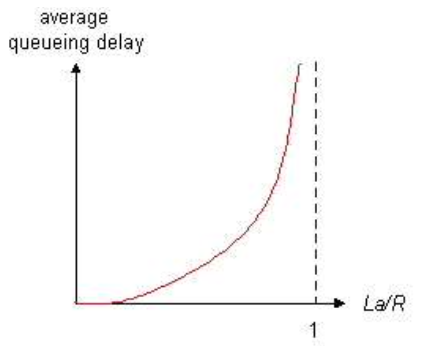
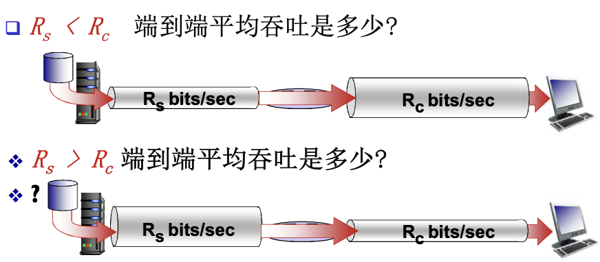
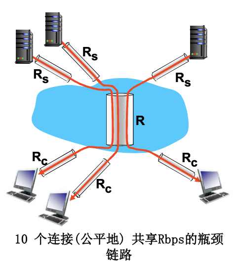

# 📘 1.6 分组延时、丢失和吞吐量 (Packet Delay, Loss, and Throughput)

> 来源说明：计算机网络-郑老师-第1章 1.6节 | 本节涵盖：四种分组延时、排队延时与流量强度、Traceroute、分组丢失、吞吐量与瓶颈链路

---

## 🧠 核心概念总览（严格按原文顺序）

* [*知识点1: 分组丢失和延时是怎样发生的*](#id1)
* [*知识点2: 四种分组延时概述*](#id2)
* [*知识点3: 节点处理延时（Processing Delay）*](#id3)
* [*知识点4: 排队延时（Queueing Delay）*](#id4)
* [*知识点5: 传输延时（Transmission Delay）*](#id5)
* [*知识点6: 传播延时（Propagation Delay）*](#id6)
* [*知识点7: 节点总延时*](#id7)
* [*知识点8: 车队类比（直观理解四种延时）*](#id8)
* [*知识点9: 车队类比续（存储-转发深入理解）*](#id9)
* [*知识点10: 排队延时与流量强度*](#id10)
* [*知识点11: Internet的延时和路由测量（Traceroute）*](#id11)
* [*知识点12: Traceroute示例解读*](#id12)
* [*知识点13: Traceroute使用方法*](#id13)
* [*知识点14: 分组丢失（Packet Loss）*](#id14)
* [*知识点15: 吞吐量（Throughput）基本概念*](#id15)
* [*知识点16: 吞吐量计算示例*](#id16)
* [*知识点17: 吞吐量：互联网场景*](#id17)

---

<a id="id1"></a>
## ✅ 知识点1: 分组丢失和延时是怎样发生的

**理论**
* **发生位置**：在路由器缓冲区的**分组队列**
* **排队原因**：
  * 分组到达链路的速率**超过**了链路输出的能力
  * 分组等待排到队头、被传输
* **分组丢失原因**：
  * 分组到达时，如果没有**可用的缓冲区**，则该分组被丢掉（**分组丢失**）


---

<a id="id2"></a>
## ✅ 知识点2: 四种分组延时概述

**理论**
* **四种延时类型**：
  1. **节点处理延时**（Nodal Processing Delay）
  2. **排队延时**（Queueing Delay）
  3. **传输延时**（Transmission Delay）
  4. **传播延时**（Propagation Delay）

---

<a id="id3"></a>
## ✅ 知识点3: 节点处理延时（Processing Delay）

**理论**
* **定义**：d_proc = 处理延时
* **处理内容**：
  * 检查**bit级差错**
  * 检查分组首部
  * 决定将分组导向何处
* **时间量级**：通常是**微秒数量级或更少**


---

<a id="id4"></a>
## ✅ 知识点4: 排队延时（Queueing Delay）

**理论**
* **定义**：d_queue = 排队延时
* **发生原因**：在输出链路上等待传输的时间
* **特点**：
  * 依赖于路由器的**拥塞程度**
  * 变化范围大，取决于流量强度

**注意点**
* ⚠️ **关键特性**：排队延时是四种延时中变化最大的，也是网络性能优化的重点

---

<a id="id5"></a>
## ✅ 知识点5: 传输延时（Transmission Delay）

**理论**
* **定义**：d_trans = 传输延时
* **计算公式**：
  * **R** = 链路带宽(bps)
  * **L** = 分组长度(bits)
  * **传输延时 = L/R**
* **物理意义**：将分组发送到链路上的时间 = 存储转发延时
* **时间量级**：
  * 对低速率的链路而言很大（如拨号）
  * 通常为微秒级到毫秒级


---

<a id="id6"></a>
## ✅ 知识点6: 传播延时（Propagation Delay）

**理论**
* **定义**：d_prop = 传播延时
* **计算公式**：
  * **d** = 物理链路的长度
  * **s** = 在媒体上的传播速度（~2×10⁸ m/sec，约为光速的2/3）
  * **传播延时 = d/s**
* **物理意义**：信号在物理介质中传播所需的时间
* **时间量级**：几微秒到几百毫秒， 几乎可忽略不计如果两者非常近的时候


**注意点**
* ⚠️ **常见混淆**：传输延时和传播延时是完全不同的概念！
  * 传输延时：把分组"推上"链路的时间（L/R）
  * 传播延时：信号在链路上"跑"的时间（d/s）

---

<a id="id7"></a>
## ✅ 知识点7: 节点总延时

**理论**
* **总延时公式**：
  ```
  d_nodal = d_proc + d_queue + d_trans + d_prop
  ```
---

<a id="id8"></a>
## ✅ 知识点8: 车队类比（直观理解四种延时）

**理论**
* **类比设定**：
  * 汽车以**100 km/hr**的速度传播
  * 收费站服务每辆车需**12秒**（传输时间）
  * 汽车 ~ bit；车队 ~ 分组
* **问题**：在车队在第二个收费站排列好之前需要多长时间？
  * 即从车队的第一辆车到达第一个收费站开始计时，到车队的最后一辆车离开第二个收费站，共需要多少时间？
* **计算过程**：
  * 将车队从收费站输送到公路上的时间 = 12 × 10 = **120秒**
  * 最后一辆车从第一个收费站到第二个收费站的传播时间：100km/(100km/hr) = **1小时**
  * **答案：62分钟**

* **对应关系**：
  * 收费站服务时间 → 传输延时（L/R）
  * 汽车行驶时间 → 传播延时（d/s）
  * 收费站排队 → 排队延时（d_queue）

---

<a id="id9"></a>
## ✅ 知识点9: 车队类比续（存储-转发深入理解）

**理论**
* **新设定**：
  * 汽车以**1000 km/hr**的速度传播
  * 收费站服务每辆车需**1分钟**
* **问题**：在所有的汽车被第一个收费站服务之前，汽车会到达第二个收费站吗？
* **答案**：**Yes！**
  * 7分钟后，第一辆汽车到达了第二个收费站
  * 而第一个收费站仍有3辆汽车
* **关键洞察**：
  * 在整个分组被第一个路由器传输之前，**第一个比特已经到达了第二个路由器！**

**注意点**
* 💡 **重要理解**：这说明了存储-转发机制的特点——必须收完整个分组才能转发，但第一个比特传播得很快

---

<a id="id10"></a>
## ✅ 知识点10: 排队延时与流量强度

**理论**
* **定义参数**：
  * **R** = 链路带宽(bps)
  * **L** = 分组长度(bits)
  * **a** = 分组到达队列的平均速率
* **流量强度（Traffic Intensity）**：**La/R**
* **流量强度与排队延时的关系**：

| La/R值 | 排队延时情况 |
|--------|-------------|
| La/R ~ 0 | 平均排队延时很小 |
| La/R -> 1 | 延时变得很大 |
| La/R >= 1 | 比特到达速率超过输出速率，平均排队延时将趋向无穷大！ |

* **设计原则**：**设计系统时流量强度不能大于或等于1！**



**注意点**
* ⚠️ **关键结论**：La/R 趋近 1时系统不稳定，排队延迟无限增长


---

<a id="id11"></a>
## ✅ 知识点11: Internet的延时和路由测量（Traceroute）

**理论**
* **测量问题**：Internet的延时和路由是什么样的呢？
* **Traceroute诊断程序**：
  * 提供从源端，经过路由器，到目的的延时测量
* **工作原理**：
  * For all i：
    * 沿着目的的路径，向每个路由器发送**3个探测分组**
    * 路由器i将向发送方返回一个分组
    * 发送方对发送和回复之间间隔计时
* **使用ICMP协议**：通过head里面的TTL(time to live)来实现计算回复的时间间隔(之后会详细介绍)


---

<a id="id12"></a>
## ✅ 知识点12: Traceroute示例解读

**理论**
* **示例输出**（从`gaia.cs.umass.edu`到`www.eurecom.fr`）：

```
1  cs-gw (128.119.240.254)  1 ms  1 ms  2 ms
2  border1-rt-fa5-1-0.gw.umass.edu (128.119.3.145)  1 ms  1 ms  2 ms
3  cht-vbns.gw.umass.edu (128.119.3.130)  6 ms 5 ms 5 ms
...
8  62.40.103.253 (62.40.103.253)  104 ms 109 ms 106 ms  ← trans-oceanic link
...
17 * * *
18 * * *
19 fantasia.eurecom.fr (193.55.113.142)  132 ms  128 ms  136ms
```

* **输出解读**：
  * 每行显示：跳数、主机名/IP、三次探测的延时
  * **`*` 表示无响应**：probe lost（探测丢失）或 router not replying（路由器不回复）
  * **trans-oceanic link**：跨洋链路（延时明显增加）

  * 延时突增点通常是网络瓶颈或长距离链路
  * `* * *`表示路由器不响应ICMP或防火墙过滤

---

<a id="id13"></a>
## ✅ 知识点13: Traceroute使用方法

**理论**
* **Windows系统**：
  * 命令：`tracert hostname`
  * 示例：`tracert www.gucas.ac.cn`
  * 完整参数：`tracert [-d] [-h maximum_hops] [-j computer-list] [-w timeout] target_name`
* **帮助文档**：http://www.linkwan.com/gb/broadmeter/article/trace-help.htm
* **测试网址**：
  * `www.traceroute.org`
  * `www.linkwan.com`

**注意点**
* 📋 **使用提示**：不同操作系统命令不同（Windows: tracert，Linux/Mac: traceroute）

---

<a id="id14"></a>
## ✅ 知识点14: 分组丢失（Packet Loss）

**理论**
* **丢失原因**：
  * 链路的队列缓冲区容量**有限**
  * 当分组到达一个**满的队列**时，该分组将会**丢失**
* **丢失后的处理**：
  * 丢失的分组可能会被**前一个节点**重传
  * 当节点提供了不可靠服务，可能由**源端系统**重传
  * 或**根本不重传**（取决于协议）


**注意点**
* 🔄 **知识关联**：TCP协议会重传丢失的分组，UDP通常不重传

---

<a id="id15"></a>
## ✅ 知识点15: 吞吐量（Throughput）基本概念

**理论**
* **定义**：在源端和目标端之间传输的速率（数据量/单位时间）
* **两种吞吐量**：
  * **瞬间吞吐量（Instantaneous Throughput）**：在一个时间点的速率
  * **平均吞吐量（Average Throughput）**：在一个长时间内的平均值
* **管道类比**：
  * 服务器发送bits（流体）进入管道
  * 管道1：可以承载fluid at rate R_s bits/sec
  * 管道2：可以承载fluid at rate R_c bits/sec
* **需要时有效比特**：数据量指的是实际能收到的有效数据量

**注意点**
* 📋 **术语提醒**：Throughput（吞吐量）vs Bandwidth（带宽），带宽是理论最大值，吞吐量是实际传输速率

---

<a id="id16"></a>
## ✅ 知识点16: 吞吐量计算示例

**理论**



* **关键概念**：
  * **瓶颈链路（Bottleneck Link）**：端到端路径上，限制端到端吞吐的链路
  * **短桶效应**：吞吐量由最窄的管道决定（瓶颈链路）


---

<a id="id17"></a>
## ✅ 知识点18: 吞吐量：互联网场景

**理论**
* **场景描述**：
  * 10个连接（公平地）共享R bps的瓶颈链路
  * 服务器发送速率R_s
  * 客户端接收速率R_c
* **计算**：
  * 链路上的每一段实际可用带宽R_i' = ?
  * 端到端吞吐量：min{R_i'}
  * 每个连接上的端到端吞吐：min(R_c, R_s, R/10)
* **实际情况**：
  * **R_c或者R_s经常是瓶颈**



**注意点**
* 💡 **现实理解**：实际网络中，瓶颈通常是接入网速率（R_c或R_s），而不是主干网

---

## 🔑 核心要点总结

1. **四种分组延时**：
   * 处理延时（d_proc）：微秒级，检查差错和首部
   * 排队延时（d_queue）：变化大，取决于拥塞
   * 传输延时（d_trans = L/R）：发送分组到链路的时间
   * 传播延时（d_prop = d/s）：信号在介质中传播的时间
2. **流量强度 La/R**：必须<1，否则排队无限增长
3. **Traceroute**：测量端到端延时和路由路径的工具
4. **吞吐量**：端到端平均吞吐 = min{R₁, R₂, ..., Rₙ}，受限于瓶颈链路

---

## 📌 考试速记版

* **四种延时公式**：

| 延时 | 符号 | 公式/量级 | 决定因素 |
|------|------|----------|----------|
| 处理延时 | d_proc | 微秒级 | 路由器处理速度 |
| 排队延时 | d_queue | 变化大 | 流量强度 La/R |
| 传输延时 | d_trans | L/R | 分组长度L、带宽R |
| 传播延时 | d_prop | d/s | 距离d、传播速度s |

* **总延时公式**：d_nodal = d_proc + d_queue + d_trans + d_prop

* **流量强度规则**：La/R < 1（必须小于1！）

* **吞吐量规则**：端到端吞吐 = min{各链路速率} = 瓶颈链路速率

* **Traceroute解读**：
  * 每跳显示三次探测延时
  * * * * 表示无响应（丢失或不回复）
  * 延时突增 = 瓶颈或长距离链路

**记忆口诀**：
> "处排传传四延时，LaR小于一是王；
> 瓶颈链路透吐量，Traceroute测路由。"
