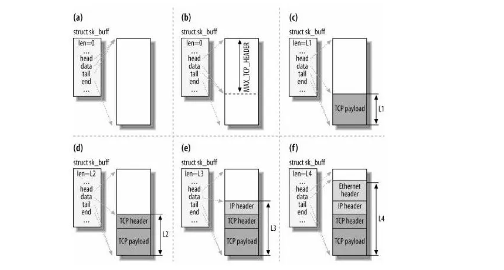
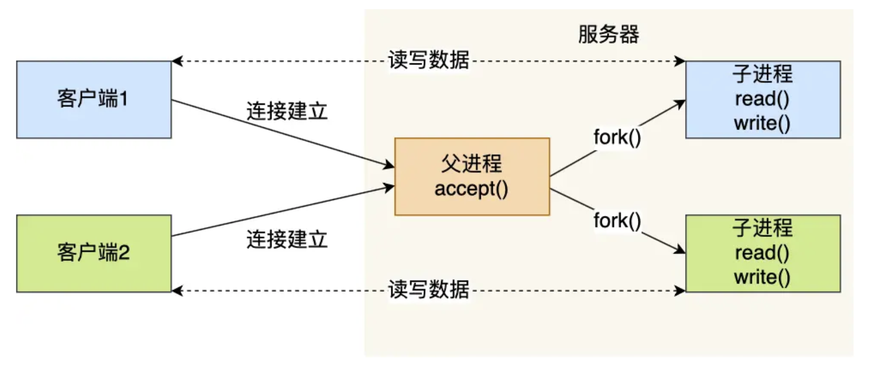
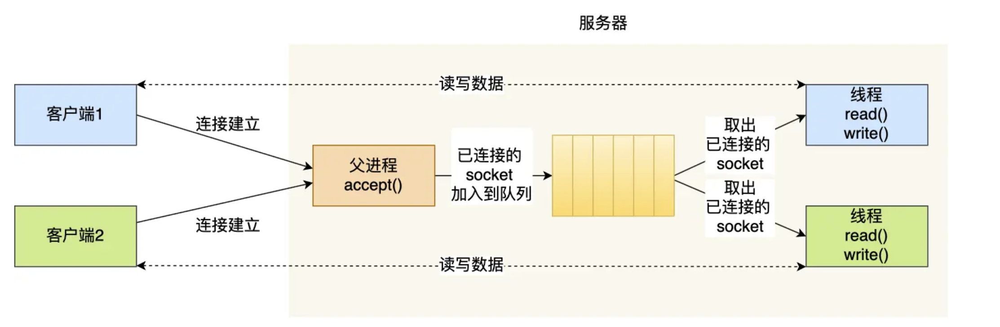
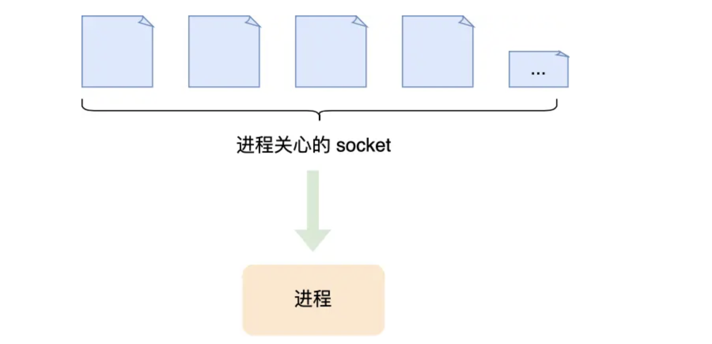
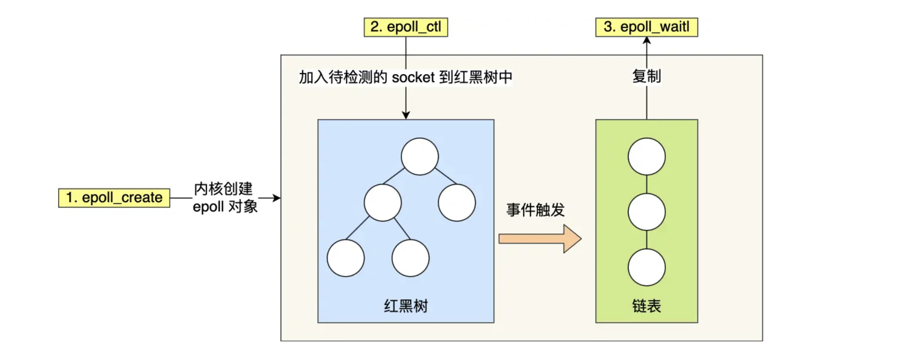

# 📘 2.10 I/O 多路复用：select/poll/epoll (I/O Multiplexing: select/poll/epoll)

> 来源说明：小林coding — 图解网络 · I/O多路复用篇 | 本节涵盖：服务端从单连接 Socket 模型到高并发 I/O 多路复用的演进，重点解析 `select`、`poll`、`epoll` 三种机制的原理、区别及应用

---

## 🧠 核心概念总览（严格按原文顺序）

- [*知识点1: Socket 编程基本模型*](#id1)
- [*知识点2: 文件描述符与内核数据结构*](#id2)
- [*知识点3: I/O 进程模型*](#id12)
- [*知识点4: 多进程模型*](#id3)
- [*知识点5: 多线程模型与线程池*](#id4)
- [*知识点6: C10K 问题与 I/O 多路复用的引入*](#id5)
- [*知识点7: `select` 机制*](#id6)
- [*知识点8: `poll` 机制*](#id7)
- [*知识点89: `epoll` 机制 —— 红黑树 + 就绪链表*](#id8)
- [*知识点10: `epoll` 的事件驱动与回调机制*](#id9)
- [*知识点11: 水平触发(LT) vs 边缘触发(ET)*](#id10)
- [*知识点12: `select` / `poll` / `epoll` 对比总结*](#id11)

---

<a id="id1"></a>
## ✅ 知识点1: Socket 编程基本模型

**先复习一下基本模型...**

- **服务端通过 `socket() → bind() → listen() → accept()` 的固定顺序建立监听**
- **而客户端则通过 `connect()` 主动发起连接——这是所有网络通信程序的起点。**

- `Socket` 是应用层与传输层之间的编程接口，操作系统内核为每个 Socket 维护两个关键队列来管理连接建立过程：

    - `TCP 半连接队列(SYN Queue)`：存放处于 `SYN_RCVD` 状态的连接（收到客户端 SYN，尚未完成三次握手）
    - `TCP 全连接队列(Accept Queue)`：存放已完成三次握手、等待应用层取用的连接

- 服务端调用 `accept()` 本质上就是从全连接队列头部取出一个已就绪的连接。
- 如果全连接队列为空，`accept()` 默认阻塞等待。


> 🔄 **知识关联**：Socket 通信的完整流程已在章节 2.8（TCP Socket 编程）和 2.9（UDP Socket 编程）中详细展开，本节聚焦于「一个服务端如何同时处理大量连接」这一进阶问题。


---

<a id="id2"></a>
## ✅ 知识点2: 文件描述符与内核数据结构

**Linux"一切皆文件"的设计哲学...**

- **linux 将 Socket 也被抽象为文件**
    - 内核通过一个整数的文件描述符来索引它
    - 这为后续 I/O 多路复用统一监控多个 Socket 奠定了基础

- **内核层面的数据结构关系**：

    - 每个进程对应一个 `task_struct` 结构体，其中包含指向 **文件描述符数组(File Descriptor Table)** 的指针
    - 文件描述符本质上就是这个数组的**下标索引**
    - 每个数组元素指向一个打开的文件（包括普通文件、Socket、管道等）
    - 也就是说**内核可以通过文件描述符找到对应的对应打开的文件**
    - 每个文件都有一个 inode，Socket 文件的inode 指向了内核中的 Socket 结构
        - 在这个结构体里有两个队列，**分别是发送队列和接收队列**
        - 这两个队列里面保存的是一个个 `struct sk_buff` ，用链表的组织形式串起来
        - `sk_buff` 可以表示各个层的包
    - 应用程序通过文件描述符调用 `read()` / `write()`，内核据此找到对应的 Socket 并执行真正的网络 I/O

- **这一抽象带来的关键好处是**：
    - **操作系统可以用统一的接口来管理所有 I/O 资源**
    - select/poll/epoll 本质上就是在批量监控这些文件描述符上的事件

- **`sk_buff` 如何描述所有种类网络包呢？**
    - **当接收报文时**：
        - 从网卡驱动开始，通过协议栈层层往上传送数据报，通过增加 `skb->data` 的值，来逐步剥离协议首部。
    - **当要发送报文时**：
        - 创建 `sk_buff` 结构体，数据缓存区的头部预留足够的空间，用来填充各层首部，在经过各下层协议时，通过减少 `skb->data` 的值来增加协议首部。
    


> 💡 **理解技巧**：把文件描述符想象成"号码牌"——`task_struct` 是进程的记账本，文件描述符数组是号码本，"号码"对应到具体的文件/Socket 对象。I/O 多路复用就是在问内核："这些号码中有哪些已经可读/可写了？"
> 💡 **理解技巧**：`sk_buff` 可以表示各个层的数据包，在应用层数据包叫 data，在 TCP 层我们称为 segment，在 IP 层我们叫packet，在数据链路层称为 frame。
> ⚠️ **关键区分**：为什么全部数据包只用一个结构体来描述呢? 如果每一层都用一个结构体，那在层之间传递数据的时候，就要发生多次拷贝，这将大大降低 CPU 效率。


---
<a id="id12"></a>
## ✅ 知识点3: I/O 进程模型

**一个从"理想"到"现实"的技术话题**

- **一台服务器到底能同时服务多少客户端？**

- **理论天花板**：
    - 对于 TCP 四元组（本机IP+端口+对端IP+端口），服务端 IP/端口固定 → 可变的是 **对端IP数 × 对端端口数**
    -  **客户端IP数**是2³²， **客户端端口数**2¹⁶
    - 因此对于 IPV4 TCP 协议层面，单机最多能"挂"多少连接 → 2⁴⁸
- **现实困境**：同步阻塞模型一次只能处理一个客户端 → 太慢
- **实际瓶颈**：操作系统资源（文件描述符、内存）才是真正的限制
    - **文件描述符（File Descriptor）**
        - Socket 本质上是一个文件，对应一个文件描述符
        - Linux 下，单个进程打开的文件描述符数量有限制默认值一般为 1024
        - 虽然可通过 ulimit 命令增大该限制
    - **系统内存**
        - 每个 TCP 连接在内核中都有对应的数据结构
        - 每个连接都会占用一定的内存
        - 连接数越多，内存消耗越大
- **实际并发能力需要通过优化 I/O 模型和系统参数来提升！！**


---


<a id="id3"></a>
## ✅ 知识点4: 多进程模型

**最早期的并发解决方案...**

- 是为每个连接分配一个独立的进程——简单直观，
- 但进程上下文切换的高昂代价使其难以扩展到大规模并发场景

- **工作流程**：

    - 主进程调用 `socket()` → `bind()` → `listen()` 建立监听
    - 每当 `accept()` 返回一个新连接，主进程调用 `fork()` 创建子进程
        - 这两个进程刚复制完的时候，几乎一模一样
        - 不过，**会根据返回值来区分是父进程还是子进程**
        - 如果返回值是0，则是子进程;如果返回值是其他的整数，就是父进程
    - 子进程继承父进程的文件描述符副本，专门处理该连接的数据收发，子进程直接和 已链接 socket 通信
    - 主进程继续 `accept()` 等待下一个连接
    

- **子进程任务完成后的善后问题**：
    - 子进程退出后，内核仍会保留其部分信息（占用内存）
    - 若父进程不主动回收，这些进程会变成**僵尸进程**，越积越多最终耗尽系统资源
    - 父进程需通过 `wait()` 或 `waitpid()` 函数完成回收


- **上下文切换(Context Switch)开销巨大的原因**：
    - 进程是资源分配的基本单位，切换时不仅要保存/恢复 CPU 寄存器、程序计数器等**内核空间资源**
    - 还要切换**虚拟内存地址空间**（页表）、栈、全局变量等**用户空间资源**
    - 频繁的上下文切换会导致 CPU 缓存失效（Cache Miss）和 TLB 刷新

> ⚠️ **关键限制**：每来一个连接就 `fork()` 一次的模式，在并发量达数千时会耗尽系统内存和 CPU 资源。每个进程都有独立的地址空间，即使进程处于阻塞等待 I/O 状态，其占用的内存也不可忽视。
> 🔄 **知识关联**：`fork()` 的系统调用机制属于操作系统进程管理范畴；在传输层的 TCP 连接管理中，子进程处理的正是 `accept()` 返回的已建立连接。

---

<a id="id4"></a>
## ✅ 知识点5: 多线程模型与线程池

**多线程模型是对多进程模型的一次改良**

- 线程共享进程地址空间，上下文切换代价更小，配合线程池可以避免频繁创建/销毁的开销

- **相比多进程模型的优势**：
    - 同一进程内的线程**共享文件描述符表、堆内存、全局变量等资源**
    - 上下文切换时只需切换线程的**私有数据**（栈、寄存器），无需切换地址空间
    - 创建和销毁线程的开销远小于进程


- **线程池(Thread Pool)的优化**：
    - 预先创建固定数量的线程，避免「来一个连接才创建一个线程」的延迟
    - 任务完成后线程回池而非销毁，复用线程资源
    - 当并发量超过线程池大小时，新连接排队等待

- **工作流程**：
    1. **初始化线程池**：服务器提前创建若干个线程，形成线程池
    2. **建立连接**：服务器（父进程）通过 `accept()` 接收客户端的TCP连接，生成「已连接Socket」
    3. **加入队列**：服务器将新建立的「已连接Socket」加入到全局队列中。为避免多线程竞争，操作队列前需要加锁。
    4. **取出任务**：线程池中的线程负责从全局队列中取出「已连接Socket」进行处理（取出操作同样需要加锁）。
    5. **读写通信**：线程获取到Socket后，与对应的客户端进行 `read()`（读数据）和 `write()`（写数据）操作，完成业务处理与通信
    

- **硬伤仍然存在**：
    - 要达到 C10K（单机同时处理 10,000 个连接），就需要维护上万个线程
    - 每个线程都有独立的栈空间（默认 8MB），10,000 个线程仅栈就消耗约 80GB 虚拟内存
    - 大量线程的调度和上下文切换依然是一笔沉重开销


> 💡 **理解技巧**：多线程模型是从"一个服务员服务一桌客人"（多进程）进化到"几个服务员轮班服务多桌客人"（线程池），但客人数量达到万级时，再能干的几个服务员也忙不过来——这就引出了下一个知识点：**I/O 多路复用**。


---

<a id="id5"></a>
## ✅ 知识点6: C10K 问题与 I/O 多路复用的引入

**但是还是有问题...**

- **C10K问题：单机同时处理 10,000 个并发连**：是多进程/多线程模型的性能仍然无法扛住

- 多进程和多线程模型的共同瓶颈在于：
    - 每个连接都需要一个独立的执行单元（进程或线程）
    - 大部分连接在大部分时间里是**空闲等待**的（等待数据到达），但进程/线程仍占据系统资源
    - 1 万个连接 = 1 万个执行单元，资源消耗与连接数呈**线性增长**

- **I/O 多路复用**：用一个进程/线程来监控大量 Socket 的事件状态，只在有事件就绪时才进行处理

- **I/O 多路复用 `(I/O Multiplexing)` 的解题思路**：
    - 用一个进程维护多个 Socket
    - **进程通过一个系统调用从内核获取多个事件**："我监控的这些多个 Socket 中，哪些有事件（可读/可写/异常）发生了？"
    - 内核返回就绪的 Socket 列表，进程只处理这些活跃连接
    

> 💡 **理解技巧**：把 I/O 多路复用比作"前台值班"——一个前台小姐同时守着 1000 部电话，哪部电话响了（事件就绪），她就接起哪部。不需要为每部电话配一个专人等待。


---

<a id="id6"></a>
## ✅ 知识点7: `select` 机制

**`select` 是最早出现的 I/O 多路复用系统调用**

- **将关心的文件描述符放入一个位图集合并并传给内核，内核遍历检查后返回就绪结果。简单易用，但性能瓶颈明显**

- **`select` 的工作流程**：

    1. 用户态构造一个 **文件描述符集合（`BitsMap`，位图）**，将关心的 fd 对应的 bit 置 1
    2. 调用 `select()`，将整个 `BitsMap` **拷贝到内核空间**（第 1 次拷贝）
    3. 内核**遍历整个 `BitsMap`**，检查每个 fd 是否有事件（第 1 次遍历，O(n)）
    4. 内核将就绪结果写回 `BitsMap`，**拷贝回用户空间**（第 2 次拷贝）
    5. 用户态**再次遍历整个 `BitsMap`**，找出哪些 fd 就绪（第 2 次遍历，O(n)）

- **两次遍历 + 两次拷贝** 是 select 性能问题的根源。

- **最大支持 1024 个文件描述符**：
    - 受内核宏 `FD_SETSIZE` 的限制，`BitsMap` 默认为 1024 位
    - 如需突破，需重新编译内核，**不具备通用性**

> ⚠️ **关键限制**：`select` 的 `BitsMap` 不可重用——每次调用后内核会修改它（标记就绪 fd），下次调用前必须用 `FD_ZERO()` / `FD_SET()` 重新初始化。
> 💡 **理解技巧**：`select` 就像你拿着一本花名册（BitsMap）去教室一个个点名——你得把所有名字念一遍（两次遍历），花名册还得来回递给老师（两次拷贝），花名册最多写 1024 个人名。

---

<a id="id7"></a>
## ✅ 知识点8: `poll` 机制

**为了解决问题，`poll` 便登场了...**

- **`poll` 用动态数组替代 `select` 的固定长度位图，突破了 1024 的硬限制——但在遍历方式和拷贝开销上与 select 并无本质区别**

- poll 的核心数据结构是 `struct pollfd` 数组：

    ```c
    struct pollfd {
        int   fd;       // 要监控的文件描述符
        short events;   // 要监控的事件（可读/可写/异常）
        short revents;  // 内核返回的就绪事件
    };
    ```

- **相对于 `select` 的改进**：
    - 不再使用固定大小的 `BitsMap`，而是用**动态数组（链表组织）**
    - 文件描述符数量不受 1024 限制，只受系统资源约束

- **与 select 相同的底层问题**：
    - 依然是**线性结构**存储 Socket 集合，内核仍需 **O(n) 遍历**
    - 每次调用仍需将整个数组在**用户态和内核态之间拷贝**
    - 并发数增大时，遍历和拷贝的开销呈数量级增长

- 两者的**共同致命缺陷**：当并发连接数从 1000 增长到 10,000 甚至 100,000 时，每次 `select()` / `poll()` 调用都要遍历全部 fd，**"很难应对 C10K"**。

> 💡 **理解技巧**：poll 相当于把 select 的"固定大小的打卡表"换成了"活页笔记本"——可以无限加页，但每次还是要逐页翻查。数据结构灵活了，算法复杂度没变。
> 🔄 **知识关联**：poll 和 select 一样，仅支持**水平触发(LT)**，参见知识点 10。

---

<a id="id8"></a>
## ✅ 知识点9: `epoll` 机制 —— 红黑树 + 就绪链表

**针对这一系列问题， `epoll` 便腾空出世...**

- **`epoll` 是 Linux 给出的 C10K 解决方案，用内核中的红黑树管理所有监控的 `fd`，配合就绪链表直接返回活跃事件，彻底告别了 `select`/`poll` 的全量遍历模式。**

- **`epoll` 的基本用法**：
    1. `epoll_create()`：创建 epoll 内核对象 `epfd`      
    2. `epoll_ctl()`：将需要监视的 Socket 添加到 epfd 中 
    3. `epoll_wait()`：阻塞等待，只返回**有数据就绪**的 Socket 
    ```cpp 
    int s = SOCKet(AF INET, SOCK STREAM, 0);
    bind(s,...);
    listen(s,...);
    int epfd = epoll create(...);
    epoll_ctl(epfd，...);//将所有需要监听的socket添加到epfd中
    while(1){
        int n = epoll wait(...);for(接收到数据socket){//处理}
    }
    ```

- **核心改进一：红黑树管理**

    - 内核中维护一棵**红黑树(Red-Black Tree)** 来跟踪所有待检测的文件描述符
    - 通过 `epoll_ctl()` 进行 fd 的**增删改**操作，时间复杂度 **O(log n)**
    - 不需要像 `select`/`poll` 那样**每次调用都传入整个 fd 集合**
    - `fd`向 `epoll` 注册一次后，内核会持续跟踪，只需要传入一个待检测的 socket 就可以跟踪整个
    - 这消除了 `select`/`poll` "每次都要把全部 fd 从用户态拷贝到内核态"的最大开销
    

- **核心改进二：就绪链表**

    - 内核维护一个**链表(Ready List)** 记录已就绪的事件
    - `epoll_wait()` 直接返回该链表中的事件，**无需轮询整个 fd 集合**
    - 从"全量查询"变为"增量通知"，效率大幅提升

    

- 正是这两个改进，使得 epoll 即使在数十万并发连接的场景下依然能保持高效——**"epoll 被称为解决 C10K 问题的利器"**。


> 💡 **理解技巧**：select/poll 是"每次都要你拿着整本花名册去点名"，epoll 是"在教室门口装了一个签到机"——谁来谁签到（事件触发 → 加入就绪链表），你只需要看签到表即可。红黑树就是那个"教室名单数据库"，高效增删查。


---

<a id="id9"></a>
## ✅ 知识点10: `epoll` 的事件驱动与回调机制

**`epoll` 的高效源于事件驱动架构——当 Socket 有数据到达时，网卡驱动触发中断，内核通过回调函数将对应的 fd 挂到就绪链表，整个过程无需主动轮询。**

完整的事件驱动流程：

1. 应用调用 `epoll_ctl()` 将某个 fd 注册到 epoll 的红黑树中，同时注册一个**回调函数(Callback)**
2. 当该 fd 上有事件发生（如数据到达），内核的网卡驱动中断处理程序触发通知
3. 内核调用注册好的**回调函数**，在该函数中将该 fd 的信息节点加入到**就绪链表**
4. 应用调用 `epoll_wait()` 时，如果就绪链表不为空，内核直接将链表中的数据拷贝给用户态
5. 就绪链表为空（没有活跃事件）时，`epoll_wait()` 可以阻塞等待或立即返回


**与 `select`/`poll` 的本质差异**：
- `select`/`poll`：**主动轮询**——每次都要遍历问一遍"你有事件吗？"
- `epoll`：**被动通知**——"有事了你自己喊我"

**注意点**
> 💡 **理解技巧**：select/poll 像是在操场上一个个找人问"你今天有事吗"，epoll 是让大家有事自己来办公室登记。你不需要每天去操场巡逻两遍。
> ⚠️ **重要提醒**：多路复用 API 返回的事件"并不一定可读写的"，建议搭配**非阻塞 I/O(Non-blocking I/O)** 使用——因为存在「事件通知和实际读写之间的时间窗口」，如果用阻塞 I/O，可能在 `read()` / `write()` 时发生意外阻塞。


---

<a id="id10"></a>
## ✅ 知识点11: 水平触发(LT) vs 边缘触发(ET)

**epoll 提供两种事件通知模式——水平触发在条件满足时反复通知，边缘触发仅在状态变化时通知一次。ET 模式能减少系统调用次数，但对编程要求更高。**

```c
// 触发模式在 epoll_event 的 events 字段中指定
struct epoll_event ev;
ev.events = EPOLLIN | EPOLLET;  // 边缘触发模式（ET）
ev.events = EPOLLIN;            // 默认水平触发模式（LT）
```

| 模式 | 特点 | 行为 |
|------|------|------|
| **水平触发(LT — Level Triggered)** | 条件持续满足则持续通知 | Socket 接收缓冲区有数据未读完时，`epoll_wait()` 每次都会返回该 fd，不断唤醒进程 |
| **边缘触发(ET — Edge Triggered)** | 仅状态变化时通知一次 | 只在「无数据→有数据」的瞬间通知一次，之后即使数据未读完也不再通知 |

**ET 模式的性能优势**：
- 减少 `epoll_wait()` 的系统调用次数——系统调用本身涉及上下文切换开销
- LT 模式下数据没读完会反复触发，而 ET 模式一次性通知后不再打扰

**ET 模式的编程要求**：
- 必须配合**非阻塞 I/O** 使用
- 每次收到通知后需要循环 `read()` / `write()` 直到返回 `EAGAIN`（无更多数据）
- 必须在一次通知中把数据读完，否则剩余数据可能永远不被处理

select 和 poll 仅支持**水平触发**，epoll **默认使用水平触发**，可通过 `EPOLLET` 标志切换为边缘触发。

**注意点**
> ⚠️ **关键区分**：ET 模式下如果读数据不彻底（未读到 `EAGAIN`），剩余数据不会触发新通知——这部分数据就"丢失"了，除非对端再发新数据才能连带触发。这是 ET 模式最常见的编程陷阱。
> 💡 **理解技巧**：LT 像"闹钟"，缓冲区有数据就响铃，你没处理完它会一直响；ET 像"门铃"，只在数据第一次到达时响一声，后续无论你处没处理，它都安静了。
> 📋 **术语提醒**：`水平触发(Level Triggered, LT)`、`边缘触发(Edge Triggered, ET)`、`EAGAIN(资源暂时不可用)`

---

<a id="id11"></a>
## ✅ 知识点12: select / poll / epoll 对比总结

**三种 I/O 多路复用机制代表了 Linux 在高并发网络编程上的演进路径——从固定位图到动态数组，再到内核事件驱动，每一次迭代都在解决前一代的核心瓶颈。**

| 特性 | `select` | `poll` | `epoll` |
|------|--------|------|-------|
| **数据结构** | `BitsMap`（固定长度位图） | 动态数组 `pollfd[]`（链表） | 红黑树 + 就绪链表 |
| **最大连接数** | 1024（`FD_SETSIZE` 硬限制） | 无上限（受系统资源限制） | 无上限（受系统资源限制） |
| **fd 遍历方式** | 全集合遍历 O(n) | 全集合遍历 O(n) | 仅返回就绪事件，无需遍历 |
| **数据拷贝** | 每次调用全量拷贝 fd 集合 | 每次调用全量拷贝 fd 集合 | `epoll_ctl()` 仅传入增删的 fd，减少拷贝 |
| **触发模式** | 仅水平触发(LT) | 仅水平触发(LT) | 水平触发(LT) + 边缘触发(ET) |
| **应对 C10K** | 困难 | 困难 | 利器 |

**选型建议**：
- 连接数少且都是活跃连接（< 100 个）→ `select` 或 `poll` 均可，简单够用
- 连接数多但大部分是空闲连接 → 必须用 `epoll`，因为 epoll 的开销只与活跃连接数成正比，而非总连接数
- 高并发场景下，epoll 搭配**非阻塞 I/O + ET 模式**是标准实践

**注意点**
> 🔄 **知识关联**：这些 I/O 多路复用机制是构建高性能网络服务器（如 Nginx、Redis）的基石。在传输层中，TCP 的流式传输和 UDP 的数据报模式都可以通过 epoll 统一管理——epoll 不关心上层协议类型，只关心 fd 上的事件。
> 📋 **术语提醒**：`非阻塞 I/O(Non-blocking I/O)`、`活跃连接(Active Connection)`

---

## 🔑 核心要点总结

1. **从多进程到 I/O 多路复用是一条必然的演进路径**：多进程/多线程模型受限于每个连接一个执行单元的资源消耗，当并发达到 C10K 级别时，单靠增加进程/线程已不可行。
2. **select/poll 的本质缺陷是"全量遍历 + 全量拷贝"**：这两个操作的时间复杂度都是 O(n)，随着监控的 fd 数量增长，性能线性下降。
3. **epoll 的精髓在于"事件驱动 + 内核态维护"**：红黑树消除每次全量传入 fd 的开销，就绪链表消除全量遍历的开销，回调机制实现从"轮询"到"通知"的范式转换。
4. **ET 模式是 epoll 的高性能实践，但需要更谨慎的编程**：必须在非阻塞 I/O 下循环读至 `EAGAIN`，否则可能丢失数据。

---
