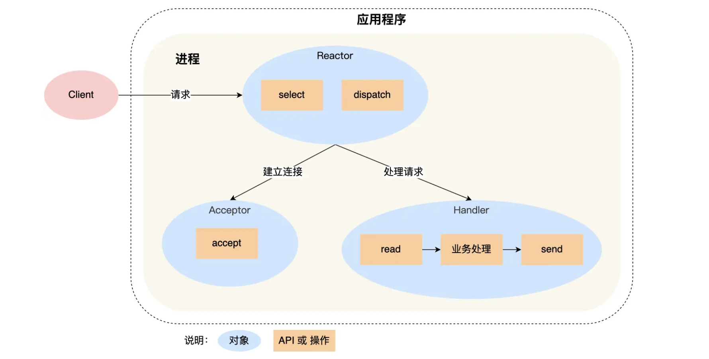
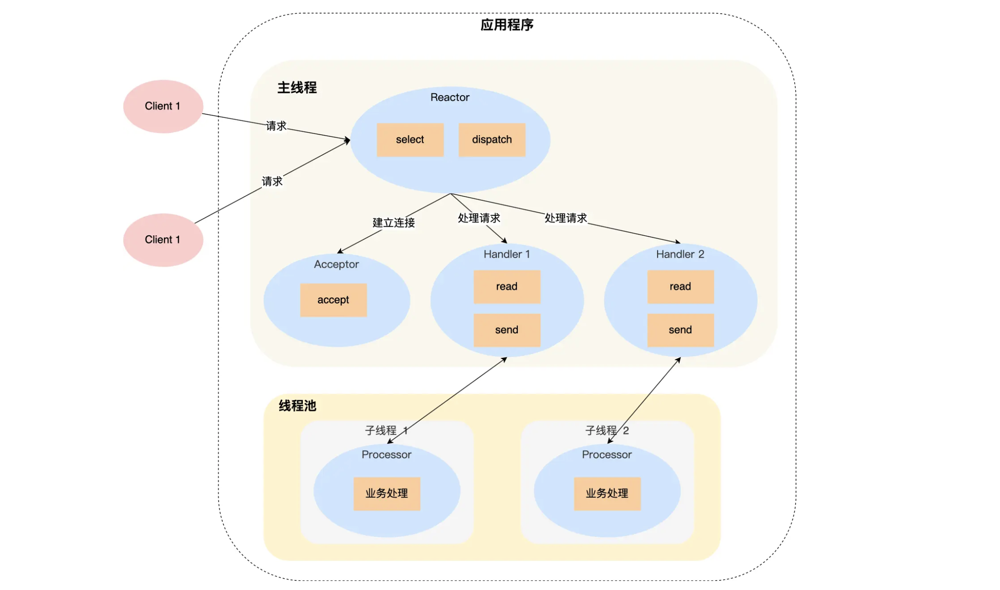
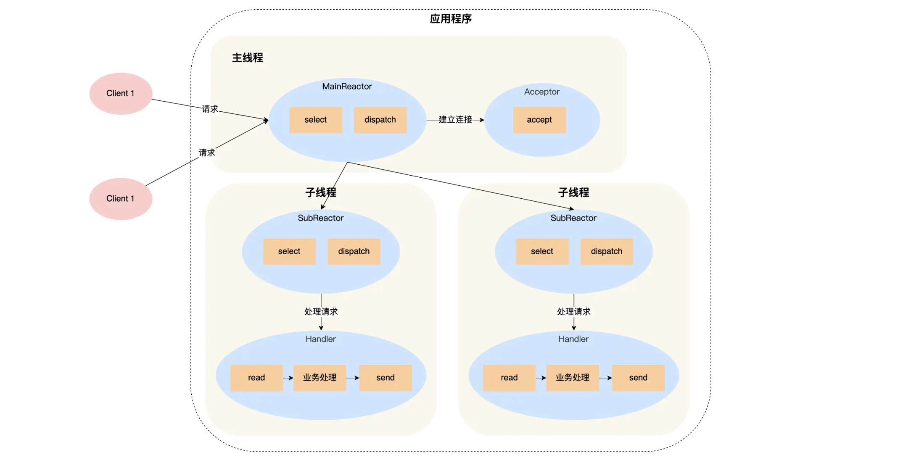
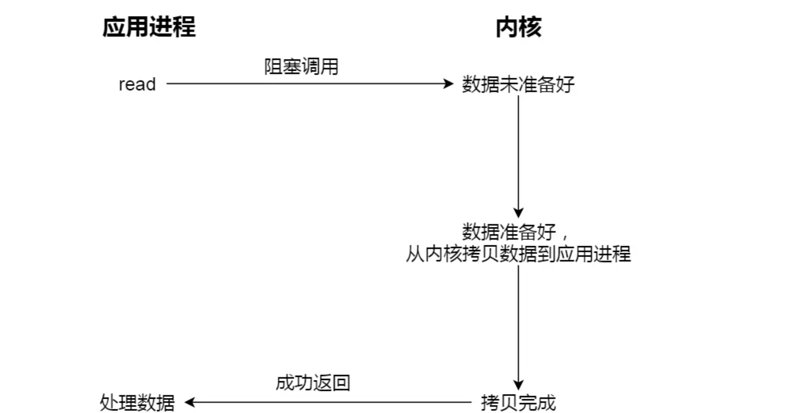
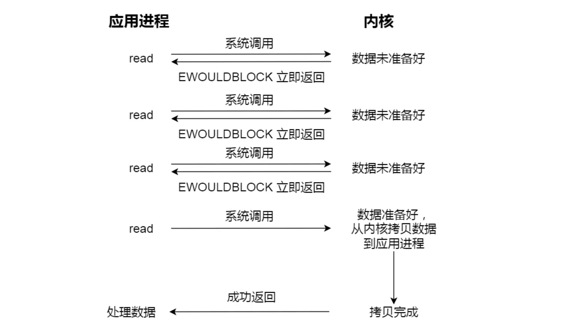

# 📘 2.11 Reactor与Proactor网络模式 (Reactor and Proactor Pattern)

> 来源说明：小林coding — 图解网络 · Reactor与Proactor篇 | 本节涵盖：从传统服务端模型演进到 Reactor 模式的三种经典方案（单Reactor单线程、单Reactor多线程、主从Reactor），以及与 Proactor 异步模式的对比和 I/O 概念辨析

---

## 🧠 核心概念总览（严格按原文顺序）

- [*知识点1: 传统服务端模型的演进瓶颈*](#id1)
- [*知识点2: I/O 多路复用 — Reactor 的基石*](#id2)
- [*知识点3: Reactor 模式的定义与核心组成*](#id3)
- [*知识点4: Reactor 模式的两个可变维度*](#id4)
- [*知识点5: 单 Reactor 单进程/线程 — 工作流程*](#id5)
- [*知识点6: 单 Reactor 单进程/线程 — 优缺点与 Redis 案例*](#id6)
- [*知识点7: 单 Reactor 多线程 — 工作流程*](#id7)
- [*知识点8: 单 Reactor 多线程 — 优缺点与瓶颈*](#id8)
- [*知识点9: 主从 Reactor 多线程 — 工作流程*](#id9)
- [*知识点10: 主从 Reactor 典型案例 — Netty、Nginx 与惊群问题*](#id10)
- [*知识点11: Proactor 模式 — 异步 I/O 的另一种路径*](#id11)
- [*知识点12: 阻塞/非阻塞/同步/异步 四概念辨析*](#id12)

---

## ✅ 知识点1: 传统服务端模型的演进瓶颈

**从"一个连接一个线程"到"线程池 + 非阻塞轮询"，每一步改进都在解决前一步的问题，但也同时暴露了新的瓶颈：**

- 服务端并发模型的演进经历了三个关键阶段：
   1. **一个连接一个线程**：简单直观，但频繁创建和销毁线程带来显著的性能开销
   2. **线程池(Thread Pool)**：预创建线程实现资源复用，让单个线程轮流处理多个连接——解决了创建/销毁的开销
   3. **阻塞 `read` 的新问题**：当一个线程对某个 socket 连接执行 `read()` 操作且无数据可读时，该线程会**卡住(Block)**，无法处理其他连接，导致线程无法继续处理其他的 socket 链接业务了

- **解决方案：阻塞轮询 → 非阻塞轮询**
   - 将 Socket 改为非阻塞后，线程不会卡在单个 `read` 上
   - 但需要通过<b>轮询(Polling)</b>来判断数据是否就绪——"轮询是要消耗 CPU 的"
   - "随着一个线程处理的连接越多，轮询的效率就会越低"
      - 线程并不知道有没有数据在 socket 上，必须使用 `read()` 去试探 → 每次 CPU 空转轮询导致
   - 于是乎，多路复用便横空出世了...

> 🔄 **知识关联**：本知识点是对 2.10 节（select/poll/epoll）内容的承上启下——前面讲的是"单机怎么扛住 10000 个连接"，本节讲的是"扛住连接之后，怎么优雅地组织代码来处理它们"

---

## ✅ 知识点2: I/O 多路复用 — Reactor 的基石

**I/O 多路复用的核心价值**

- **I/O 多路复用的优势：系统调用统一监听所有关注的连接，由内核来通知哪些连接就绪，彻底摆脱了应用层轮询的 CPU 空转问题**

- `select`/`poll`/`epoll` 就是内核提供的这类接口：
   - **无事件时**：线程阻塞在系统调用上（如 `epoll_wait()`），**CPU 零消耗**，无需轮询
   - **有事件时**：内核返回产生事件的连接列表，线程从阻塞中恢复，处理对应业务
   - 这一机制是后续所有 Reactor 方案的**底层基础设施**——没有它，Reactor 模式无从谈起

- **select / poll 到底是不是轮询机制？**

  - 若"轮询"= 忙等 / 空转（busy-waiting，CPU 100%）→ **不是**：select / poll 是阻塞调用，无事件时进程睡在内核等待队列里，CPU 占用为 0。
  - 若"轮询"= 每次调用对全部 fd 做线性扫描 → **是**：这正是说 select / poll 是轮询机制的准确含义。

- **为什么它不是忙等**
   - 调用本身是**阻塞**的：无事件且未超时，线程被挂入等待队列、移出运行队列，一条指令都不执行。
   - 唤醒路径其实是**事件驱动**的：网卡中断 → 协议栈处理 → 唤醒等待队列上的线程。

- **`select`/`poll` vs `epoll`**：
   - **select / poll**：等待时睡眠（不空转），醒来前后全量扫描（是轮询）→ 睡在门口，但每次都挨家挨户查一遍岗
   - **epoll**：等待时同样睡眠，但内核早已把"谁就绪"登记在册 → 睡在传达室，醒来直接看面板上的房号

> 💡 **理解技巧**：轮询是你不停去问"好了没好了没好了没"（CPU 空转），I/O 多路复用是你坐在那等着，有人好了会拍你一下（内核通知）。前者烧 CPU，后者零消耗。
> 🔄 **知识关联**：select/poll/epoll 的详细对比（数据结构、复杂度、适用场景）见 2.10 节知识点 6-11。

---

## ✅ 知识点3: Reactor 模式的定义与核心组成

**Reactor 模式本质上是"对 I/O 多路复用接口的面向对象封装"**

- 让开发者无需关注底层网络 API 细节，只需聚焦于业务逻辑的编写

- Reactor 模式也叫 **Dispatcher 模式(Dispatcher Pattern)**，其核心含义是：

   > I/O 多路复用监听事件 → 收到事件后 → 根据事件类型**分配**给某个进程/线程去处理

- **两大核心组成部分**：

   1. **`Reactor`**：负责**监听和分发事件**
      - 监听连接建立事件（新的客户端连接请求）
      - 监听读写事件（已有连接的数据到达或可发送）
      - 将事件类型和来源分发给对应的处理器（handler）

   2. **处理资源池**：负责**处理事件**
      - 完整流程：`read()` 读数据 → 业务逻辑处理 → `send()` 发响应
      - 可以是单线程、多线程、或多进程

---

## ✅ 知识点4: Reactor 模式的两个可变维度

**Reactor 模式十分灵活**
- **之所以灵活，是因为有两个可以独立调节的维度**：Reactor 的**数量**和**处理资源的形态**——它们的组合产出了不同的方案

- **两个维度**：
   - **Reactor 的数量**：单 Reactor 还是多 Reactor
   - **处理资源池的形态**：单进程/单线程还是多进程/多线程

- **四种理论组合**：

   | Reactor \ 处理资源 | 单进程/单线程 | 多进程/多线程 |
   |---------------------|-------------|-------------|
   | **单 Reactor** | ✅ 方案一（经典） | ✅ 方案二（有瓶颈） |
   | **多 Reactor** | ❌ 无性能优势，不采用 | ✅ 方案三（主从模式，主流） |

- **多 Reactor 单进程/线程被排除的原因**：多个 Reactor 在单进程中仍需串行调度，复杂度增加却没有利用多核的性能收益，因此实际中不存在这种组合。

> 💡 **理解技巧**：把 Reactor 想象成"前台接待"，处理资源池想象成"后厨厨师"。单 Reactor 单线程 = 一个人既当前台又当厨师；单 Reactor 多线程 = 一个前台 + 多个厨师；主从 Reactor = 一个总前台分配客人 + 每桌配一个专属服务生。

---

## ✅ 知识点5: 单 Reactor 单进程/线程 — 工作流程

**这是最简洁的 Reactor 实现...**
- 一个执行单元包揽监听、分发、读数据、业务处理、发数据的全部工作。
   - C 语言下体现为"单进程"（程序本身就是一个独立进程）
   - Java 下体现为"单线程"（Java 程序只是跑在 JVM 进程内的一个线程）

- **工作流程**：
   

   1. `Reactor` 对象通过 `select()`（或 `epoll_wait()`）监听事件，通过 `dispatch()` 按事件类型分发
      - 若为**连接建立事件** → `Acceptor` 对象通过 `accept()` 获取新连接，创建对应的 `Handler` 对象
         - `accpetor` = 获取链接的对象
      - 若为**读写事件** → 找到该连接对应的 `Handler` 对象
   2. `Handler` 走完完整的 `read()` → 业务处理 → `send()` 流程
      - `handler`  = 处理事件的调用对象

---

## ✅ 知识点6: 单 Reactor 单进程/线程 — 优缺点与 Redis 案例

**实现最简单但性能天花板最低**
 - Redis 6.0 之前选择它，恰恰因为它是最极端的匹配：业务快到瓶颈不在 CPU 上

- **优点**：
   - 实现简单，无需考虑进程间通信或多进程/多线程竞争
   - 天然无竞态(race condition)问题，不需要互斥锁

- **缺点**：
   - **"无法充分利用多核 CPU 的性能"**——一个进程只能跑在一个核上
   - **Handler 业务处理期间，整个进程无法处理其他连接的事件**——"如果业务处理耗时比较长，那么就造成响应的延迟"
   - 不适用于**计算密集型**任务

- **典型案例 — Redis（6.0 之前）**：
   - "Redis 业务处理主要是在内存中完成，操作的速度是很快的，性能瓶颈不在 CPU 上"
   - 对于纯内存 KV 操作，单线程的响应延迟远远不是短板
   - Redis 6.0 引入多线程 I/O 是为了应对网络 I/O 瓶颈，而非业务逻辑瓶颈

> ⚠️ **关键区分**：单 Reactor 单线程 ≠ 只能处理低并发。Redis 在单线程下达到数万 QPS，说明**瓶颈的性质远比并发数量本身更重要**。如果每个业务处理只需要微秒级，单线程的顺序处理完全够用；如果业务涉及磁盘 I/O 或复杂计算，单线程就会立刻成为瓶颈。

---

## ✅ 知识点7: 单 Reactor 多线程 — 工作流程

**在方案一的基础上，将"业务处理"从主线程中剥离到子线程池**

- Handler 只负责数据收发，业务逻辑由子线程 Processor 承担
- **工作流程**（前三个步骤与方案一相同）：
   

   1. `Reactor` 通过 `select` 监听事件，`dispatch` 分发
      - **连接建立事件** → `Acceptor` 处理，创建 `Handler`
      - **读写事件** → 找到对应连接的 `Handler` 处理
   2. **差异从这里开始**：`Handler` 只负责数据的**接收和发送**，不再负责业务处理
      - `Handler` 通过 `read()` 拿到数据后，将数据封装为任务对象
      - 将任务提交给**子线程池**中的某个 `Processor` 对象处理
   3. 子线程 `Processor` 完成业务处理后，将**结果传回主线程**的 `Handler`
   4. `Handler` 通过 `send()` 将响应发送给客户端

---

## ✅ 知识点8: 单 Reactor 多线程 — 优缺点与瓶颈

**利用多核能力的同时，也引入了两个新问题：共享数据竞争和单 Reactor 的性能天花板**

- **优点**：
   - 能够充分利用多核 CPU 的性能——业务处理在多线程中并行执行

- **缺点**：

   1. **共享资源竞争**：
      - 子线程 `Processor` 结果传回主线程 `Handler` 时，涉及共享队列/缓冲区的并发写入
      - 需要用<b>互斥锁(Mutex)</b>保护共享资源，增加编程复杂度

   2. **单 Reactor 瓶颈（更致命的缺陷）**：
      - "一个 Reactor 对象承担所有事件的监听和响应，而且只在主线程中运行"
      - "在面对瞬间高并发的场景时，容易成为性能的瓶颈"
      - 即使有 100 个子线程处理业务，如果每秒有 10 万个新连接涌入，主线程的一个 Reactor 在 `accept` 和 `dispatch` 上会成为瓶颈
- **单 Reactor 多进程 vs 多线程**
   1. **单 Reactor 多进程：实现太麻烦**
      - 进程之间内存不共享，子进程 ↔ 父进程必须靠**双向 IPC** 传递数据和结果；
      - 父进程（Reactor）还要额外记录"**子进程的结果该回发给哪个客户端**"，多一层路由映射的复杂度。
   2. **单 Reactor 多线程：简单得多，所以成为主流**
      - 线程**天然共享内存**，处理结果直接交接，只需处理并发问题（加锁），复杂度远低于 IPC；
      - 结论：**实际应用中基本看不到单 Reactor 多进程**，多线程是事实标准。

- **一句话记忆**：进程间要"写信往来"还得贴地址，线程间直接"同桌共享"——复杂度差了一个量级，多进程方案因此被淘汰

> 💡 **理解技巧**：单 Reactor 多线程就像只有一个收银台的超市——后厨可以有 10 个厨师并行做菜，但所有订单还是只能从一个收银台进入。促销高峰期，收银台排队就成了瓶颈，后厨再多人也白搭。

---

## ✅ 知识点9: 主从 Reactor 多线程 — 工作流程

**单 Reactor 多线程的自然升级**
- **将 Reactor 拆分为一个 MainReactor（专接连接）和多个 SubReactor（各管一摊），彻底消除了单 Reactor 瓶颈**

- **工作流程**（以多线程为例）：
   
   1. 主线程的 **`MainReactor`** 通过 `select` 只监控**连接建立事件**，由 `Acceptor` 的 `accept()` 获取新连接
   2. `MainReactor` 将新建立的连接**分配给某个子线程**（按某种负载均衡策略）
   3. 子线程的 **`SubReactor`** 将分配到的连接加入自己的 `select` 继续监听，并创建对应的 `Handler`
   4. 当该连接上有新事件（读/写）发生时，`SubReactor` 调用对应的 `Handler` 响应
   5. `Handler` 完成 `read()` → 业务处理 → `send()` 的完整流程

- **关键优势--简化了整个架构**：
   - 主线程和子线程**分工明确**——主线程只负责接收新连接，子线程负责后续所有 I/O + 业务
   - 交互简单：主线程只需将新连接传给子线程，"子线程无须返回数据，直接就可以在子线程将处理结果发送给客户端"
   - 避免了单 Reactor 多线程中"子线程回传结果给主线程"的复杂同步

> 💡 **理解技巧**：主从 Reactor 像餐厅的"领位员 + 分区服务员"模式——一个领位员（MainReactor）负责迎接客人并带到空桌，然后该桌的专属服务员（SubReactor）负责点菜、上菜、结账一条龙。客人在哪个区就由哪个服务员全权负责，前后台不需要来回交接。

---

## ✅ 知识点10: 主从 Reactor 典型案例 — Netty、Nginx 与惊群问题

**主从 Reactor 是当今高性能网络框架的事实标准，但 Netty 和 Nginx 的实现有微妙而关键的差异。**

- **典型采用者**：

   | 项目 | 方案 | 说明 |
   |------|------|------|
   | **Netty** | 多 Reactor **多线程** | Java NIO 框架，EventLoopGroup(boss) + EventLoopGroup(worker) 分别对应 MainReactor 和 SubReactor |
   | **Memcache** | 多 Reactor **多线程** | 内存缓存系统，主线程接连接，子线程处理请求 |
   | **Nginx** | 多 Reactor **多进程** | 经典的高性能 Web 服务器，但实现有差异（见下） |

- **Nginx 的特殊之处**：
   - 主进程(master process)**只负责初始化 Socket**（`socket()` → `bind()` → `listen()`），不做 accept
   - 子进程(worker process)各自拥有独立的 Reactor，**自己直接执行 `accept()`**
   - 通过**共享锁(accept mutex)**控制一次只有一个子进程成功 `accept()`——这就是所谓的**惊群问题(Thundering Herd)** 的解决方案
   - 子进程 accept 到连接后，在自己的 Reactor 内全权处理，不需再分配给其他子进程

- **惊群问题(Thundering Herd Problem)**：
   - 当一个新的连接事件到来时，如果多个子进程都在 `epoll_wait()` 上等待同一监听 socket
   - 所有子进程都会被唤醒去抢这个连接，但只有一个能成功 `accept()`
   - 其余进程被"空唤醒"，白白做了上下文切换
   - Nginx 通过**互斥锁**保证同一时刻只有一个子进程在等待 `accept` 事件

**注意点**
> ⚠️ **关键区分**：Netty 是 MainReactor `accept` 后**分配**给 SubReactor；Nginx 是每个 worker **自己抢** `accept`。前者避免惊群但需要线程间传递 fd；后者多进程独立、容错更好，但需要锁来控制惊群。

---

## ✅ 知识点11: Proactor 模式 — 异步 I/O 的另一种路径

**故事走向了另一条路线...**
- **Proactor → Reactor："我来读写" → "操作系统帮我读写，读完了通知我**
- **但在 Linux 上，这个美好的理想至今未能完善实现**
- **Reactor vs Proactor 核心对比**：

   | 维度 | Reactor | Proactor |
   |------|---------|----------|
   | **I/O 模型** | 非阻塞同步(Non-blocking Synchronous) | 异步(Asynchronous) |
   | **感知内容** | 就绪可读写事件（I/O 待完成） | 已完成的读写事件（I/O 已由 OS 完成） |
   | **数据读写** | 应用进程主动调用 `read()` / `write()` | 操作系统自动完成，应用只拿到结果 |
   | **比喻** | 快递员到楼下打电话："下来拿吧" | 快递员送到家门口："签收吧" |

- **Proactor 工作流程**：
   1. 应用发起异步读请求，告诉内核"读缓冲区地址 + 读多少字节 + 读完通知我"
   2. 内核等待数据到达，**自行完成数据从内核缓冲区到用户缓冲区的拷贝**
   3. 内核通知应用："读操作已完成，数据已在你的缓冲区里"
   4. 应用直接处理数据，不需要再调用 `read()`

- **为什么 Proactor 在 Linux 上不普及**：
   - "在 Linux 下的异步 I/O 是不完善的"——`aio` 系列函数（`aio_read`、`aio_write` 等）由 POSIX 定义，但**不是真正的操作系统级别支持**
   - 是在用户空间**模拟出来的异步**，且仅支持本地文件 I/O，**网络 Socket 不支持**
   - 反观 Windows 的 **IOCP(I/O Completion Port)**，是操作系统级别实现的完整异步 I/O——"真正意义上的异步 I/O"
   - 因此在实际工程中，Linux 上用 Reactor（epoll），Windows 上可用 Proactor（IOCP）

> ⚠️ **关键区分**：Linux 的 `aio` ≠ 真正的异步 I/O。真正异步 I/O 要求数据从内核缓冲区拷贝到用户缓冲区这一过程也不阻塞应用——Linux 的 `aio` 对此做不到。

---

## ✅ 知识点12: 阻塞/非阻塞/同步/异步 四概念辨析

**这四个概念是面试和实际编程中最常混淆的 I/O 术语...**

- **核心突破口在于：阻塞/非阻塞管的是"数据没准备好时要不要等"，同步/异步管的则是"数据从内核拷到用户空间这一下，谁来做**

- 用饭堂打饭的类比来理解：

   - **`阻塞 I/O(Blocking I/O)`**：
      
      - 一直在饭堂排队等——菜（数据）没做好时你站着干等
      - 菜好了，你还要等阿姨把菜从锅里打到你的饭盒里（**从内核缓冲区 → 用户缓冲区拷贝**）
      - **两个过程都等**：等待数据就绪 + 等待数据拷贝

   - **`非阻塞 I/O(Non-blocking I/O)`**：
   
      - 多次跑去看菜好了没——没好就回来做别的事，过一会儿再去看
      - 菜好了以后，你仍要**站那儿等阿姨把菜打到饭盒**（最后一次等待依然存在）
      - **只消除了等待数据就绪的阻塞，数据拷贝过程仍然是同步等待**

   - **`异步 I/O(Asynchronous I/O)`**：
      - 跟阿姨说"做好了连饭带菜打包好送到我面前"
      - 全程不等待——阿姨做好、装好、送到时通知你一声
      - **数据就绪 + 数据拷贝两个阶段都由操作系统完成**

- **核心技术洞察**：
   - 无论阻塞 `read` 还是非阻塞 `read`，当数据就绪后，**数据从内核缓冲区拷贝到用户缓冲区的过程都是同步的**——这个拷贝过程中，应用线程必须等待
   - 真正的异步 I/O 连这个拷贝过程都不需要应用参与——操作系统直接往你给的缓冲区地址里写，写完了通知你

**注意点**
> ⚠️ **最常见的误解**："非阻塞 I/O = 异步 I/O"——这是错的。非阻塞 I/O 只是不在"等待数据就绪"阶段阻塞，数据拷贝阶段依然需要应用线程参与（同步）。真正的异步 I/O 是最彻底的：两个阶段 OS 全包，应用只等最终通知。
> 📋 **术语提醒**：`同步(Synchronous)` vs `异步(Asynchronous)`：前者应用主动参与数据拷贝，后者完全由 OS 代理。`阻塞(Blocking)` vs `非阻塞(Non-blocking)`：前者在没有数据时卡住不让走，后者返回"还没有"让你先去做别的。

---

## 🔑 核心要点总结

1. **Reactor 解决了"怎么组织代码处理大量连接"的问题**：I/O 多路复用解决的是"怎么高效发现事件"，Reactor 解决的是"发现事件后怎么分发处理"，两者是底层机制和上层架构的关系。
2. **三种 Reactor 方案的选择取决于业务特征**：IO 密集型且业务极快 → 单 Reactor 单线程（Redis）；需要多核但并发量不大 → 单 Reactor 多线程；高并发 + 多核 → 主从 Reactor（Netty/Nginx）。
3. **主从 Reactor 的核心洞察是"连接建立"和"数据 IO+业务"天然是两种不同性质的工作**——前者轻量但需要及时响应，后者重量但可以并行处理。物理上分离它们是最优解。
4. **Proactor 在 Linux 上不是一个可行的工程选项**：`aio` 不完善且不支持网络 Socket，这就是为什么所有 Linux 高性能网络框架（Nginx、Redis、Netty）都基于 Reactor/epoll 而非 Proactor。
5. **同步 ≠ 阻塞，异步 ≠ 非阻塞**：阻塞/非阻塞管的是"数据没就绪时回不回去"，同步/异步管的是"数据拷贝这一步要不要自己来"。非阻塞 read 仍然是同步 I/O——最后的拷贝步骤需要线程本尊在场等待。
---