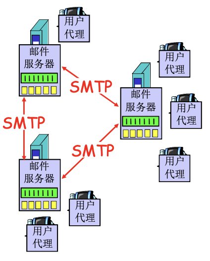
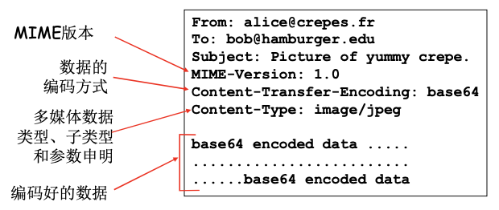

# 📘 2.4 EMail - 电子邮件

> 来源说明：计算机网络-郑老师-第2章 | 本节涵盖：电子邮件组成、SMTP协议、邮件格式、邮件访问协议（POP3、IMAP）

---

## 🧠 核心概念总览（严格按原文顺序）

* [*知识点1: 电子邮件的3个主要组成部分*](#id1)
* [*知识点2: 用户代理(User Agent)*](#id2)
* [*知识点3: 邮件服务器*](#id3)
* [*知识点4: SMTP协议概述*](#id4)
* [*知识点5: SMTP传输的三个阶段*](#id5)
* [*知识点6: Alice给Bob发送报文的例子*](#id6)
* [*知识点7: 简单的SMTP交互*](#id7)
* [*知识点8: SMTP总结及与HTTP对比*](#id8)
* [*知识点9: 邮件报文格式*](#id9)
* [*知识点10: MIME多媒体扩展*](#id10)
* [*知识点11: 邮件访问协议概述*](#id11)
* [*知识点12: POP3协议*](#id12)
* [*知识点13: POP3的三个阶段*](#id13)
* [*知识点14: IMAP协议*](#id14)

---

<a id="id1"></a>
## ✅ 知识点1: 电子邮件的3个主要组成部分

**组成部分**
  * **用户代理(User Agent)**
  * **邮件服务器(Mail Server)**
  * **简单邮件传输协议：SMTP(Simple Mail Transfer Protocol)**

**架构图**



---

<a id="id2"></a>
## ✅ 知识点2: 用户代理(User Agent)

**理论**
* **别名**：又名"邮件阅读器"
* **功能**：
  * 撰写、编辑和阅读邮件
  * 代我们进行操作的应用
  * 使用拉取协议（POP3）从邮箱服务器拉取邮件
* **示例**：Outlook、Foxmail
* **邮件存储**：
  * 输出和输入邮件保存在服务器上

---

<a id="id3"></a>
## ✅ 知识点3: 邮件服务器

**理论**
* **功能1**：邮箱中管理和维护发送给用户的邮件
* **功能2**：输出报文队列，保持待发送邮件报文
  * 代理/或服务器发的放入队列中，并继续按照队列再转发到目标
* **功能3**：邮件服务器之间的SMTP协议：发送email报文
  * 客户：发送方邮件服务器
  * 服务器：接收端邮件服务器

---

<a id="id4"></a>
## ✅ 知识点4: SMTP协议概述

**理论**
* **标准**：RFC 2821
* **传输层**：使用TCP在客户端和服务器之间传送报文
* **端口**：端口号为25
* **传输方式**：直接传输，从发送方服务器到接收方服务器

**注意点**
* 📋 **术语**：SMTP (Simple Mail Transfer Protocol) - 简单邮件传输协议、RFC 2821 - SMTP标准

---

<a id="id5"></a>
## ✅ 知识点5: SMTP传输的三个阶段

**理论**

| 阶段 | 说明 |
|------|------|
| **握手** | 建立连接并进行初始交互 |
| **传输报文** | 发送邮件内容 |
| **关闭** | 结束连接 |

**交互特点**
* **命令/响应**
  * 命令：ASCII文本
  * 响应：状态码和状态信息
* **报文格式**：报文必须为7位ASCII码 - 发包之后可以直接解释出来

---

<a id="id6"></a>
## ✅ 知识点6: Alice给Bob发送报文的例子

**理论**

**流程步骤**
1. **Alice使用用户代理撰写邮件并发送**给 `bob@someschool.edu`
2. **Alice的用户代理将邮件发送到她的邮件服务器**；邮件放在报文队列中，（攒到一起再发，不能让服务器太劳累了）
3. **SMTP的客户端打开到Bob邮件服务器的TCP连接**
4. **SMTP客户端通过TCP连接发送Alice的邮件**
5. **Bob的邮件服务器将邮件放到Bob的邮箱**
6. **Bob调用他的用户代理阅读邮件** (POP3协议)

**流程图**


---

<a id="id7"></a>
## ✅ 知识点7: 简单的SMTP交互

**理论**

**示例对话**
```
S: 220 hamburger.edu
C: HELO crepes.fr
S: 250 Hello crepes.fr, pleased to meet you
C: MAIL FROM: <alice@crepes.fr>
S: 250 alice@crepes.fr... Sender ok
C: RCPT TO: <bob@hamburger.edu>
S: 250 bob@hamburger.edu ... Recipient ok
C: DATA
S: 354 Enter mail, end with "." on a line by itself
C: Do you like ketchup?
C: How about pickles?
C: .
S: 250 Message accepted for delivery
C: QUIT
S: 221 hamburger.edu closing connection
```

**说明**
* `S:` 表示服务器响应
* `C:` 表示客户端命令
* `220` 服务就绪
* `HELO` 标识客户端
* `MAIL FROM` 发件人
* `RCPT TO` 收件人
* `DATA` 开始传输邮件内容
* `354` 开始输入邮件
* `250` 请求完成
* `QUIT` 结束会话

---

<a id="id8"></a>
## ✅ 知识点8: SMTP总结及与HTTP对比

**理论**

**SMTP特点**
* 使用**持久连接**
* 要求报文（首部和主体）为**7位ASCII编码**
* SMTP服务器使用 `CRLF.CRLF` 决定报文的尾部

**HTTP vs SMTP对比**

| 特性 | HTTP | SMTP |
|------|------|------|
| **传输模式** | 拉(Pull) | 推(Push) |
| **交互形式** | ASCII形式的命令/响应交互、状态码 | ASCII形式的命令/响应交互、状态码 |
| **对象封装** | 每个对象封装在各自的响应报文(一个报文至多包含一个对象)中 | 多个对象包含在一个报文中 |

**注意点**
* 💡 **核心区别**：HTTP是客户端"拉"数据，SMTP是服务器"推"数据

---

<a id="id9"></a>
## ✅ 知识点9: 邮件报文格式

**理论**
* **标准**：RFC 822 - 文本报文的标准
* **首部行(Header)**：
  * `To:` - 收件人
  * `From:` - 发件人
  * `Subject:` - 主题
  * `CC:` - 抄送
  * 与SMTP命令不同！
* **主体(Body)**：
  * 报文内容
  * 只能是ASCII码字符

**报文格式**


---

<a id="id10"></a>
## ✅ 知识点10: MIME多媒体扩展

**理论**
* **MIME**：**多媒体邮件扩展(Multimedia Mail Extension)**
* **标准**：RFC 2045, 2056
* **功能**：在报文首部用额外的行申明MIME内容类型

**MIME首部示例**



**MIME组成部分**

| 字段 | 说明 |
|------|------|
| **MIME-Version** | MIME版本 |
| **Content-Transfer-Encoding** | 数据的编码方式 |
| **Content-Type** | 多媒体数据类型、子类型和参数申明 |
| **编码好的数据** | Base64编码的数据 |


---

<a id="id11"></a>
## ✅ 知识点11: 邮件访问协议概述

**理论**

**架构**
```
用户A(发送方)
   |
   | SMTP
   v
发送方邮件服务器 --------SMTP--------> 接收方邮件服务器
                                          |
                                          | 邮件访问协议
                                          v
                                       用户B(接收方)
```

**三种邮件访问协议**

| 协议 | 全称 | 标准 | 特点 |
|------|------|------|------|
| **POP** | 邮局访问协议(Post Office Protocol) | RFC 1939 | 用户身份确认并下载 |
| **IMAP** | Internet邮件访问协议(Internet Mail Access Protocol) | RFC 1730 | 更多特性，更复杂，在服务器上处理存储的报文 |
| **HTTP** | - | - | Hotmail、Yahoo! Mail等，方便 |

**注意点**
* 📋 **术语**：POP (Post Office Protocol) - 邮局协议、IMAP (Internet Mail Access Protocol) - Internet邮件访问协议

---

<a id="id12"></a>
## ✅ 知识点12: POP3协议

**理论**
* **POP3**：**Post Office Protocol Version 3**
* **标准**：RFC 1939
* **功能**：从服务器访问邮件

**工作过程**
1. **用户身份确认**：代理<-->服务器
2. **下载邮件**：将邮件从服务器下载到本地

---

<a id="id13"></a>
## ✅ 知识点13: POP3的三个阶段

**理论**

**阶段1：用户确认阶段**

| 命令 | 说明 | 服务器响应 |
|------|------|-----------|
| `user` | 申明用户名 | `+OK` / `-ERR` |
| `pass` | 输入口令 | `+OK` / `-ERR` |

**示例**
```
S: +OK POP3 server ready
C: user bob
S: +OK
C: pass hungry
S: +OK user successfully logged on
```

**阶段2：事务处理阶段**

| 命令 | 说明 |
|------|------|
| `list` | 报文号列表 |
| `retr` | 根据报文号检索报文 |
| `dele` | 删除指定报文 |
| `quit` | 退出 |

**示例**
```
C: list
S: 1 498
S: 2 912
S: .
C: retr 1
S: <message 1 contents>
S: .
C: dele 1
C: retr 2
S: <message 1 contents>
S: .
C: dele 2
C: quit
S: +OK POP3 server signing off
```

**阶段3：更新阶段**
* 服务器根据客户端的操作更新邮箱状态

**注意点**
* 📋 **术语**：list - 列表、retr - 检索、dele - 删除、quit - 退出

---

<a id="id14"></a>
## ✅ 知识点14: IMAP协议

**理论**
* **IMAP**：**Internet Mail Access Protocol**
* **特点**
  * IMAP服务器将每个报文保存在服务器上
  * 更多特性（更复杂）
  * 在服务器上处理存储的报文

**POP3 vs IMAP对比**

| 特性 | POP3 | IMAP |
|------|------|------|
| **存储位置** | 下载到本地 | 保存在服务器 |
| **复杂度** | 简单 | 复杂 |
| **功能** | 基本下载 | 服务器端管理、文件夹、搜索等 |
| **适用场景** | 单设备 | 多设备同步 |

---

## 🔑 核心要点总结
1. **电子邮件三组件**：用户代理、邮件服务器、SMTP协议
2. **SMTP**：TCP端口25，推模式，7位ASCII，持久连接
3. **邮件格式**：首部(To/From/Subject) + 空行 + 主体
4. **MIME**：扩展邮件支持多媒体内容
5. **访问协议**：POP3(下载)、IMAP(服务器管理)、HTTP(Web邮件)

## 📌 考试速记版
* **SMTP核心**：TCP/25端口、推模式、ASCII编码、三阶段(握手/传输/关闭)
* **命令对比**：HELO(问候)、MAIL FROM(发件)、RCPT TO(收件)、DATA(内容)
* **vs HTTP**：HTTP拉、SMTP推；HTTP一对象一响应、SMTP多对象一报文
* **邮件格式**：RFC822标准、首部+空行+主体
* **MIME作用**：让邮件支持非ASCII内容(Base64编码)
* **访问协议**：POP3(简单下载)、IMAP(服务器管理)、HTTP(Web访问)

**记忆口诀**：邮件系统三组件，用户代理服务器SMTP连，推模式来ASCII编，POP下载IMAP管，MIME让邮件更丰富
