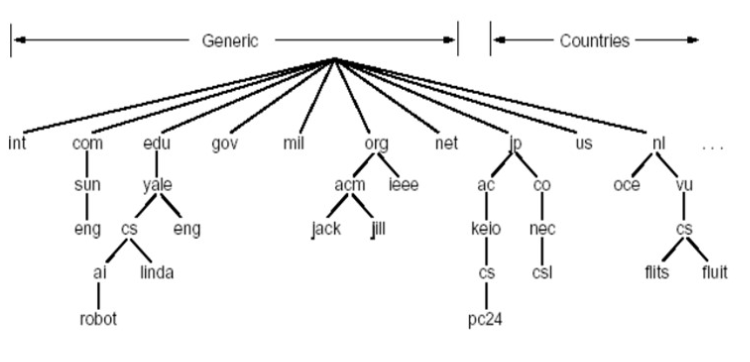
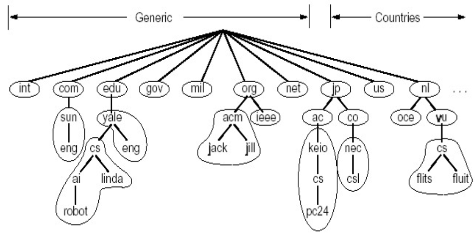

# 📘 2.5 DNS (Domain Name System) - 域名系统

> 来源说明：计算机网络-郑老师-第2章 | 本节涵盖：DNS必要性、历史、名字空间、名字服务器、查询过程、记录类型、安全性

---

## 🧠 核心概念总览（严格按原文顺序）

* [*知识点1: DNS的必要性*](#id1)
* [*知识点2: DNS系统需要解决的问题*](#id2)
* [*知识点3: DNS的历史*](#id3)
* [*知识点4: DNS总体思路和目标*](#id4)
* [*知识点5: DNS名字空间(The DNS Name Space) - 域名结构*](#id5)
* [*知识点6: DNS根名字服务器*](#id6)
* [*知识点7: DNS域名(Domain Name)*](#id7)
* [*知识点8: DNS域名的管理*](#id8)
* [*知识点9: 解析问题-名字服务器(Name Server)*](#id9)
* [*知识点10: 名字空间划分为若干区域(Zone)*](#id10)
* [*知识点11: 权威DNS服务器*](#id11)
* [*知识点12: 权威DNS服务器 - TLD服务器*](#id12)
* [*知识点13: DNS记录(Resource Records)*](#id13)
* [*知识点14: DNS大致工作过程*](#id14)
* [*知识点15: 本地名字服务器(Local Name Server)*](#id15)
* [*知识点16: 名字解析过程*](#id16)
* [*知识点17: 递归查询(Recursive Query)*](#id17)
* [*知识点18: 迭代查询(Iterated Query)*](#id18)
* [*知识点19: DNS协议、报文*](#id19)
* [*知识点20: 提高性能-缓存*](#id20)
* [*知识点21: 维护问题-新增一个域*](#id21)
* [*知识点22: 攻击DNS*](#id22)

---

<a id="id1"></a>
## ✅ 知识点1: DNS的必要性

**理论**
* **IP地址标识主机、路由器**，但IP地址**不好记忆**，不便人类使用（没有意义）
* **人类倾向使用有意义的字符串**来标识Internet上的设备
  * 例如：`qzheng@ustc.edu.cn` 所在的邮件服务器
  * 例如：`www.ustc.edu.cn` 所在的web服务器
* 存在着<b>"字符串"→IP地址</b>的转换的必要性
  * **人类用户**提供要访问机器的"字符串"名称
  * 由**DNS负责转换**成为二进制的网络地址

**注意点**
* 📋 **术语**：DNS (Domain Name System) - 域名系统

---

<a id="id2"></a>
## ✅ 知识点2: DNS系统需要解决的问题

**理论**

| 问题 | 解决方案 |
|------|----------|
| **问题1：如何命名设备** | 用**有意义的字符串**：好记，便于人类使用<br>解决一个平面命名的重名问题方式：**层次化命名** |
| **问题2：如何完成名字到IP地址的转换** | **分布式的数据库**维护和响应名字查询 |
| **问题3：如何维护** | 增加或者删除一个域，需要在域名系统中进行相应操作 |

---

<a id="id3"></a>
## ✅ 知识点3: DNS的历史

**理论**
* **ARPANET的名字解析解决方案**
  * **主机名**：没有层次的一个字符串（**一个平面**）
  * **集中维护站**：维护着一张**主机名-IP地址的映射文件：Hosts.txt**
  * **更新方式**：每台主机定时从维护站取文件

* **ARPANET解决方案的问题**
  * 当网络中主机数量很大时
    * **没有层次的主机名称很难分配**
    * **文件的管理、发布、查找都很麻烦**


---

<a id="id4"></a>
## ✅ 知识点4: DNS总体思路和目标

**理论**
* **DNS的主要思路**
  * **分层的、基于域的命名机制**
  * **若干分布式的数据库**完成名字到IP地址的转换
  * 运行在**UDP之上端口号为53**的应用服务
  * **核心的Internet功能，但以应用层协议实现**
    * 在**网络边缘处理复杂性**
    * 端系统的应用层

* **DNS主要目的**
  * 实现**主机名-IP地址的转换(name/IP translate)**
  * **其它目的**
    * **主机别名到规范名字的转换**：Host aliasing
    * **邮件服务器别名到邮件服务器的正规名字的转换**：Mail server aliasing
    * **负载均衡**：Load Distribution - 分配解析系统


---

<a id="id5"></a>
## ✅ 知识点5: DNS名字空间(The DNS Name Space) - 域名结构

**理论**
* **一个层面命名设备会有很多重名**
* **DNS采用层次树状结构的命名方法**
* **Internet根被划为几百个顶级域(top level domains)**
  * **通用的(generic)**：.com, .edu, .gov, .int, .mil, .net, .org, .firm, .shop, .web, .arts, .rec
  * **国家的(countries)**：.cn, .us, .nl, .jp
* **每个(子)域下面可划分为若干子域(subdomains)**
* 每过一个层次使用`.`来区分
* **树叶是主机**


---

<a id="id6"></a>
## ✅ 知识点6: DNS根名字服务器

**理论**
* 全球共有**13个根名字服务器**（逻辑上）
* **优势**：可靠，一个根死掉了，可以找其他的
* 根名字服务器分布示例：

| 标识 | 组织/位置 |
|------|----------|
| a | Verisign, Dulles, VA |
| b | USC-ISI, Marina del Rey, CA |
| c | Cogent, Herndon, VA |
| d | U Maryland, College Park, MD |
| e | NASA, Mt View, CA |
| f | Internet Software Consortium, Palo Alto, CA |
| g | US DoD, Vienna, VA |
| h | ARL, Aberdeen, MD |
| i | Autonomica, Stockholm |
| j | Verisign (11 locations) |
| k | RIPE, London/Amsterdam/Frankfurt |
| l | ICANN, Los Angeles, CA |
| m | WIDE, Tokyo |


---

<a id="id7"></a>
## ✅ 知识点7: DNS域名(Domain Name)

**理论**
* <b>域名(Domain Name)</b>格式
  * 从本域往上，直到树根
  * 中间使用<b>"."</b>间隔不同的级别
  

* **示例**
  * `ustc.edu.cn`
  * `auto.ustc.edu.cn`
  * `www.auto.ustc.edu.cn`
* **域的域名**：可以用于表示一个**域**
* **主机的域名**：一个域上的一个**主机**

---

<a id="id8"></a>
## ✅ 知识点8: DNS域名的管理

**理论**
* **一个域管理其下的子域**
  * .jp 被划分为 ac.jp, co.jp
  * .cn 被划分为 edu.cn, com.cn
* **创建一个新的域，必须征得它所属域的同意**
* **域与物理网络无关**
  * 域**遵从组织界限**，而不是物理网络
    * 一个域的主机**可以不在一个网络**
    * 一个网络的主机**不一定在一个域**
  * **域的划分是逻辑的，而不是物理的**

**注意点**
* 💡 **逻辑划分** vs **物理划分**：域按组织划分，不按网络位置划分

---

<a id="id9"></a>
## ✅ 知识点9: 解析问题-名字服务器(Name Server)

**理论**
* **一个名字服务器的问题**
  * **可靠性问题**：单点故障
  * **扩展性问题**：通信容量
  * **维护问题**：远距离的集中式数据库(改变一个域名到IP的对应关系非常麻烦)
* **解决方案：区域(zone)**
  * 区域的划分有**区域管理者自己决定**
  * 将DNS名字空间划分为**互不相交的区域**，每个区域都是树的一部分
  * **名字服务器**
    * 每个区域都有一个名字服务器：维护着它所管辖区域的**权威信息(authoritative record)**
    * 名字服务器**允许被放置在区域之外**，以保障可靠性


---

<a id="id10"></a>
## ✅ 知识点10: 名字空间划分为若干区域(Zone)

**理论**
* 名字空间被划分为多个**区域(Zone)**
* 每个区域对应一个**名字服务器**
* 名字服务器包括**权威DNS服务器**（含**根服务器**、**TLD服务器**及特定域名权威服务器）和**递归DNS服务器**（本地DNS服务器）。



---

<a id="id11"></a>
## ✅ 知识点11: 权威DNS服务器

**理论**
* **权威DNS服务器**：组织机构的DNS服务器
* **功能**：
  * 提供组织机构服务器（如Web和mail）可访问的**主机和IP之间的映射**
  * 上层名字服务器还需要维护一个指向到正确下层名字服务器的指针
* **维护方式**：组织机构可以选择**自己维护**或由**某个服务提供商来维护**

**注意点**
* 📋 **术语**：Authoritative DNS Server - 权威DNS服务器

---
<a id="id12"></a>
## ✅ 知识点12: 权威DNS服务器 - TLD服务器

**理论**
* **顶级域(TLD)服务器**
  * 负责**顶级域名**（如com, org, net, edu, gov）
  * 负责**所有国家级的顶级域名**（如cn, uk, fr, ca, jp）
* **维护机构**
  * **Network Solutions** 公司维护com TLD服务器
  * **Educause** 公司维护edu TLD服务器

**注意点**
* 📋 **术语**：TLD (Top Level Domain) Server - 顶级域服务器


---

<a id="id13"></a>
## ✅ 知识点13: DNS记录(Resource Records)

**理论**
* **区域名字服务器维护资源记录**
* **资源记录(resource records)**
  * **作用**：维护<b>域名-IP地址(其它)</b>的映射关系
  * **位置**：Name Server的分布式数据库中
* **RR格式**：`(domain_name, ttl, type, class, Value)`
  * **Domain_name**：域名
  * **Ttl**：time to live，生存时间（权威、缓冲记录）
  * **Class**：类别，对于Internet，值为**IN**
  * **Value**：值，可以是数字、域名或ASCII串
  * **Type**：类别，资源记录的类型

**DNS：保存资源记录(RR)的分布式数据库**

**RR格式简化**：`(name, value, type, ttl)`

| Type | Name | Value | 说明 |
|------|------|-------|------|
| **Type=A** | 为主机 | 为IP地址 | 主机名→IP地址映射 |
| **Type=CNAME** | 为规范名字的别名 | 为规范名字 | www.ibm.com的规范名字为servereast.backup2.ibm.com |
| **Type=NS** | 域名(如foo.com) | 为该域名的权威服务器的域名 | 指定权威服务器 |
| **Type=MX** | - | 为name对应的邮件服务器的名字 | 邮件服务器映射 |

**TTL**：生存时间，决定了资源记录应当从缓存中删除的时间


---

<a id="id14"></a>
## ✅ 知识点14: DNS大致工作过程

**理论**
1. **应用调用解析器(resolver)**
2. **解析器作为客户**向Name Server发出查询报文（封装在UDP段中）
3. **Name Server返回响应报文**(name/ip)

```
        application
            |
            v
        resolver 
            | 1:request
            v
        Local Name Server
            | 2:request
            v
        (其他DNS服务器)
            | 3:response
            v
        Local Name Server
            | 4:response
            v
        resolver
```

---

<a id="id15"></a>
## ✅ 知识点15: 本地名字服务器(Local Name Server)

**理论**
* **并不严格属于层次结构**
* **每个ISP**（居民区的ISP、公司、大学）都有一个本地DNS服务器
  * 也称为**"默认名字服务器"**
* **当一个主机发起一个DNS查询时**，查询被送到其**本地DNS服务器**
  * 起着**代理**的作用，将查询转发到层次结构中

**注意点**
* 📋 **术语**：Local Name Server - 本地名字服务器、Default Name Server - 默认名字服务器

---

<a id="id16"></a>
## ✅ 知识点16: 名字解析过程

**理论**
* **目标名字在Local Name Server中**
  * **情况1**：查询的名字在该区域内部
  * **情况2**：**缓存(caching)**
* **当与本地名字服务器不能解析名字时**
  * 联系**根名字服务器**
  * 顺着**根-TLD**一直找到**权威名字服务器**

```
local name server cs.yale.edu
    |
    | (不能解析)
    v
联系根名字服务器 → TLD → 权威名字服务器
    |
    v
返回结果
```

---

<a id="id17"></a>
## ✅ 知识点17: 递归查询(Recursive Query)

**理论**
* **递归查询特点**：**名字解析负担都放在当前联络的名字服务器上**
* **问题**：**根服务器的负担太重**
* **解决**：**迭代查询(Iterated Query)**

**递归查询流程**：
```
host → local DNS → root DNS → TLD DNS → authoritative DNS
  (1)    (8返回)    (2请求,7返回) (3请求,6返回) (4请求,5返回)
```

**注意点**
* ⚠️ 递归查询将负担集中在服务器端，对根服务器压力大

---

<a id="id18"></a>
## ✅ 知识点18: 迭代查询(Iterated Query)

**理论**
* **主机cis.poly.edu**想知道主机**gaia.cs.umass.edu**的IP地址
* **根（及各级域名）服务器返回的不是查询结果**，而是**下一个NS的地址**
* **最后由权威名字服务器给出解析结果**
* **当前联络的服务器给出可以联系的服务器的名字**
* **"我不知道这个名字，但可以向这个服务器请求"**

**迭代查询流程**：
```
host(cis.poly.edu)
    |
    v
local DNS server(dns.poly.edu) --(1请求)--> root DNS server
    ^                                      |
    |                                      v
    |<--(8返回结果)------------------- TLD DNS server
                                              |
                                              v
                                         authoritative DNS server
                                              |
                                              v
                                          (返回IP)
```

**注意点**
* 💡 迭代查询将负担分散到各层服务器，根服务器压力减小

---

<a id="id19"></a>
## ✅ 知识点19: DNS协议、报文

**理论**
* **DNS协议**：查询和响应报文的**报文格式相同**
* **报文首部**
  * **标识符（ID）**：16位
  * **flags标志**
    * 查询/应答
    * 希望递归
    * 递归可用
    * 应答为权威

**报文结构**：
```
2 bytes                2 bytes
identification         flags
# questions            # answer RRs
# authority RRs          # additional RRs
questions (variable)
answers (variable)
authority (variable)
additional info (variable)
```

| 字段 | 说明 |
|------|------|
| **identification** | 标识符，匹配查询与响应 |
| **flags** | 标志位 |
| **# questions** | 查询的问题数量 |
| **# answer RRs** | 回答中的RR数量 |
| **# authority RRs** | 权威记录的RR数量 |
| **# additional RRs** | 附加信息的RR数量 |
| **questions** | 查询的Name、type字段 |
| **answers** | 对应查询的RR记录 |
| **authority** | 权威服务器的记录 |
| **additional info** | 附加的有用信息 |

---

<a id="id20"></a>
## ✅ 知识点20: 提高性能-缓存

**理论**
* **一旦名字服务器学到了一个映射，就将该映射缓存起来**
* **根服务器通常都在本地服务器中缓存着**
  * 使得**根服务器不用经常被访问**
* **目的：提高效率**
* **可能存在的问题**：如果情况变化，**缓存结果和权威资源记录不一致**
* **解决方案**：**TTL（默认2天）**

**注意点**
* ⚠️ 缓存带来效率提升，但也可能引入一致性问题，通过TTL解决

---

<a id="id21"></a>
## ✅ 知识点21: 维护问题-新增一个域

**理论**
* **在上级域的名字服务器中增加两条记录**，指向这个新增的子域的域名和域名服务器的地址
* **在新增子域的名字服务器上运行名字服务器**，负责本域的名字解析：名字→IP地址

**例子：在com域中建立一个"Network Utopia"**
1. **到注册登记机构注册域名networkutopia.com**
   * 需要向该机构提供权威DNS服务器（基本的、和辅助的）的名字和IP地址
2. **登记机构在com TLD服务器中插入两条RR记录**：
   * `(networkutopia.com, dns1.networkutopia.com, NS)`
   * `(dns1.networkutopia.com, 212.212.212.1, A)`
3. **在networkutopia.com的权威服务器中确保有**：
   * 用于Web服务器的`www.networkutopia.com`的类型为A的记录
   * 用于邮件服务器`mail.networkutopia.com`的类型为MX的记录

---

<a id="id22"></a>
## ✅ 知识点22: 攻击DNS

**理论**

### DDoS攻击
* **对根服务器进行流量轰炸攻击**：发送大量ping
  * **没有成功**
  * **原因1**：根目录服务器配置了**流量过滤器、防火墙**
  * **原因2**：**Local DNS服务器缓存了TLD服务器的IP地址**，因此无需查询根服务器
* **向TLD服务器流量轰炸攻击**：发送大量查询
  * **可能更危险**
  * **效果一般**：大部分DNS缓存了TLD

### 重定向攻击
* **中间人攻击**
  * 截获查询，伪造回答，从而攻击某个（DNS回答指定的IP）站点
* **DNS中毒**
  * 发送伪造的应答给DNS服务器，希望它能够缓存这个虚假的结果
* **技术上较困难**：分布式截获和伪造

### 利用DNS基础设施进行DDoS
* **伪造某个IP进行查询**，攻击这个目标IP
* **查询放大**：响应报文比查询报文大
* **效果有限**

**总的说来，DNS比较健壮**

---

## 🔑 核心要点总结
1. **DNS是应用层协议**，使用UDP端口53，但提供核心Internet功能（域名→IP转换）
2. **分布式、层次化设计**：根→TLD→权威→本地DNS
3. **两种查询方式**：递归查询（负担在服务器）vs 迭代查询（返回下一级地址）
4. **缓存机制**提高效率，TTL解决一致性问题
5. **多种RR类型**：A、CNAME、NS、MX等，各有用途

## 📌 考试速记版
* **DNS核心功能**：域名↔IP地址转换
* **服务器层次**：根(13个)→TLD→权威→本地
* **查询类型**：递归（服务器负担）vs 迭代（返回NS地址）
* **RR类型**：A(主机→IP)、CNAME(别名→规范名)、NS(域→权威服务器)、MX(邮件服务器)
* **安全措施**：缓存、TTL、流量过滤

**记忆口诀**：DNS五三端口跑，根顶权本四层牢，递归迭代两种查，A记MX要记牢
