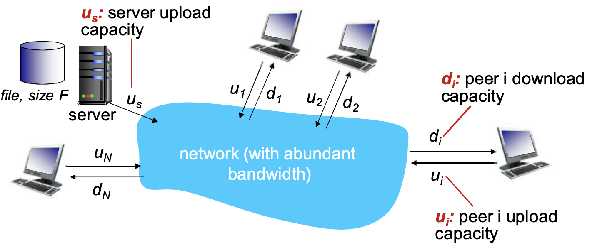
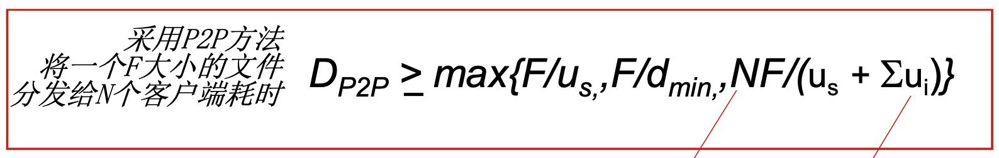
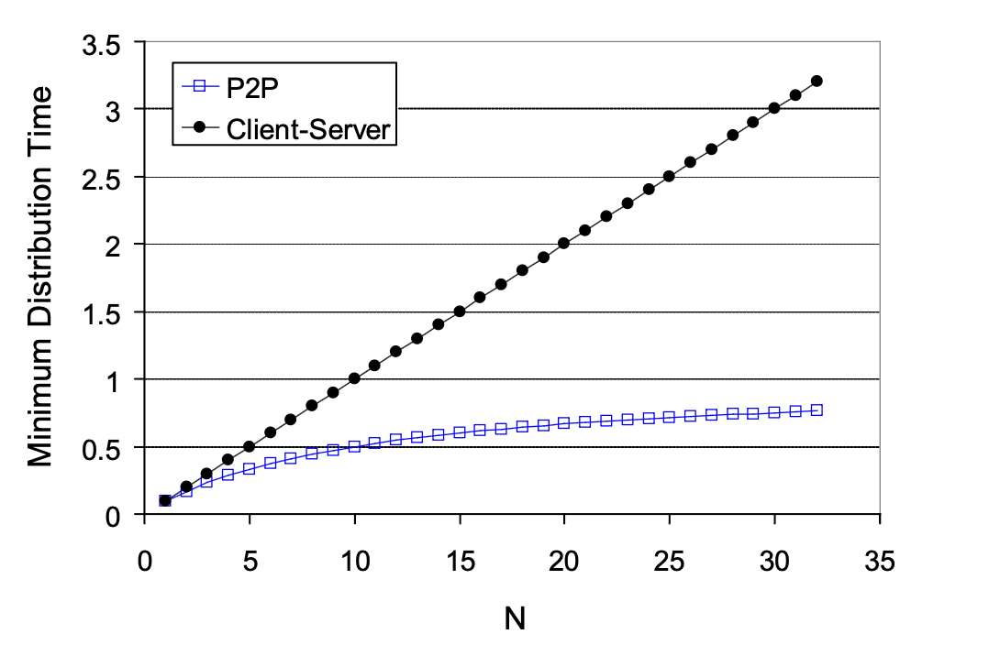
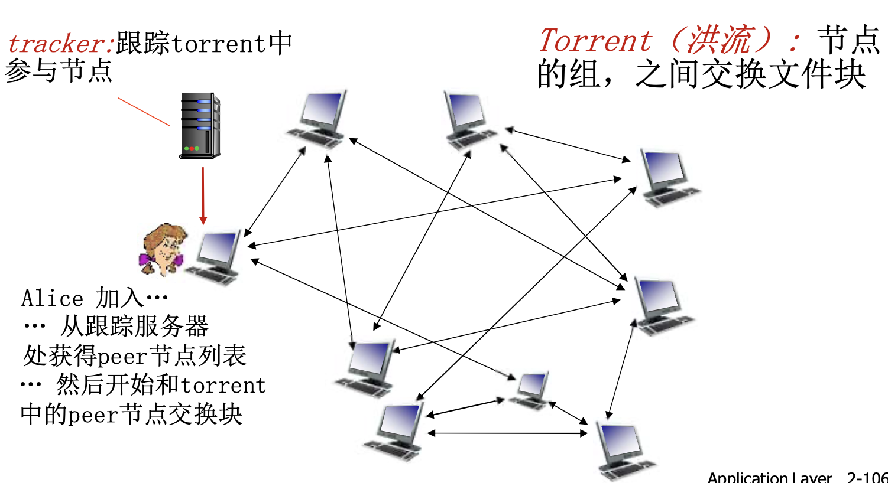
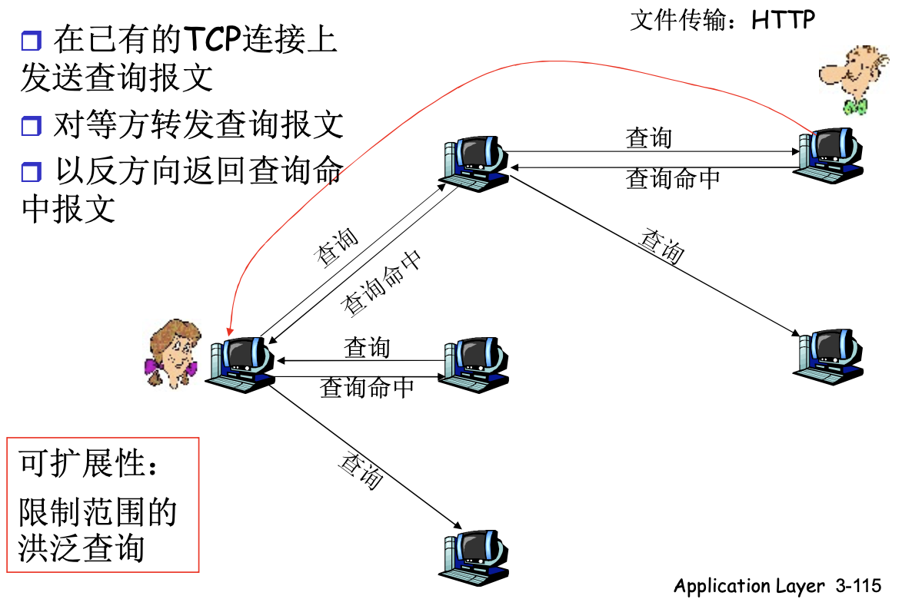

# 📘 2.6 P2P 应用 (Peer-to-Peer Applications)

> 来源说明：计算机网络-郑老师-第2章 | 本节涵盖：P2P架构特点、文件分发、BitTorrent协议、文件共享方案

---

## 🧠 核心概念总览（严格按原文顺序）

* [*知识点1: 纯P2P架构特点*](#id1)
* [*知识点2: 文件分发问题-C/S vs P2P*](#id2)
* [*知识点3: 文件分发时间-C/S模式*](#id3)
* [*知识点4: 文件分发时间-P2P模式*](#id4)
* [*知识点5: C/S vs P2P对比示例*](#id5)
* [*知识点6: P2P文件分发-BitTorrent概述*](#id6)
* [*知识点7: BitTorrent工作流程*](#id7)
* [*知识点8: BitTorrent请求块策略*](#id8)
* [*知识点9: BitTorrent发送块策略-tit-for-tat*](#id9)
* [*知识点10: P2P文件共享示例*](#id10)
* [*知识点11: P2P文件共享的两大问题*](#id11)
* [*知识点12: P2P集中式目录-Napster设计*](#id12)
* [*知识点13: 集中式目录存在的问题*](#id13)
* [*知识点14: 查询洪泛-Gnutella协议*](#id14)
* [*知识点15: Gnutella覆盖网络*](#id15)
* [*知识点16: 如何建立洪泛网络*](#id17)
* [*知识点17: 利用不匀称性-KaZaA*](#id18)
* [*知识点18: KaZaA查询*](#id19)
* [*知识点19: KaZaA小技巧*](#id20)
* [*知识点20: 分布式哈希表(DHT)*](#id21)

---

## ✅ 知识点1: 纯P2P架构特点

**理论**
* **没有（或极少）一直运行的服务器**
* **任意端系统都可以直接通信**
* **利用peer的服务能力**，不需要专用服务器
* **Peer节点间歇上网，每次IP地址都有可能变化**

**例子**
* 文件分发 (BitTorrent)
* 流媒体 (KanKan)
* VoIP (Skype)

---

## ✅ 知识点2: 文件分发问题-C/S vs P2P

**理论**
* **问题**：从一台服务器分发文件（大小F）到N个peer需要多少时间？
* **资源限制**
  * `us`：server upload capacity（服务器上载容量）
  * `di`：peer i download capacity（节点i下载容量）
  * `ui`：peer i upload capacity（节点i上载容量）

**架构图**

---

## ✅ 知识点3: 文件分发时间-C/S模式

**理论**
* **服务器传输**
  * 都是由服务器发送给peer，服务器必须顺序传输（上载）N个文件拷贝：F
  * 发送一个copy时间：`F/us`
  * 发送N个copy时间：`NF/us`

* **客户端**
  * 每个客户端必须下载一个文件拷贝
  * `dmin` = 客户端最小的下载速率(因为这个速度才能兜底，它传完了才算完)
  * 下载带宽最小的客户端下载的时间：`F/dmin`

* **C/S方法总时间**

* **特点**：**随着N线性增长**
  * 当客户数量很少时(N很小)，服务端能极快发完文件，这个时候速度由客户端下载速度决定。
  * 但是当服务器有很多客户端的时候(N很大)，瓶颈就是服务器上传速度了，因此总速度是由`NF/us`决定了
  

---

## ✅ 知识点4: 文件分发时间-P2P模式

**理论**
* **服务器传输**
  * 最少需要上载一份拷贝
  * 发送一个拷贝的时间：`F/us`

* **客户端**
  * 每个客户端必须下载一个拷贝
  * 最小下载带宽客户单耗时：`F/dmin`

* **客户端总体**
  * 所有客户端总体下载量NF
  * 最大上载带宽是：`us + Σui`
  * 除了服务器可以上载，其他所有的peer节点都可以上载

* **P2P方法总时间**

* **特点**
  * 分子随着N线性变化，每个节点需要下载，整体下载量随着N增大
  * **分母也是如此，随着peer节点的增多每个peer也带了服务能力**
  * **自扩展性**
  * **节点非常多，可管理性较差**

---

## ✅ 知识点5: C/S vs P2P对比示例

**假设**
  * 客户端上载速率 = u
  * F/u = 1小时
  * us = 10u
  * dmin ≥ us

**结论**：P2P具有更好的扩展性

---

## ✅ 知识点6: P2P文件分发-BitTorrent概述

**理论**
* **文件被分为一个个块256KB**
* **网络中的这些peers发送接收文件块，相互服务**

**关键组件**
* 每个节点有一个**位图文件**， 每个位置使用1/0表示拥不拥有某块文件
  * 后续会在洪流中泛洪所有节点的位图文件这样大家就知道对方有哪些文件资源块了

---

## ✅ 知识点7: BitTorrent工作流程

**理论**
1. **Peer加入torrent**
   * Alice加入...
   * 从跟踪服务器处获得peer节点列表
   * 然后开始和torrent中的peer节点交换块
   * 向跟踪服务器注册，获得peer节点列表，和部分peer节点构成邻居关系（"连接"）

2. **Peer下载时同时上传**
   * 当peer下载时，该peer可以同时向其他节点提供上载服务

3. **Peer动态变化**
   * Peer可能会变换用于交换块的peer节点
   * 扰动(churn)：peer节点可能会上线或者下线

4. **完成文件后**
   * 一旦一个peer拥有整个文件，它会（自私的）离开或者保留（利他主义）在torrent中

---

## ✅ 知识点8: BitTorrent请求块策略

**理论**
* **请求块**
  * 在任何给定时间，不同peer节点拥有一个文件块的子集
  * 周期性的，一开始加入的peer节点Alice向邻居询问他们拥有哪些块的信息
  * 并对所有传过来的块全部下载
  * 当Alice节点拥有的块到达一定数量后: Alice向peer节点请求它希望的块，**稀缺的块**

---

## ✅ 知识点9: BitTorrent发送块策略-tit-for-tat

**理论**
* **发送块：一报还一报(tit-for-tat)**
  * Alice向4个peer发送块，这些peer向它自己提供最大带宽的服务
  * 其他peer被Alice阻塞（将不会从Alice处获得服务）

* **动态调整**
  1. **Top 4 白名单**：每个节点（如Alice）只给对自己贡献带宽最多的 **前4个peer** 发数据
  2. **Choke（阻塞）**：不在Top 4的peer被"拉黑"，暂时从Alice这里拿不到任何数据
  3. **10秒重新评估**：每隔10秒刷新一次Top 4排名，动态调整"VIP名单"
  4. **30秒随机疏通**：每隔30秒随机挑一个非Top 4的peer，免费给它发点数据"试试水"

* **效果**
  * 更高的上载速率 → 发现更好的交易伙伴 → 获得更快的文件传输速率

* **tit-for-tat核心思路**：谁提供给我的带宽服务好，我就优先将资源发给他们
  1. Alice **随机疏通** Bob（给Bob发数据）
  2. Bob发现Alice对自己不错 → 把Alice加入自己的 **Top 4**
  3. Bob开始回报Alice → Bob也成为Alice的 **Top 4**
  4. **双赢**：两人形成稳定的互惠传输通道

---

## ✅ 知识点10: P2P文件共享示例

**理论**
* **Alice选择其中一个对等方，如Bob**
* **Alice在其笔记本电脑上运行P2P客户端程序**
* **间歇性地连接到Internet**，每次从其ISP得到新的IP地址
* **请求"双截棍.MP3"**
* **应用程序显示其他有"双截棍.MP3"拷贝的对等方**
* **文件从Bob's PC传送到Alice的笔记本上**：HTTP
* **当Alice下载时，其他用户也可以从Alice处下载**
* **Alice的对等方既是一个Web客户端，也是一个瞬时Web服务器**

**结论**：所有的对等方都是服务器 = 可扩展性好！

---

## ✅ 知识点11: P2P文件共享的两大问题

**理论**
* **问题1：如何定位所需资源**
* **问题2：如何处理对等方的加入与离开**

**P2P种类**
  * **结构化P2P**：节点通过哈希算法（如 DHT）按规则组织成特定拓扑如树，环等等，文件定位精确高效，但系统维护复杂度高。

  * **非结构化P2P**：节点随机建立连接形成松散网络，文件存放无固定规则，依赖泛洪查询，简单灵活但搜索效率随规模急剧下降。

**可能的解决问题方案**
* 集中
* 分散
* 半分散

---

## ✅ 知识点12: P2P集中式目录-Napster设计

**工作流程**
1. 当对等方连接时，它告知中心服务器：**IP地址、内容**
2. Alice查询"双截棍.MP3"
3. Alice从Bob处请求文件

**特点**
* 文件传输是分散的，
* 而定位内容则是高度s集中的
 

---

## ✅ 知识点13: 集中式目录存在的问题

**理论**
* **单点故障**：目录服务器一挂全完了
* **性能瓶颈**：上下线都需要向目录服务器告知
* **侵犯版权**

---

## ✅ 知识点14: 查询洪泛-Gnutella协议

**理论**
* **全分布式**
  * 没有中心服务器
* **开放文件共享协议**
  * 许多Gnutella客户端实现了自己的Gnutella协议
  * 类似HTTP有许多的浏览器

**协议运作**

---

## ✅ 知识点15: Gnutella覆盖网络

**理论**
* **覆盖网络：图**
  * 如果X和Y之间有一个TCP连接，则二者之间存在一条边
  * 所有活动的对等方连接的边就是覆盖网络（Overlay Network）
* **边并不是物理链路**
* 对于一个对等方节点，通常所连接的节点少于10个

---

## ✅ 知识点16: 如何建立洪泛网络

**节点加入**
1. **对等方X必须首先发现某些已经在覆盖网络中的其他对等方**
   * 使用可用对等方列表，这个列表一般在客户端配置好时给出
   * 一般列表中是经常在运行的覆盖网络中的节点IP
   * 联系维持列表的Gnutella站点

2. **X接着试图与该列表上的对等方建立TCP连接**，直到与某个对等方Y建立连接

3. **X向Y发送一个Ping报文**，Y四处转发该Ping报文

4. **所有收到Ping报文的对等方以Pong报文响应**
   * IP地址、共享文件的数量及总字节数

5. **X收到许多Pong报文，然后随机选取8-10个节点建立TCP连接**

**节点离开**
1. 离开节点告诉，与之链接的对等点需要离开的信息
2. 失去节点的对等点则去找其他节点链接维持链接强度

---

## ✅ 知识点17: 利用不匀称性-KaZaA

**理论**
* **每个对等方要么是一个组长，要么隶属于一个组长**
  * 对等方与其组长之间有TCP连接
  * 组长对之间有TCP连接
* **组长跟踪其所有的孩子的内容**
* **组长与其他组长联系**
  * 转发查询到其他组长
  * 获得其他组长的数据拷贝

**架构图**

---

## ✅ 知识点18: KaZaA查询

**理论**
* **每个文件有一个散列标识码和一个描述符**
* **客户端向其组长发送关键字查询**（匹配描述符）
* **组长用匹配进行响应**
  * 对每个匹配：元数据、散列标识码和IP地址
  * 匹配成功后将源文件中的哈希值作为这个目标资源的唯一标识并返回
* 如果组长在小组内查询到目标资源, 直接返回
* 否则组长将查询转发给其他组长，其他组长也以匹配进行响应
* **客户端选择要下载的文件**
  * 向拥有文件的对等方发送一个带散列标识码的HTTP请求

---

## ✅ 知识点19: KaZaA小技巧

**理论**
* **请求排队**
  * 限制并行上载的数量
  * 确保每个被传输的文件从上载节点接收一定量的带宽

* **激励优先权**
  * 鼓励用户上载文件
  * 加强系统的扩展性

* **并行下载**
  * 从多个对等方下载同一个文件的不同部分
  * HTTP的字节范围首部
  * 更快地检索一个文件

---

## ✅ 知识点20: 分布式哈希表(DHT)

**理论**
* **哈希表**
* **DHT方案**
* **环形DHT以及覆盖网络**
* **Peer波动**

**注意点**
* 📋 **术语**：DHT (Distributed Hash Table) - 分布式哈希表

---

## 🔑 核心要点总结
1. **P2P核心优势**：自扩展性，peer越多服务能力越强
2. **BitTorrent**：分块(256KB)传输 + Tit-for-Tat激励机制 + 跟踪服务器
3. **三种定位方案**：Napster集中式、Gnutella洪泛式、KaZaA组长式
4. **C/S vs P2P**：C/S线性增长、P2P对数增长（自扩展）

## 📌 考试速记版
* **P2P特点**：无服务器、直接通信、自扩展、peer既是客户端也是服务器
* **BitTorrent**：256KB块、tracker管理、tit-for-tat激励机制
* **文件分发时间**：C/S: max{NF/us, F/dmin} vs P2P: max{F/us, F/dmin, NF/(us+Σui)}
* **三种方案对比**：Napster(集中目录/分散传输)、Gnutella(全分布/洪泛)、KaZaA(组长机制)

**记忆口诀**：P2P无中心自扩展，BitTorrent分块传，一报还一报tit-for-tat，三种方案各有招
