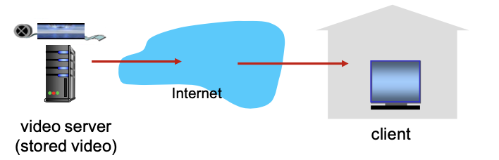
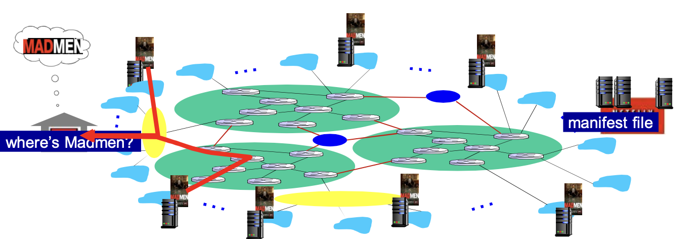
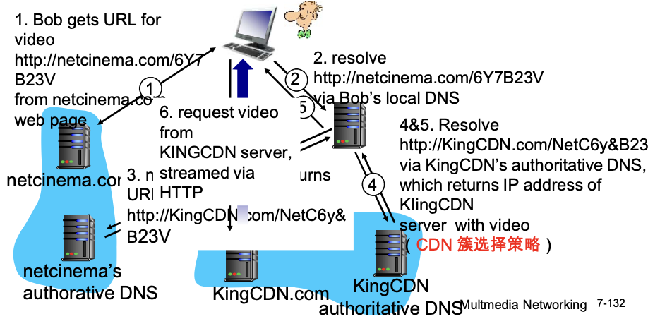
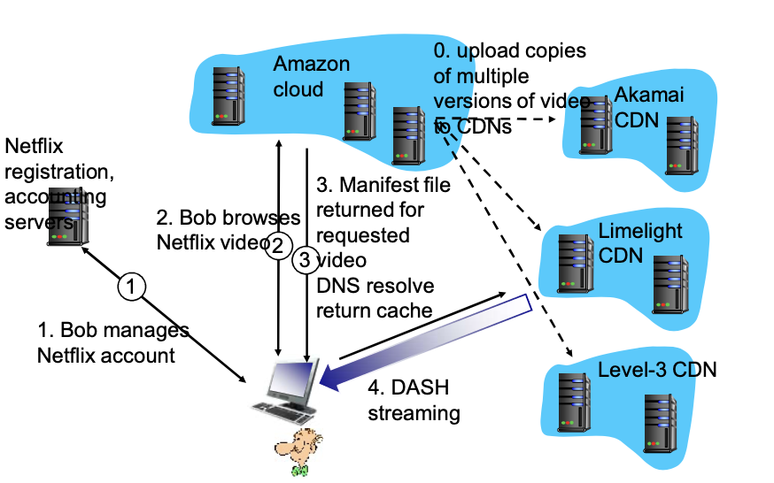

# 📘 2.7 CDN (Content Distribution Network) - 内容分发网络

> 来源说明：计算机网络-郑老师-第2章 | 本节涵盖：视频流化服务、DASH协议、CDN架构、内容访问场景

---

## 🧠 核心概念总览（严格按原文顺序）

* [*知识点1: 视频流化服务和CDN的上下文*](#id1)
* [*知识点2: 视频流化服务的规模性与异构性挑战*](#id2)
* [*知识点3: 多媒体视频特性*](#id3)
* [*知识点6: 视频编码速率类型*](#id6)
* [*知识点7: 存储视频的流化服务*](#id7)
* [*知识点8: DASH概述*](#id8)
* [*知识点9: DASH服务器端*](#id9)
* [*知识点10: DASH客户端*](#id10)
* [*知识点11: DASH智能客户端*](#id11)
* [*知识点12: CDN必要性-选项1超级服务中心*](#id12)
* [*知识点13: CDN架构-选项2内容分发网络*](#id13)
* [*知识点14: CDN部署缓存节点策略-Enter Deep*](#id14)
* [*知识点15: CDN部署缓存节点策略-Bring Home*](#id15)
* [*知识点16: CDN节点内容存储*](#id16)
* [*知识点17: OTT概念*](#id17)
* [*知识点18: OTT挑战*](#id18)
* [*知识点19: CDN简单内容访问场景*](#id19)
* [*知识点20: 案例学习-Netflix*](#id20)

---

## ✅ 知识点1: 视频流化服务和CDN的上下文

**理论**
* **视频流量**：占据着互联网大部分的带宽
  * Netflix, YouTube：占据37%, 16% 的ISP下行流量
  * ~1B YouTube 用户, ~75M Netflix用户

---

## ✅ 知识点2: 视频流化服务的规模性与异构性挑战

**理论**
* **挑战：规模性**
  * 如何服务者 ~1B 用户？
  * 单个超级服务器无法提供服务
* **挑战：异构性**
  * 不同用户拥有不同的能力（例如：有线接入和移动用户；带宽丰富和受限用户）
* **解决方案**
  * 分布式的，应用层面的基础设施

---

## ✅ 知识点3: 多媒体视频特性

**理论**
* **视频可定义为**：固定速度显示的图像序列（e.g. 24 images/sec）
* **数字化图像**：像素的阵列，每个像素被若干bits表示
* **网络视频特点**
  * **高码率**：>10x于音频，高的网络带宽需求（单位时间数据量）
  * **视频通常需要被压缩**
  * 90%以上的网络流量是视频
* **编码**：使用图像内和图像间的冗余来降低编码的比特数（压缩）如：把动的对象编码传输即可
  * **空间冗余**（图像内）： 发送2个值：颜色和重复的个数(N)
  * **时间冗余**（相邻的图像间）：仅发送和帧i差别的地方

---

## ✅ 知识点6: 视频编码速率类型

**理论**
* **CBR** (constant bit rate)：以固定速率编码
* **VBR** (variable bit rate)：视频编码速率随时间的变化而变化

**编码标准示例**
* **MPEG 1** (CD-ROM)：1.5 Mbps
* **MPEG 2** (DVD)：3-6 Mbps
* **MPEG 4** (often used in Internet, < 1 Mbps)

---

## ✅ 知识点7: 存储视频的流化服务

**理论**
* **简单场景**

* 视频流媒体服务器client边下边放，延迟非常低

---

## ✅ 知识点8: DASH概述

**理论**
* **DASH**：Dynamic, Adaptive Streaming over HTTP（动态自适应流）
* 多媒体流化服务技术

---

## ✅ 知识点9: DASH服务器端

**理论**
* **将视频文件分割成多个块**
* **每个块独立存储，编码于不同码率**（8-10种），一个块就有多种不同版本
* **告示文件（manifest file）**：提供不同块的URL，以及码率

---

## ✅ 知识点10: DASH客户端

**理论**
1. **先获取告示文件**
2. **周期性地测量服务器到客户端的带宽**
3. **查询告示文件，在一个时刻请求一个块**，HTTP头部指定字节范围
   * 如果带宽足够，选择最大码率的视频块
   * 会话中的不同时刻，可以切换请求不同的编码块（取决于当时的可用带宽）

---

## ✅ 知识点11: DASH智能客户端

**理论**
* **"智能"客户端**：客户端自适应决定
  * **什么时候去请求块**（不至于缓存挨饿，或者溢出）
  * **请求什么编码速率的视频块**（当带宽够用时，请求高质量的视频块）
  * **哪里去请求块**（可以向离自己近的服务器发送URL，或者向高可用带宽的服务器请求）

---

## ✅ 知识点12: CDN必要性-选项1超级服务中心

* **挑战**：服务器如何通过网络向上百万用户同时流化视频内容 (上百万视频内容)?

* **选择1：单个的、大的超级服务中心"mega-server"**

* **存在的问题**
  * 服务器到客户端路径上跳数较多，瓶颈链路的带宽小导致停顿
  * "二八规律"决定了网络同时充斥着同一个视频的多个拷贝，效率低（付费高、带宽浪费、效果差）
  * 单点故障点，性能瓶颈
  * 周边网络的拥塞

**评述**：相当简单，但是这个方法**不可扩展**

---

## ✅ 知识点13: CDN架构-选项2内容分发网络

**理论**
* **选项2：通过CDN，全网部署缓存节点，存储服务内容，就近为用户提供服务，提高用户体验**
* **内容加速**：用户可以通过域名解析重定向找到最近能提供服务的节点：提供的服务更好

---

## ✅ 知识点14: CDN部署缓存节点策略-Enter Deep

**理论**
* **Enter Deep（深入部署）**
  * 将CDN服务器深入到许多接入网：将服务器介入到local isp
  * 并将视频资源内容预先部署到这些缓存服务器
  * **更接近用户，数量多，离用户近，管理困难**
  * **Akamai**：1700个位置

---

## ✅ 知识点15: CDN部署缓存节点策略-Bring Home

**理论**
* **Bring Home（带回家部署）**
  * 部署在少数(10个左右)关键位置，如将服务器簇安装于POP附近（离若干1st ISP，POP较近）
  * 服务器卡在一个关键的位置，但是中间跳数比较多
  * 采用租用线路将服务器簇连接起来
  * **Limelight**

---

## ✅ 知识点16: CDN节点内容存储

**理论**
* **在CDN节点中存储内容的多个拷贝**
  * e.g. Netflix stores copies of MadMen
* **用户从CDN缓存节点中请求内容**（通过通过告示文件/域名重定向）
  * 重定向到最近的拷贝，请求内容
  * 如果网络路径拥塞，可能选择不同的拷贝
  * 具体怎么请求，向谁请求是客户端自己的事儿

---

## ✅ 知识点17: OTT概念

**理论**
* **OTT (Over The Top)**
* 互联网络**主机-主机**之间的通信作为一种服务向用户提供
* 缓存节点是在应用层，网络边缘

---

## ✅ 知识点18: OTT挑战

**理论**
* **在拥塞的互联网上复制内容的挑战**
  * 从哪个CDN节点中获取内容？- 节点部署问题
  * 用户在网络拥塞时的行为？
  * 在哪些CDN节点中存储什么内容？- 内容部署问题

---

## ✅ 知识点19: CDN简单内容访问场景

**理论**
* **场景**：Bob(客户端)请求视频
  * URL：`http://netcinema.com/6Y7B23V`
  * 视频存储在CDN：`http://KingCDN.com/NetC6y&B23V`

**流程**
1. Bob从netcinema.com网页获取视频URL：`http://netcinema.com/6Y7B23V`
2. 通过Bob的本地DNS解析`http://netcinema.com/6Y7B23V`
3. netcinema的权威DNS返（域名解析重定向）URL：`http://KingCDN.com/NetC6y&B23V`
4. 通过KingCDN的权威DNS解析`http://KingCDN.com/NetC6y&B23V`
5. 返回KingCDN服务器的IP地址（CDN簇选择策略）
6. Bob向KingCDN服务器请求视频
7. 视频从KingCDN服务器流式传输给Bob

**架构图**

---

## ✅ 知识点20: 案例学习-Netflix

**理论**
* **架构**

**流程**
1. Bob管理Netflix账户
2. Bob浏览Netflix视频
3. DNS解析返回缓存位置，Manifest file返回
4. DASH流式传输

---

## 🔑 核心要点总结
1. **视频占据互联网大部分流量**，面临规模性和异构性挑战
2. **DASH**：客户端自适应选择码率，HTTP传输，告示文件指引
3. **CDN两种部署策略**：Enter Deep（Akamai，节点多）vs Bring Home（Limelight，租用线路）
4. **CDN工作流程**：DNS重定向→选择最近CDN节点→流式传输
5. **Netflix案例**：多CDN + DASH实现大规模视频分发

## 📌 考试速记版
* **视频挑战**：规模性(~1B用户) + 异构性(不同带宽设备)
* **DASH核心**：分块存储、多码率版本、告示文件、客户端自适应选择
* **CDN策略**：Enter Deep(深入接入网,1700+节点) vs Bring Home(关键位置,10个左右)
* **OTT**：Over The Top，互联网主机-主机通信作为服务
* **Netflix架构**：Amazon云+多CDN(Akamai/Limelight/Level-3)+DASH

**记忆口诀**：视频流量占带宽，规模异构是挑战，DASH分块多码率，CDN就近来服务，Enter Deep节点多，Bring Home关键位，OTT来分发
