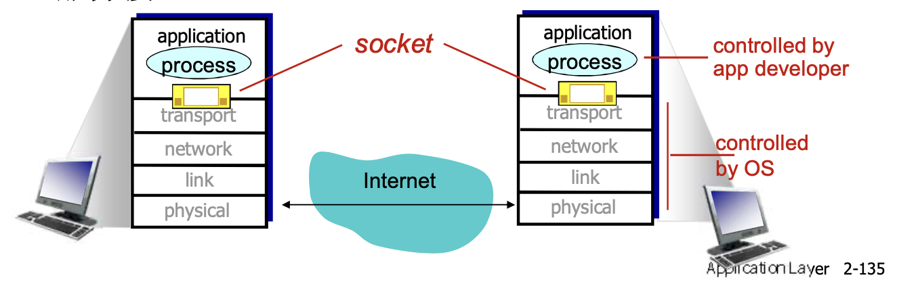

# 📘 2.8 TCP 套接字编程 (TCP Socket Programming)

> 来源说明：计算机网络-郑老师-第2章 | 本节涵盖：Socket概念、TCP套接字编程、C/S交互流程、C语言示例

---

## 🧠 核心概念总览（严格按原文顺序）

* [*知识点1: Socket编程概述*](#id1)
* [*知识点2: 2种传输层服务的socket类型*](#id2)
* [*知识点3: TCP套接字概述*](#id3)
* [*知识点4: TCP服务特点*](#id4)
* [*知识点5: TCP服务器端流程*](#id5)
* [*知识点6: TCP客户端流程*](#id6)
* [*知识点7: TCP C/S socket交互*](#id7)
* [*知识点8: 数据结构sockaddr_in*](#id8)
* [*知识点9: 数据结构hostent*](#id9)
* [*知识点10: C客户端示例(TCP)*](#id10)
* [*知识点11: C服务器示例(TCP)*](#id11)

---

<a id="id1"></a>
## ✅ 知识点1: Socket编程概述

**理论**
* **应用进程使用传输层提供的服务才能够交换报文**，实现应用协议，实现应用
* **TCP/IP**：应用进程使用Socket API访问传输服务
* **界面上的SAP(Socket)**：应用进程与传输层之间的接口
* **目标**：学习如何构建能借助sockets进行通信的C/S应用程序
* **socket**：分布式应用进程之间的门，传输层协议提供的端到端服务接口

**架构图**


**控制关系**
* **应用开发者控制**：socket、应用层逻辑
* **操作系统控制**：传输层、网络层、链路层、物理层

---

<a id="id2"></a>
## ✅ 知识点2: 2种传输层服务的socket类型

**理论**
* **TCP**：可靠的、字节流的链接的服务（打招呼）
* **UDP**：不可靠（数据UDP数据报）的非链接服务（不打招呼）

---

<a id="id3"></a>
## ✅ 知识点3: TCP套接字概述

**理论**
* **套接字**：应用进程与端到端传输协议（TCP或UDP）之间的门户
* **TCP服务**：从一个进程向另一个进程可靠地传输字节流

---

<a id="id4"></a>
## ✅ 知识点4: TCP服务特点

**理论**
* **可靠的传输服务**
* **流量控制**：发送方不会淹没接受方
* **拥塞控制**：当网络出现拥塞时，能抑制发送方
* **不能提供的服务**：时间保证、最小吞吐保证和安全
* **面向连接**：要求在客户端进程和服务器进程之间建立连接

---

<a id="id5"></a>
## ✅ 知识点5: TCP服务器端流程

**理论**
* **服务器首先运行，等待连接建立**

**步骤**
1. **服务器进程必须先处于运行状态**
2. **创建欢迎socket**
3. **和本地端口 + IP地址 捆绑**
4. **在欢迎socket上阻塞式等待接收用户的连接**
5. **当与客户端连接请求到来时**
   * 服务器接受来自用户端的请求
   * 解除阻塞式等待，返回一个新的socket（与欢迎socket不一样），与客户端通信
   * 允许服务器与多个客户端通信
   * 使用源IP和源端口来区分不同的客户端


---

<a id="id6"></a>
## ✅ 知识点6: TCP客户端流程

**理论**
* **客户端主动和服务器建立连接**

**步骤**
1. **创建客户端本地套接字**（隐式捆绑到本地port）
2. 指定服务器进程的**IP地址和端口号**，与服务器进程连接
3. **连接API调用有效时**，客户端与服务器建立了TCP连接

---

<a id="id7"></a>
## ✅ 知识点7: TCP C/S socket交互

**C/S模式的应用样例**
1. 客户端从标准输入装置读取一行字符，发送给服务器
2. 服务器从socket读取字符
3. 服务器将字符转换成大写，然后返回给客户端
4. 客户端从socket中读取一行字符，然后打印出来

**交互流程**


**数据传输**

| 阶段 | Server (运行在hostid) | Client |
|------|----------------------|--------|
| clientSocket传输数据 connectionSocket接收 | `read(connectionSocket, ...)` | `write(clientSocket, ...)` |
| connectionSocket回复 | `write(connectionSocket, ...)` | `read(clientSocket, ...)` |


**说明**
* 从应用程序的角度：TCP在客户端和服务器进程之间提供了可靠的、字节流（管道）服务

---

<a id="id8"></a>
## ✅ 知识点8: 数据结构sockaddr_in

**理论**
* **IP地址和port捆绑关系的数据结构**（标示进程的端节点）

**C语言结构体**
```cpp
struct sockaddr_in {
    short sin_family;        // AF_INET
    u_short sin_port;        // port
    struct in_addr sin_addr; // IP address, unsigned long
    char sin_zero[8];        // align
};
```

**字段说明**

| 字段 | 类型 | 说明 |
|------|------|------|
| `sin_family` | short | 地址族，值为AF_INET |
| `sin_port` | u_short | 端口号 |
| `sin_addr` | struct in_addr | IP地址，unsigned long |
| `sin_zero` | char[8] | 对齐填充 |

---

<a id="id9"></a>
## ✅ 知识点9: 数据结构hostent

**理论**
* **域名和IP地址的数据结构**

**C语言结构体**
```cpp
struct hostent {
    char *h_name;        // 主机的域名
    char **h_aliases;    // 主机别名列表
    int h_addrtype;      // 地址类型
    int h_length;        // 地址长度
    char **h_addr_list;  // IP地址列表
};
#define h_addr h_addr_list[0];  // 第一个IP地址
```

**用途**
* 作为调用域名解析函数时的参数
* 返回后，将IP地址拷贝到`sockaddr_in`的IP地址部分

---

<a id="id10"></a>
## ✅ 知识点10: C客户端示例(TCP)

**理论**

**完整代码示例**
```cpp
/* client.c */
void main(int argc, char *argv[])
{
    struct sockaddr_in sad;    /* structure to hold an IP address of server */
    int clientSocket;          /* socket descriptor */
    struct hostent *ptrh;      /* pointer to a host table entry */
    char Sentence[128];
    char modifiedSentence[128];
    
    host = argv[1]; 
    port = atoi(argv[2]);
    
    /* Create client socket, connect to server */
    clientSocket = socket(PF_INET, SOCK_STREAM, 0);
    memset((char *)&sad, 0, sizeof(sad));  /* clear sockaddr structure */
    sad.sin_family = AF_INET;               /* set family to Internet */
    sad.sin_port = htons((u_short)port);    /*转换成网络次序：大端还是小端*/
    ptrh = gethostbyname(host);             /* Convert host name to IP address */
    memcpy(&sad.sin_addr, ptrh->h_addr, ptrh->h_length);  /* 将IP地址拷贝到sad.sin_addr */
    //bind()在客户端隐式得完成，不需要显式得调用
    connect(clientSocket, (struct sockaddr *)&sad, sizeof(sad));
    
    /* Get input stream from user */
    gets(Sentence);
    
    /* Send line to server */
    n = write(clientSocket, Sentence, strlen(Sentence)+1);
    
    /* Read line from server */
    n = read(clientSocket, modifiedSentence, sizeof(modifiedSentence));
    
    printf("FROM SERVER: %s\n", modifiedSentence);
    
    /* Close connection */
    close(clientSocket);
}
```

**客户端信息交换操作**


**关键步骤**
1. 创建客户端socket
2. 设置服务器地址结构
3. 将主机名转换为IP地址
4. 连接服务器
5. 获取用户输入
6. 发送数据到服务器
7. 从服务器读取响应
8. 关闭连接

---

<a id="id11"></a>
## ✅ 知识点11: C服务器示例(TCP)

**理论**

**完整代码示例**
```cpp
/* server.c */
void main(int argc, char *argv[])
{
    struct sockaddr_in sad;     /* structure to hold an IP address of server */
    struct sockaddr_in cad;     /* client address */
    int welcomeSocket, connectionSocket;  /* socket descriptor */
    struct hostent *ptrh;       /* pointer to a host table entry */
    char clientSentence[128];
    char capitalizedSentence[128];
    
    port = atoi(argv[1]);
    
    /* Create welcoming socket at port & bind a local address */
    welcomeSocket = socket(PF_INET, SOCK_STREAM, 0);
    memset((char *)&sad, 0, sizeof(sad));  /* clear sockaddr structure */
    sad.sin_family = AF_INET;               /* set family to Internet */
    sad.sin_addr.s_addr = INADDR_ANY;       /* set the local IP address */
    sad.sin_port = htons((u_short)port);    /* set the port number */
    bind(welcomeSocket, (struct sockaddr *)&sad, sizeof(sad));
    
    /* Specify the maximum number of clients that can be queued */
    listen(welcomeSocket, 10);
    
    while(1) {
        /* Wait, on welcoming socket for contact by a client */
        connectionSocket = accept(welcomeSocket, (struct sockaddr *)&cad, &alen);
        
        n = read(connectionSocket, clientSentence, sizeof(clientSentence));
        
        /* capitalize Sentence and store the result in capitalizedSentence */
        // ... 处理逻辑 ...
        
        /* Write out the result to socket */
        n = write(connectionSocket, capitalizedSentence, strlen(capitalizedSentence)+1);
        
        close(connectionSocket);
    }  /* End of while loop, loop back and wait for another client connection */
}
```

**关键步骤**
1. 创建欢迎socket
2. 绑定本地地址
3. 设置监听队列长度
4. 循环等待客户端连接
5. 接受连接（创建新的connectionSocket）
6. 读取客户端数据
7. 处理数据（如转换为大写）
8. 发送响应
9. 关闭连接socket，继续等待下一个客户端

---

## 🔑 核心要点总结
1. **Socket是应用进程与传输层之间的门户**，提供端到端服务接口
2. **TCP提供可靠的字节流服务**，含流量控制、拥塞控制
3. **服务器流程**：创建socket→绑定→监听→接受连接→通信→关闭
4. **客户端流程**：创建socket→连接服务器→通信→关闭
5. **关键数据结构**：sockaddr_in（IP+端口）、hostent（域名解析）

## 📌 考试速记版
* **Socket概念**：应用进程与传输层的门户，端到端服务接口
* **TCP特点**：可靠、字节流、流量控制、拥塞控制、面向连接
* **服务器端函数**：socket()→bind()→listen()→accept()→read()/write()→close()
* **客户端函数**：socket()→connect()→write()→read()→close()
* **关键结构体**：sockaddr_in（sin_family, sin_port, sin_addr）、hostent（h_addr）

**记忆口诀**：TCP套接字可靠流，bind listen accept三连，客户端connect来握手，sockaddr_in存地址
