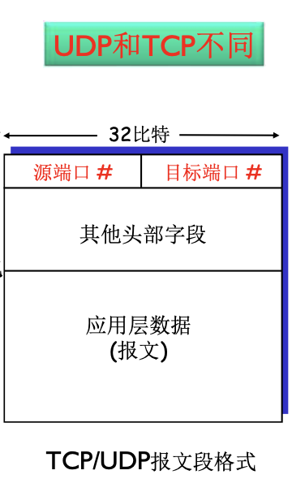
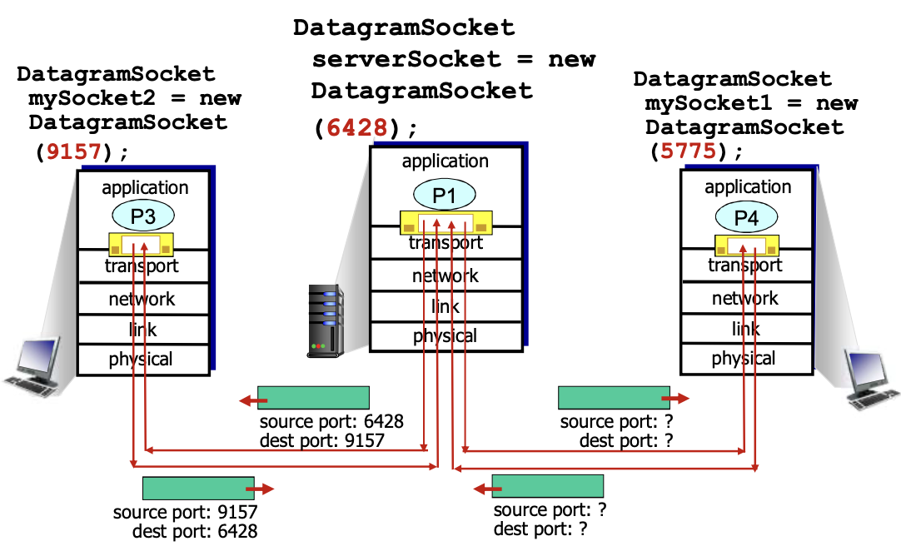
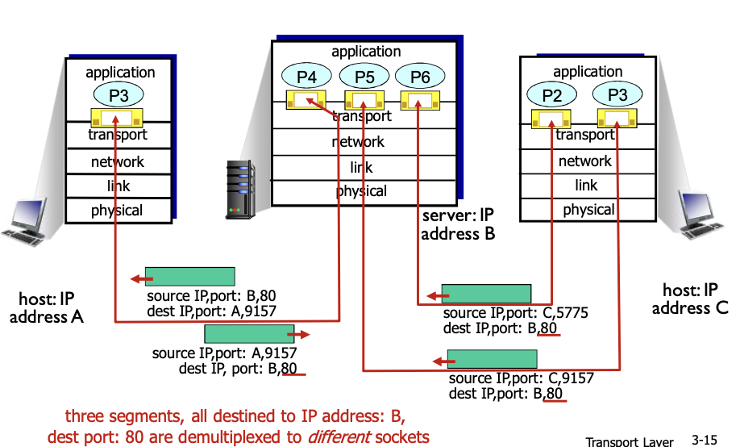

# 📘 3.2 多路复用与解复用 (Multiplexing and Demultiplexing)

> 来源说明：计算机网络-郑老师-第3章 | 本节涵盖：多路解复用工作原理、UDP多路解复用、TCP多路复用、多线程Web Server

---

## 🧠 核心概念总览（严格按原文顺序）

* [*知识点1: 多路解复用工作概述*](#id2)
* [*知识点2: 多路解复用工作原理*](#id2)
* [*知识点3: 无连接(UDP)多路解复用*](#id3)
* [*知识点4: 无连接多路解复用示例*](#id4)
* [*知识点5: 面向连接(TCP)的多路复用*](#id5)
* [*知识点6: 面向连接的解复用示例*](#id6)
* [*知识点7: 面向连接的多路复用：多线程Web Server*](#id7)

---

## ✅ 知识点1: 多路复用与解复用概述

**多路复用 (Multiplexing) - 在发送方主机**
* 从多个套接字 (Socket) 接收来自多个进程的报文
* 根据套接字**对应的IP地址和端口号**等信息对报文段用头部加以封装
  * 该头部信息用于以后的解复用

**多路解复用 (Demultiplexing) - 在接收方主机**
* 根据报文段的头部信息中的**IP地址和端口号**将接收到的报文段发给正确的套接字
  * 从而交给对应的应用进程(PID)，这里属于是OS内核的工作，不是应用层

**一句话：** 复用与解复用就是对多个PDU的封装和解封装

**图示流程**

---

## ✅ 知识点1: 多路解复用工作原理

**多路解复用 (Demultiplexing) 作用**
* **TCP或UDP实体采用哪些信息，将报文段的数据部分交给正确的socket，从而交给正确的进程**

**主机收到IP数据报的处理**
* 每个数据报有源IP地址和目标地址
* 每个数据报承载一个传输层报文段 (Segment)
* 每个报文段有一个源端口号 (Source Port) 和目标端口号 (Destination Port)
  * 特定应用有著名的端口号 (Well-known Ports)
* 主机联合**使用IP地址和端口号**将报文段发送给合适的套接字 (Socket)

---

## ✅ 知识点2: 无连接(UDP)多路解复用

**UDP套接字标识：二元组**
* 目标IP地址 (Destination IP Address)
* 目标端口号 (Destination Port Number)

**客户端创建套接字 (Socket Creation)**
* **服务器端**：`serverSocket = socket(PF_INET, SOCK_STREAM, 0);`
  * `bind(serverSocket, &sad, sizeof(sad));` — 将serverSocket和指定的端口号捆绑
* **客户端**：`ClientSocket = socket(PF_INET, SOCK_DGRAM, 0);`
  * 没有Bind，ClientSocket和OS为之分配的某个端口号捆绑（客户端使用什么端口号无所谓，客户端主动找服务器）

**解复用机制**
* 检查报文段的目标端口号
* 用该端口号将报文段定位给正确的套接字

**关键特性**
* **如果两个不同源IP地址/源端口号的数据报，但有相同的目标IP地址和端口号，则被定位到相同的套接字**
  * 即：UDP仅根据目标IP和目标端口进行解复用

**当主机接收到UDP段时**
* **检查UDP段中的目标端口号**
* **将UDP段交给具备那个端口号的套接字**

---

## ✅ 知识点3: 无连接多路解复用示例

**关键观察**
* 具备相同目标IP地址和目标端口号，即使是源IP地址或/且源端口号的IP数据报，**将会被传到相同的目标UDP套接字上**

* 在每个接收到的报文段中都提供了**返回地址**

---

## ✅ 知识点4: 面向连接(TCP)的多路复用

**TCP套接字标识：四元组**
* 源IP地址 (Source IP Address)
* 源端口号 (Source Port Number)
* 目的IP地址 (Destination IP Address)
* 目的端口号 (Destination Port Number)

**解复用机制**
* **接收主机用这四个值来将数据报定位到合适的套接字**

**服务器支持多个TCP套接字**
* **每个套接字由其四元组标识（有不同的源IP和源PORT）**
* **Web服务器对每个连接客户端有不同的套接字**
  * 非持久连接 (Non-persistent HTTP)：对每个请求有不同的套接字

**TCP报文段格式**
* 32比特源端口号 (Source Port #)
* 32比特目标端口号 (Destination Port #)
* 其他头部字段
* 应用层数据

---

## ✅ 知识点5: 面向连接的解复用示例

**解复用结果**
* **三个报文段 (Segment)，所有目标IP地址都是B，目标端口都是80**
* **被解复用到不同的套接字 (Different Sockets)**
  * 根据四元组中的源IP和源端口区分

**场景示例**

---

## ✅ 知识点6: 面向连接的多路复用：多线程Web Server

**理论**

**多线程Web Server场景**
* **一个进程下面可能有多个线程 (Threads)**
  * 由多个线程分别为客户提供服务
* **在这个场景下，还是根据4元组决定将报文段内容分配给同一个进程下的不同线程**
  * 解复用到不同线程

**Socket分配示例**

| Socket | PID | 源IP | 源端口 | 目的IP | 目的端口 |
|--------|-----|------|--------|--------|----------|
| 80011 | P1 | C | 80 | A | 9157 |
| 90000 | P0 | C | 80 | - | - |
| 90004 | P4 | A | 9157 | C | 80 |
| 90005 | P5 | B | 9157 | C | 80 |
| 90006 | P6 | B | 5775 | C | 80 |

**关键机制**
* **服务器能够在一个TCP端口上同时支持多个TCP套接字**
* **每个套接字由其四元组标识（有不同的源IP和源PORT）**
* **在每个接收到的报文段中都提供了"返回地址"**
  * 即源IP地址和源端口号，用于服务器回复时定位

---

## 🔑 核心要点总结
1. **多路复用/解复用核心**：发送方将多个进程数据封装发送，接收方根据头部信息分发给正确的套接字
2. **UDP解复用**：使用二元组（目标IP地址、目标端口号），不同源IP/端口但相同目标的数据报会定位到同一套接字
3. **TCP解复用**：使用四元组（源IP、源端口、目的IP、目的端口），每个连接有独立的套接字
4. **服务器套接字**：服务器通过bind()将套接字与特定端口绑定，客户端由OS自动分配端口
5. **多线程Server**：一个进程多个线程，根据四元组将报文段解复用到不同线程
6. **返回地址**：TCP报文段中的源IP和源端口作为"返回地址"，供服务器回复使用

## 📌 考试速记版
* **UDP解复用**：只看目标IP+目标端口（二元组），同目标→同套接字
* **TCP解复用**：看四元组（源IP、源端口、目的IP、目的端口），每个连接独立套接字
* **Web服务器**：同一端口(80)支持多个连接，靠四元组区分
* **多线程**：4元组决定报文段分配给哪个线程
* **bind()**：服务器绑定特定端口，客户端通常不bind
* **返回地址**：TCP报文段的源IP+源端口

## 🔍 UDP vs TCP 多路复用/解复用对比表

| 特性 | UDP | TCP |
|------|-----|-----|
| **套接字标识** | 二元组（目标IP、目标端口） | 四元组（源IP、源端口、目的IP、目的端口） |
| **解复用依据** | 仅目标地址和端口 | 完整的连接标识 |
| **同目标不同源** | 定位到相同套接字 | 定位到不同套接字 |
| **连接独立性** | 无连接，每个报文独立处理 | 面向连接，每条连接独立套接字 |
| **服务器端口** | 一个端口服务所有客户端 | 一个端口支持多个连接（多套接字） |
| **返回地址** | 需从报文提取源地址回复 | 四元组中包含完整返回地址 |

## 🔍 套接字标识对比表

| 协议 | 标识维度 | 具体字段 |
|------|---------|---------|
| **UDP** | 2元组 | 目标IP地址 + 目标端口号 |
| **TCP** | 4元组 | 源IP地址 + 源端口号 + 目的IP地址 + 目的端口号 |

**记忆口诀**：UDP解复用看目标（二元组），TCP解复用看全程（四元组），多线程Server靠四元组分线程，返回地址源IP源端口