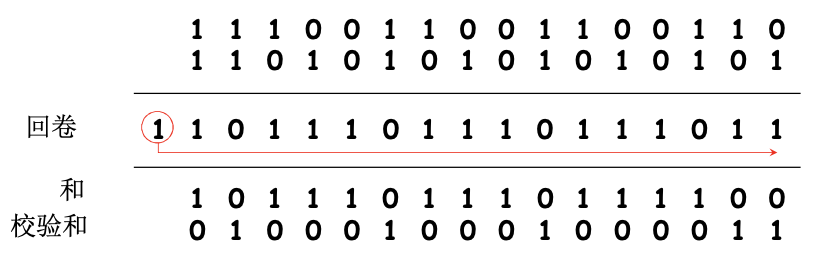

# 📘 3.3 无连接传输：UDP (User Datagram Protocol)

> 来源说明：计算机网络-郑老师-第3章 | 本节涵盖：UDP特点、UDP报文段格式、UDP校验和、Internet校验和计算

---

## 🧠 核心概念总览（严格按原文顺序）

* [*知识点1: UDP特点与应用场景*](#id1)
* [*知识点2: UDP报文段格式*](#id2)
* [*知识点3: UDP校验和*](#id3)
* [*知识点4: Internet校验和计算示例*](#id4)

---

## ✅ 知识点1: UDP特点与应用场景

* **UDP核心特点**
  * **尽力而为的服务**
    * 可能丢失
    * 可能送到应用进程的报文段乱序
  * **不建立连接（会增加延时）**
    * 无连接：UDP发送端和接收端之间没有握手
    * 每个UDP报文段都被独立地处理
    * 所以和IP一样每个数据单元独立发送，被叫做数据报
* 为什么需要UDP
  * **简单**：在发送端和接收端没有连接状态
  * **报文段的头部很小（开销小）**
  * **无拥塞控制和流量控制**
    * 应用程序->传输的速率 = 主机->网络的速率
    * UDP可以尽可能快地发送报文段

* **UDP被用于**
  * **流媒体**（丢失不敏感，速率敏感、应用可控制传输速率）
  * **DNS**
  * **SNMP**

* **在UDP上实现可靠传输**
  * 在应用层增加可靠性
  * 应用特定的差错恢复

---

## ✅ 知识点2: UDP报文段格式

**理论**

**UDP报文段结构**

| 字段 | 长度 | 说明 |
|------|------|------|
| **源端口号 (Source Port)** | 16比特 | 发送方端口号 |
| **目的端口号 (Destination Port)** | 16比特 | 接收方端口号 |
| **长度 (Length)** | 16比特 | UDP报文段总字节数（包括头部+数据） |
| **校验和 (Checksum)** | 16比特 | 检测报文头部和载荷在过程中是否出错，出错就扔掉 |
| **应用程序数据 (Payload)** | 可变 | 应用层报文 |

**UDP头部开销**
* **8字节**（很小的开销）

---

## ✅ 知识点3: UDP校验和

* **校验和目标**
  * **检测在被传输报文段中的差错**（如比特反转）

* **发送方计算校验和**
  * **将报文段的内容视为16比特的整数**
  * 校验和：报文段的加法和（1的补运算）
  * 发送方将校验和放在UDP的校验和字段

* **接收方验证校验和**
  * 计算接收到的报文段的校验和
  * **检查计算出的校验和与校验和字段的内容是否相等**
    * **不相等** → 检测到差错
    * **相等** → 没有检测到差错，但也许还是有差错（残存错误）

**关键注意**
* **当数字相加时，在最高位的进位要回卷，再加到结果上**

---

## ✅ 知识点4: Internet校验和计算示例

* **计算步骤**
  1. 将数据划分为16比特的整数
  2. 将所有16比特整数相加
  3. 最高位进位回卷（加到结果低位）
  4. 取结果的反码（1的补码）得到校验和

* **示例：两个16比特的整数相加**
  

* **目标端验证**
  * **代表数据的16比特数字 + 校验和 = 1111111111111111**（允许进位回卷） → 通过校验
  * **否则** → 没有通过校验

* **重要规则**
  * **求和时，必须将进位回卷到结果上**
  * 进位回卷是Internet校验和的关键特征

---

## 🔑 核心要点总结
1. **UDP核心特点**：无连接、无状态、开销小（8字节头部）、无拥塞/流量控制
2. **UDP适用场景**：流媒体、DNS、SNMP、对实时性要求高的应用
3. **UDP报文段格式**：源端口(16bit)、目的端口(16bit)、长度(16bit)、校验和(16bit)
4. **校验和计算**：16比特整数相加，进位回卷，取反码
5. **校验和验证**：接收方计算校验和与字段比较，相等可能仍有残存错误
6. **UDP vs TCP**：UDP无连接无可靠保证但快速，TCP可靠但开销大

## 📌 考试速记版
* **UDP特点**：无连接、无状态、小头部、无拥塞控制、快速发送
* **UDP应用**：流媒体、DNS、SNMP、实时应用
* **报文段格式**：4个字段各16bit = 8字节头部
* **校验和**：16bit整数相加→进位回卷→取反码
* **验证**：校验范围+校验和=全1则通过
* **注意**：通过校验≠无差错（残存错误可能）

## 🔍 UDP vs TCP 特性对比表

| 特性 | UDP | TCP |
|------|-----|-----|
| **连接性** | 无连接 | 面向连接 |
| **可靠性** | 不可靠 | 可靠 |
| **头部开销** | 8字节 | 20字节 |
| **拥塞控制** | 无 | 有 |
| **流量控制** | 无 | 有 |
| **状态维护** | 无连接状态 | 有连接状态 |
| **传输速率** | 应用控制 = 网络速率 | 受拥塞/流量控制限制 |
| **适用场景** | 实时、流媒体、DNS | 文件传输、HTTP、邮件 |

**记忆口诀**：UDP无连接无控制，八字节头部跑得飞快，校验和要进位回卷，流媒体DNS最爱它
