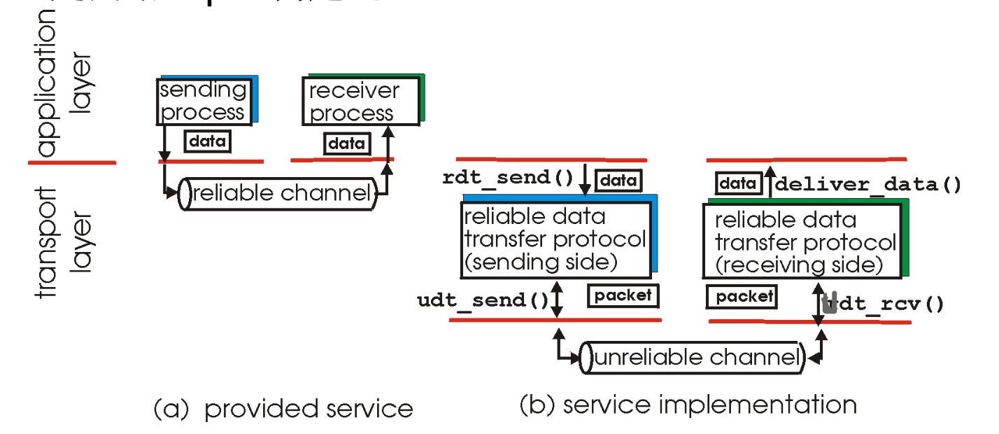
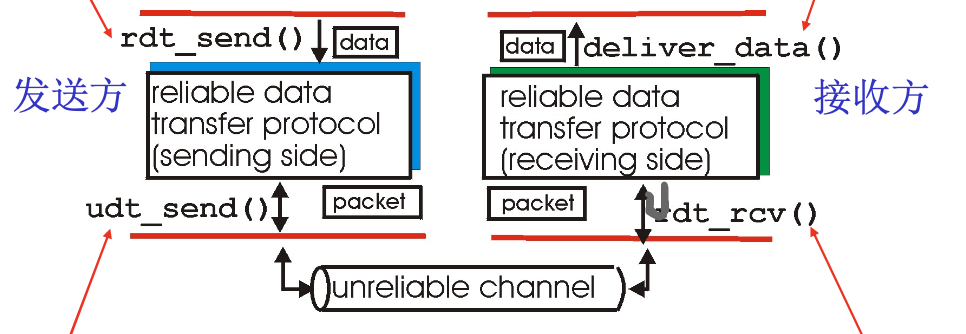
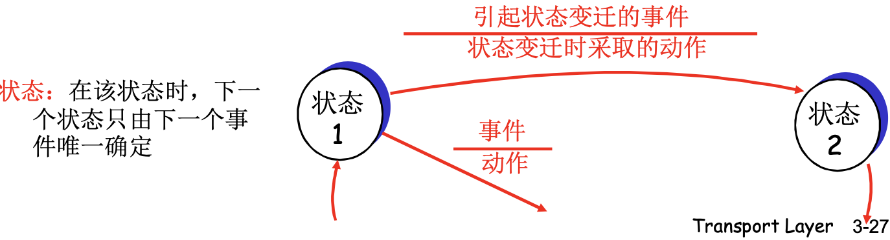
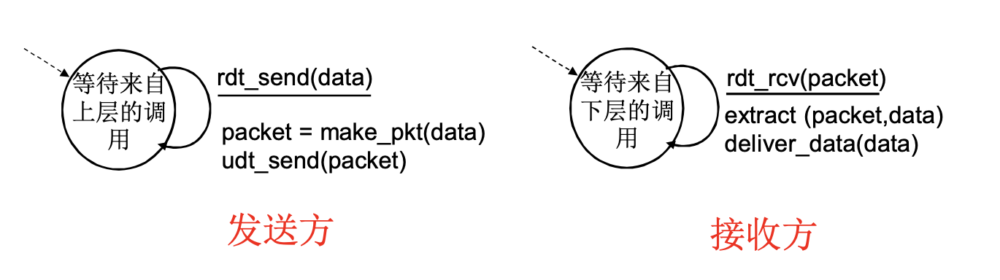
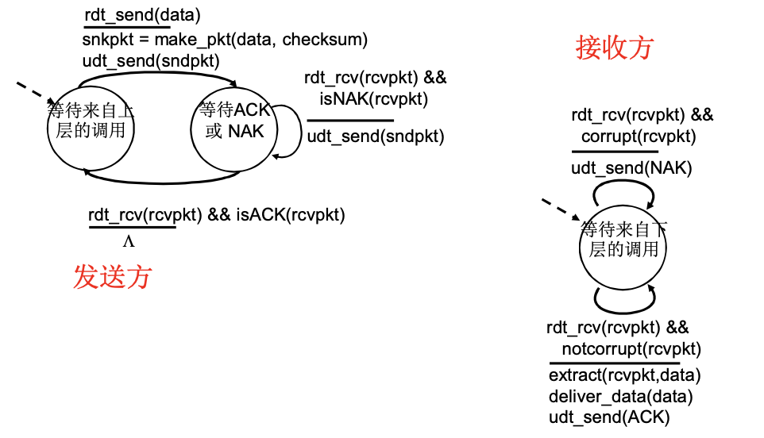
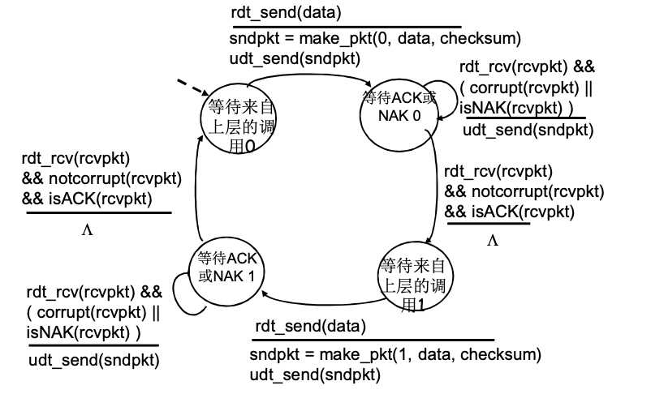
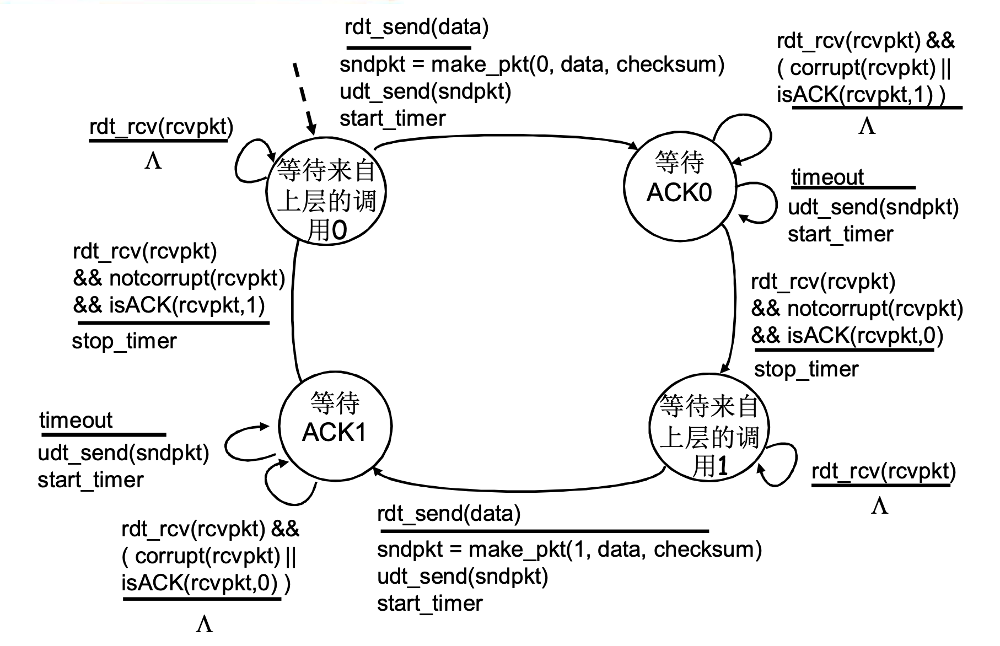
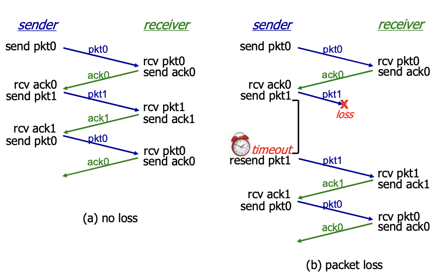
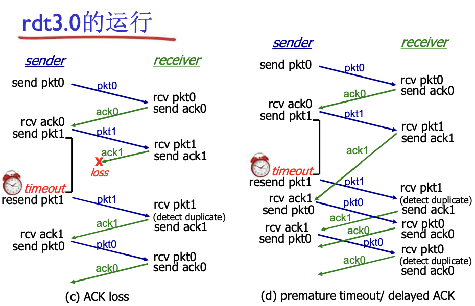
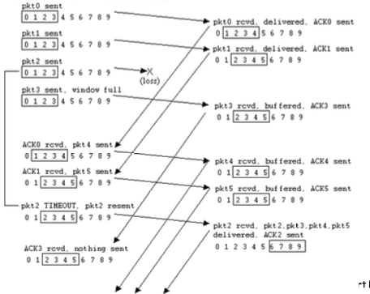

# 📘 3.4 可靠数据传输的原理 (Principles of Reliable Data Transfer)

> 来源说明：《计算机网络-郑老师》第3章 3.4节 | 本节涵盖：rdt1.0至rdt3.0渐增式设计、流水线机制、GBN与SR协议

---

## 🧠 核心概念总览（严格按原文顺序）

- [*知识点1: 可靠数据传输概述*](#id1)
- [*知识点2: 问题描述与FSM*](#id2)
- [*知识点3: rdt1.0——可靠信道上的传输*](#id3)
- [*知识点4: rdt2.0——具有比特差错的信道*](#id4)
- [*知识点5: rdt2.1——处理ACK/NAK出错*](#id5)
- [*知识点6: rdt2.2——无NAK的协议*](#id6)
- [*知识点7: rdt3.0——分组丢失与超时重传*](#id7)
- [*知识点8: rdt3.0性能瓶颈与流水线思想*](#id8)
- [*知识点9: 滑动窗口协议 - 发送窗口*](#id9)
- [*知识点10: 滑动窗口协议 - 接收窗口*](#id14)
- [*知识点11: GBN与SR核心机制对比*](#id10)
- [*知识点12: GBN协议FSM与运行*](#id11)
- [*知识点13: 选择重传(SR)协议*](#id12)
- [*知识点14: 窗口尺寸限制与协议选择*](#id13)

---

## ✅ 知识点1: 可靠数据传输概述

* **rdt基本概念**
  - **rdt**(reliable data transfer)在**应用层**(Application Layer)、**传输层**(Transport Layer)和**数据链路层**(Data Link Layer)都很重要
  - 贯穿于多个协议层次
  - 是网络 **Top 10** 问题之一
  - 信道的不可靠特点决定了可靠数据传输协议（**rdt**）的复杂性

**可靠数据传递模型**

---

## ✅ 知识点2: 问题描述与FSM

- 可靠数据传输需要定义清晰的**接口**和**函数**:

| 接口/函数 | 说明 |
|-----------|------|
| `rdt_send()` | 被上层调用，将数据交付给下方的发送实体 |
| `udt_send()` | 被rdt调用，将分组放到不可靠信道上传输 |
| `udt_rcv()` | 当分组通过信道到达接收方时被调用 |
| `deliver_data()` | 被rdt调用，将数据交付给上层 |

* 我们将：

  -   采用**渐增式**(incremental)的方法，从简单到复杂逐步构建rdt协议， 一步一步来考虑
  - 只考虑**单向数据传输** + **双方的控制信息**（如状态反馈机制）
    * 但控制信息实际是双向流动
  - 双向传输 = **2个单向传输问题**的综合，故可以简化问题
  - 使用**有限状态机**描述发送方和接收方
    - **状态(state)**：圆圈表示
    - **事件(event)**：横线上方
    - **动作(action)**：横线下方
    - 在该状态时，下一个状态只由下一个事件唯一确定

**注意点**
- 📋 **术语提醒**：`udt` = unreliable data transfer（不可靠数据传输）
- ⚠️ 虽然数据传输是单向的，但控制信息（ACK、NAK）是双向的

---

## ✅ 知识点3: rdt1.0——可靠信道上的传输

- **假设**：下层信道**完全可靠**，上层就只需要封装解封装
  - 没有比特出错(bit error)
  - 没有分组丢失(packet loss)

* **发送方FSM：**
  - 状态：等待来自上层的调用
  - 事件：`rdt_send(data)`
  - 动作：`packet = make_pkt(data)` → `udt_send(packet)`

* **接收方FSM：**
  - 状态：等待来自下层的调用
  - 事件：`rdt_rcv(packet)`
  - 动作：`extract(packet, data)` → `deliver_data(data)`

---

## ✅ 知识点4: rdt2.0——具有比特差错的信道

- **新假设**：下层信道可能将分组中的**比特翻转**(bit flip)
  - 用**校验**(checksum)和**检测比特差错**

* **恢复机制/停等协议(Stop-and-Wait)：**
  - **确认（Acknowledgment, ACK）**：接收方显式告知发送方分组已正确接收
  - **否定确认（Negative Acknowledgment, NAK）**：接收方显式告知发送方分组出错
    - 发送方收到NAK后**重传**(retransmit)该分组
    - 发送方有副本

* **rdt2.0新增机制：**
  - 发送方：差错控制编码、**缓存(buffer)**
  - 接收方：使用编码检错，反馈控制报文（ACK/NAK）

* **发送方FSM：**
  - 上层请求发送数据 → 封装分组（加 checksum）、发送，进入**等待 ACK/NAK**
  - 收到正确 ACK: `rdt_rcv(rcvpkt) && isACK(rcvpkt)` → 发送完成，返回**等待上层**
  - 收到 NAK 或分组出错/损坏: `rdt_rcv(rcvpkt) && isNAK(rcvpkt)` → **重传当前分组**，继续**等待 ACK/NAK**

* **接收方FSM：**
  - 收到出错分组: `rdt_rc(rcvpkt) && corrup(rcvpkt)` → 发送NAK
  - 收到正确分组: `rdt_rcv(rcvpkt) && notcorrupt(rcvpkt)` → 提取数据、交付上层、发送ACK

---

## ✅ 知识点5: rdt2.1——处理ACK/NAK出错

- **致命缺陷**：如果ACK/NAK本身出错？
  - 发送方不知道接收方发生了什么事情
  - 重传？可能重复；不重传？可能死锁

* **核心解决：引入序号(sequence number)**
  - 发送方在每个分组中加入**序号**
  - 如果ACK/NAK出错，发送方**重传当前分组**
  - 接收方**丢弃重复分组**，不发给上层，然后再发一次ACK

* **停等协议**：发送方发送一个分组，然后等待接收方应答
  - 只需要**两个序号**（0，1）就够，因为一次只发一个未确认分组

* **发送方FSM（四个状态）：**
  - **等待上层调用 0**
    - 上层请求发送数据 → 封装分组（seq=0 + checksum）、发送 → **等待 ACK/NAK 0**

  - **等待 ACK/NAK 0**
    - 收到损坏分组 或 NAK → 重传序号 0 分组 → 继续**等待 ACK/NAK 0**
    - 收到正确 ACK → 序号翻转 → **等待上层调用 1**

  - **等待上层调用 1**
    - 上层请求发送数据 → 封装分组（seq=1 + checksum）、发送 → **等待 ACK/NAK 1**

  - **等待 ACK/NAK 1**
    - 收到损坏分组 或 NAK → 重传序号 1 分组 → 继续**等待 ACK/NAK 1**
    - 收到正确 ACK → 序号翻转 → **等待上层调用 0**
    

* **接收方FSM：**
  - 状态指示期望收到的序号（0或1）
  - 收到期望序号且正确 → 交付数据、发送ACK、翻转状态
  - 收到非期望序号且正确 → 发送ACK（重复ACK，通知发送方已收到）
  - 收到出错分组 → 发送NAK

  

  

* **rdt2.1观察：**
   - **发送方**必须检测ACK/NAK是否出错（需要EDC），还要必须记住分组编号
   * **发送方**不对收到的ACK/NAK给确认，没有所谓的确认的确认；
  - **接收方**不知道它最后发送的ACK/NAK是否被正确收到
  - **接收方**通过后续收到的是"老分组"还是"下一个分组"来判断之前的ACK是否被正确收到通过序列号

  

---

## ✅ 知识点6: rdt2.2——无NAK的协议

* **无NAK协议特点**
  - 功能同rdt2.1，但**只使用ACK（ack要编号）**
  - 接收方对最后正确接收的分组发ACK，以替代NAK
    - 必须显式包含被正确接收分组的序号
  - 当收到**重复的ACK**（duplicate ACK）时，发送方与收到NAK采取相同动作：**重传当前分组**

* **为之后的流水线协议做准备：**
  - 一次能发送多个分组时，每个应答都有ACK+NAK很麻烦
  - 用对前一个数据单位的ACK，代替本数据单位的NAK
  - **确认信息减少一半，协议处理简单**

  | 传统方式 | 简化方式（rdt2.2） |
  |---------|-------------------|
  | ACK0, ACK1... + NAK0, NAK1... | ACK0（确认收到0） |
  | NAK1 = 表示1出错 | ACK0重复 = 暗示NAK1 |

* **rdt2.2发送方FSM：**
  - 等待上层调用 0 → 发送pkt0 → 等待ACK 0
  - 收到`corrupt || isACK(1)` → 重传pkt0
  - 收到`notcorrupt && isACK(0)` → 转到等待上层调用 1

* **rdt2.2接收方FSM：**
  - 等待下层调用 0
  - 收到`notcorrupt && has_seq1` → 交付数据、发送ACK1（注意：seq1到达说明seq0已正确接收）
  - 收到`corrupt || has_seq1` → 发送ACK1（重复ACK）
  

* **rdt2.2运行：**
  - **无差错**：正常ACK0、ACK1交替
  - **分组出错**：receiver发送ACK0（对前一个正确分组的确认）→ sender收到重复ACK0 → 知道pkt1出错 → 重传
   
  - **ACK出错**：sender未收到正确ACK → 超时重传 → receiver收到重复分组 → 再次发送ACK
  

---

## ✅ 知识点7: rdt3.0——分组丢失与超时重传

- **新假设**：下层信道可能**丢失分组（数据或ACK）**
  - 会导致死锁（发送方永远等待ACK）
  - 已有机制（检验和、序列号、ACK、重传）不够处理

* **核心机制：发送方等待ACK一段合理的时间**
  - **发送端超时重传(timeout retransmission)**：到时未收到ACK → 重传
  - 需要**倒计数定时器(countdown timer)**
    - 链路层timeout时间**确定的(fixed)**
    - 传输层timeout时间**适应式的(adaptive)**

* **问题处理：**
  - 分组或ACK只是被延迟？→ 利用**序列号**处理重复
  - 接收方必须指明被正确接收的序列号

* **rdt3.0发送方FSM：**

  - **等待上层调用 0**
    - 上层请求发送数据 → 封装分组（seq=0 + checksum）、发送、**启动定时器** → **等待 ACK 0**

  - **等待 ACK 0**
    - 收到损坏分组 或 错误的 ACK（ACK 1）→ **忽略**，继续**等待 ACK 0**
    - **定时器超时** → **重传**序号 0 分组、**重启定时器** → 继续**等待 ACK 0**
    - 收到正确 ACK 0 → **停止定时器**、序号翻转 → **等待上层调用 1**

  - **等待上层调用 1**
    - 上层请求发送数据 → 封装分组（seq=1 + checksum）、发送、**启动定时器** → **等待 ACK 1**

  - **等待 ACK 1**
    - 收到损坏分组 或 错误的 ACK（ACK 0）→ **忽略**，继续**等待 ACK 1**
    - **定时器超时** → **重传**序号 1 分组、**重启定时器** → 继续**等待 ACK 1**
    - 收到正确 ACK 1 → **停止定时器**、序号翻转 → **等待上层调用 0**
    
    

* **rdt3.0运行：**
  - **无丢失**：正常流程
  - **分组丢失**：pkt丢失 → sender超时 → resend
  - **ACK丢失**：ack丢失 → sender超时 → resend → receiver收到重复pkt → 发送ack
  - **过早超时/延迟ACK**：也能正常工作，但**效率较低**，一半的分组和确认是重复的
  

* **注意点**
  - ⚠️ **超时重传**是TCP实现可靠传输的核心机制
  - 📋 RTT = Round Trip Time（往返时间），是设置超时的重要参考
  - 💡 rdt3.0 = rdt2.2 + 超时重传；rdt3.0能工作但性能差

---

## ✅ 知识点8: rdt3.0性能瓶颈与流水线思想

**rdt3.0性能瓶颈**
- rdt3.0在链路容量大时**性能很差**
  - 一次发一个PDU，不能充分利用链路传输能力

**利用率公式：**
* 其中 **L**=分组长度（比特），**R**=传输速率（bps），**RTT**=往返时间

$$U_{sender} = \frac{L/R}{RTT + L/R}$$

**例：1 Gbps链路，15ms传播延时，1KB分组：**

$$T_{transmit} = \frac{8kb/pkt}{10^9 b/sec} = 8 \mu s$$

$$U_{sender} = \frac{L/R}{RTT + L/R} = \frac{0.008}{30.008} = 0.00027$$

- **U 利用率：忙于发送的时间比例** 
- RTT = 2 x 传播延时 = 30 ms 
T的时间时信道忙的时候，其余30ms都是空闲的
- 每30ms + 8us发送1KB的分组意味着只用到了270kbps=33.75kB/s的吞吐量（在1Gbps 链路上）
- **瓶颈**：网络协议限制了物理资源的利用！

**停等操作时序图示：**

**解决方案 - 流水线(Pipelining)提高利用率：**
- 允许发送方在未得到确认的情况下**连续发送多个分组**
- 一次发送3个分组时：

$$U = \frac{3 \times L/R}{RTT + L/R} = \frac{0.024}{30.008} = 0.0008$$

- 利用率随n增加而提高，直到U=100%
- 瓶颈转移为链路带宽本身

**流水线协议要求：**
  - 增加序号范围：用多个bit表示分组序号
  - 发送方/接收方要有**缓冲区(buffer)**
    - 发送方缓冲：未确认，可能需要重传
    - 接收方缓存：上层取用速率 ≠ 接收速率；数据可能乱序，排序交付

**注意点**
- ⚠️ <b>带宽-延迟积(bandwidth-delay product)</b>大的网络中，停等协议利用率极低
- 💡 从"串行停等"到"并行流水线"是协议设计的关键飞跃
- 🔄 流水线是TCP滑动窗口的基础

---

## ✅ 知识点9: 滑动窗口协议 - 发送窗口 & 发送缓存区

**发送缓冲区：**
- **发送缓冲区**：内存区域，落入缓冲区的分组可以发送，用于存放已发送但未确认的分组
- **必要性**：需要重发时可用
- **发送缓冲区的大小**：一次最多可以发送多少个未经确认的分组
  - 停止等待协议=1
  - 流水线协议>1，合理的值，不能很大，链路利用率不能够超100%
- **发送缓冲区中的分组**
  - **未发送的**：落入发送缓冲区的分组，可以连续发送出去；
  - **已经发送出去的、等待对方确认的分组**：发送缓冲区的分组只有得到确认才能删除

**发送窗口：**
- **发送窗口**：发送缓冲区中**已发送但未确认分组**的序号构成的空间
  - 发送窗口的最大值 <= 发送缓存区的值
    - **初始状态**：后沿=前沿，窗口尺寸=0，因为发送方没有发送任何分组
    
    - **每发送一个组**：前沿前移一个单位
    - **前沿移动**：发送分组 → 前沿前移
    - **后沿移动**：收到老分组确认 → 后沿前移
  - 前沿极限不能超过发送缓冲区

- 滑动窗口的相对表示方法：
  - 分组不动，可缓冲范围移动，代表一段可以发送的权力
  

- 滑动窗口技术实例：
  

---

## ✅ 知识点10: 滑动窗口协议 - 接收窗口 

**接收窗口（receiving window）：**
- **接收窗口** = 接收缓冲区
- **接收窗口控制哪些分组可以接收**：
  - 序号落入接收窗口内 → 允许接收
  - 序号在接收窗口外 → 丢弃
- **接收窗口尺寸$W_r$ = 1**：只能**顺序接收确认**（Go-Back-N, GBN: 回退N步）
- **接收窗口尺寸$W_r$ > 1**：可以**乱序接收确认**，但解封并提交数据给上层要按序（Selective Repeat, SR：选择重传）

**SR接收窗口的滑动和发送确认：**
- **SR滑动条件**：
  - **低序号分组到来** → 窗口移动
  
  - **高序号乱序到** → 缓存但不向上交付数据和滑动
  
- **发送确认**：
  - $W_r$ = 1：发送连续收到的最大分组确认（**累计确认**）
  - $W_r$ > 1：收到分组，发送该分组确认（**非累计确认**）

---

## ✅ 知识点11: GBN与SR核心机制对比

**GBN核心机制：**
- 发送端最多有N个未确认分组
- 接收端发送**累计型确认**
  - 发现gap，不确认新到来的分组
- 发送端对最老未确认分组设**一个定时器**
  - 超时 → 重传**后沿开始的所有在发送窗口的分组**

**SR核心机制：**
- 发送端最多有N个未确认分组
- 接收方对每个到来分组**单独确认**（非累计）
- 发送端为**每个未确认分组**保持定时器
  - 超时 → 只重传**该未确认**分组

**两种流水线协议的区别：**

| 特性 | Go-Back-N (GBN) | Selective Repeat (SR) |
|------|-----------------|----------------------|
| 发送窗口 | > 1，最大 $2^n - 1$ | > 1，最大 $2^{n-1}$ |
| 接收窗口 | = 1 | > 1（通常等于发送窗口） |
| 确认方式 | **累计确认(cumulative ACK)** | **单独确认(individual ACK)** |
| 定时器数量 | 1个（对最老未确认分组） | 每个未确认分组一个 |
| 接收方缓存 | 不需要（只保留期望序号的分组） | 需要（缓存乱序到达的分组） |
| 重传策略 | 超时后重传**所有未确认**分组 | 超时后只重传**该未确认**分组 |
| 出错代价 | 回退N步，重传N个分组 | 只重传1个分组 |
| 资源需求 | 少（接收方只需1个缓存单元） | 多（接收方需多个缓存单元） |
| 复杂度 | 简单 | 复杂 |
| 适用场景 | 出错率低 | 链路容量大（延迟大、带宽大） |

**正常/异常窗口互动：**

| 场景 | GBN发送窗口 | GBN接收窗口 | SR发送窗口 | SR接收窗口 |
|------|-------------|-------------|-----------|-----------|
| 正常 | 新分组落入缓冲区并发送→前沿滑动; 确认→后沿滑动 | 收到期望分组→滑动→发确认 | 同GBN | 收到分组→缓存；期望序号到→向前滑动→交付 |
| 异常 | 超时→重传所有；重复ACK→后沿不动 | 乱序分组，没有在范围内→**丢弃**；重复发老ACK | 超时→只重传该分组；乱序ACK→后沿不动 | 乱序分组→**缓存**；发送该分组ACK |

**注意点**
- ⚠️ GBN和SR代表了两种设计哲学："简单但代价大" vs "复杂但效率高"
- 🔄 TCP早期使用GBN-like机制，现代TCP使用SR-like的SACK机制

---

## ✅ 知识点11: GBN协议FSM与运行

**理论**
- **变量**：`base` = 后沿序号，`nextseqnum` = 前沿序号-1，`N` = 缓冲区大小

**GBN发送方FSM：**
  * `rdt_send(data)`: 上层有数据要发送
    * `if(nextseqnum < base + N)`: 不能超过缓冲区大小
    * `if(base == nextseqnum)`: 之前窗口没有分组，需要启动超时定时器
  * `timeout`: 此时一定是最老的一个，也就是后沿超时了
    * 此时每一个都要重新传一遍
  * `rdt_rcv(rcvpkt) &&notcorrupt(rcvpkt)`: 这个时候需要停止计时器

**GBN接收方FSM：**
* `rdt_rcv(rcvpkt)`: 发送方发来分组，检查是否通过校验，分组序号是否对得上
  * 如果通过了，那么将分组解封装，交给上层用户
  * 并将确认发送给发送方
  * `expectedseqnum++`: 并将确认序号加1，移动到下一个确认序号
  * 只需要一个变量就可以记住窗口，因为大小为1
  * GBN接收方**不缓存乱序分组**，直接丢弃

**运行中的GBN：**

**注意点**
- ⚠️ GBN发送方只需要**一个定时器**

---

## ✅ 知识点12: 选择重传(SR)协议

**理论**
- 接收方对每个正确接收的分组**分别发送ACKn（非累积确认）**
  - 接收窗口 > 1，可以**缓存乱序分组**
  - 最终将分组按顺序交付给上层

- 发送方**只重传没有收到ACK的分组**——选择性重发
  - 为**每个未确认分组**设定一个定时器

**SR发送方：**

| 事件 | 动作 |
|------|------|
| 从上层接收数据 | 如果序号在发送窗口中，则发送 |
| timeout(n) | 重新发送分组n，重新设定定时器n |
| ACK(n) in [sendbase, sendbase+N] | 将分组n标记为已接收；如n为最小未确认序号，将base移到下一个未确认序号 |

**SR接收方：**

| 分组情况 | 动作 |
|----------|------|
| n ∈ [rcvbase, rcvbase+N-1] | 发送ACK(n)；乱序则缓存；有序则将该分组及缓存的连续分组交付给上层，窗口移到下一个未接收分组 |
| n ∈ [rcvbase-N, rcvbase-1] | 发送ACK(n)（对旧分组的重复确认） |
| 其它 | 忽略 |

**SR运行：**

**注意点**
- ⚠️ SR核心优势：出错时只重传丢失分组，效率高
- 💡 SR是"精准打击"，哪里丢了补哪里
- 📋 SR接收方需要缓存乱序分组，等前面的分组到达后一起交付

---

## ✅ 知识点13: 窗口尺寸限制与协议选择

**理论**
- **窗口最大尺寸限制：**
  - **GBN: $W_{max} \leq 2^n - 1$**
  - **SR: $W_{max} \leq 2^{n-1}$**

**例子：** n = 2；序列号：0, 1, 2, 3
- GBN = 3
- SR = 2

**SR窗口限制的原因：**
- 接收方看不到发送方的窗口情况
- 当窗口大小 > $2^{n-1}$ 时，接收方无法区分：
  - 新传输的分组 vs 重传的旧分组
- 会导致将**重复数据误认为新数据**

**(a) 窗口大小 = $2^{n-1}$ = 2 时（正常工作）：**
- 接收窗口和发送窗口不会重叠到相同序号
- 可以正确区分新分组和重传分组

**(b) 窗口大小 = $2^{n-1} + 1$ = 3 时（出现问题）：**
- 发送方和接收方窗口可能同时包含相同序号
- 接收方无法判断分组是新数据还是重传的旧数据

**适用范围：**
- **出错率低**：适合GBN（出错罕见，没必要用复杂的SR）
- **链路容量大（延迟大、带宽大）**：适合SR（一点出错代价太大）

| | GBN | SR |
|---|-----|-----|
| **优点** | 简单，所需资源少 | 出错时，重传一个代价小 |
| **缺点** | 一旦出错，回退N步代价大 | 复杂，所需要资源多 |

**注意点**
- ⚠️ 窗口大小限制的根本原因：接收方无法区分新旧分组
- 📋 n = 序号字段的比特数，序号空间大小 = $2^n$
- 🔄 协议选择原则：根据网络特征（出错率、链路容量）选择合适的协议

---

## 🔑 核心要点总结

1. **rdt协议的渐增式设计**：rdt1.0（理想信道）→ rdt2.0（比特差错+ACK/NAK）→ rdt2.1（ACK/NAK出错+序号）→ rdt2.2（编号ACK替代NAK）→ rdt3.0（分组丢失+超时重传），逐步增加机制应对更复杂的信道

2. **停等协议的性能瓶颈**：rdt3.0使用停等机制，在高带宽-延迟积网络中利用率极低（例：1Gbps链路利用率仅0.027%），因此引入流水线机制

3. **流水线与滑动窗口**：允许发送方连续发送多个分组；发送窗口管理"发送权限"，接收窗口管理"接收权限"；窗口滑动由"发送"和"确认"驱动

4. **GBN vs SR的本质区别**：GBN接收窗口=1（不缓存乱序分组，累计确认，出错回退N步重传所有未确认）；SR接收窗口>1（缓存乱序分组，单独确认，选择性重传超时分组）

5. **窗口大小限制**：GBN最大 $2^n-1$，SR最大 $2^{n-1}$，原因是避免接收方无法区分新旧分组

## 📌 考试速记版

| 协议 | 信道假设 | 核心机制 | 序号 | 定时器 |
|------|----------|----------|------|--------|
| rdt1.0 | 完全可靠 | 直接发送 | 无 | 无 |
| rdt2.0 | 比特差错 | ACK/NAK + 重传 | 无 | 无 |
| rdt2.1 | ACK/NAK也会出错 | 序号(0,1) + 重传 | 2 | 无 |
| rdt2.2 | 同2.1 | 编号ACK替代NAK | 2 | 无 |
| rdt3.0 | 分组丢失 | 超时重传 | 2 | 1个 |
| GBN | 流水线+出错 | 累计ACK + 回退N步 | $2^n$ | 1个 |
| SR | 流水线+出错 | 单独ACK + 选择重传 | $2^n$ | N个 |

**关键公式：**
- 停等利用率：$U = \frac{L/R}{RTT + L/R}$
- 流水线利用率：$U = \frac{N \times L/R}{RTT + L/R}$
- GBN最大窗口：$W_{max} = 2^n - 1$
- SR最大窗口：$W_{max} = 2^{n-1}$

**记忆口诀**：
> "停等效率低，流水来解决；GBN简单狠，回退N步疼；SR精细巧，缓存选择性重传好；窗口有限制，序号一半不能超。"
