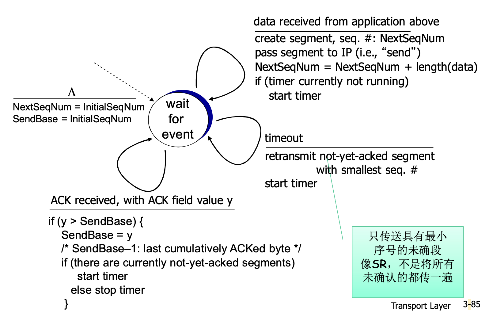

# 📘 第3章 传输层 — TCP详解 (Transport Layer: TCP)

> 来源说明：郑烇《计算机网络》第3章 3.5节 | 本节涵盖：TCP概述、报文段结构、序号/确认号、RTT估计、可靠传输、重传机制、流量控制、连接管理

---

## 🧠 核心概念总览（严格按原文顺序）

- [*知识点1: TCP概述与报文段结构*](#id1)
- [*知识点2: TCP序号与确认号机制*](#id2)
- [*知识点3: TCP往返延时(RTT)估计与超时设置*](#id3)
- [*知识点4: TCP可靠数据传输机制*](#id4)
- [*知识点5: TCP发送方简化版FSM与事件处理*](#id5)
- [*知识点6: TCP重传场景与累积确认*](#id6)
- [*知识点7: TCP接收方ACK产生建议*](#id7)
- [*知识点8: TCP快速重传机制*](#id8)
- [*知识点9: TCP流量控制*](#id9)
- [*知识点10: TCP连接建立：握手原理与问题*](#id10)
- [*知识点11: TCP三次握手过程与FSM*](#id11)
- [*知识点12: TCP连接关闭*](#id12)

---

<a id="id1"></a>
## ✅ 知识点1: TCP概述与报文段结构

TCP(Transmission Control Protocol) 的核心特征：
- **点对点**：一个发送方，一个接收方
- **可靠的、按顺序的字节流服务**：不提供报文的边界, 对方发送两个分组，收到可能只是一个大的分组
- **管道化(Pipelining)/流水线**：TCP拥塞控制和流量控制设置窗口大小，向对方连续发送很多tcp的段
- **发送和接收缓存**：进程写数据到TCP发送缓存，TCP从缓存取数据组成报文段；接收方TCP将数据放入接收缓存，进程从缓存读取

- **全双工数据(Full-Duplex Data)**：
  - 在同一连接中数据流双向流动，接收方也可以向发送方传
  - **MSS(Maximum Segment Size)**：最大报文段大小，如果应用进程交下来的报文太大了，就必须划分成MSS大小的报文
- **面向连接(Connection-Oriented)**：在数据交换之前，通过握手(交换控制报文)初始化发送方、接收方的状态变量
- **有流量控制(Flow Control)**：发送方不会淹没接收方

**TCP报文段结构(TCP Segment Structure)**

| 字段 | 说明 |
|------|------|
| 源端口号(Source Port #) / 目的端口号(Dest Port #) | 各16比特 |
| 序号(Sequence Number) | 该报文段所携带数据的首字节在整个字节流中的编号（偏移量） |
| 确认号(Acknowledgement Number) | 接收方期望从发送方收到的**下一个字节**的序号同时采用累积确认机制。 |
| 首部长度(Header Length) | 以32比特字为单位表示TCP报文段头部的总长度 |
| 保留(Reserved) / 未用 | |
| **URG** | 紧急数据(通常不用) |
| **ACK** | ACK #合法 |
| **PSH** | 马上推出数据(通常不用) |
| **RST, SYN, FIN** | 建立/拆除连接 |
| 接收窗口(Receive Window) | 愿意接收的字节数量 |
| 校验和(Checksum) | Internet校验和(同UDP) |
| 紧急数据指针(Urgent Data Pointer) | |
| 可选项(Options) | |
| 应用层数据(Application Data) | 长度可变 |

- **确认号 = n** 意味着期望收到字节 n，**确认 n-1 及以前所有字节**

**注意点**
- ⚠️ **关键区别**：TCP序号是对**字节流**编号，不是对报文段编号

---

<a id="id2"></a>
## ✅ 知识点2: TCP序号与确认号机制


- **序号**：报文段首字节在字节流中的编号
- **确认号**：期望从另一方收到的下一个字节的序号，采用**累积确认(Cumulative ACK)**
- **RFC没有明确规定**: 没有规定接收方如何处理乱序的报文段

**示例：简单telnet场景**


- Host A 发送 `Seq=42, ACK=79, data='C'` 给 Host B表示：
  - 我希望B能从79及其之后开始传，因为78之前的我都已经收到
  - 发给B`Seq=42`说明42之前已经被B收到

- Host B 收到后回显 'C'，发送 `Seq=79, ACK=43, data='C'`
  - 确认收到42，期望下一个43
  - A期望要79开始，那就从79开始传
- Host A 收到回显后发送 `Seq=43, ACK=80`
  - A确认收到79及之前, 请求后面的的80 
  - B请求43, 那就答应给43

**注意点**
- 💡 **理解技巧**：ACK号表示"我期望你下次发这个序号"，同时暗示"这个序号之前的所有数据我都收到了"
- 🔄 **知识关联**：累积确认意味着一个ACK可以确认多个报文段

---

<a id="id3"></a>
## ✅ 知识点3: TCP往返延时(RTT)估计与超时设置

- **Q: 怎样设置TCP超时(Timeout)？**
  - 比RTT要长，但RTT是**变化的**
  - **太短**：太早超时 → 不必要的重传
  - **太长**：对报文段丢失反应太慢，消极

- **Q: 怎样估计RTT？**
  - **计算SampleRTT**：测量从报文段发出到收到确认的时间
    - 如果有重传，**忽略此次测量**
  - **问题**：然而SampleRTT实际上每次测量的变化幅度大（尤其是距离远的情况）
  - **解决办法**: 对几个最近的测量值求平均，而不是仅用当前的SampleRTT

- **EstimatedRTT 计算公式（指数加权移动平均 EWMA）**
$$EstimatedRTT = (1-\alpha) \cdot EstimatedRTT + \alpha \cdot SampleRTT$$

  - $EstimatedRTT$表示前面一个估计的RTT
  - $SampleRTT$表示现在测量出来的RTT
  - 过去样本的影响呈指数衰减
  - **推荐值：$\alpha = 0.125$**
  

- 平均值越大， 超时时间就越大，但是往返延迟的变化越大越分散，超时时间也会越大
- 导致网络偶尔波动导致误判丢包
- **为此，我们需要设置超时 — 安全边界(Safety Margin)**
- 安全边界时间就是给超时定时器额外加的"缓冲余量"

  $$TimeoutInterval = EstimatedRTT + 4 \cdot DevRTT$$
  - 其中 DevRTT（偏差估计）：

    $$DevRTT = (1-\beta) \cdot DevRTT + \beta \cdot |SampleRTT - EstimatedRTT|$$

  - **推荐值：$\beta = 0.25$**
  - EstimatedRTT变化大（方差大）→ 较大的安全边界时间
  - SampleRTT会偏离EstimatedRTT多远由DevRTT度量

**注意点**
- ⚠️ **关键参数**：$\alpha=0.125$（新样本权重），$\beta=0.25$（偏差权重）
- 💡 **理解技巧**：EstimatedRTT像"平滑后的平均RTT"，DevRTT像"RTT的波动程度"，超时 = 平均 + 4倍波动（留足安全余量）

---

<a id="id4"></a>
## ✅ 知识点4: TCP可靠数据传输机制


TCP在IP不可靠服务的基础上建立了**rdt**：
- 管道化的报文段（**GBN or SR** 风格的混合）
- **累积确认**（像GBN）
- **设置单个重传定时器和最老的分组相关联**（像GBN）
- 是否可以接受乱序的，**没有规范**

**简化TCP发送方的前提假设**：
- 忽略重复的确认
- 忽略流量控制和拥塞控制

**通过以下事件触发重传**：
1. **超时(Timeout)**：只重发那个最早的未确认段（像SR，不是像GBN重传所有未确认段）
2. **重复的确认(Duplicate ACKs)**
   - 例子：收到了ACK50，之后又收到3个ACK50但是超时定时器还没有到时
   - 这个时候的重传叫**快速重传**

**注意点**
- ⚠️ **重要区别**：TCP超时重传**只重传最早未确认的段**（SR风格），不是GBN那样重传所有未确认段
- 🔄 **知识关联**：TCP是GBN和SR的混合体 — 累积确认+单个定时器像GBN，但重传策略像SR

---

<a id="id5"></a>
## ✅ 知识点5: TCP发送方简化版FSM与事件处理

**理论**

**简化版TCP发送方FSM（列表形式）**

- **初始状态**
  - `NextSeqNum = InitialSeqNum`
  - `SendBase = InitialSeqNum`

- **状态：等待事件(Wait for Event)**

  - **事件1：从应用层接收数据(data received from application above)**
    - 动作：创建报文段，`seq # = NextSeqNum`
    - 如果定时器当前没有运行，启动定时器(`start timer`)
    - 将报文段传给IP（即"发送"）
    - 前沿序号向前滑动：`NextSeqNum = NextSeqNum + length(data)`
    - 下一状态：保持等待事件

  - **事件2：超时(timeout)**
    - 动作：重传**具有最小序号且尚未确认**的报文段(`retransmit not-yet-acknowledged segment with smallest seq. #`)
    - 重新启动定时器(`start timer`)
    - 下一状态：保持等待事件

  - **事件3：收到ACK(ACK received, with ACK field value y)**
    - 如果 `y > SendBase`：
      - `SendBase = y`（更新已被确认的字节）: 后沿滑动
      - 如果当前还有未被确认的报文段，**重新启动定时器**
      - 否则停止定时器
    - 下一状态：保持等待事件
  

**发送方事件详细说明**

| 事件 | 动作 |
|------|------|
| **从应用层接收数据** | 用`nextseq`创建报文段；序号`nextseq`为报文段首字节的字节流编号；如果还没有运行，启动定时器（定时器与最早未确认的报文段关联；过期间隔 = `TimeOutInterval`） |
| **超时** | 重传后沿最老的报文段；重新启动定时器 |
| **收到确认** | 如果是对尚未确认的报文段确认：更新已被确认的报文序号；如果当前还有未被确认的报文段，重新启动定时器 |

**注释**
- `SendBase-1`：最后一个累积确认的字节
- 例子：`SendBase-1 = 71`，收到 `y = 73`，因此接收方期望73+；`y > SendBase`，新的数据被确认

**注意点**
- ⚠️ **定时器规则**：定时器只与**最早未确认的报文段**关联，不是每个报文段一个定时器
- 💡 **理解技巧**：`SendBase`是"已确认数据的边界"，收到更大的ACK意味着累积确认了更多数据

---

<a id="id6"></a>
## ✅ 知识点6: TCP重传场景与累积确认

**理论**

TCP重传的三种典型场景：

1. **ACK丢失**
   - Host A 发送 Seq=92, 8字节数据；然后 Seq=100, 20字节数据
   - Host B 收到两段，发送 ACK=100 和 ACK=120
   - 如果 ACK=100 丢失，但 ACK=120 到达，**累积确认**使得 Host A 知道100之前的数据已被确认
   - SendBase 更新为120

2. **过早超时(Premature Timeout)**
   - Host A 发送 Seq=92 和 Seq=100
   - ACK=100 和 ACK=120 都在传输中
   - 但定时器在ACK到达前超时，Host A **只重传最早未确认的段** Seq=92
   - 随后 ACK=120 到达，SendBase 更新为120（即使92被重传了，也不会重传100）

3. **累积确认场景**
   - Host A 发送 Seq=92(8字节) 和 Seq=100(20字节)
   - 第一个段丢失，第二个段到达
   - Host B 发送 ACK=100（期望100），累积确认只确认到92之前
   - Host A 超时后重传 Seq=92

**注意点**
- ⚠️ **关键机制**：TCP对**顺序收到的最高字节**进行确认，不是每个段单独确认
- 💡 **理解技巧**：累积确认的好处是丢失某个ACK不会导致重传，只要后续ACK到达即可

---

<a id="id7"></a>
## ✅ 知识点7: TCP接收方ACK产生建议

**理论**

产生TCP ACK的建议 [RFC 1122, RFC 2581]

| 接收方的事件 | TCP接收方动作 |
|-------------|--------------|
| 所期望序号的报文段按序到达。所有在期望序号之前的数据都已经被确认 | **延迟的ACK**。对另一个按序报文段的到达最多等待500ms。如果下一个报文段在这个时间间隔内没有到达，则发送一个ACK。 |
| 有期望序号的报文段到达。另一个按序报文段等待发送ACK | 立即发送单个累积ACK，以确认两个按序报文段。 |
| 比期望序号大的报文段乱序到达。检测出数据流中的间隔 | 立即发送**重复的ACK**，指明下一个期待字节的序号。 |
| 能部分或完全填充接收数据间隔(gap)的报文段到达。 | 若该报文段起始于间隔(gap)的低端，则立即发送ACK。 |

**注意点**
- ⚠️ **考试重点**：延迟ACK最多等500ms；乱序到达立即发重复ACK；填补间隔低端立即发ACK
- 🔄 **知识关联**：第3种情况（乱序到达发重复ACK）正是触发快速重传的根源

---

<a id="id8"></a>
## ✅ 知识点8: TCP快速重传机制

**理论**

**为什么需要快速重传？**
- 超时周期往往太长：在重传丢失报文段之前的延时太长
- 发送方通常连续发送大量报文段
- 如果报文段丢失，通常会引起**多个重复的ACK**

**快速重传(Fast Retransmit)机制**
- 通过**重复的ACK**来检测报文段丢失
- 如果发送方收到同一数据的**3个冗余ACK(3 duplicate ACKs)**，重传**最小序号**的段
- **快速重传**：在定时器过时之前重发报文段
- 假设：在被确认的数据后面的数据丢失了
  - 第一个ACK是正常的
  - 收到第二个该段的ACK，表示接收方收到一个该段后的乱序段
  - 收到第3、4个该段的ACK，表示接收方收到该段之后的2个、3个乱序段，可能性非常大 → **段丢失了**

**快速重传算法**

```
event: ACK received, with ACK field value of y
  if (y > SendBase) {
    SendBase = y
    if (there are currently not-yet-acknowledged segments)
      start timer
  }
  else {  // 已确认报文段的一个重复确认
    increment count of dup ACKs received for y
    if (count of dup ACKs received for y = 3) {
      resend segment with sequence number y  // 快速重传
    }
  }
```

**注意点**
- ⚠️ **触发条件**：**3个重复ACK**（加上最初的ACK共4个相同ACK号）
- 💡 **理解技巧**：重复ACK像"接收方在喊：我还在等这个段，后面的都到了"，喊3次发送方就认为该段确实丢了

---

<a id="id9"></a>
## ✅ 知识点9: TCP流量控制

**理论**

**流量控制(Flow Control)定义**
- 接收方控制发送方，不让发送方发送太多、太快以至于让接收方的缓冲区溢出
- 接收方在其向发送方的TCP段头部的**rwnd**字段"通告"其空闲buffer大小

**机制细节**
- `RcvBuffer` 大小通过socket选项设置（典型默认大小为4096字节）
- 很多操作系统自动调整 `RcvBuffer`
- 发送方限制未确认("in-flight")字节的个数 ≤ 接收方发送过来的 `rwnd` 值
- **保证接收方不会被淹没**

**接收窗口计算公式**

$$RcvWindow = RcvBuffer - [LastByteRcvd - LastByteRead]$$

- `LastByteRcvd`：接收方从网络收到的最后一个字节的序号
- `LastByteRead`：应用进程从接收缓存读取的最后一个字节的序号
- 缓存中的可用空间 = `RcvWindow`

**注意点**
- ⚠️ **关键字段**：TCP首部中的 **Receive Window (rwnd)** 字段
- 💡 **理解技巧**：rwnd就是"我还能装多少"，发送方看到rwnd=0就停止发送（后续有持续探测机制，但本教材未详述）

---

<a id="id10"></a>
## ✅ 知识点10: TCP连接建立：握手原理与问题

**理论**

在正式交换数据之前，发送方和接收方**握手(Handshake)**建立通信关系：
- 同意建立连接（每一方都知道对方愿意建立连接）
- 同意连接参数（初始序号、窗口大小等）

**为什么2次握手不行？**

Q: 在网络中，2次握手建立连接总是可行吗？
- **变化的延迟**：连接请求的段没有丢，但可能超时
- **由于丢失造成的重传**：例如 `req_conn(x)`
- **报文乱序**
- **相互看不到对方**

**2次握手的失败场景**

1. **半连接(Half-Connection)**：只在服务器端维护了连接
   - 客户端发送 `req_conn(x)`，服务器回复 `acc_conn(x)` 进入ESTAB
   - 客户端没收到 `acc_conn(x)`，重传 `req_conn(x)`
   - 服务器收到重传的请求，又发一次 `acc_conn(x)`
   - 客户端最终终止连接，但服务器仍认为连接存在

2. **老的数据被当成新的数据接受了**
   - 客户端发送 `req_conn(x)`，服务器回复 `acc_conn(x)`
   - 连接建立后传输 `data(x+1)`，连接完成客户端终止
   - 服务器忘记x，但某个延迟的 `data(x+1)` 或重传的请求在之后到达
   - 服务器误以为是新连接的数据

**注意点**
- ⚠️ **核心问题**：2次握手无法区分**延迟的旧报文**和**新连接的报文**
- 💡 **理解技巧**：2次握手只有"请求-同意"，缺少"确认同意已收到"这一步

---

<a id="id11"></a>
## ✅ 知识点11: TCP三次握手过程与FSM

**理论**

**解决方案**：变化的初始序号 + 双方确认对方的序号（**3次握手**）

**三次握手详细过程**

| 步骤 | 客户端(Client) | 方向 | 服务器(Server) |
|------|---------------|------|---------------|
| 1 | 选择初始序号x，发送TCP SYN报文：`SYNbit=1, Seq=x` | → | 从LISTEN进入SYN RCVD |
| 2 | 收到SYNACK，进入ESTAB | ← | 选择初始序号y，发送SYNACK报文：`SYNbit=1, Seq=y, ACKbit=1, ACKnum=x+1` |
| 3 | 发送ACK确认：`ACKbit=1, ACKnum=y+1`（该报文可能包含C→S的数据） | → | 收到ACK，进入ESTAB |

- 接收SYNACK(x)：表明服务器是活跃的；发送SYNACK的ACK；该报文可能包含C→S的数据
- 接收ACK(y)：表明客户端是活跃的

**3次握手解决半连接和老数据问题**
- 如果收到延迟的旧SYN或旧数据，由于序号不在当前连接范围内，直接**Refuse（拒绝）**
- 连接不存在、没建立起来、连接的序号不在当前连接的范围之内 → **扔掉**

**TCP三次握手FSM（服务器端简化版，列表形式）**

- **状态1：CLOSED**
  - 事件：应用调用 `welcomeSocket.accept()`
  - 动作：创建监听socket
  - 下一状态：LISTEN

- **状态2：LISTEN**
  - 事件：收到 `SYN(x)`
  - 动作：发送 `SYNACK(seq=y, ACKnum=x+1)`，创建一个新的socket用于和client的通信
  - 下一状态：SYN RCVD

- **状态3：SYN RCVD**
  - 事件：收到 `ACK(ACKnum=y+1)`
  - 动作：无
  - 下一状态：ESTAB

- **状态4：ESTAB**
  - 连接已建立，可以进行数据传输

**客户端FSM（简化版，列表形式）**

- **状态1：CLOSED**
  - 事件：应用调用 `newSocket("hostname", "port number")`
  - 动作：发送 `SYN(seq=x)`
  - 下一状态：SYN SENT

- **状态2：SYN SENT**
  - 事件：收到 `SYNACK(seq=y, ACKnum=x+1)`
  - 动作：发送 `ACK(ACKnum=y+1)`
  - 下一状态：ESTAB

**注意点**
- ⚠️ **关键标志**：SYN bit = 1 表示建立连接；ACK bit = 1 表示确认号有效
- 📋 术语：SYN(Synchronize Sequence Numbers), SYNACK(Synchronization-Acknowledgment)

---

<a id="id12"></a>
## ✅ 知识点12: TCP连接关闭

**理论**

- 客户端、服务器**分别关闭它自己这一侧的连接**
- 发送 **FIN bit = 1** 的TCP段
- 一旦接收到FIN，用**ACK**回应
  - 接到FIN段，ACK可以和它自己发出的FIN段一起发送
- **可以处理同时的FIN交换**

**客户端关闭连接状态转换（列表形式）**

- **状态1：ESTAB**
  - 事件：应用调用 `clientSocket.close()`
  - 动作：发送 `FINbit=1, seq=x`；不能再发送数据但可以接收数据
  - 下一状态：FIN_WAIT_1

- **状态2：FIN_WAIT_1**
  - 事件：收到服务器的ACK
  - 动作：`ACKbit=1, ACKnum=x+1`
  - 下一状态：FIN_WAIT_2（等待服务器关闭）

- **状态3：FIN_WAIT_2**
  - 事件：收到服务器的FIN
  - 动作：服务器 `FINbit=1, seq=y`；不能再发送数据
  - 下一状态：发送ACK后进入TIMED_WAIT

- **状态4：TIMED_WAIT**
  - 动作：发送 `ACKbit=1, ACKnum=y+1`
  - 等待 `2*max segment lifetime`（2倍最大报文段生存时间）
  - 下一状态：CLOSED

**服务器关闭连接状态转换（列表形式）**

- **状态1：ESTAB**
  - 事件：收到客户端FIN
  - 动作：发送 `ACKbit=1, ACKnum=x+1`
  - 下一状态：CLOSE_WAIT（仍可以发送数据）

- **状态2：CLOSE_WAIT**
  - 事件：应用关闭连接
  - 动作：发送 `FINbit=1, seq=y`
  - 下一状态：LAST_ACK

- **状态3：LAST_ACK**
  - 事件：收到客户端最后的ACK
  - 动作：`ACKbit=1, ACKnum=y+1`
  - 下一状态：CLOSED

**注意点**
- ⚠️ **重要状态**：`TIME_WAIT` 等待2MSL是为了确保最后一个ACK能被对方收到，以及让旧连接的报文在网络中消失
- 💡 **理解技巧**：TCP连接关闭是"四次挥手"（FIN+ACK + FIN+ACK），但中间两次可以合并

---

## 🔑 核心要点总结

1. **TCP是字节流协议**：序号和确认号都是对字节编号，不是对报文段；累积确认机制使得一个ACK可以确认多个段
2. **RTT估计采用EWMA**：EstimatedRTT平滑样本，DevRTT衡量波动，超时 = 平均 + 4倍波动；关键参数 $\alpha=0.125, \beta=0.25$
3. **TCP重传混合GBN与SR**：累积确认+单个定时器像GBN，但超时只重传最早未确认段像SR；快速重传通过3个重复ACK触发，避免等待超时
4. **流量控制通过rwnd实现**：接收方通告空闲缓存，发送方限制在途数据不超过rwnd，防止接收缓存溢出
5. **必须三次握手**：解决半连接和老数据问题；必须四次挥手（可合并为三次）：双方各自关闭单向连接，TIME_WAIT等待2MSL

## 📌 考试速记版

- **序号 vs 确认号**：Seq = 本报首字节编号；ACK = 期望收到的下一字节（累积确认）
- **超时公式**：$TimeoutInterval = EstimatedRTT + 4 \cdot DevRTT$
- **快速重传条件**：收到**3个重复ACK**立即重传，不等超时
- **流量控制公式**：$RcvWindow = RcvBuffer - [LastByteRcvd - LastByteRead]$
- **三次握手标志**：SYN → SYNACK → ACK；初始序号 + 双方确认
- **关闭连接状态**：客户端 ESTAB→FIN_WAIT_1→FIN_WAIT_2→TIME_WAIT→CLOSED；服务器 ESTAB→CLOSE_WAIT→LAST_ACK→CLOSED

**记忆口诀**：
> "字节编号Seq流，ACK累积向前走；EWMA平滑RTT，四倍偏差算超时；三重复ACK快重传，rwnd控流不溢出；三次握手防旧包，四次挥手各关路。"