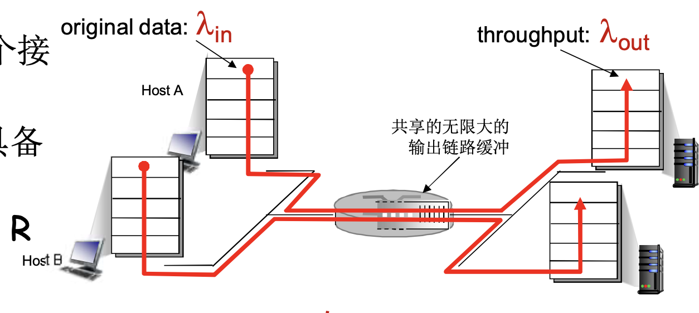
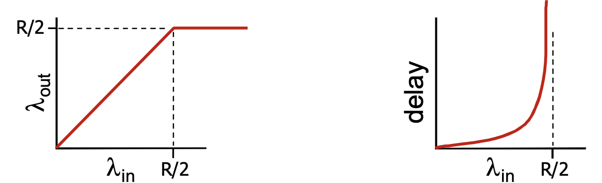
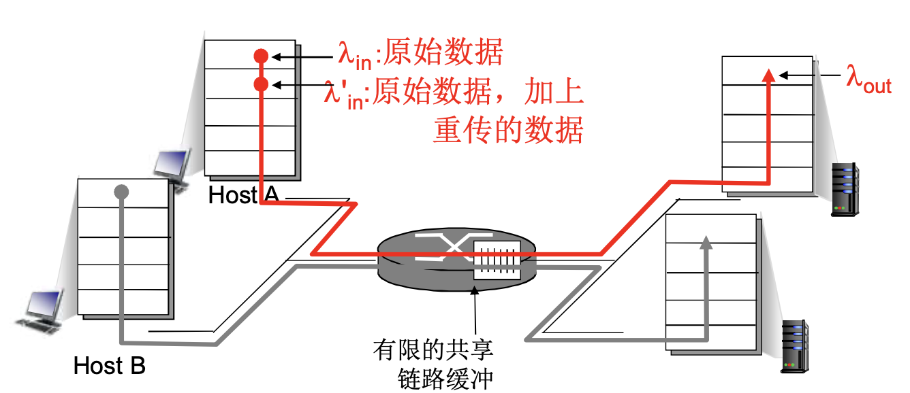
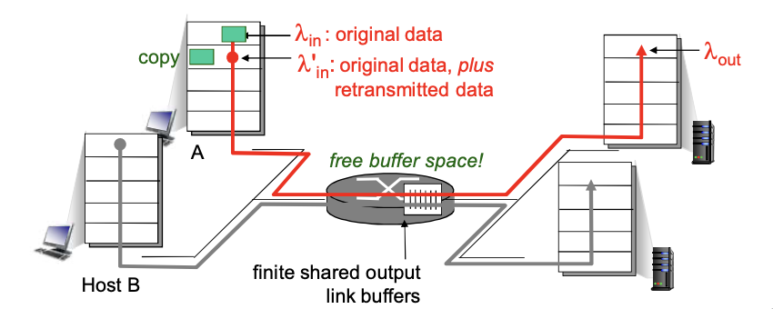
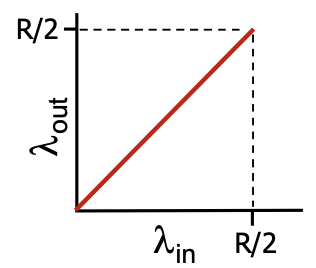
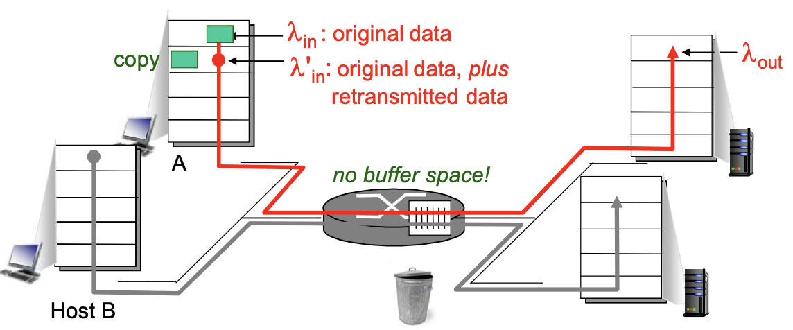
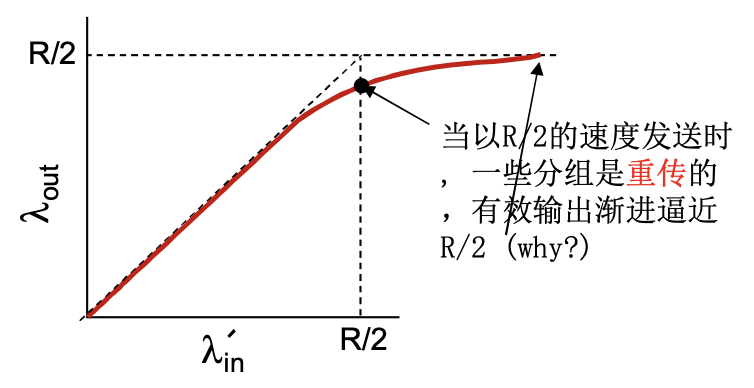
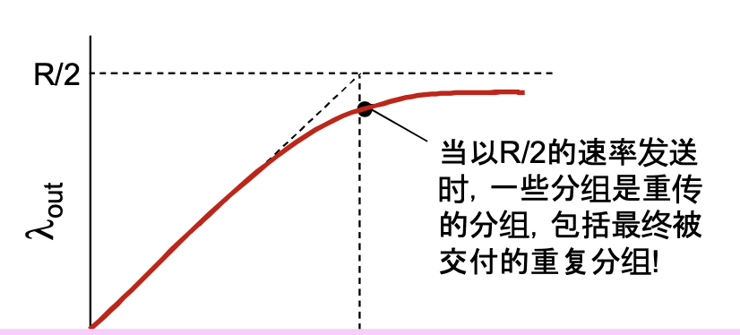
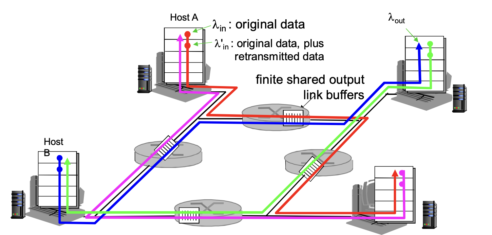

# 📘 3.6 拥塞控制原理 (Principles of Congestion Control)

> 来源说明：郑老师《计算机网络》Transport Layer 3-108 ~ 3-120 | 本节涵盖：拥塞定义、拥塞成因与代价分析、拥塞控制方法分类、ATM ABR 案例

---

## 🧠 核心概念总览（严格按原文顺序）

- [*知识点1: 拥塞的定义与表现*](#id1)
- [*知识点2: 场景1 — 无限缓冲、无重传时的吞吐量与延迟*](#id2)
- [*知识点3: 场景2 — 有限缓冲与重传*](#id3)
- [*知识点4: 场景2理想化① — 发送端掌握完美缓冲信息*](#id4)
- [*知识点5: 场景2理想化② — 发送端掌握丢失信息并精确重传*](#id5)
- [*知识点6: 场景2现实情况 — 超时重传与重复分组的代价*](#id6)
- [*知识点7: 场景3 — 多路径多发送端与上游带宽浪费*](#id7)
- [*知识点8: 拥塞控制方法 — 端到端 vs 网络辅助*](#id8)
- [*知识点9: ATM ABR 拥塞控制 — 弹性服务与RM信元*](#id9)
- [*知识点10: ATM ABR 拥塞控制 — ER字段与EFCI机制*](#id10)

---

<a id="id1"></a>
## ✅ 知识点1: 拥塞的定义与表现

- **拥塞(Congestion)** 的非正式定义：**"太多的数据需要网络传输，超过了网络的处理能力"**
- **拥塞控制与流量控制(flow control)不同**：
  - **流量控制**：端到端的发送方与接收方之间的**速率匹配**
  - **拥塞控制**：**全局性**问题，涉及网络中所有主机、路由器及链路
- **拥塞的表现**：
  - **分组丢失(Packet Loss)**：路由器缓冲区溢出导致分组被丢弃
  - **分组经历比较长的延迟(Long Delay)**：分组在路由器的队列中排队等待转发
- 拥塞是 **网络中前10位的问题！**

**注意点**
- ⚠️ **关键区别**：流量控制解决"接收方吃不下"，拥塞控制解决"网络传不动"
- 💡 **理解技巧**：把路由器想象成收费站，车太多（分组太多）要么堵在路上（延迟大），要么被劝返（丢弃）


---

<a id="id2"></a>
## ✅ 知识点2: 场景1 — 无限缓冲、无重传时的吞吐量与延迟


- 网络拓扑：2个发送端(Host A, Host B)，2个接收端，中间经过 **1个路由器**
- 假设条件：
  - 路由器具备 **无限大的缓冲**
  - 输出链路带宽为 **R**
  - **没有重传**
  
- 性能分析：
  - 每个连接的最大吞吐量：**R/2**（两主机共享带宽R）
  - 当进入的速率 $\lambda_{in}$ 接近链路带宽R/2时，延迟(delay)急剧增大，流量强度接近1
  - $\lambda_{out}$（输入网络流量）随 $\lambda_{in}$ （输出至应用网络流量）线性增长至 R/2 后饱和
  - ⚠️ **瓶颈**：即使缓冲区无限，链路带宽R仍是硬上限，每个连接最多分到 R/2
  - 💡 **理解技巧**：无限缓冲=不会丢包，但会"堵死"——延迟无限增大，这是拥塞的第一种代价
  


---

<a id="id3"></a>
## ✅ 知识点3: 场景2 — 有限缓冲与重传

**理论**
- 网络拓扑：一个路由器，**有限的缓冲**
- 核心机制：**分组丢失时，发送端重传**
- 速率关系：
  - **应用层输入 = 应用层输出**：$\lambda_{in} = \lambda_{out}$（原始数据速率）
  - **传输层输入包括重传**：$\lambda'_{in} \geq \lambda_{in}$（实际注入网络的速率 ≥ 原始数据速率）
  - ⚠️ **关键不等式**：$\lambda'_{in} \geq \lambda_{in}$
    - 重传使得网络实际承载的流量大于应用层真正想发的流量
    - 流量强度越大越接近1，那么随着重传越来越多，$\lambda'_{in}$与$\lambda_{in}$差距会越来越大
  


**注意点**
- 🔄 **知识关联**：这是场景1的升级版——从"不会丢但会堵"变成"会丢所以得重传"

---

<a id="id4"></a>
## ✅ 知识点4: 场景2理想化① — 发送端掌握完美缓冲信息

- **理想化假设**：发送端有**完美的信息**，即发送端知道什么时候路由器的**缓冲的可用区域大小**
- 行为特征：
  - **只在缓冲可用时发送**
  - 分组不会丢掉
  - **不会丢失**：$\lambda'_{in} = \lambda_{in}$（无需重传，无额外流量）
  - 💡 **理解技巧**：这是"上帝视角"——发送方像开了天眼，知道路由器队列还剩几个空位，绝不多发一个分组
  
- 性能：$\lambda_{out}$ 可完美达到 R/2，无资源浪费
 

**注意点**
- ⚠️ **现实不可行**：真实网络中发送端不可能实时知道路由器缓冲状态，因此这只是一个理论基准

---

<a id="id5"></a>
## ✅ 知识点5: 场景2理想化② — 发送端掌握丢失信息并精确重传

- **理想化假设**：**掌握丢失信息**，即发送端能精确知道哪些分组在路由器因缓冲器满而被丢弃
- 行为特征：
  - 分组可以丢失，在路由器由于缓冲器满而被丢弃
  - **如果发送端知道分组丢失了，发送方重传分组**
  - ⚠️ **与场景1的区别**：这里允许丢包，但要求发送方"丢多少补多少"，不盲目多发
  
- 性能曲线：
  - 当以 R/2 的速度发送时，一些分组是**重传的**
  - 有效输出 $\lambda_{out}$ 渐进逼近 R/2
  - 输出比输入少的原因：1) 重传的丢失分组；2) 没有必要重传的重复分组
  

**注意点**
- 💡 **理解技巧**：发送方像精准的快递员——包裹被退回了，立刻补发一份，绝不多发冗余包裹

---

<a id="id6"></a>
## ✅ 知识点6: 场景2现实情况 — 超时重传与重复分组的代价


- **现实情况**：**重复**
  - 分组可能由于缓冲器满而被丢弃
  - 但也可能由于分组在网络滞留导致发送端**最终超时**，发送第2个拷贝，结果 **2个分组都被传出**在网络上且没有丢弃（原分组和重传分组可能同时在路上）
- 性能曲线特征：
  - 当以 R/2 的速率发送时，一些分组是重传的，包括**最终被交付的重复分组**
  - $\lambda_{out}$ 达到峰值后可能下降
  
- **拥塞的"代价"**：
  1. 为发送到一个有效输出，网络需要做**更多的工作（重传）**
  2. **没有必要的重传**：链路中包括了多个分组的拷贝
     - 是那些**没有丢失**，经历的时间比较长（拥塞状态）但是**超时的分组**
  3. 降低了的 **"goodput"**（有效吞吐量）
      - 💡 goodput 就是"真正有用的吞吐量"。拥塞时，网络里跑了很多重复包，带宽被浪费，goodput 暴跌

**注意点**
- ⚠️ **核心矛盾**：超时重传本是为了可靠性，但在拥塞时反而雪上加霜——往已经堵死的网络里再塞一份
- 🔄 **知识关联**：这是 TCP 拥塞控制要解决的核心问题——如何区分"丢包是因为出错"还是"丢包是因为拥塞"

---

<a id="id7"></a>
## ✅ 知识点7: 场景3 — 多路径多发送端与上游带宽浪费

- 网络拓扑：**4个发送端**，**多重路径**，存在**超时/重传**
- 关键问题：当 $\lambda_{in}$ 和 $\lambda'_{in}$ 增加时，会发生什么？

- 现象分析：
  - 当红色的 $\lambda'_{in}$ 增加时，所有到来的**蓝色分组**都在最上方的队列中丢弃了，**蓝色吞吐 → 0**
  - 因为这个时候红色经过经过第一个路由，蓝色经过第二个路由流量势必会红色流量更大
  - 所以红色流量在缓冲区"挤死"了蓝色流量
  - 同理，绿色又会"挤死"红色，紫色又会"挤死"绿色
  - 造成网络死锁，浪费上有传输能力
- **又一个拥塞的代价**：
  - 当分组丢失时，任何“**关于这个分组的上游传输能力**” 都被浪费了
  - 分组在到达瓶颈路由器之前已经占用了多条链路的带宽，一旦被丢弃，这些带宽全部白跑

**注意点**
- ⚠️ **上游浪费**：这是最容易被忽略的代价——分组走了3跳，第3跳被丢，前两跳的带宽和路由器处理全白费
- 💡 **理解技巧**：想象你寄快递，包裹已经坐了飞机+高铁，到最后一公里发现地址错了被销毁——前面所有运输成本全部沉没

---

<a id="id8"></a>
## ✅ 知识点8: 拥塞控制方法 — 端到端 vs 网络辅助

**理论**
- **2种常用的拥塞控制方法**：

| 维度 | 端到端拥塞控制 (End-to-End) | 网络辅助拥塞控制 (Network-Assisted) |
|------|---------------------------|-----------------------------------|
| 反馈来源 | **没有来自网络的显式反馈** | **路由器提供给端系统以反馈信息** |
| 推断方式 | 端系统根据**延迟**和**丢失事件**推断是否有拥塞 | 路由器主动参与 |
| 具体机制 | TCP采用的方法 | ① 单个 bit 置位，显示有拥塞 (SNA, DECbit, TCP/IP ECN, ATM)<br>② **显式提供发送端可以采用的速率(Explicit Rate)** |
| 特点 | 隐式反馈，实现简单 | 显式反馈，更精细控制 |

**注意点**
- 📋 **术语提醒**：ECN = Explicit Congestion Notification（显式拥塞通知）
- 🔄 **知识关联**：TCP 属于端到端，ATM ABR 属于网络辅助
- 💡 **理解技巧**：端到端像"盲人摸象"——通过丢包和延迟猜网络状态；网络辅助像"导航APP"——路由器直接告诉你前面堵不堵

---

<a id="id9"></a>
## ✅ 知识点9: ATM ABR 拥塞控制 — 弹性服务与RM信元

**理论**
- **ABR (Available Bit Rate)**：可用比特率
  - **"弹性服务(Elastic Service)"**：速率可随网络状况调整
  - 如果发送端的路径**"轻载"**：发送方使用可用带宽
  - 如果发送方的路径**拥塞**了：发送方限制其发送的速度到一个**最小保障速率(Minimum Guaranteed Rate)** 上
- **RM (Resource Management) 信元**：
  - 由发送端发送，在数据信元中间隔插入
  - **RM信元中的比特被交换机设置("网络辅助")**：
    - **NI bit (No Increase)**：轻微拥塞，速率不要增加了
    - **CI bit (Congestion Indication)**：拥塞指示
  - 发送端发送的RM信元被**接收端返回**，接收端不做任何改变

**注意点**
- ⚠️ **RM信元路径**：去程由发送端发，途经交换机被"打标记"，到接收端后**原路返回**给发送端
- 💡 **理解技巧**：ABR像"弹性工作制"——活少时多干（用满带宽），活多时少干（保底线），RM信元就是上下级之间的"工作负荷通知单"

---

<a id="id10"></a>
## ✅ 知识点10: ATM ABR 拥塞控制 — ER字段与EFCI机制

**理论**
- **ER (Explicit Rate) 字段**：
  - 在RM信元中的 **2个字节** ER 字段
  - 拥塞的交换机可能会**降低信元中ER的值**
  - 发送端发送速度因此是**最低的可支持速率**（路径上所有交换机ER值的最小值）
- **EFCI (Explicit Forward Congestion Indication) bit**：
  - 数据信元中的EFCI bit：被拥塞的交换机设置成 **1**
  - 连锁反应：如果在管理信元RM前面的数据信元EFCI被设置成了1，接收端在返回的RM信元中设置 **CI bit**

**教材图示核心逻辑**
```
发送端 → [数据信元(data cell)] → 交换机(拥塞则EFCI=1) → 接收端
       → [RM信元] → 交换机(设置NI/CI/ER) → 接收端(原样返回RM) → 发送端(读取反馈调整速率)
```

**注意点**
- ⚠️ **ER的"木桶效应"**：路径上有多个交换机，每个都可能压低ER值，发送端最终看到的是**路径上的最小可用速率**
- 🔄 **知识关联**：EFCI是"前向标记"，CI是"反向标记"——数据去时被打上拥塞标签，RM回程时把这个信息带回去
- 💡 **理解技巧**：ER就像一段路有多个限速牌，你最终只能按最低的限速开；EFCI就像路上抛了锚的车插了警示牌，后面收到的RM信元看到警示牌就知道前面堵了

---

## 🔑 核心要点总结

1. **拥塞的本质**：网络需求 > 网络处理能力，表现为丢包和延迟，与流量控制完全不同
2. **拥塞的三大代价**：① 延迟飙升（场景1）；② 重传浪费与goodput下降（场景2）；③ 上游带宽白白浪费（场景3）
3. **控制方法二分法**：TCP采用**端到端**（靠丢包/延迟猜）；ATM ABR采用**网络辅助**（路由器显式反馈NI/CI/ER）
4. **ABR核心机制**：RM信元往返传递网络状态，ER字段取路径最小可用速率，EFCI前向标记触发CI反向告警

## 📌 考试速记版

- **拥塞 vs 流量控制**：全局网络问题 vs 端到端接收能力问题
- **场景1结论**：无限缓冲 → 不丢包但延迟∞，吞吐量上限 R/2（每连接）
- **场景2核心不等式**：$\lambda'_{in} \geq \lambda_{in}$（重传使网络负载≥应用负载）
- **场景3致命伤**：上游传输能力全部浪费（多跳路径丢包）
- **两种控制方法**：
  - 端到端：无显式反馈，TCP用
  - 网络辅助：路由器给反馈，如ECN、ATM ABR
- **ABR速记**：
  - RM = Resource Management，由发送端发、接收端返
  - NI = No Increase（别加了），CI = Congestion Indication（堵了）
  - ER = Explicit Rate（显式速率），取路径最小值
  - EFCI = 数据信元前向标记为1 → 接收端回传RM时置CI=1

**记忆口诀**：  
"拥塞三场景，无限有限多路径；延迟丢包白跑路，端到网络两控制。RM信元跑来回，ER取小EFCI催，NI别加CI喊堵，ABR弹性最会随。"