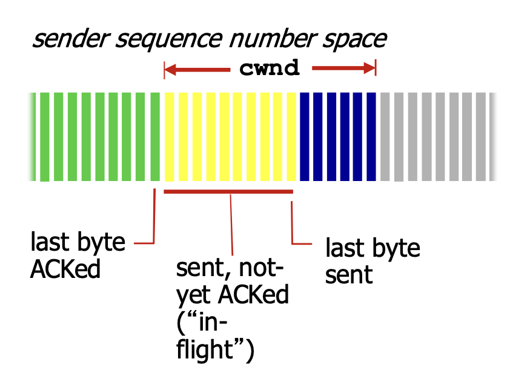

# 📘 3.7 TCP 拥塞控制 (TCP Congestion Control)

> 来源说明：郑老师《计算机网络》Transport Layer 3-122 ~ 3-141 | 本节涵盖：TCP端到端拥塞控制机制、拥塞感知、CongWin动态调整、慢启动与AIMD、Threshold阈值、吞吐量分析、公平性、ECN

---

## 🧠 核心概念总览（严格按原文顺序）

- [*知识点1: TCP拥塞控制机制概览与核心问题*](#id1)
- [*知识点2: TCP拥塞控制：拥塞感知*](#id2)
- [*知识点3: 速率控制方法 — CongWin与联合控制*](#id3)
- [*知识点4: 拥塞控制策略概述*](#id4)
- [*知识点5: 慢启动机制 (Slow Start)*](#id5)
- [*知识点6: AIMD — 加性增乘性减*](#id6)
- [*知识点7: Threshold阈值与TCP Reno改进*](#id7)
- [*知识点8: TCP拥塞控制完整总结 — 状态、表格与FSM*](#id8)
- [*知识点9: TCP吞吐量分析*](#id9)
- [*知识点10: TCP over Long Fat Pipes*](#id10)
- [*知识点11: TCP公平性*](#id11)
- [*知识点12: ECN显式拥塞通知*](#id12)

---

<a id="id1"></a>
## ✅ 知识点1: TCP拥塞控制机制概览与核心问题

- **端到端的拥塞控制机制**：
  - **路由器不向主机发送有关拥塞的反馈信息** —— 路由器负担较轻，符合网络核心简单的 **TCP/IP架构原则**
  - **端系统** 根据自身得到的信息（如丢包、延迟），判断是否发生拥塞，从而采取动作
  - ⚠️ **TCP/IP设计哲学**：网络核心保持简单（路由器不维护连接状态），复杂性推到边缘（端系统负责拥塞控制）
- **拥塞控制的几个问题**：
  1. **如何检测拥塞**：
     - **轻微拥塞**：网络还能传一部分数据
     - **拥塞**：网络严重堵塞
  2. **控制策略**：
     - **拥塞发生时如何动作，降低速率**：轻微拥塞时如何降？拥塞时如何降？
     - **拥塞缓解时如何动作，增加速率**：网络好转时如何升？

**注意点**
- 💡 **理解技巧**：TCP像"盲人开车"——看不到前方路况，只能通过"撞了墙"(丢包)或"听到喇叭"(重复ACK)来判断是否堵车

---

<a id="id2"></a>
## ✅ 知识点2: TCP拥塞控制：拥塞感知 

核心问题：**发送端如何探测到拥塞？**

- **情况一，通过超时判断拥塞：某个段超时了（丢失事件）→ 拥塞**
  - 超时时间到，某个段的确认没有来
  - **原因1：网络拥塞**（某个路由器缓冲区没空间了，被丢弃）— **概率大**
  - **原因2：出错被丢弃**（各级错误，没有通过校验，被丢弃）— **概率小**
  - 一旦超时，就认为拥塞了，有一定误判，但是总体控制方向是对的

- **情况二，通过冗余ACK判断拥塞：有关某个段的3次重复ACK → 轻微拥塞**
  - 段的第1个ACK：正常，确认绿段，期待红段
  - 段的第2个重复ACK：意味着红段的后一段收到了，蓝段乱序到达
  - 段的第2、3、4个ACK重复：意味着红段的后第2、3、4个段收到了，橙段乱序到达，同时**红段丢失的可能性很大**（后面3个段都到了，红段都没到）
  - **网络这时还能够进行一定程度的传输**，拥塞但情况要比第一种好
  
  - ⚠️ **核心区别**：超时 = "彻底失联"（严重拥塞）；3dupACK = "还能收到回音"（轻微拥塞/只是某个包丢了）

**注意点**
- 🔄 **知识关联**：超时后TCP采取最保守策略（CongWin直接归1）；3dupACK采取较温和策略（CongWin减半）——因为网络还能传数据
- 💡 **理解技巧**：超时像"电话完全打不通"，3dupACK像"电话能打通但对方说'你上一句我没听清，但下几句我听懂了'"

---

<a id="id3"></a>
## ✅ 知识点3: 速率控制方法 — CongWin与联合控制


**一、拥塞窗口 CongWin**
- 维持一个拥塞窗口的值：**CongWin**
- 发送端限制**已发送但是未确认的数据量**（的上限）：
  $$\text{LastByteSent} - \text{LastByteAcked} \leq \text{CongWin}$$
  
- 从而粗略地控制发送方往网络中注入的速率：
  $$\text{rate} \approx \frac{\text{CongWin}}{\text{RTT}} \text{ bytes/sec}$$
  

**二、CongWin的动态调整机制**
- **CongWin是动态的**，是感知到的网络拥塞程度的函数
- **超时或者3个重复ACK → CongWin↓**：
  - **超时时**：CongWin降为 **1 MSS**，进入 **SS阶段** 然后再倍增到 CongWin/2（每个RTT）为止，从而进入 **CA阶段**
  - **3个重复ACK**：CongWin降为 **CongWin/2**，进入 **CA阶段**
- **否则（正常收到ACK）→ CongWin↑**：
  - **SS（慢启动）阶段**：加倍增加（每个RTT CongWin*2）
  - **CA（拥塞避免）阶段**：线性增加（每个RTT加一个MSS）

**三、TCP拥塞控制和流量控制的联合动作**
- 发送端控制**发送但是未确认的量**，同时也不能够超过接收窗口，满足流量控制要求:
$$\text{SendWin} = \min\{\text{CongWin}, \text{RecvWin}\}$$
- **同时满足拥塞控制和流量控制要求**
- ⚠️ **双重限制**：发送窗口由"网络能承受多少"(CongWin)和"接收方能收多少"(RecvWin)共同决定，取较小的那个


---

<a id="id4"></a>
## ✅ 知识点4: 拥塞控制策略概述

**理论**
- **拥塞控制策略 (Congestion Control Strategies)** 三大核心：
  1. **慢启动 (Slow Start)**：连接初期指数级探测可用带宽
  2. **AIMD (Additive Increase Multiplicative Decrease)**：**线性增、乘性减** —— 探测到拥塞时窗口乘性减半，网络好转时窗口线性增加
  3. **超时事件后的保守策略 (Conservative Strategy after Timeout)**：超时意味着严重拥塞，采取最激进的降级

**注意点**
- 🔄 **知识关联**：这三大策略共同构成TCP拥塞控制的"骨架"——先慢启动快速爬坡，再AIMD精细探测，遇超时则彻底归零重来

---

<a id="id5"></a>
## ✅ 知识点5: 慢启动机制 (Slow Start)

**理论**

**初始状态**
- 连接刚建立，**CongWin = 1 MSS**
- 示例：MSS = 1460 bytes & RTT = 200 msec → **初始速率 = 58.4 kbps**
- 可用带宽可能 **>> MSS/RTT**，应该尽快加速，到达希望的速率

**增长机制**
- 当连接开始时，**指数性增加**发送速率，直到发生丢失的事件
- **每一个RTT，CongWin加倍**
- **每收到一个ACK时，CongWin加1**（累积效果导致每RTT翻倍）
- 慢启动阶段：只要不超时或3个重复ACK，一个RTT，CongWin加倍

**总结**
- **初始速率很慢，但是加速却是指数性的**
- 指数增加，SS时间很短，**长期来看可以忽略**

**注意点**
- ⚠️ **"慢启动"其实不慢**：名字叫"慢启动"是因为初始值只有1MSS很小，但增长速度是**指数级**，很快就能飙上去
- 💡 **理解技巧**：像火箭发射——起步推力小（1MSS），但每秒推力翻倍，很快就能突破音障

---

<a id="id6"></a>
## ✅ 知识点6: AIMD — 加性增乘性减

**理论**

**乘性减 (Multiplicative Decrease)**
- 丢失事件后将 **CongWin降为1**，将 **CongWin/2作为阈值(Threshold)**，进入慢启动阶段（倍增直到CongWin/2）

**加性增 (Additive Increase)**
- 当 **CongWin > 阈值(Threshold)** 时，一个RTT如没有发生丢失事件，将 **CongWin加1 MSS**：**探测(probing)** 可用带宽
- **AIMD saw tooth behavior**：像锯齿一样，线性爬坡 → 丢包骤降 → 再线性爬坡 → 再骤降，持续**探测带宽(probing for bandwidth)**

**两种丢包事件的处理差异 (3-131)**
- **当收到3个重复的ACKs**：
  - **CongWin减半**
  - 窗口（缓冲区大小）之后**线性增长**
  - **思路**：3个重复的ACK表示网络还有一定的段传输能力；超时之前的3个重复的ACK表示"警报"
- **当超时事件发生时**：
  - **CongWin被设置成1 MSS**，进入SS阶段
  - 之后窗口**指数增长**
  - 增长到一个阈值（上次发生拥塞的窗口的一半）时，再**线性增加**

**注意点**
- ⚠️ **为什么3dupACK比超时温和？** 3dupACK说明网络还能传后续包（只是某个包丢了），所以只砍半；超时说明网络可能彻底堵死，所以直接归零
- 💡 **理解技巧**：AIMD像"爬楼梯摔滑梯"——一步一步往上爬（线性增），一跤摔到半山腰（乘性减），再重新爬

---

<a id="id7"></a>
## ✅ 知识点7: Threshold阈值与TCP Reno改进

**理论**
- **核心问题**：什么时候应该将指数性增长变成线性？
- **答案**：在超时之前，当 **CongWin变成上次发生超时的窗口的一半**
- **实现**：
  - 引入变量：**Threshold (ssthresh)**
  - **出现丢失，Threshold设置成CongWin的1/2**
- **图示对比（TCP Tahoe vs TCP Reno）**：
  - **TCP Tahoe**：丢包后CongWin直接归1，从慢启动重新爬
  - **TCP Reno**：3dupACK时CongWin减半并进入快速恢复，避免直接归1的剧烈震荡

**注意点**
- ⚠️ **Threshold的记忆作用**：Threshold记录了"上次拥塞时窗口的一半"，下次慢启动爬到这儿就改线性增长，避免再次冲顶拥塞
- 🔄 **知识关联**：Threshold是SS阶段和CA阶段的分界线 —— CongWin < Threshold 走指数增长(SS)，CongWin > Threshold 走线性增长(CA)

---

<a id="id8"></a>
## ✅ 知识点8: TCP拥塞控制完整总结 — 状态、表格与FSM

**理论**

**一、文字总结 (3-133)**
- 当 **CongWin < Threshold**：发送端处于**慢启动阶段 (slow-start)**，窗口**指数性增长**
- 当 **CongWin > Threshold**：发送端处于**拥塞避免阶段 (congestion-avoidance)**，窗口**线性增长**
- 当收到**三个重复的ACKs (triple duplicate ACK)**：**Threshold设置成CongWin/2**，**CongWin = Threshold + 3**
- 当**超时事件发生时 (timeout)**：**Threshold = CongWin/2**，**CongWin = 1 MSS**，进入SS阶段

**二、TCP发送端拥塞控制表格 (3-134)**

| 事件 | 状态 | TCP发送端行为 | 解释 |
|------|------|--------------|------|
| 以前没有收到ACK的data被ACKed | 慢启动(SS) | CongWin = CongWin + MSS<br>If (CongWin > Threshold) 状态变成"CA" | 每一个RTT CongWin加倍 |
| 以前没有收到ACK的data被ACKed | 拥塞避免(CA) | CongWin = CongWin + MSS × (MSS/CongWin) | 加性增加，每一个RTT对CongWin加1个MSS |
| 通过收到3个重复的ACK，发现丢失的事件 | SS or CA | Threshold = CongWin/2<br>CongWin = Threshold + 3<br>状态变成"CA" | 快速重传，实现乘性的减。<br>CongWin没有变成1 MSS。 |
| 超时 | SS or CA | Threshold = CongWin/2<br>CongWin = 1 MSS<br>状态变成"SS" | 进入slow start |
| 重复的ACK | SS or CA | 对被ACKed的segment，增加重复ACK的计数 | CongWin and Threshold不变 |

**三、FSM状态机描述 (3-135)**

- **状态1：慢启动 (Slow Start)**
  - 收到New ACK：`cwnd += MSS`，`dupACKcount = 0`，发送新段；若 `cwnd ≥ ssthresh` → 进入拥塞避免
  - 超时：`ssthresh = cwnd/2`，`cwnd = 1 MSS`，`dupACKcount = 0`，重传丢失段 → 回到慢启动
  - 收到重复ACK：`dupACKcount++`；若 `dupACKcount == 3` → `ssthresh = cwnd/2`，`cwnd = ssthresh + 3`，重传丢失段 → 进入快速恢复

- **状态2：拥塞避免 (Congestion Avoidance)**
  - 收到New ACK：`cwnd += MSS × (MSS/cwnd)`，`dupACKcount = 0`，发送新段
  - 超时：`ssthresh = cwnd/2`，`cwnd = 1 MSS`，`dupACKcount = 0`，重传丢失段 → 回到慢启动
  - 收到重复ACK：`dupACKcount++`；若 `dupACKcount == 3` → `ssthresh = cwnd/2`，`cwnd = ssthresh + 3`，重传丢失段 → 进入快速恢复

- **状态3：快速恢复 (Fast Recovery)**
  - 收到重复ACK：`cwnd += MSS`，发送新段（若允许）
  - 收到New ACK：`cwnd = ssthresh`，`dupACKcount = 0` → 进入拥塞避免
  - 超时：`ssthresh = cwnd/2`，`cwnd = 1 MSS`，`dupACKcount = 0`，重传丢失段 → 回到慢启动

**注意点**
- ⚠️ **3dupACK时CongWin = Threshold + 3 的含义**：Threshold是减半后的值，+3是因为已经收到了3个重复ACK，说明网络里还有3个段在传，所以可以多发3个MSS
- 📋 **术语提醒**：dupACKcount = duplicate ACK count（重复ACK计数器），ssthresh = slow start threshold（慢启动阈值）

---

<a id="id9"></a>
## ✅ 知识点9: TCP吞吐量分析

**理论**
- **问题**：TCP的平均吞吐量是多少？使用窗口尺寸W和RTT来描述
- **假设**：忽略慢启动阶段，假设发送端总有数据传输
- **W**：发生丢失事件时的窗口尺寸（单位：字节）
- **平均窗口尺寸**（#in-flight字节）：**3/4 W**
- **平均吞吐量**：RTT时间吞吐 3/4 W
  $$\text{avg TCP thruput} = \frac{3}{4} \cdot \frac{W}{\text{RTT}} \text{ bytes/sec}$$

**注意点**
- ⚠️ **为什么是3/4W？** 窗口在W和W/2之间锯齿震荡（AIMD），平均就是 (W + W/2)/2 = 3W/4
- 💡 **理解技巧**：TCP吞吐量就像锯齿波的平均高度——峰值W，谷值W/2，平均线在中间偏上的3/4位置

---

<a id="id10"></a>
## ✅ 知识点10: TCP over Long Fat Pipes

**理论**
- **场景**：高带宽 × 高延迟的网络（"长肥管道"）
- **示例**：1500字节/段，100ms RTT，如果需要 **10 Gbps** 吞吐量
- 由 $T = 0.75W/R$ 推导：
  $$W = \frac{TR}{0.75} = 12.5M \text{字节} = 83333 \text{段}$$
  - 需要窗口大小 **W = 83,333 in-flight段**
- **吞吐量用丢失率L表示**：
  $$T = \frac{1.22 \cdot MSS}{RTT \cdot \sqrt{L}}$$
- 反推丢包率：
  $$\rightarrow L = 2 \times 10^{-10}$$
  - 为了达到10Gbps的吞吐，平均**50亿段丢失一个**
  - **非常非常小的丢失率！可能远远低于链路的物理丢失率，达不到的**
- **结论**：网络带宽增加，**需要更新的TCP版本！**

**注意点**
- ⚠️ **TCP的带宽瓶颈**：传统TCP在超高速网络中，为了维持高吞吐需要极低的丢包率，这往往不现实，因此催生了TCP CUBIC、BBR等新版本
- 💡 **理解技巧**：长肥管道像"超长超粗的输油管"——要填满它需要巨大的窗口（83,333个段同时在途），而AIMD的锯齿震荡在这种尺度下效率极低

---

<a id="id11"></a>
## ✅ 知识点11: TCP公平性

**理论**

**一、公平性目标 (3-138)**
- 如果 **K个TCP会话** 分享一个链路带宽为 **R** 的瓶颈，每一个会话的有效带宽为 **R/K**

**二、为什么TCP是公平的？ (3-139)**
- **2个竞争的TCP会话**：
  - **加性增加**：斜率为1，吞吐量增加
  - **乘性减**：吞吐量比例减少
- **收敛特性**：AIMD机制使得多条连接最终收敛到 **equal bandwidth share（等带宽共享）**
- 图示逻辑：两条连接的吞吐量轨迹在"公平线"（45度线）和"效率线"（总吞吐=R）之间震荡，最终趋向交点

**三、公平性的挑战 (3-140)**
- **公平性和UDP**：
  - 多媒体应用通常**不用TCP** —— 应用发送的数据速率希望不受拥塞控制的节制
  - **使用UDP**：音视频应用泵出数据的速率是恒定的，**忽略数据的丢失**
  - 研究领域：**TCP友好性 (TCP Friendly)** —— 如何让UDP应用不饿死TCP连接
- **公平性和并行TCP连接**：
  - 2个主机间可以打开**多个并行的TCP连接**
  - **Web浏览器**常这样做
  - 示例：带宽为R的链路支持了9个连接：
    - 如果新的应用要求建**1个TCP连接**，获得带宽 **R/10**
    - 如果新的应用要求建**11个TCP连接**，获得带宽 **R/2**

**注意点**
- ⚠️ **TCP公平性的前提**：所有连接具有相似的RTT。如果RTT差异大，短RTT连接会"抢"更多带宽
- ⚠️ **并行连接破坏公平**：开11个连接拿走一半带宽，这是"合法作弊"——TCP公平是按连接数分，不是按应用或用户数分
- 💡 **理解技巧**：AIMD像两个分蛋糕的人——你多切一点我就按比例缩一点，最终大家各拿一半；但UDP是"抢蛋糕不撒手"的，并行TCP是"一个人拿多个叉子"

---

<a id="id12"></a>
## ✅ 知识点12: ECN显式拥塞通知

**理论**
- **Explicit Congestion Notification (ECN)** —— **网络辅助拥塞控制**
- 机制流程：
  1. **TOS字段中2个bit**被网络路由器标记，用于指示是否发生拥塞
  2. **拥塞指示**被传送到接收主机（在IP数据报中）
  3. 在接收方→发送方的ACK中，接收方（在IP数据报中看到了拥塞指示）设置 **ECE bit**，指示发送方发生了拥塞

**教材图示流程**
```
发送端(source) → [IP datagram, ECN=00] → 路由器(拥塞则标记ECN=11) → 接收端(destination)
接收端 → [TCP ACK segment, ECE=1] → 发送端(感知拥塞，降低速率)
```

**注意点**
- ⚠️ **ECN vs 传统TCP**：传统TCP靠"丢包"被动感知拥塞；ECN让路由器**主动标记**拥塞，发送端可以提前降速，避免真的丢包
- 📋 **术语提醒**：ECN = Explicit Congestion Notification（显式拥塞通知），ECE = ECN-Echo（ECN回显标志），TOS = Type of Service（服务类型字段）

---

## 🔑 核心要点总结

1. **TCP端到端拥塞控制**：路由器不反馈，端系统通过超时(严重拥塞)和3dupACK(轻微拥塞)自主感知
2. **CongWin是核心杠杆**：发送速率 ≈ CongWin/RTT，SendWin = min(CongWin, RecvWin) 同时受拥塞和流量控制约束
3. **慢启动 + AIMD**：连接初期指数级探测(SS)，正常期线性探测(CA)；超时归1重来，3dupACK减半恢复
4. **Threshold是关键分界线**：丢包时Threshold = CongWin/2，SS爬到Threshold后转CA，避免反复冲顶拥塞
5. **公平性与挑战**：AIMD收敛到等带宽共享，但UDP不遵守规则、并行TCP连接破坏公平

## 📌 考试速记版

- **拥塞感知信号**：超时 = 严重拥塞（CongWin→1）；3dupACK = 轻微拥塞（CongWin→CongWin/2）
- **速率公式**：rate ≈ CongWin/RTT；SendWin = min(CongWin, RecvWin)
- **SS阶段**：CongWin < Threshold，指数增（每RTT翻倍），每收到ACK加1MSS
- **CA阶段**：CongWin > Threshold，线性增（每RTT加1MSS），公式 CongWin += MSS×(MSS/CongWin)
- **3dupACK处理**：Threshold = CongWin/2，CongWin = Threshold + 3，进入Fast Recovery
- **超时处理**：Threshold = CongWin/2，CongWin = 1 MSS，进入Slow Start
- **平均吞吐量**：avg thruput = (3/4) × W/RTT（W为丢包时窗口大小）
- **长肥管道问题**：10Gbps需窗口83,333段，要求丢包率L≈2×10⁻¹⁰，传统TCP难以满足
- **公平性公式**：K条连接共享带宽R，理想各得R/K；UDP和并行连接破坏公平
- **ECN机制**：路由器在IP头标记拥塞→接收端在ACK中置ECE→发送端提前降速

**记忆口诀**：  
"CongWin是油门，RTT是赛道，超时归零dupACK半，Threshold记住上次惨。SS指数飞，CA线性爬，AIMD锯齿探带宽，长肥管道要换代。ECN路由器提前喊，UDP耍赖并行骗，TCP公平靠收敛。"