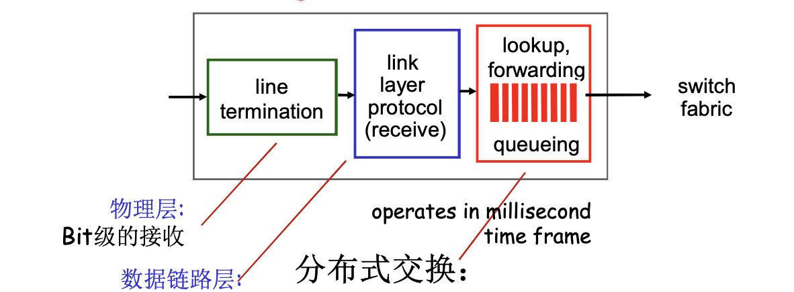
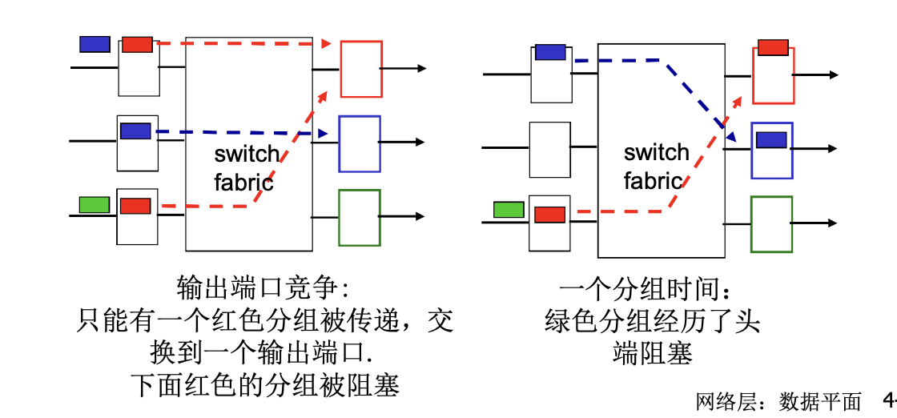
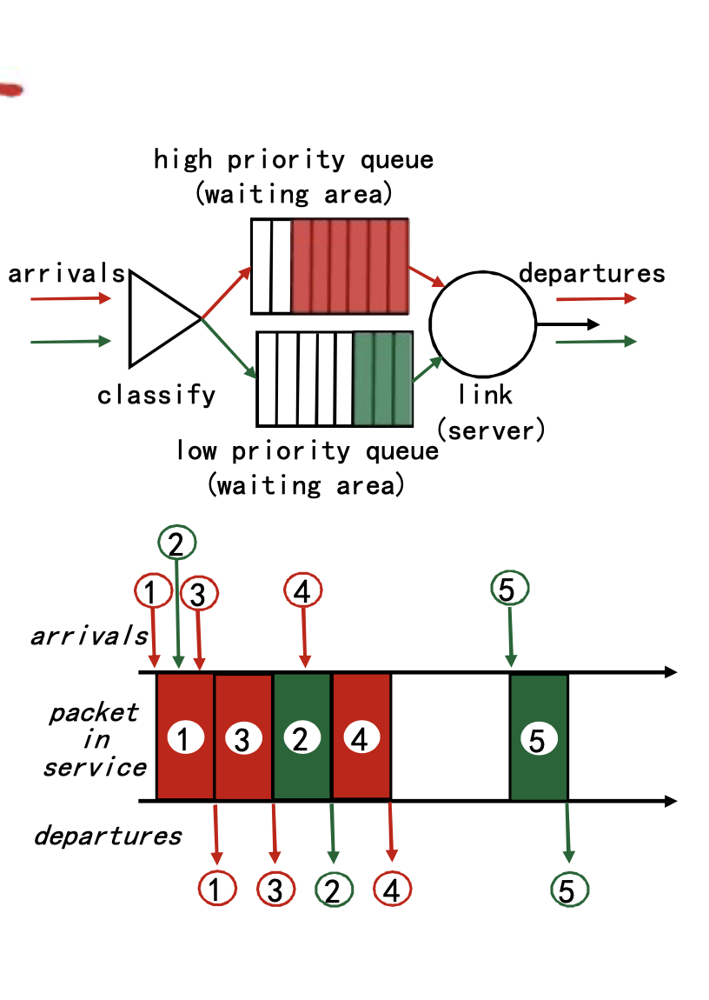

# 📘 4.1 路由器组成 (Router Composition)

> 来源说明：计算机网络（郑老师课程）第4章 4.2节 | 本节涵盖：路由器体系架构、输入/输出端口处理、交换结构、调度机制

---

## 🧠 核心概念总览（严格按原文顺序）

- [*知识点1: 网络层数据平面导论与路由器体系架构*](#id1)
- [*知识点2: 输入端口功能与分布式交换*](#id2)
- [*知识点3: 基于目标的转发与最长前缀匹配*](#id3)
- [*知识点4: 输入端口缓存与头阻塞*](#id4)
- [*知识点5: 交换结构与三种交换机构*](#id5)
- [*知识点6: 输出端口、排队与缓存大小*](#id6)
- [*知识点7: 调度机制与FIFO调度*](#id7)
- [*知识点8: 优先权调度*](#id8)
- [*知识点9: 循环调度(Round Robin)*](#id9)
- [*知识点10: 加权公平队列(WFQ)*](#id10)

---

## ✅ 知识点1: 网络层数据平面导论与路由器体系架构

**传统路由器组成与角色**
- **网络层** 功能分为两大平面：
  - **数据平面**：负责将数据报从输入链路转发到输出链路
  - **控制平面**：负责协调网络行为，生成路由表
- **路由器** 高层面体系架构包含核心组件：
  - **输入端口**：接收进入的分组
  - **输出端口**：发送出去的分组
  - **高速交换结构(high-speed switching fabric)**：连接输入和输出端口，实现分组转发
  - **路由处理器(routing processor)**： 
    1. 路由器通过路由选择算法/协议（如 **RIP, OSPF, BGP**）与邻居交换路由信息，独立计算生成**路由表**来掌握全网拓扑和最优路径
    2. 路由器再从路由表中提炼出「目的前缀→出接口」的映射，生成转发表并下发到输入端口硬件
  - ⚠️ 路由器实际上没有单独的输入与输出端口，通常整合在一起
  - ⚠️ **路由表 ≠ 转发表**，虽然密切相关，但转发表是路由表经过优化后下载到输入端口的实际查表结构
  

---

## ✅ 知识点2: 输入端口功能与分布式交换

**输入端结构流程**
- 输入端口内部处理流水线（从外到内）：
  1. **物理层处理**：**线路端接**，实现将物理信号转换为**Bit级的接收**
  2. **数据链路层处理**：**链路层协议动作、解封装**如判断哪里是帧头哪里是尾，例如 **Ethernet**（见第五章）
  3. **网络层查找/转发/排队**：查询转发表，决定输出端口，然后进入交换结构
- **分布式交换**：
  - 根据数据报头部的信息（如：**目的地址**），在输入端口内存中的转发表中查找合适的输出端口，即 **"匹配+行动"**
  - **基于目标的转发**：仅仅依赖于IP数据报的目标IP地址（传统方法）
  - **通用转发**：基于头部字段的任意集合进行转发（如SDN/OpenFlow思路）
- ⚠️ **核心机制**：转发表存放在**输入端口本地内存**中，而非集中式查询，这是实现高速转发的关键

**注意点**
- 🔄 **知识关联**：通用转发是SDN的核心思想，打破了传统仅按目的IP转发的限制，可基于源IP、端口、协议类型等任意字段转发

---

## ✅ 知识点3: 基于目标的转发与最长前缀匹配

**转发实现**
- **基于目标的转发**使用**转发表(Forwarding Table)**，将目的地址范围映射到链路接口：

| Destination Address Range | Link Interface |
|---|---|
| `11001000 00010111 00010000 00000000` 至 `11001000 00010111 00010111 11111111` | 0 |
| `11001000 00010111 00011000 00000000` 至 `11001000 00010111 00011000 11111111` | 1 |
| `11001000 00010111 00011001 00000000` 至 `11001000 00010111 00011111 11111111` | 2 |
| otherwise | 3 |

- **问题**：如果地址范围没有划分得特别规整，会发生什么？→ 需要更灵活的匹配方式
- **最长前缀匹配(Longest Prefix Matching)**：
  - 当给定目标地址查找转发表时，采用**最长地址前缀匹配**的目标地址表项
  - 使用通配符 `*` 表示"不关心"的比特位，使转发表更紧凑：

| Destination Address Range | Link Interface |
|---|---|
| `11001000 00010111 00010*** *********` | 0 |
| `11001000 00010111 00011000 *********` | 1 |
| `11001000 00010111 00011*** *********` | 2 |
| otherwise | 3 |

- **匹配示例**：
  - **DA**: `11001000 00010111 00010110 10100001` → 匹配前缀 `00010`（接口 **0**）
  - **DA**: `11001000 00010111 00011000 10101010` → 同时匹配 `00011000`（接口 **1**，更长前缀）和 `00011`（接口 **2**）→ 选择**最长前缀匹配：接口 1**
- **硬件实现**：路由器中经常采用 **TCAMs (Ternary Content Addressable Memories，三元内容可寻址存储器)** 完成
  - **内容可寻址(Content Addressable)**：将地址交给TCAM，它可以在**一个时钟周期**内检索出地址，不管表空间有多大
  - **Cisco Catalyst** 系列路由器：在TCAM中可存储多达约 **1百万条** 路由表项

**注意点**
- ⚠️ **核心原则**：最长前缀匹配是IP转发的基础，因为CIDR（无类别域间路由）导致地址空间划分不规整，无法用简单的范围查找
- 💡 **理解技巧**：想象查字典，先找最长能匹配的词根。比如地址 `192.168.1.1` 同时匹配 `192.168.1.0/24` 和 `192.168.0.0/16`，选更精确的 `/24`
- 📋 **术语提醒**：TCAM 中的 "Ternary(三元的)" 指每个比特可以是 0、1 或 *（通配/不关心），区别于普通CAM只能存0和1

---

## ✅ 知识点4: 输入端口缓存与头阻塞

**输入端常见两种问题**
- **输入端口排队**：
  - 当**交换机构** 的速率小于输入端口的汇聚速率时，在输入端口可能要排队
  - 后果：**排队延迟**以及由于**输入缓存溢出造成丢失**
- **队头阻塞(Head-of-the-Line, HOL Blocking)**：
  - 排在队头的数据报阻止了队列中其他数据报向前移动
  - **场景**：队头红色分组的目标输出端口正忙（被其他输入端口占用），导致后面绿色分组即使目标端口空闲，也无法通过交换结构
  - 一个分组时间后：绿色分组经历了头端阻塞，只能等待
  

**注意点**
- ⚠️ **关键限制**：HOL阻塞是输入端口缓存的固有问题，即使交换结构整体带宽足够，队头分组的输出端口冲突也会堵住后续分组

---

## ✅ 知识点5: 交换结构与三种交换机构

**交换机构概览**
- **交换结构**：将分组从输入缓冲区传输到合适的输出端口
- **交换速率**：分组可以按照该速率从输入传输到输出
  - 运行速度经常是输入/输出链路速率的若干倍
  - 若有 **N** 个输入端口，交换机构的交换速度是输入线路速度的 **N倍** 比较理想，才不会成为瓶颈
- **三种典型的交换机构**：

  **1. 通过软件方式基于内存的交换 —— 第一代路由器**
  - 在 **CPU** 直接控制下的交换，采用传统的计算机架构
  - 分组被拷贝到**系统内存**，CPU从分组头部提取目标地址，查找转发表，找到输出端口，再拷贝到输出端口
  - **瓶颈**：转发速率被内存带宽限制（数据报通过系统总线**BUS**两遍：入内存+出内存）
  - **限制**：一次只能转发一个分组
  

  **2. 通过总线交换**
  - 数据报通过**共享总线**，从输入端口转发到输出端口
  - **总线竞争**：交换速度受限于总线带宽
  - **限制**：1次处理一个分组（总线独占）
  - **实例**：1 Gbps bus (Cisco 1900)；32 Gbps bus (Cisco 5600) —— 对于接入或企业级路由器速度足够，但**不适合区域或骨干网络**
  

  **3. 通过互联网络交换 —— e.g., Crossbar**
  - **同时并发转发多个分组**，克服总线带宽限制
  - **Banyan（榕树）网络**、**Crossbar(纵横开关)** 和其它互联网络被开发，将多个处理器连接成多处理器系统
    - 当分组从端口A到达，转给端口Y；控制器短接相应的两个总线
    - Crossbar 也叫"纵横制交换"，通过 $N \times N$ 的交叉点矩阵，实现任意输入到任意输出的并发连接
  - **问题**：由于大小不一，每个数据报通过Crossbar的时间并不一样长，造成调度困难
  - **解决方案**：将数据报**分片**为固定长度的**信元(Cell)**，通过交换网络交换（类似ATM思想）
  - **实例**：**Cisco 12000** 以 **60 Gbps** 的交换速率通过互联网络
  

**注意点**
- ⚠️ **演进逻辑**：内存 → 总线 → 互联网络，本质是从"串行共享资源"向"并行专用路径"的演进
- 💡 **理解技巧**：内存交换像单车道收费站（CPU是收费员）；总线像单车道高架桥（一次过一辆）；Crossbar像立交桥（多车道同时通行）

---

## ✅ 知识点6: 输出端口、排队与缓存大小

**输出端口结构**
- **输出端口**功能（从内到外）：
  1. 从交换结构接收分组，存入**数据报缓**并排队等待转发
  2. **链路层协议发送**：封装成帧
  3. **线路端接**：物理层发送为物理信号
  
- **输出端口排队**：
  - 当数据报从交换机构的到达速度比传输速率快，就需要输出端口**缓存(Buffering)**
    - 由调度规则选择排队的数据报进行传输
  - 假设交换速率 $R_{switch}$ 是线路速率 $R_{line}$ 的 **N倍**（N为输入端口数量）
  - 当多个输入端口同时向同一输出端口发送时，缓冲该分组（交换网络到达速率超过输出速率则缓存）
  - **后果**：排队带来延迟，由于输出端口缓存溢出则**丢弃数据报**
  
- **需要多少缓存？**
  - **RFC 3439 拇指规则(经验性规则)**：平均缓存大小 = 典型的 **RTT**（例如：250ms）倍于链路容量 **C**
    - 例：$C = 10 \text{ Gbps}$，则 $250\text{ms} \times 10\text{Gbps} = 2.5 \text{ Gbit buffer}$
  - **最新推荐**：若有 **N**（非常大）个流，缓存大小应等于：
    $$\frac{RTT \cdot C}{\sqrt{N}}$$
    - 多流共享缓存时，所需缓存随流数增加而减少
    - 🔄 **知识关联**：RFC 3439 规则适用于少量TCP流；现代数据中心/骨干网流数极大，因此缓存可按 $\sqrt{N}$ 缩减，避免 bufferbloat

**注意点**
- ⚠️ **核心矛盾**：输出端口是网络拥塞的集中体现点，多个输入流汇聚到一个输出端口必然导致排队和丢包

---

## ✅ 知识点7: 调度机制与FIFO调度

**规则**
- **调度**：选择下一个要通过链路传输的分组
- **FIFO Scheduling —— 先到先服务**：
  - 按照分组到来的次序发送
  - 所有分组放入单一队列，无类别区分
- **丢弃策略** —— 当分组到达满的队列，哪个分组被抛弃？
  - **Tail Drop（尾部丢弃）**：丢弃**刚到达的分组**（最简单、最常用）
  - **Priority（优先权丢弃）**：根据优先权丢失/移除分组（保高丢低）
  - **Random（随机丢弃）**：随机地丢弃/移除分组（如 **RED, Random Early Detection** 思想）
  
  - ⚠️ **FIFO缺陷**：不区分流量类型，突发流量会挤占所有带宽，且尾部丢弃对TCP流不友好（引发全局同步）

---

## ✅ 知识点8: 优先权调度

**规则**
- **优先权调度**：发送最高优先权的分组
- **多类**：不同类别有不同的优先权
  - 类别可能依赖于标记或者其他的头部字段，例如：**IP source/dest**、**port numbers**、**ds (Differentiated Services)** 等
  - **传输规则**：先传高优先级的队列中的分组，除非高优先级队列为空
  - 高（低）优先权队列内部的分组传输次序：**FIFO**
- **现实生活中的例子？** —— 如VIP通道、急诊优先

- ⚠️ **饿死风险**：如果高优先级队列持续有分组到达，低优先级队列可能永远得不到服务

---

## ✅ 知识点9: 循环调度(Round Robin)

**理论**
- **Round Robin (RR) Scheduling —— 轮询调度**：
  - **多类**：将流量分为多个类别，每类一个队列
  - **循环扫描**：依次从不同类别的队列中各取一个分组发送，发送完一类的一个分组，再发送下一个类的一个分组，循环所有类
  - 每个类轮流获得发送机会，避免某一类独占链路
- **现实例子？** —— 如轮流发言、CPU时间片轮转
- ⚠️ **缺陷**：如果各类分组大小差异大（如某类全是1500B大包，某类全是64B小包），实际获得的带宽不等

**注意点**
- 💡 **理解技巧**：RR像老师轮流点每组派一个代表回答问题——每组都有机会，但大组（大包）实际占用时间更长

---

## ✅ 知识点10: 加权公平队列(WFQ)

**理论**
- **Weighted Fair Queuing (WFQ) —— 加权公平队列**：
  - **一般化的Round Robin**：在RR基础上引入权重，实现差异化带宽分配
  - **服务时间分配**：在一段时间 $t$ 内，每个队列 $i$ 得到的服务时间为：
    $$\frac{W_i}{\sum W_i} \times t$$
    即服务时间与**权重(Weight)** 成正比
  - 每个类在每一个循环中获得不同权重的服务量
  - **现实例子** —— 如股东按持股比例分红、按投资比例分配收益
  - ⚠️ **核心优势**：WFQ 是真正的"公平"——不仅轮流，还按权重精确分配带宽，兼顾了优先权和公平性
  

**注意点**
- 💡 **理解技巧**：WFQ像合伙开公司——不是每人轮流管一天（RR），而是按股份（权重）分配利润和决策权，大股东（高权重）多得但小股东（低权重）也有保底
- 🔄 **知识关联**：WFQ是QoS (Quality of Service) 的核心机制，现代路由器/操作系统调度器（如Linux CFS的灵感来源）广泛使用

---

## 🔑 核心要点总结

1. **路由器两大核心功能分离**：控制平面（路由，毫秒级软件计算路由表）与数据平面（转发，纳秒级硬件查表转发），转发表从路由表生成并下发到输入端口
2. **最长前缀匹配是IP转发的基石**：由于CIDR地址划分不规整，路由器使用TCAM硬件在单个时钟周期内完成最长前缀匹配
3. **交换结构的三代演进**：内存交换（CPU控制，单分组）→ 总线交换（共享带宽，单分组）→ 互联网络交换（Crossbar/Banyan，并发多分组，60Gbps+）
4. **排队与缓存的权衡**：输入端口有HOL阻塞问题，输出端口是拥塞集中点；缓存大小按 $RTT \cdot C / \sqrt{N}$ 设计，平衡延迟与利用率
5. **调度策略的演进**：FIFO（简单但不公平）→ Priority（区分服务但可能饿死）→ Round Robin（公平轮流但忽视包长差异）→ WFQ（按权重精确分配带宽，兼顾效率与公平）

## 📌 考试速记版

| 概念 | 一句话速记 |
|---|---|
| **路由 vs 转发** | 路由是算路（控制平面），转发是查表丢包（数据平面） |
| **最长前缀匹配** | 查表选最"精确"的，靠TCAM硬件加速 |
| **HOL阻塞** | 队头分组堵路，后面分组干等 |
| **三种交换结构** | 内存（CPU串行）→ 总线（共享串行）→ Crossbar（并行并发） |
| **缓存公式** | 老规则：$RTT \times C$；新规则：$RTT \cdot C / \sqrt{N}$ |
| **四种调度** | FIFO（先来先走）→ Priority（VIP先走）→ RR（轮流走）→ WFQ（按股份走） |

**记忆口诀**：
> "路由算路转发跑，纳秒查表毫秒脑；前缀最长TCAM找，Crossbar并发好；输入HOL输出堵，缓存RTT乘C除根号N；FIFO简单Priority狠，Round Robin公平WFQ准。"