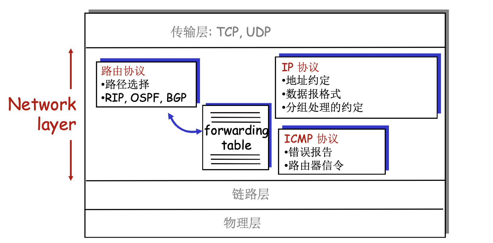
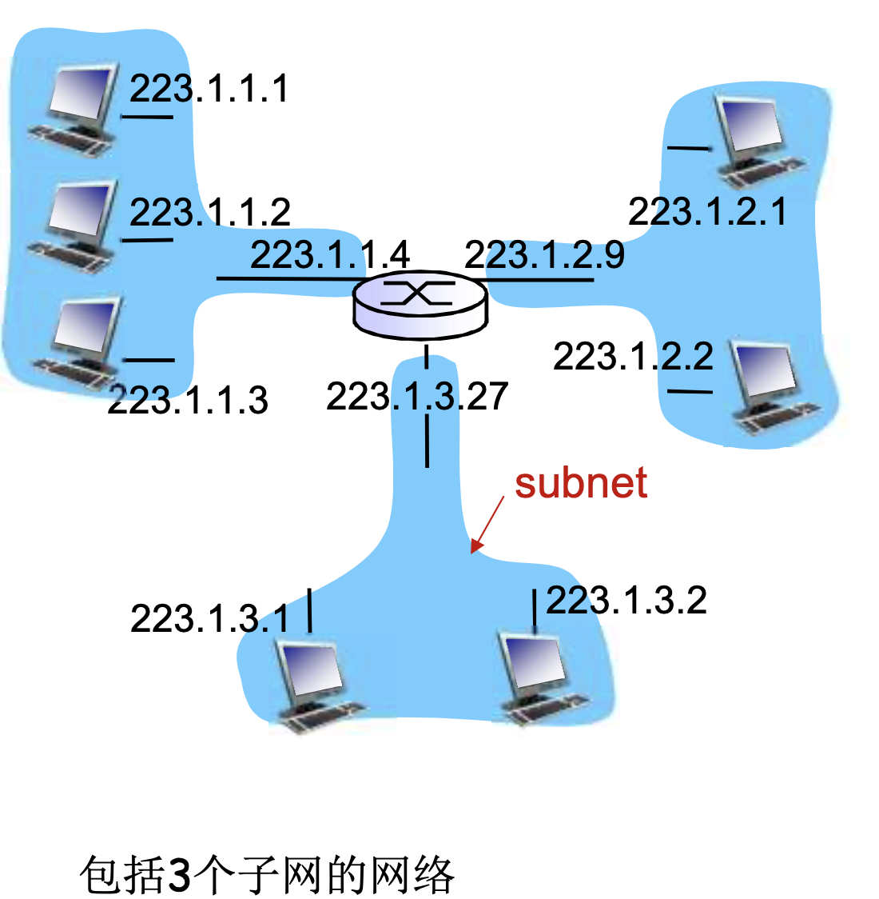
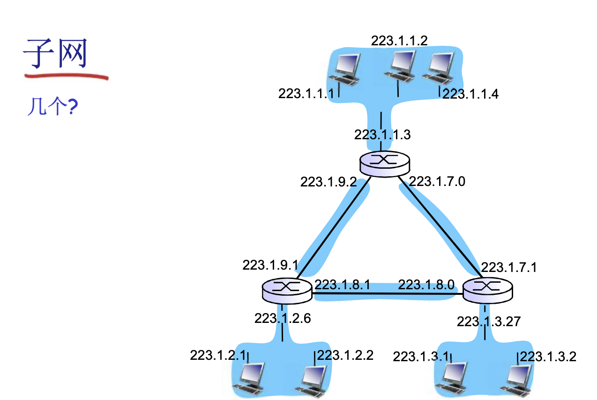
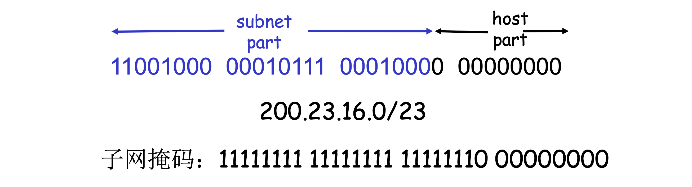
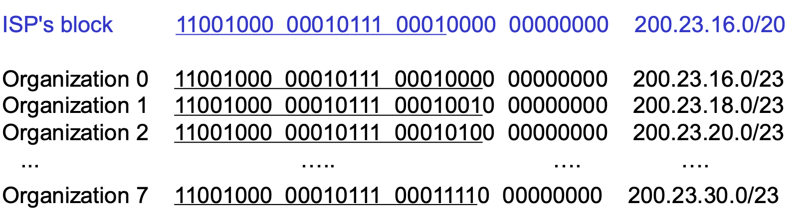
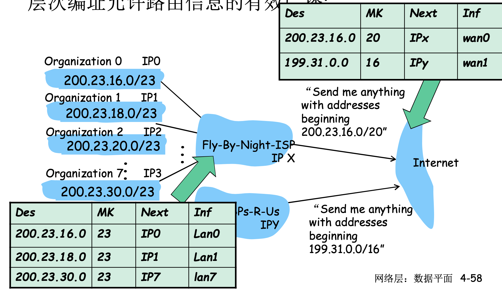
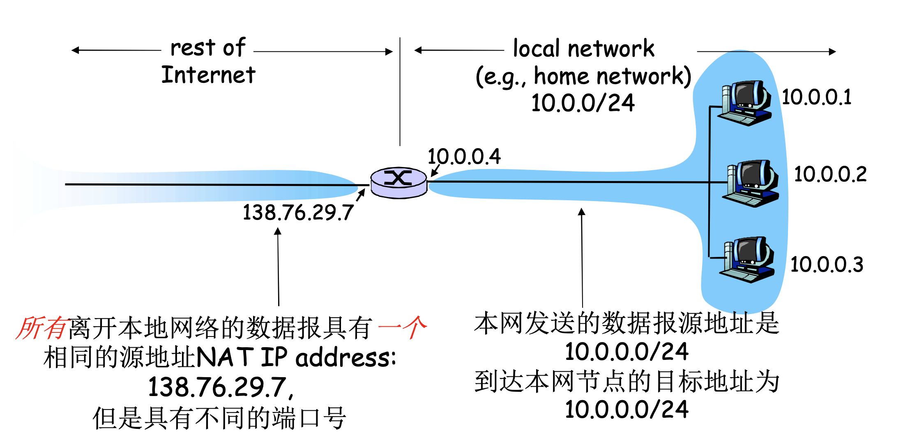

# 📘 4.3 IP协议（Internet Protocol）

> 来源说明：计算机网络（郑烇老师课程）第4章 4.3节 | 本节涵盖：IP数据报格式、分片与重组、IPv4编址、DHCP、NAT、IPv6

---

## 🧠 核心概念总览（严格按原文顺序）

- [*知识点1: 互联网的网络层功能与IP数据报格式*](#id1)
- [*知识点2: IP分片与重组机制*](#id2)
- [*知识点3: IP编址基础——接口与子网概念*](#id3)
- [*知识点4: 子网判断、IP地址分类与特殊地址*](#id4)
- [*知识点5: 私有IP地址、CIDR与子网掩码*](#id5)
- [*知识点6: 转发表与转发算法*](#id6)
- [*知识点7: DHCP动态主机配置协议*](#id7)
- [*知识点8: 层次编址——ISP分配、路由聚集与ICANN*](#id8)
- [*知识点9: NAT网络地址转换——动机与实现*](#id9)
- [*知识点10: NAT的争议与NAT穿越问题*](#id10)
- [*知识点11: IPv6动机、头部格式与主要变化*](#id11)
- [*知识点12: IPv4到IPv6过渡——隧道技术与应用现状*](#id12)

---

## ✅ 知识点1: 互联网的网络层功能与IP数据报格式

主机和路由器中的网络层(Network Layer)功能主要包括：

- **路由协议**：路径选择，如 **RIP**、**OSPF**、**BGP**
- **IP协议**：地址约定、数据报格式、分组处理的约定
- **ICMP协议**：错误报告、路由器信令、pin某个地址测试
- **转发表**：根据路由协议生成的表，用于实际分组转发

**IP数据报格式(IPv4)**

- IP数据报头部为 **32 bits** 固定宽度结构，主要字段按原文顺序如下：

  | 字段 | 长度 | 说明 |
  |------|------|------|
  | `ver` | 4 bits | IP协议版本号 |
  | `head len` | 4 bits | 头部长度(bytes) |
  | `type of service` | 8 bits | 数据类型/服务类型 |
  | `length` | 16 bits | 数据报总长(bytes) |
  | `16-bit identifier` | 16 bits | 标识符，分片/重组使用 |
  | `flags` | 3 bits | 分片标志 |
  | `fragment offset` | 13 bits | 分片偏移量 |
  | `time to live` | 8 bits | 最大剩余段数（TTL），在每个路由器中减一，减为0后抛弃 |
  | `upper layer` | 8 bits | 上层协议，指示将载荷交付给哪个协议(给TCP or UDP?) |
  | `Internet checksum` | 16 bits | 头部校验和 |
  | `source IP address` | 32 bits | 源IP地址 |
  | `destination IP address` | 32 bits | 目的IP地址 |
  | `Options` | 可变 | 可选字段（如时戳、记录所经过路由器的列表） |
  | `data` | 可变 | 有效载荷（通常是TCP段或UDP段） |

- IP数据报传输TCP段时，头部总共有 **40 bytes + 应用层开销**
  - 20 bytes of TCP
  - 20 bytes of IP
- `fragment offset` 和 `flags` 专门用于分片/重组(Fragmentation & Reassembly)
- `time to live` (TTL) 防止数据报在网络中无限循环

**注意点**
- ⚠️ **头部长度限制**：IP头部最小20字节（无Options时），Options可增加长度

---

## ✅ 知识点2: IP分片与重组机制

网络链路有 **MTU(Maximum Transmission Unit，最大传输单元)** —— 链路层帧所能携带的最大数据长度。不同链路类型具有不同的MTU。

- 大的IP数据报在网络上被**分片("fragmented")** 才能载入到不同链路的MTU中
  - 一个数据报被分割成若干个小的数据报
    - 这些分片具有**相同的ID**、**不同的偏移量(offset)**
    - **最后一个分片标记为0**（`fragflag=0`），其余为1
- **重组("Reassembly")** 只在最终的目标主机进行
- IP头部的信息被用于标识、排序相关分片

**教材示例：分片计算实例**

原始数据报：4000字节（20字节头部 + 3980字节数据），MTU = 1500 bytes

| 分片 | 总长度 | 头部 | 数据 | ID | fragflag | offset |
|------|--------|------|------|----|----------|--------|
| 第一片 | 1500 | 20 | 1480 | =x | 1 | 0 |
| 第二片 | 1500 | 20 | 1480 | =x | 1 | 185 |
| 第三片 | 1040 | 20 | 1020 | =x | 0 | 370 |

- **偏移量计算**：偏移以 **8字节为单位**
- ⚠️ **8字节对齐**：`fragment offset` 以8字节为单位，因此每个分片的数据部分（除最后一片）必须是8字节的倍数
  - 第一片：0
  - 第二片：1480 / 8 = **185**
  - 第三片：2960 / 8 = **370**
- **分片要copy**: 每个MTU头部都需要将原始数据报的头部给copy作为自己的头部

💡 **理解技巧**：
  - MTU限制的是链路层帧的**总载荷**，但分片时每个小数据报也有自己的20字节IP头部
  - **路由器只分片，不重组**：重组操作仅在目的主机完成

---

## ✅ 知识点3: IP编址基础——接口与子网概念

**IP地址**：32位标示，对**主机或路由器的接口** 编址。

- **接口**：主机/路由器和物理链路的连接处
  - 路由器通常拥有**多个接口**(2个及以上)
  - 主机也可能有多个接口
  - **一个IP地址和一个接口相关联**（不是和主机/路由器整体关联）

**接口的连接方式**
- 有线以太网网口：通过以太网交换机连接
- 无线WiFi接口：通过WiFi基站连接
- **现阶段**：无需担心子网内部一个接口是如何接到另一个接口（中间没有路由器）— 5，6章会学习

**子网(Subnets)**
- IP地址分为两部分：
  - **子网部分(Subnet Part)**：高位bits
  - **主机部分(Host Part)**：低位bits
- **什么是子网？** 一个子网内的节点（主机或路由器）它们的**IP地址的高位部分相同**，这些节点构成的网络的一部分叫做子网
- **核心特征**：**无需路由器介入，但可借助交换机**，子网内各主机可以在物理上相互直接到达（IP层面一跳可达）

💡 **理解技巧**：看IP地址是否属于同一子网，关键看高位是否相同——相同则直连互通，不同则需要路由器转发

---

## ✅ 知识点4: 子网判断、IP地址分类与特殊地址

**子网判断方法**
- 要判断一个子网，将每一个接口从主机或路由器上分开，构成了一个个网络的**孤岛**
- 每一个孤岛（网络）都是一个都可以被称之为 **subnet**
  - 内部每个IP地址前缀一样
  - 转发在IP层面内部一跳可达

- **回答**：3个，223.1.1，223.1.2，223.1.3
- **子网聚集**：ISP把多个连续的小子网合并成一个大前缀对外广播，让上游路由器只用记一条路由，大幅减少路由表条目。

  - **纯子网**：直接分配给某个组织实际使用的具体子网，是挂载主机的"叶子"网络。

  - **非纯子网**：覆盖多个纯子网的聚合地址块，本身不直接给终端使用，只用于路由表中做汇总通告。
- 子网掩码(Subnet Mask)：`/24` 表示前24位为子网部分，即 `255.255.255.0`，二进制为 `11111111 11111111 11111111 00000000`

**IP地址分类(Classful Addressing)**

- **地址范围计算**：A类的`Network`有7个bits，`host`有24个bits
- **减2的含义**：网络层约定全0和全1的地址不可用

  | 类别 | 前缀 | 网络数 | 主机数 | 地址范围 |
  |------|------|--------|--------|----------|
  | **Class A** | 0 | $2^7 - 2=$126  | $2^{24} - 2 = $16 million  | 1.0.0.0 ~ 127.255.255.255（单播） |
  | **Class B** | 10 | 16382  | 64 K  | 128.0.0.0 ~ 191.255.255.255（单播） |
  | **Class C** | 110 | 2 million  | 254  | 192.0.0.0 ~ 223.255.255.255（单播） |
  | **Class D** | 1110 | — | — | 224.0.0.0 ~ 239.255.255.255（multicast，多播） |
  | **Class E** | 11110 | — | — | 240.0.0.0 ~ 247.255.255.255（reserved for future，保留） |
  

- **爆炸数量的IP地址数**：互联网的路由是由网络（`Network`）为单位来做网络信息的发布与计算，还可以进一步通过子网聚集来减少计算量
  - 直到到了子网的路由器，再继续到目标IP的最后一跳（交换机完成）
- **单播地址**：一对一通信，数据报从一个源主机精确送达**一个**目的主机。
- **多播地址**：一对多通信，数据报从一个源主机同时送达**一组**订阅了该地址的目的主机（如视频会议、直播）。
  - D类（1110开头）专门划给多播，是因为IP设计时把A/B/C类留给点对点单播，用最高位前缀区分用途，路由器看到1110就知道要复制分组给一组接收者。
- **A/B/C类IP路由表查找非常方便**：路由器看 IP 首字节自动判定 A/B/C 类，通过默认掩码切出网络号去查路由表中对应表项，按照这个表项规定的端口号将数据报打出

**特殊IP地址**

| 类型 | 二进制特征 | 含义 |
|------|------------|------|
| 本网络 | 子网部分全为0 | 本网络 |
| 本主机 | 主机部分全为0 | 本主机(A host on this network) |
| 广播地址 | 主机部分全为1 | 广播(Broadcast)，这个网络的所有主机 |
| 远端广播 | 网络部分特定，主机部分全1 | 远端网络广播 |
| 回环地址 | 127.x.x.x | Loopback（本地测试） |

**注意点**

- 📋 **术语提醒**：传统的分类编址(Classful)已被CIDR取代，但分类概念仍用于理解地址空间划分

---

## ✅ 知识点5: 私有IP地址、CIDR与子网掩码

**内网(专用)IP地址(Private/专用地址)**
- 地址空间的一部分供专用地址使用，**永远不会被当做公用地址来分配**，不会与公用地址重复
- 只在局部网络中有意义，区分不同的设备
- **路由器不对目标地址是专用地址的分组进行转发**

| 类别 | 专用地址范围 | 掩码 |
|------|-------------|------|
| Class A | 10.0.0.0 ~ 10.255.255.255 | 255.0.0.0 (/8) |
| Class B | 172.16.0.0 ~ 172.31.255.255 | 255.255.0.0 (/12) |
| Class C | 192.168.0.0 ~ 192.168.255.255 | 255.255.255.0 (/16) |
- ⚠️ **私有地址不可路由**：因特网上的路由器看到目的地址是私有地址时，会丢弃该分组

**CIDR(Classless InterDomain Routing，无类域间路由)**
- **按类划分的痛点**：地址浪费严重且路由表爆炸：A类太大（1600万主机）多数组织用不完，C类太小（254台）又不够，B类很快耗尽
- 子网部分可以在**任意的位置**按需划分，打破传统A/B/C类的固定边界
- 地址格式：**`a.b.c.d/x`**，其中 **x** 是地址中子网号的长度（前缀长度）

- 无类(CIDR)路由方式：路由表每项自带掩码，将目的 IP 与掩码**按位与**后匹配网络前缀，不再依赖 A/B/C 类，只看前缀长短做最长匹配。
- 💡 **CIDR核心意义**：允许更灵活的地址分配，通过路由聚集减少路由表规模

**子网掩码(Subnet Mask)**
- 32 bits，每一位为0或1
  - **1**：该bit位置表示子网部分
  - **0**：该bit位置表示主机部分
- 原始A/B/C类网络的默认子网掩码：
  - A: `255.0.0.0`
  - B: `255.255.0.0`
  - C: `255.255.255.0`

---

## ✅ 知识点6: 转发表与转发算法

路由器使用**转发表(Forwarding Table)** 来决定数据报的输出接口。转发表的基本结构：

| Destination Subnet Num | Mask | Next hop | Interface |
|------------------------|------|----------|-----------|
| 202.38.73.0 | 255.255.255.192 | IPx | Lan1 |
| 202.38.64.0 | 255.255.255.192 | IPy | Lan2 |
| ... | ... | ... | ... |
| Default | - | IPz | Lan0 |

**转发算法**
1. 获得IP数据报的目标地址
2. 对于转发表中的每一个表项：
   - 计算：`(IP Des addr) & (mask) == destination`
   - 若相等，则按照该表项对应的接口转发该数据报
   - 转发表中目标子网中主机号被置为0，因为并转发中主机号没有用
   - 只有最后一跳才有用
3. 如果都没有找到，则使用**默认表项(Default)** 转发数据报（有默认网关）

**注意点**
- ⚠️ **最长前缀匹配(Longest Prefix Matching)**：当多个表项匹配时，选择前缀最长（即子网掩码中1最多）的那一项
- 💡 **理解技巧**：转发本质是"按位与"运算——目的IP和掩码逐位相与，结果等于表项中的网络地址即命中
- 🔄 **知识关联**：转发表由路由协议（如RIP、OSPF、BGP）生成，属于**数据平面**；路由协议运行属于**控制平面**

---

## ✅ 知识点7: DHCP动态主机配置协议

**如何获得一个IP地址?**
- **手动配置**：系统管理员将地址配置在文件中
  - Wintel: `control-panel -> network -> configuration -> tcp/ip -> properties`
  - UNIX: `/etc/rc.config`
- **DHCP(Dynamic Host Configuration Protocol)**：从服务器中动态获得IP地址，即 **"plug-and-play"**

**DHCP目标**
- 允许主机在加入网络时，**动态地从服务器获得IP地址**
- 可以更新对主机在用IP地址的租用期（租期快到了）
- 重新启动时，允许重新使用以前用过的IP地址
- 支持移动用户加入该网络（短期在网）

**DHCP工作概况——四步握手**
1. 主机上线时**广播`DHCP discover`** 报文[可选]：有活着的DHCP server吗？
    - **源地址用 `0.0.0.0`**（因为主机还没分配到IP），**目的地址用广播 `255.255.255.255`**（因为不知道DHCP服务器在哪，只能全网喊）。
2. DHCP服务器用 **`DHCP offer`** 提供报文响应[可选] (单播)
3. 主机请求IP地址：发送 **`DHCP request`** 报文（单播）
4. DHCP服务器发送地址： **`DHCP ack`** 报文表并设立租用时间 （单播）

- 💡 **理解技巧**：DHCP过程类似"租房"——先广播找房(discover)，房东报价(offer)，租客确认(request)，签合同交钥匙(ack)

**DHCP返回的信息（不仅仅是IP地址）**
- IP地址
- 第一跳路由器的IP地址（**默认网关，Default Gateway**）
- DNS服务器的域名和IP地址
- 子网掩码（指示地址部分的网络号和主机号）
- 📋 **术语提醒**：`yiaddr`（your IP address）在DHCP报文中表示分配给客户端的IP地址

**DHCP封装与传输实例**
- DHCP请求通过UDP服务被封装在**UDP段**中，封装在 **IP数据报** 中，封装在 **以太网帧** 中
- 以太网帧在局域网范围内**广播**（dest: `FFFFFFFFFFFF`），被运行DHCP服务的路由器收到
- 以太网帧解封装成IP，IP解封装成UDP，UDP解封装成DHCP

- ⚠️ **DHCP是应用层协议**：虽然为网络层提供地址配置服务，但实现上属于应用层，使用UDP传输

---

## ✅ 知识点8: 层次编址——ISP分配、路由聚集与ICANN

Question: **如何获得一个网络的子网部分？**
- 从 **ISP**获得地址块中分配一个小地址块
- 示例：
  - ISP拥有 `200.23.16.0/20`，可将其细分为多个 `/23` 的子块分配给不同组织
  - 从 /20 到 /23 多固定了 3 个 bit 当子网位，2³ = 8 种组合，正好把 4096 个 IP 切成 8 个各含 512 个地址的 /23 子网。

**层次编址：路由聚集(Route Aggregation)/子网聚集**
- 层次编址允许路由信息的**有效广播**
  - 子网可以对路由器进行IP地址通告，路由器整合后再向上游路由器通告（广播）
- ISP可以对外通告一个**聚合后的前缀**，而不需要通告所有细分子网
  - 例如：Fly-By-Night-ISP 对外通告 `200.23.16.0/20`，涵盖其下所有组织的细分子网
  - 这样上游路由器的路由表只需一条记录，而非多条进行查找路由
  
- 减少路由信息的数量，和计算的代价

**特殊路由信息**
- 当存在更具体的路由表项时，**优先匹配更具体的前缀**（最长前缀匹配）
- 示例：某组织 `200.23.18.0/23` 虽然被包含在 `200.23.16.0/20` 中，但如果单独通告，其他路由器会优先匹配 `/23` 的精确路由

Question: **一个ISP如何获得地址块？**
Answer: 
1. **ICANN(Internet Corporation for Assigned Names and Numbers)**
2. ICANN 作为互联网地址的最高管理机构，将大块的 IP 地址空间分配给各级 ISP，ISP 再从中切分小块给下游组织或用户。
- 互联网名称与数字地址分配机构
- 职责：
  - 分配地址
  - 管理DNS
  - 分配域名，解决冲突

**注意点**
- ⚠️ **路由聚集的本质**：用层次结构压缩路由表，减少全球路由表条目数
- 🔄 **知识关联**：CIDR的灵活前缀划分是路由聚集的技术基础
- 💡 **理解技巧**：ISP分配地址就像"批发生意"——ISP拿大块，切小块卖给客户；路由聚集就像"统一发货"，对外只报大类

---

## ✅ 知识点9: NAT网络地址转换——动机与实现

**NAT(Network Address Translation，网络地址转换)**

**动机**
- 本地网络只有一个有效IP地址（公网IP）
- **省钱**：不需要从ISP分配一块地址，可用一个IP地址用于所有局域网设备
- **灵活**：可以在局域网改变设备地址而无须通知外界；可以改变ISP而不改变内部设备地址
- **安全**：局域网内部设备没有明确的公网地址，对外不可见

**实现：NAT路由器必须执行的操作**
- **外出数据包(Outgoing Packets)**：
  - 替换**源地址和端口号**为NAT IP地址和新的端口号
  - 目标IP和端口**不变**
  - 远端的C/S将会用NAT IP地址、新端口号作为目标地址
- **维护NAT转换表(NAT Translation Table)**：
  - 记住每个转换替换对：`源IP, 端口` vs `NAT IP, 新端口`
- **进入数据包(Incoming Packets)**：
  - 替换**目标IP地址和端口号**
  - 采用存储在NAT表中的mapping表项，映射回 `(源IP, 端口)`

**教材示例**
- 主机 `10.0.0.1:3345` 访问外网 `128.119.40.186:80`
- NAT路由器（公网IP `138.76.29.7`）将其转换为 `138.76.29.7:5001`
- 返回数据报目标为 `138.76.29.7:5001`，NAT查表映射回 `10.0.0.1:3345`

**16-bit端口字段**
- 支持 **6万多个** 同时连接，一个局域网共享一个公网IP

**注意点**
- ⚠️ **NAT工作在传输层边界**：虽然NAT通常运行在路由器上，但它需要查看并修改传输层的端口号（第4层信息）
- 📋 **术语提醒**：NAT转换表中的映射通常是**动态生成**的，外出流量触发建立，一段时间无活动后删除

---

## ✅ 知识点10: NAT的争议与NAT穿越问题

**对NAT的争议**
- **违反分层原则**：路由器应该只对第3层（网络层）做信息处理，而NAT对**端口号（第4层传输层）** 作了处理
- **违反端到端原则(End-to-End Principle)**：复杂性应放到网络边缘，无需借助中转和变换就可以直接传送到目标主机。NAT打破了这种透明性。
- **应用层适配**：NAT可能要被一些应用设计者考虑（如 **P2P applications**）
- **连接方向限制**：外网的机器**无法主动连接**到内网的机器上
- **IPv6可解决地址短缺**：NAT的根本动机（IPv4地址不足）可通过IPv6解决

**NAT穿越问题(NAT Traversal)**
如果客户端需要连接位于NAT后面的服务器，如何操作？

- **方案1：静态配置NAT**
  - 手动配置端口映射：转发进来的对服务器特定端口连接请求
  - 示例：`(138.76.29.7, port 2500)` 总是转发到 `10.0.0.1 port 25000`

- **方案2：UPnP IGD(Universal Plug and Play Internet Gateway Device)**
  - 允许NATted主机：
    - 获知网络的公共IP地址（如 `138.76.29.7`）
    - 列举存在的端口映射
    - 增加/删除端口映射（在租用时间内）
  - 即**自动化静态NAT端口映射配置**

- **方案3：中继(Relay)**
  - 如 **Skype** 所使用
  - NAT后面的服务器建立和中继的连接
  - 外部的客户端链接到中继
  - 中继在2个连接之间桥接（转发数据）

**注意点**
- ⚠️ **NAT的"原罪"**：它破坏了互联网"端到端透明"的架构原则，导致P2P、VoIP等应用需要额外机制打洞
- 💡 **理解技巧**：NAT穿越就像"打电话进小区"——小区只有一个总机号(NAT公网IP)，要找到具体住户(内网主机)，需要查号台(静态映射)、自动查号(UPnP)或总机转接(中继)

---

## ✅ 知识点11: IPv6动机、头部格式与主要变化

**理论**

**IPv6的动机**
- **初始动机**：32-bit地址空间将会被很快用完（IPv4地址枯竭）
- **另外动机**：
  - **头部格式改变帮助加速处理和转发**：简化路由器对每个数据报的处理（如TTL减1、头部checksum、分片等操作）
  - **头部格式改变帮助QoS(Quality of Service)**：支持流量优先级管理

**IPv6数据报格式**
- **固定的40字节头部**：处理更快，路由器无需处理变长头部
- **数据报传输过程中，不允许分片**：中间路由器不再分片，分片工作交由源主机或不再进行

**IPv6头部字段(Cont)**
- **Priority**：标示流中数据报的优先级
- **Flow Label**：标示数据报在一个 **"flow"** 中（"flow"的概念没有被严格的定义，用于标识需要特殊处理的数据序列）
- **Next Header**：标示上层协议（类似IPv4的protocol字段）
- **Payload Len**：载荷长度
- **Hop Limit**：跳数限制（类似IPv4的TTL）
- **Source Address / Destination Address**：各 **128 bits**（IPv6地址长度是IPv4的4倍）

**和IPv4的其它变化**
- **Checksum**：**被移除掉**，降低在每一段（每个路由器）中的处理速度。端到端的差错检测由上层（TCP/UDP）负责。
- **Options**：允许，但是在头部之外，被 **"Next Header"** 字段标示（通过链式扩展头部实现）
- **ICMPv6**：ICMP的新版本
  - 附加了报文类型，如 **"Packet Too Big"**（用于替代IPv4的分片相关ICMP）
  - 多播组管理功能

**注意点**
- ⚠️ **不允许中间分片**：IPv6路由器收到过大数据报时，丢弃并发送"Packet Too Big" ICMPv6报文，由源主机重发较小数据报
- 📋 **术语提醒**：IPv6地址长度为 **128 bits**，地址空间为 $2^{128}$，远大于IPv4的 $2^{32}$
- 🔄 **知识关联**：IPv6的"Next Header"机制替代了IPv4的Options字段，使基本头部保持固定40字节

---

## ✅ 知识点12: IPv4到IPv6过渡——隧道技术与应用现状

**理论**

**从IPv4到IPv6的平移**
- **不是所有路由器都能同时升级**：没有一个标记日 **"flag days"**（即不可能在某一天全球同时切换）
- **问题**：在IPv4和IPv6路由器混合时，网络如何运转？

**隧道(Tunneling)**
- **核心思想**：在IPv4路由器之间传输的IPv4数据报中**携带IPv6数据报**
- **逻辑视图 vs 物理视图**：
  - 逻辑上：IPv6路由器A-B-E-F直接相连，全程走IPv6
  - 物理上：中间可能经过IPv4路由器C-D
- **实现方式**：将完整的IPv6数据报作为IPv4数据报的 **payload（载荷）** 进行封装
  - IPv4头部字段：源/目的IPv4地址
  - IPv4 payload：完整的IPv6头部 + IPv6 payload（UDP/TCP payload）
  - 当IPv6数据报到达隧道出口（下一个IPv6路由器）时，解封装恢复原始IPv6数据报

**IPv6应用现状**
- **Google**：8%的客户通过IPv6访问谷歌服务
- **NIST**：全美国1/3的政府域支持IPv6
- **部署估计**：估计还需要很长时间进行部署（**20年以上**！）
- 对比过去20年应用层面的变化（WWW, Facebook, streaming media, Skype...），网络基础设施的升级周期远慢于应用层创新

**注意点**
- ⚠️ **隧道技术的本质**：一种"借壳上市"——IPv6数据报借IPv4的壳穿过不支持IPv6的网络区域
- 💡 **理解技巧**：隧道就像"外语包裹"——A国寄包裹给F国，中间经过C、D两国不懂A国语言，于是把A国信件装进C、D两国通用的信封里运输，到了E国再拆开取出原信件
- 📋 **术语提醒**：**Dual Stack（双栈）** 和 **Tunneling（隧道）** 是IPv4/IPv6共存的两大核心技术

---

## 🔑 核心要点总结

1. **IP数据报与分片**：IP数据报头部固定20字节+可选Options；当数据报超过链路MTU时，路由器将其分片，目的主机根据ID、offset、flags重组，偏移量以8字节为单位。
2. **编址与CIDR**：IP地址属于接口而非主机；CIDR用`a.b.c.d/x`灵活划分子网，支持路由聚集压缩全球路由表；私有地址（10/8, 172.16/12, 192.168/16）仅在本地有效。
3. **DHCP即插即用**：通过Discover→Offer→Request→Ack四步广播握手，主机动态获取IP、网关、DNS、子网掩码，属于应用层协议。
4. **NAT的利弊**：通过端口映射让多设备共享一个公网IP，节省地址且隐藏内网，但破坏了端到端透明性；穿越方案包括静态映射、UPnP自动配置和中继转发。
5. **IPv6的变革**：128位地址解决枯竭问题；固定40字节头部、移除头部checksum、中间路由器不允许分片、用Next Header链式扩展选项；通过隧道技术穿越IPv4网络实现渐进部署。

## 📌 考试速记版

- **IP头部关键字段**：TTL（每跳减1）、Checksum（仅头部）、Fragment Offset（8字节为单位）、Protocol/Upper Layer（指示TCP/UDP）
- **分片三要素**：相同ID、不同Offset、最后一片Flags=0
- **特殊地址**：主机全0=本主机，主机全1=广播，127.x.x.x=回环，10/172.16/192.168=私有
- **CIDR vs Classful**：CIDR前缀长度任意，支持路由聚集；Classful固定A(/8)/B(/16)/C(/24)
- **DHCP四步**：D→O→R→A（Discover→Offer→Request→Ack），全部广播
- **NAT转换**：出包改源IP+端口，进包改目的IP+端口，靠NAT表映射，16位端口支持6万+并发
- **IPv6 vs IPv4**：128位地址、40字节固定头部、无头部Checksum、不中间分片、Next Header替代Options和Protocol

**记忆口诀**：
> **MTU超限要分片，ID相同偏移变，末片标志写个零，目的主机来重组。**
> **DHCP四步拿地址，DO握手RA确认，网关DNS掩码齐，即插即用真方便。**
> **NAT一出省地址，端口映射藏内网，端到端性被打破，IPv6隧道来帮忙。**