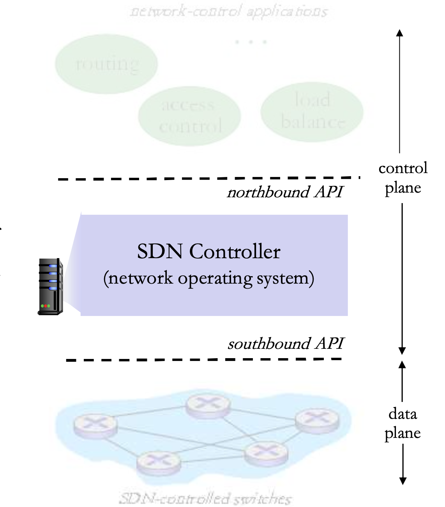
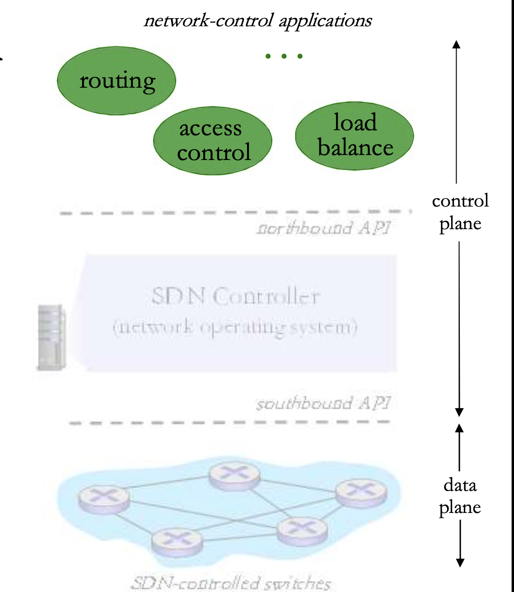
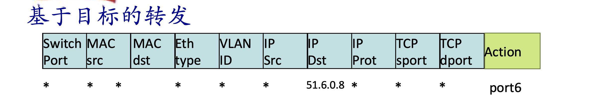
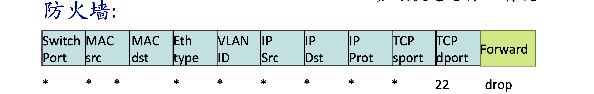
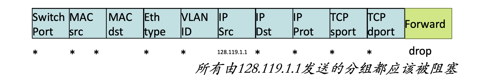
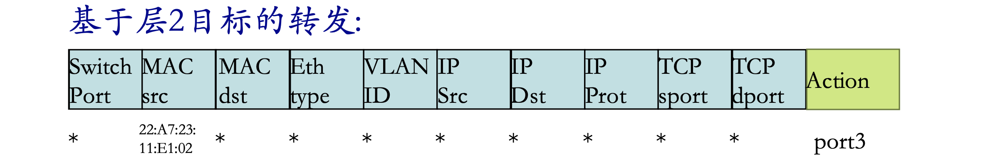

# 📘 4.4 通用转发和SDN (Generalized Forwarding and SDN)

> 来源说明：计算机网络 4.4节 | 本节涵盖：数据平面与控制平面的分离、SDN架构、OpenFlow流表与通用转发机制

---

## 🧠 核心概念总览（严格按原文顺序）

- [*知识点1: 网络层功能的数据平面与控制平面*](#id1)
- [*知识点2: 传统控制平面：每路由器实现方式*](#id2)
- [*知识点3: 中间盒与传统网络设备控制平面的问题*](#id3)
- [*知识点4: SDN起源：逻辑上集中的控制平面*](#id4)
- [*知识点5: SDN主要思路与PC演变类比*](#id5)
- [*知识点6: SDN优势：开放生态与管理便利*](#id6)
- [*知识点7: 传统流量工程的困难*](#id7)
- [*知识点8: SDN特点总结*](#id8)
- [*知识点9: SDN架构：数据平面交换机*](#id9)
- [*知识点10: SDN架构：SDN控制器*](#id10)
- [*知识点11: SDN架构：控制应用*](#id11)
- [*知识点12: 通用转发与流表机制*](#id12)
- [*知识点13: OpenFlow流表结构与匹配字段*](#id13)
- [*知识点14: OpenFlow转发实例：基于目标与层2*](#id14)
- [*知识点15: OpenFlow抽象：统一网络设备功能*](#id15)

---

## ✅ 知识点1: 网络层功能的数据平面与控制平面

网络层功能分为两大核心组件：

- **转发(Forwarding)**：对于从某个端口到来的分组，转发到合适的输出端口。类比于旅行中**一个多岔路口的进入和转出过程**。
- **路由(Routing)**：决定分组从源端到目标端的路径。类比于**规划从源到目标的旅行路径**，涉及**路由算法(Routing Algorithm)**。

**数据平面(Data Plane)** 与 **控制平面(Control Plane)** 的区分：
- **数据平面**：本地的、每个路由器的功能。决定某个从某个端口进入的分组从哪个端口输出，即**转发功能**。通过查询本地转发表(Local Forwarding Table)完成：到达分组头部字段值(values in arriving packet header) → 本地转发表 → 输出链路(output link)。
- **控制平面**：网络范围的逻辑。决定分组端到端穿行于各个路由器的路径。

---

## ✅ 知识点2: 传统控制平面：每路由器实现方式

**理论**

**每个路由器(Per Router)的控制平面**是传统IP实现方式的核心特征：

- 每个路由器上都有实现路由算法的元件（它们之间需要相互交互），形成传统IP实现方式的控制平面。
- **三大特点**：
  1. 每台设备上既实现控制功能，又实现数据平面功能。
  2. 控制功能分布式实现（各路由器独立运行路由算法并交互）。
  3. 路由表-粘连（路由表与设备紧密绑定，难以灵活调整）。

- ⚠️ **分布式本质**：传统方式下，控制平面功能是分布式地实现的，没有集中式的网络视图。
- 🔄 **知识关联**：这种"每路由器"方式与后续SDN的"逻辑集中"形成鲜明对比。

---

## ✅ 知识点3: 中间盒与传统网络设备控制平面的问题

**数量众多、功能各异的中间盒(Middleboxes)**：

- 路由器的网络层功能：
  - **IP转发(IP Forwarding)**：对于到来的分组按照路由表决定如何转发，属于**数据平面**。
  - **路由(Routing)**：决定路径，计算路由表，处在**控制平面**。
- 还有其他种类繁多网络设备（中间盒）：交换机(Switch)、防火墙(Firewall)、NAT、IDS(入侵检测系统)、负载均衡设备(Load Balancer)等。
- 未来存在不断增加的需求和相应的网络设备，需要不同的设备去实现不同的网络功能。
  - 每台设备集成了控制平面和数据平面的功能。
  - 控制平面分布式地实现了各种控制平面功能。
  - **升级和部署网络设备非常困难**。

**网络设备控制平面的实现方式特点**：

- 互联网网络设备：传统方式都是通过**分布式**，每台设备的方法来实现数据平面和控制平面功能。
- **垂直集成(Vertical Integration)**：每台路由器或其他网络设备，包括：
  1. 硬件、在私有的操作系统；
  2. 互联网标准协议(IP, RIP, IS-IS, OSPF, BGP)的私有实现；
  3. 从上到下都由一个厂商提供（**代价大、被设备上"绑架"**）。
- 每个设备都实现了数据平面和控制平面的事情，控制平面的功能是分布式实现的。
- 设备基本上只能（分布式升级困难）按照固定方式工作，**控制逻辑固化**。不同的网络功能需要不同的"middleboxes"：防火墙、负载均衡设备、NAT boxes等。
- **(数据+控制平面)集成 → (控制逻辑)分布 → 固化**，导致代价大、升级困难、管理困难等。
- > ⚠️ **固化问题**：控制逻辑固化在设备中，无法灵活调整以满足流量工程等新需求。
- > ⚠️ **垂直集成的弊端**：硬件+OS+协议栈全由一家厂商提供，形成封闭生态，创新缓慢。

**传统方式实现网络功能的问题**：

- **垂直集成** → 昂贵、不便于创新的生态。
- **分布式、固化设备功能** → 网络设备种类繁多：
  - 无法改变路由等工作逻辑，**无法实现流量工程等高级特性**。
  - 配置错误影响全网运行；升级和维护会涉及到全网设备，管理困难。
  - 要增加新的网络功能，需要设计、实现以及部署新的特定设备，设备种类繁多。
- **~2005年**：开始重新思考网络控制平面的处理方式：
  - **集中**：远程的控制器集中实现控制逻辑。
  - **分离**：数据平面和控制平面的分离。

- > 💡 **演变契机**：2005年左右，业界开始探索控制平面集中化与数据/控制分离的新范式。

---

## ✅ 知识点4: SDN起源：逻辑上集中的控制平面

**SDN：逻辑上集中的控制平面(SDN: Logically Centralized Control Plane)**：

- 一个不同的（通常是远程的）**控制器(Controller)** 和 **CA(控制代理, Control Agent)** 交互，控制器决定分组转发的逻辑（**可编程**），CA所在设备执行逻辑。
- **控制平面和数据平面分离** 是SDN的核心起点。
- > ⚠️ **"逻辑上集中"的含义**：并非物理上必须是一台机器，而是指控制逻辑在概念上由统一的控制器管理（实际实现可能分布式）。
- > 🔄 **知识关联**：这是对传统"每路由器分布式控制"的根本性颠覆。

- > ⚠️ **"逻辑上集中"的含义**：并非物理上必须是一台机器，而是指控制逻辑在概念上由统一的控制器管理（实际实现可能分布式）。

---

## ✅ 知识点5: SDN主要思路与PC演变类比

**SDN的主要思路(Main Ideas of SDN)**：

- **网络设备数据平面和控制平面分离**。
- **数据平面-分组交换机(Data Plane - Packet Switch)**：
  - 将路由器、交换机和目前大多数网络设备的功能进一步抽象成：按照**流表(Flow Table)**（由控制平面设置的控制逻辑）进行PDU（帧、分组）的动作（包括**转发、丢弃、拷贝、泛洪、阻塞**）。
  - **统一化设备功能**：SDN交换机(SDN Switch)（分组交换机），执行控制逻辑。
- **控制平面-控制器+网络应用(Control Plane - Controller + Network Applications)**：
  - **分离、集中**。
  - 计算和下发控制逻辑：**流表(Flow Table)**。

**类比：主框架到PC的演变(Analogy: Mainframe to PC Evolution)**：

  | 模式 | 结构 | 特点 |
  |------|------|------|
  | **垂直集成(Vertical Integration)** | 专用软件 + 专用操作系统 + 专用硬件 | 封闭，私有，创新缓慢，产业规模小 |
  | **水平集成(Horizontal Integration)** | App + Windows(OS) or Linux or Mac OS + Microprocessor | 开放接口，快速创新，产业巨大 |
  
  

- SDN借鉴PC产业的**水平集成**思想：将网络设备的控制逻辑与硬件解耦，通过开放接口促进创新。

- >💡 **核心类比**：SDN就像PC革命——把"专用封闭系统"变成"开放分层架构"，让不同厂商专注于各自层次。

---

## ✅ 知识点6: SDN优势：开放生态与管理便利

**SDN控制平面和数据平面分离的优势(Advantages of SDN Separation)**：

1. **水平集成控制平面的开放实现（而非私有实现）**，创造出好的产业生态，促进发展：
   - 分组交换机、控制器和各种控制逻辑网络应用app可由**不同厂商生产**，专业化，引入竞争形成良好生态。
2. **集中式实现控制逻辑，网络管理容易**：
   - 集中式控制器了解网络状况，**编程简单**，传统方式困难。
   - **避免路由器的误配置**。
3. **基于流表的匹配+行动(Match+Action)的工作方式**允许<b>"可编程的"分组交换机</b>：
   - 实现<b>流量工程(Traffic Engineering)</b>等高级特性。
   - 在此框架下实现各种新型（未来）的网络设
- > 💡 **可编程性**：流表的"匹配+行动"机制让网络行为可以通过软件定义，而非硬件固化。

---

## ✅ 知识点7: 传统流量工程的困难

**流量工程：传统路由比较困难(Traffic Engineering: Traditional Routing is Difficult)**：

- **问题1（路径指定）**：网管如果需要u到z的流量走uvwz，x到z的流量走xwyz，怎么办？
  - 需要定义链路的代价，流量路由算法以此运算（**IP路由面向目标，无法操作**）（或者需要新的路由算法）！
  - **无法完成**：需要定义链路的代价，流量路由算法以此运算但是IP路由面向目标，无法操作
  

- **问题2（负载均衡）**：如果网管需要将u到z的流量分成2路：uvwz和uxyz（负载均衡），怎么办？（IP路由面向目标）
  - **无法完成**（在原有体系下只有使用新的路由选择算法），而在全网部署新的路由算法是个大的事情。
  

- **问题3（区分服务）**：如果需要w对蓝色的和红色的流量采用不同的路由，怎么办？
  - **无法操作**（基于目标的转发，采用LS, DV路由）。
  

- > ⚠️ **核心矛盾**：传统IP路由是<b>面向目标(Destination-Based)</b>的，只根据目的IP做转发决策，无法根据源地址、应用类型、负载状况等做灵活调度。
- > 🔄 **知识关联**：这三个"无法"正是SDN要解决的问题——通过SDN的流表的细粒度匹配+行动实现灵活控制。

---

## ✅ 知识点8: SDN特点总结

**SDN特点**：

1. **通用"flow-based"基于流的匹配+行动**。
2. **控制平面和数据平面的分离**。
3. **控制平面功能在数据交换设备之外实现**（控制逻辑脱离硬件）。
4. **可编程控制**：
   - 在**远程控制器**之上以**网络应用**形式实现各种网络功能：
     - 路由(Routing)
     - 接入控制(Access Control)
     - 负载均衡(Load Balancing)
     - 其他功能

- > 💡 **"可编程"的含义**：网络行为不再由硬件固件决定，而是由控制器上的软件应用通过API定义。

---

## ✅ 知识点9: SDN架构：数据平面交换机

**SDN架构：数据平面交换机**：

- **数据平面交换机**：
  - 快速，简单，商业化交换设备。
  - 采用**硬件实现通用转发功能**（基于流表的高速匹配+行动）。
- **流表**被控制器计算和安装。
- 基于**南向API(Southbound API)**（例如OpenFlow），SDN控制器访问基于流的交换机：
  - 定义了哪些可以被控制哪些不能。
  - > ⚠️ **南向API**：控制器到交换机的接口称为"南向"，因为控制器在逻辑上位于网络拓扑的"上方"。
- 也定义了和控制器的协议（e.g., OpenFlow）。
- > 💡 **硬件实现通用转发**：SDN交换机通过专用硬件（如TCAM）实现流表的高速查找，保持转发性能。

---

## ✅ 知识点10: SDN架构：SDN控制器

**SDN架构：SDN控制器**：

- **SDN控制器(SDN Controller)**（网络操作系统, Network OS）：
  - **维护网络状态信息**（全局网络视图）。
  - 通过上面的<b>北向API(Northbound API)</b>和网络控制应用交互。
  - 通过下面的<b>南向API(Southbound API)</b>和网络交换机交互。
  - **逻辑上集中**，但是在实现上通常由于**性能、可扩展性、容错性以及鲁棒性**采用**分布式方法**。
    - > ⚠️ **逻辑集中 vs 物理分布**：控制器在概念上是单一实体，但实际部署常为分布式集群（避免单点故障、提升性能）。

- > 🔄 **知识关联**：控制器是SDN的"大脑"，掌握全局拓扑、流量状态，为应用提供网络编程接口。

---

## ✅ 知识点11: SDN架构：控制应用

**SDN架构：控制应用**：

- **网络控制应用**：
  - **控制的大脑**：采用下层提供的服务（SDN控制器提供的API），实现网络功能：
    - 路由(Routing)、交换机(Switching)
    - 接入控制(Access Control)、防火墙(Firewall)
    - 负载均衡(Load Balancing)
    - 其他功能
  - **非绑定(Unbundled)**：可以被第三方提供，与控制器厂商通常不同，与分组交换机厂商也可以不同。
    - > ⚠️ **非绑定的意义**：控制应用、控制器、交换机的"解耦"让网络功能可以像App一样由第三方开发，形成开放市场。
  
---

## ✅ 知识点12: 通用转发与流表机制

**通用转发和SDN**：

- 每个路由器包含一个**流表(Flow Table)**（被逻辑上集中的控制器计算和分发）。
- 控制平面计算流表并下发到数据平面，数据平面根据流表执行转发：
  - 逻辑集中式路由控制器 → 下放本地流表到分组器 → 到达分组头部字段值与流表项匹配成功 → 将匹配的表项目**行动**作用于分组上。
    - > ⚠️ **流表由控制器计算并下发**：这是SDN的核心——控制逻辑集中计算，转发规则下发执行。

**OpenFlow数据平面抽象**：

- **流**：由分组（帧）头部字段所定义。
- **通用转发**：简单的分组处理规则，包含四个核心要素：
  1. **模式**：将分组头部字段和流表进行匹配。
  2. **行动**：对于匹配上的分组，可以是**丢弃**、**转发**、**修改**、将匹配的分组**发送给控制器**。
  3. **优先权**：几个模式匹配了，优先采用哪个，消除歧义。
  4. **计数器**：统计流表表项匹配成功的`#bytes`以及`#packets`（统计匹配流的数据包和字节数）。

- 路由器中的流表定义了路由器的**匹配+行动**规则（流表由控制器计算并下发）。

**示例流表**：

  | 优先级 | 模式 (Pattern) | 行动 (Action) |
  |--------|---------------|---------------|
  | 1 | src=1.2.*.*, dest=3.4.5.* | drop |
  | 2 | src=.*.*.*.*, dest=3.4.*.* | forward(2) |
  | 3 | src=10.1.2.3, dest=.*.*.*.* | send to controller |

- > 💡 **"匹配+行动"的灵活性**：相比传统路由只查目的IP，流表可以匹配任意头部字段（MAC、IP、端口、VLAN等），实现精细化控制。

---

## ✅ 知识点13: OpenFlow流表结构与匹配字段

**OpenFlow：流表的表项结构**：

每个流表项包含三个核心部分：

1. **规则**：匹配条件
2. **行动**：匹配后的处理动作
3. **统计**：计数器（Packet + byte counters）

**行动(Action)类型**：

1. 向特定（可能多个）端口转发
2. 分装分组转发给控制器
3. 丢弃分组
4. 发送分组给处理管道/上报控制器
5. 修改字段

- > 💡 **行动多样性**：不仅可以转发/丢弃，还能修改头部字段（实现NAT、隧道等）、上报控制器（处理未知流）。

**匹配字段(Match Fields)**（覆盖链路层到传输层）：

| 层次 | 匹配字段 |
|------|---------|
| **链路层** | Switch Port, VLAN ID, MAC src, MAC dst, Eth type |
| **网络层** | IP Src, IP Dst, IP Prot |
| **传输层** | TCP sport, TCP dport |

- > ⚠️ **10+个匹配维度**：OpenFlow可以基于端口、MAC、VLAN、IP、协议类型、TCP/UDP端口等做匹配，远超传统路由的单一目的IP。

---

## ✅ 知识点14: OpenFlow转发实例：基于目标与层2

**例子1：基于目标的转发**：

- **IP单播转发**：
  
  - Action: **port6**
  - 含义：IP数据报目标地址是51.6.0.8应该被通过端口6转发。

- **防火墙示例（基于端口过滤）**：
  
  - Action: **drop**
  - 含义：阻塞所有具有目标TCP端口号是22的分组。

- **防火墙示例（基于源IP过滤）**：
  
  - Action: **drop**
  - 含义：所有由128.119.1.1发送的分组都应该被阻塞。

-  **基于层2目标的转发**：
    
    - Action: **port3**
    - 含义：所有层2源MAC地址是22:A7:23:11:E1:02都应该被向端口3转发。

- > 💡 **通配符(*)的力量**：流表使用通配符表示"不关心该字段"，只匹配关心的维度，实现灵活策略。
- > 🔄 **知识关联**：这些例子展示了同一个流表框架如何实现路由、防火墙、交换等多种网络功能。

---

## ✅ 知识点15: OpenFlow抽象：统一网络设备功能

**OpenFlow抽象(OpenFlow Abstraction)**：

- **match+action**：统一化各种网络设备提供的功能。

**传统网络设备的OpenFlow映射**：

- **路由器(Router)**：
  - match：最长前缀匹配(Longest Prefix Matching)
  - action：通过一条链路转发(Forward via one link)

- **交换机(Switch)**：
  - match：目标MAC地址(Destination MAC Address)
  - action：转发或者泛洪(Forward or Flood)

- **防火墙(Firewall)**：
  - match：IP地址和TCP/UDP端口号(IP Address and TCP/UDP Port Number)
  - action：允许或者禁止(Allow or Deny)

- **NAT(Network Address Translation)**：
  - match：IP地址和端口号(IP Address and Port Number)
  - action：重写地址和端口号(Rewrite Address and Port Number)

**核心结论**：
- 因此**几乎所有的网络设备**都可以在这个**"匹配+行动"(Match+Action)**模式框架进行描述，具体化为各种网络设备包括**未来的网络设备**。

**OpenFlow网络实例**：

- **场景**：来自H5和H6的数据报应该被发向H3或者H4，通过s1然后经由s2。
- **s1流表**：
  - match: ingress port=1, IP Src=10.3.*.*, IP Dst=10.2.*.* → action: forward(3)
  - match: ingress port=1, IP Src=10.3.*.*, IP Dst=10.2.*.* → action: forward(4)
- **s2流表**：
  - match: ingress port=2, IP Dst=10.2.0.3 → action: forward(3)
  - match: ingress port=2, IP Dst=10.2.0.4 → action: forward(4)

**注意点**
- ⚠️ **统一框架的意义**：OpenFlow用一套"匹配+行动"抽象统一了路由、交换、防火墙、NAT等多种设备功能，这是SDN"通用转发"的核心。
- 💡 **未来设备**：新网络功能无需新硬件，只需在控制器上开发新应用+下发新流表即可。
- 📋 **术语提醒**：最长前缀匹配(Longest Prefix Matching)、泛洪(Flood)、NAT(Network Address Translation)。

---

## 🔑 核心要点总结

1. **数据平面 vs 控制平面**：转发是本地决策（查流表/路由表），路由是全局决策（计算端到端路径）。SDN的核心创新是将二者分离。
2. **传统网络的三大痛点**：垂直集成（封闭昂贵）、分布式控制（难以管理）、控制逻辑固化（无法灵活调度流量）。
3. **SDN的"水平集成"思想**：借鉴PC产业，将控制逻辑与硬件解耦，通过开放接口形成多厂商生态。
4. **OpenFlow的"匹配+行动"**：基于流表的通用转发框架，可匹配链路层到传输层多个字段，实现路由、防火墙、NAT、负载均衡等多种功能。
5. **SDN三层架构**：数据平面交换机（高速执行）→ SDN控制器（全局视图+API）→ 控制应用（实现具体网络功能）。

## 📌 考试速记版

- **关键对比**：传统IP路由是"面向目标"的（只查目的IP），SDN/OpenFlow是"基于流"的（可匹配源IP、目的IP、MAC、端口、协议等任意组合）。
- **流表四要素**：Pattern（匹配头部字段）+ Action（转发/丢弃/修改/上报）+ Priority（优先级消除歧义）+ Counters（统计计数）。
- **SDN三大优势**：开放生态（多厂商竞争）、集中管理（避免误配置、编程简单）、可编程（快速部署流量工程等高级功能）。
- **南向API vs 北向API**：南向（控制器→交换机，如OpenFlow）下发流表；北向（应用→控制器）提供网络编程接口。

**记忆口诀**：
> **"数据控制要分离，流表匹配加行动；南向下发北向编，开放生态可编程。"**
