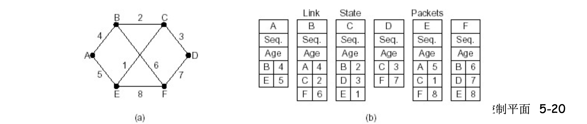

# 📘 5.2 路由选择算法 (Routing Algorithms)

> 来源说明：郑老师《计算机网络》课程 5.2节 | 本节涵盖：路由基本概念、链路状态(LS)与距离矢量(DV)两类核心路由选择算法的原理、机制与对比

---

## 🧠 核心概念总览（严格按原文顺序）

- [*知识点1: 路由(Route)的基本概念与网络为单位的路由*](#id1)
- [*知识点2: 网络图抽象、路径代价与最优化原则*](#id2)
- [*知识点3: 路由选择算法的原则与分类*](#id3)
- [*知识点4: 链路状态(Link State)路由的工作过程与邻居发现*](#id4)
- [*知识点5: LS分组组装、扩散机制与顺序号/年龄控制*](#id5)
- [*知识点6: Dijkstra算法原理、符号定义与节点分类*](#id6)
- [*知识点7: Dijkstra算法执行示例、复杂度与震荡问题*](#id7)
- [*知识点8: 距离矢量(Distance Vector)路由基本思想与Bellman-Ford方程*](#id8)
- [*知识点9: DV分布式迭代算法与核心工作流程*](#id9)
- [*知识点10: DV无穷计算问题与水平分裂(Split Horizon)算法*](#id10)
- [*知识点11: LS与DV算法的综合比较*](#id11)

---

<a id="id1"></a>
## ✅ 知识点1: 路由的基本概念与网络为单位的路由

- **路由概念**：按照某种指标（传输延迟、所经过的站点数目等）找到一条从源节点到目标节点的**较好路径**
  - **较好路径**：按照某种指标较小的路径
  - **指标**：站数、延迟、费用、队列长度等，或者是一些单纯指标的加权平均
  - 采用什么样的指标，表示网络使用者希望网络在什么方面表现突出，什么指标网络使用者比较重视
- 路由特征：**以网络(子网)为单位进行路由**（路由信息通告 + 路由计算）
  - 网络为单位进行路由，路由信息传输、计算和匹配的代价低
  - **前提条件**：一个网络所有节点地址前缀相同，且物理上聚集
  - 路由就是：**计算网络到其他网络如何走的问题**
  - > 💡 **理解技巧**："以网络为单位"意味着路由表项的目标是"网络前缀"，而非单个主机，大幅降低路由表规模
- 路由特征：**网络到网络的路由 = 路由器-路由器之间路由**
  - 网络对应的路由器到其他网络对应的路由器的路由
  - 如果在同一个网络中通信：路由器-主机之间的通信，<b>链路层(Link Layer)</b>解决
  - 到了这个路由器就是到了这个网络
  - > ⚠️ **关键区分**：路由器-路由器之间的路由由网络层负责；同一网络内路由器到主机的通信由链路层解决
- **路由选择算法(routing algorithm)**：网络层软件的一部分，完成路由功能

    - > 📋 **术语提醒**：路由(route) vs 路由选择算法(routing algorithm)——前者是路径结果，后者是计算路径的软件方法

---

<a id="id2"></a>
## ✅ 知识点2: 网络图抽象、路径代价与最优化原则


- **网络的图抽象需给出的必要要素**：将网络抽象为图 $G=(N,E)$
  - $N$ = 路由器集合 = $\{u, v, w, x, y, z\}$
  - $E$ = 链路集合 = $\{(u,v), (u,x), (v,x), (v,w), (x,w), (x,y), (w,y), (w,z), (y,z)\}$
  - 边有**代价(cost)**
- **边和路径的代价**
  - $c(x,x')$ = 链路的代价 $(x,x')$，例如 $c(w,z)=5$
  - 代价可能总为1，或是**链路带宽的倒数**，或是**拥塞情况的倒数**
  - $\text{Cost of path }(x_1, x_2, ..., x_p) = c(x_1,x_2) + c(x_2,x_3) + ... + c(x_{p-1},x_p)$
  
- **路由的输入**：拓扑、边的代价、源节点
- **路由的输出**：源节点的**汇集树(sink tree)**
- **最优化原则(optimality principle)**：
  - **汇集树(sink tree)**：此节点到所有其它节点的最优路径形成的树
  - 路由选择算法就是为所有路由器**找到并使用汇集树**
    - > 💡 **理解技巧**：汇集树就像以源节点为根、覆盖全网的最短路径树，每个路由器需要一棵以自己为根的汇集树
    - > 🔄 **知识关联**：汇集树的概念是LS算法中Dijkstra算法的直接输出结果

    
    
- > ⚠️ **重要限制**：路由的输入必须包含完整的拓扑和边代价信息，输出是汇集树而非单条路径


---

<a id="id3"></a>
## ✅ 知识点3: 路由选择算法的原则与分类


- **路由选择算法的原则**：
  1. **正确性(correctness)**：算法必须是**正确的**和**完整的**，使分组一站一站接力，正确发向目标站；完整：目标所有的站地址，在路由表中都能找到相应的表项；没有处理不了的目标站地址
  2. **简单性(simplicity)**：算法在计算机上应简单；最优但复杂的算法，时间上延迟很大，不实用，不应为了获取路由信息增加很多的通信量
        - > ⚠️ **关键权衡**：最优性 vs 简单性——追求最优可能导致算法复杂、通信量大，实际中常接受次优解
  3. **健壮性(robustness)**：算法应能适应**通信量**和**网络拓扑**的变化；通信量变化，网络拓扑的变化算法能很快适应；不向很拥挤的链路发数据，不向断了的链路发送数据
  4. **稳定性(stability)**：产生的路由不应该摇摆
  5. **公平性(fairness)**：对每一个站点都公平
  6. **最优性(optimality)**：某一个指标的最优，时间上、费用上，等指标，或综合指标；实际上，获取最优的结果代价较高，可以是**次优的**
- **路由算法分类**：
  - **按信息范围分**：
    - **全局(global)**：所有的路由器拥有完整的拓扑和边的代价的信息 → **"link state"算法**
    - **分布式(distributed)**：路由器只知道与它有物理连接关系的邻居路由器，和到相应邻居路由器的代价值；迭代地与邻居交换路由信息、计算路由信息 → **"distance vector"算法**
    - > 💡 **理解技巧**：LS是"全局信息，本地计算"；DV是"局部信息，分布式迭代计算"， 类似于动态规划
  - **按适应性分**：
    - **静态(static)**：路由随时间变化缓慢
    - **动态(dynamic)**：路由变化很快，周期性更新，根据链路代价的变化而变化
    - **非自适应算法(non-adaptive algorithm)**：不能适应网络拓扑和通信量的变化，路由表是事先计算好的
    - **自适应路由选择(adaptive algorithm)**：能适应网络拓扑和通信量的变化


---

<a id="id4"></a>
## ✅ 知识点4: 链路状态(Link State)路由的工作过程与邻居发现

- **配置LS路由选择算法的路由工作过程**：
  1. 各点通过各种渠道获得**整个网络拓扑**、网络中所有链路**代价**等信息（这部分和算法没关系，属于协议和实现）
  2. 使用**LS路由算法**，计算本站点到其它站点的最优路径（汇集树），得到**路由表(routing table)**
  3. 按照此路由表转发分组（**datagram方式**）
- **LS路由的基本工作过程概况（5步）**：
  1. **发现相邻节点**，获知对方网络地址
  2. **测量到相邻节点的代价**（延迟、开销）
  3. **组装一个LS分组**，描述它到相邻节点的代价情况
  4. **将分组通过扩散的方法（泛洪）发到所有其它路由器**（以上4步让每个路由器获得拓扑和边代价）
    - >💡 **理解技巧**：LS的核心思想是"让每个路由器都拥有全网地图，然后各自独立导航"
  5. **通过Dijkstra算法找出最短路径**（这才是路由算法）
     - 每个节点独立算出来到其他节点（路由器=网络）的最短路径
     - 迭代算法：第k步能够知道本节点到k个其他节点的最短路径
     - > ⚠️ **重要区分**：前4步是"信息收集与分发"（协议层面），第5步Dijkstra才是"路由算法"本身
- **步骤1：发现相邻节点**
  - 一个路由器上电之后，向所有线路发送**HELLO分组**
  - 其它路由器收到HELLO分组，回送应答，在应答分组中，告知自己的名字（全局唯一）
  - 在局域网LAN中，通过广播HELLO分组，获得其它路由器的信息，可以认为引入一个人工节点
- **步骤2：测量到相邻节点的代价**
  - **实测法**：发送一个分组要求对方立即响应
  - 回送一个**ECHO分组**
  - 通过测量时间可以估算出延迟情况
- **步骤3：组装LS分组**
  - 发送者名称
  - 序号、年龄
  - 列表：给出它相邻节点，和它到相邻节点的延迟
  


- > 📋 **提醒**：HELLO分组用于发现邻居；ECHO分组用于测量延迟

---

<a id="id5"></a>
## ✅ 知识点5: LS分组扩散机制与顺序号/年龄控制

**理论**
- **步骤4：将分组通过扩散的方法发到所有其它路由器**
  - **顺序号(Sequence Number)**：用于控制无穷的扩散，每个路由器都记录（源路由器、顺序号），发现重复的或老的就不扩散
    - **具体问题1**：循环使用问题
    - **具体问题2**：路由器崩溃之后序号从0开始
    - **具体问题3**：序号出现错误
  - **解决问题的办法：年龄字段(Age)**
    - 生成一个分组时，年龄字段不为0
    - 每一个时间段，AGE字段减1
    - **AGE字段为0的分组将被抛弃**
- **扩散分组的数据结构**（节点B的数据结构示例）：
  - **Source**：从哪个节点收到LS分组
  - **Seq, Age**：序号、年龄
  - **Send flags**：发送标记，必须向指定的哪些相邻站点转发LS分组
  - **ACK flags**：本站点必须向哪些相邻站点发送应答
  - **DATA**：来自source站点的LS分组

**教材示例/公式**
```
节点B的数据结构示例：
| Source | Seq | Age | Send flags | ACK flags | Data |
| A      | 21  | 60  | ...        | ...       | ...  |
| F      | 21  | 60  | ...        | ...       | ...  |
| E      | 21  | 59  | ...        | ...       | ...  |
| C      | 20  | 60  | ...        | ...       | ...  |
| D      | 21  | 59  | ...        | ...       | ...  |
```

**注意点**
- ⚠️ **关键机制**：Seq解决重复和顺序问题，Age解决崩溃和错误问题——两者结合保证扩散的健壮性
- 💡 **理解技巧**：Age就像TTL，不断递减到0就丢弃，防止过期信息永久滞留
- 🔄 **知识关联**：这种受控扩散(flooding)是LS协议（如OSPF）的核心机制

---

<a id="id6"></a>
## ✅ 知识点6: Dijkstra算法原理、符号定义与节点分类

**理论**
- **步骤5：通过Dijkstra算法找出最短路径**
  - 路由器获得各站点LS分组和整个网络的拓扑
  - 通过Dijkstra算法计算出到其它各路由器的最短路径（汇集树）
  - 将计算结果安装到路由表中
- **LS的应用情况**：
  - **OSPF协议**是一种LS协议，被用于Internet上
  - **IS-IS(Intermediate System-Intermediate System)**：被用于Internet主干中，Netware
- **符号标记**：
  - $c(i,j)$：从节点$i$到$j$链路代价（初始状态下非相邻节点之间的链路代价为$\infty$）
  - $D(v)$：从源节点到节点$V$的当前路径代价（节点的代价）
  - $p(v)$：从源到节点$V$的路径前序节点
  - $N'$：当前已经知道最优路径的节点集合（**永久节点(permanent node)**的集合）
- **LS路由选择算法的工作原理**：
  - **节点标记**：每一个节点使用 $(D(v), p(v))$，如：$(3,B)$ 标记
    - $D(v)$：从源节点由已知最优路径到达本节点的距离
    - $P(v)$：前序节点来标注
  - **2类节点**：
    - **临时节点(tentative node)**：还没有找到从源节点到此节点的最优路径的节点
    - **永久节点(permanent node) $N'$**：已经找到了从源节点到此节点的最优路径的节点
- **算法初始化**：
  - 除了源节点外，所有节点都为临时节点
  - 节点代价除了与源节点相邻的节点外，都为 $\infty$
- **迭代过程**：
  1. 从所有临时节点中找到一个节点代价最小的临时节点，将之变成永久节点（当前节点）$W$
  2. 对此节点的所有在临时节点集合中的邻节点$(V)$：
     - 如 $D(v) > D(w) + c(w,v)$，则重新标注此点，$(D(W)+C(W,V), W)$
     - 否则，不重新标注
  3. 开始一个新的循环

**教材示例/公式**
```
D(v): 从源节点到节点V的当前路径代价
p(v): 从源到节点V的路径前序节点
N': 永久节点集合

迭代更新规则：
if D(v) > D(w) + c(w,v):
    D(v) = D(w) + c(w,v)
    p(v) = w
```

**注意点**
- ⚠️ **核心要点**：Dijkstra是贪心算法，每次将代价最小的临时节点"固化"为永久节点，且永不更改
- 💡 **理解技巧**：$(D(v), p(v))$ 就像"当前最短距离"和"从哪来的"标签，永久节点就是"已经确定最短路径的点"
- 📋 **术语提醒**：tentative node = 临时/试探节点；permanent node = 永久节点

---

<a id="id7"></a>
## ✅ 知识点7: Dijkstra算法执行示例、复杂度与震荡问题

**理论**
- **Dijkstra算法的例子**（以节点$u$为源节点）：
  - Step 0: $N'=\{u\}$，$D(v)=7(u)$, $D(w)=3(u)$, $D(x)=\infty$, $D(y)=5(u)$, $D(z)=\infty$
  - Step 1: 选最小$w$加入$N'$，更新邻居：$D(v)=\min\{7, 3+3\}=6(w)$, $D(x)=11(w)$, $D(y)$不变
  - Step 2: 选最小$v$加入$N'$，更新邻居：$D(x)$不变, $D(y)=14(x)$...
  - 最终得到汇集树，安装到路由表（destination -> link映射）
- **算法复杂度**：$n$节点
  - 每一次迭代：需要检查所有不在永久集合$N$中的节点
  - $n(n+1)/2$ 次比较：$O(n^2)$
  - 有很有效的实现（如优先队列）：$O(n \log n)$
- **可能的震荡(Oscillation)**：
  - 例如：链路代价 = 链路承载的流量
  - 一开始选择某条路径 → 该路径流量增加 → 代价上升 → 换另一条路径 → 新路径流量增加 → 代价上升 → 又换回原路径...
  - 形成**周期性震荡**

**教材示例/公式**
```
e.g., D(v) = min{D(v), D(w)+c(w,v)} = min{7, 3+3} = 6

destination | link
v           | (u,v)
x           | (u,x)
y           | (u,w)
w           | (u,w)
z           | (u,w)
```

**注意点**
- ⚠️ **重要警告**：链路代价如果与实时流量相关，可能引发震荡——这是LS在实际部署中需要考虑的问题
- 💡 **理解技巧**：复杂度从$O(n^2)$到$O(n \log n)$的优化，关键在于使用堆(Heap)结构快速找到最小临时节点
- 🔄 **知识关联**：震荡问题在OSPF中通过适当设置链路代价计算方式（不直接用实时流量）来缓解

---

<a id="id8"></a>
## ✅ 知识点8: 距离矢量(Distance Vector)路由基本思想与Bellman-Ford方程

**理论**
- **距离矢量路由选择(distance vector routing)**：动态路由算法之一
- **DV算法历史及应用情况**：
  - 1957 Bellman, 1962 Ford Fulkerson
  - 用于ARPANET, Internet(**RIP**), DECnet, Novell, ApplTalk
- **基本思想**：
  - 各路由器维护一张路由表，结构为（目标To、下一跳Next、代价cost）
  - 各路由器与相邻路由器**交换路由表(DV)**
  - 根据获得的路由信息，**更新路由表**
- **代价及相邻节点间代价的获得**：
  - 跳数(hops)、延迟(delay)、队列长度
  - 相邻节点间代价的获得：**通过实测**
- **路由信息的更新过程**：
  1. 根据实测得到本节点$A$到相邻站点的代价（如：延迟）
  2. 根据各相邻站点声称它们到目标站点$B$的代价
  3. 计算出本站点$A$经过各相邻站点到目标站点$B$的代价
  4. 找到一个**最小的代价**，和相应的**下一个节点$Z$**，到达节点$B$经过此节点$Z$，并且代价为$A$-$Z$-$B$的代价
  5. 其它所有的目标节点一个计算法
- **定期测量它到相邻节点的代价** → 更新路由表
- **定期与相邻节点交换路由表(DV)**：约定次序的往各个目标节点的代价向量；实际为（目标，代价）列表
- **Bellman-Ford方程(动态规划)**：
  - 设 $d_x(y)$ := 从$x$到$y$的最小路径代价
  - 那么：
    $$d_x(y) = \min_{v} \{c(x,v) + d_v(y)\}$$
    - $c(x,v)$：$x$到邻居$v$的代价
    - $d_v(y)$：从邻居$v$到目标$y$的代价
    - 取所有$x$的邻居取最小的$v$
- **Bellman-Ford例子**：
  - 已知 $d_v(z)=5$, $d_x(z)=3$, $d_w(z)=3$
  - $d_u(z) = \min\{c(u,v)+d_v(z), c(u,x)+d_x(z), c(u,w)+d_w(z)\} = \min\{2+5, 1+3, 5+3\} = 4$
  - 那个能够达到目标$z$最小代价的节点$x$，就在到目标节点的下一条路径上，在**转发表(forwarding table)**中使用
- **节点$x$维护的信息**：
  - $D_x(y)$ = 节点$x$到$y$代价最小值的**估计**
  - $x$节点维护**距离矢量(Distance Vector)** $D_x = [D_x(y): y \in N]$
  - 知道到所有邻居$v$的代价：$c(x,v)$
  - 收到并维护一个它邻居的距离矢量集
  - 对于每个邻居，$x$维护 $D_v = [D_v(y): y \in N]$

**教材示例/公式**
```
Bellman-Ford方程:
dx(y) = min {c(x,v) + dv(y)}
        v

计算示例:
du(z) = min{c(u,v)+dv(z), c(u,x)+dx(z), c(u,w)+dw(z)}
      = min{2+5, 1+3, 5+3} = 4
```

**注意点**
- ⚠️ **核心区别**：LS是"地图导航"，DV是"问路"——DV只相信邻居告诉它的距离估计
- 💡 **理解技巧**：Bellman-Ford方程本质就是"我到目的地的最短距离 = 我到邻居的距离 + 邻居到目的地的最短距离"的最小值
- 📋 **术语提醒**：Distance Vector = 距离矢量；RIP(Routing Information Protocol)是经典的DV协议

---

<a id="id9"></a>
## ✅ 知识点9: DV分布式迭代算法与核心工作流程

**理论**
- **核心思路**：
  - 每个节点都将自己的距离矢量估计值传送给邻居，**定时或者DV有变化时**，让对方去算
  - 当$x$从邻居收到DV时，自己运算，更新它自己的距离矢量
    - 采用B-F equation: $D_x(y) \leftarrow \min_v\{c(x,v) + D_v(y)\}$，对于每个节点$y \in N$
  - $D_x(y)$估计值最终**收敛**于实际的最小代价值$d_x(y)$
  - **分布式、迭代算法**
- **异步式，迭代**：每次本地迭代被以下事件触发：
  - 本地链路代价变化了
  - 从邻居来了DV的更新消息
- **分布式特性**：
  - 每个节点只是在自己的DV改变之后向邻居通告
  - 然后邻居们在有必要的时候通知他们的邻居
- **每个节点的工作流程**：
  1. **等待**：本地链路代价变化或者从邻居传送新的DV报文
  2. **重新计算**：各目标代价估计值
  3. **通告邻居**：如果到任何目标的DV发生变化
- **DV的具体计算示例**（节点$x,y,z$）：
  - $D_x(y) = \min\{c(x,y)+D_y(y), c(x,z)+D_z(y)\} = \min\{2+0, 7+1\} = 2$
  - $D_x(z) = \min\{c(x,y)+D_y(z), c(x,z)+D_z(z)\} = \min\{2+1, 7+0\} = 3$
  - 各节点维护并随时间迭代更新路由表，最终收敛到稳定值

**注意点**
- ⚠️ **关键特性**：DV是异步、分布式的——没有全局时钟同步，各节点独立计算、独立通告
- 💡 **理解技巧**：DV就像"谣言传播"，好消息（短路径）传得快，但坏消息（链路断开）传得慢
- 🔄 **知识关联**：DV的分布式特性使其适合简单网络，但也带来了count-to-infinity问题

---

<a id="id10"></a>
## ✅ 知识点10: DV无穷计算问题与水平分裂(Split Horizon)算法

**理论**
- **DV的无穷计算问题(Count-to-Infinity)**：
  - **DV的特点**：**好消息传的快，坏消息传的慢**
  - **好消息**：某个路由器接入或有更短的路径；传播以每一个交换周期前进一个路由器的速度进行
  - **坏消息**：链路断开或代价变大；传播速度非常慢
- **坏消息传播示例**（线性拓扑A-B-C-D-E，$c(A,B)=1$，A断开）：
  - Initially: B到A=1，C/D/E到A=$\infty$
  - After 1 exchange: B从C处获得信息，C可以到达A（C-A要经过B本身），路径是2，因此B变成3，从C处走
  - After 2 exchanges: C从B处获得消息，B可以到A路径为3，因此C到A从B走，代价为3
  - 无限次之后，到A的距离变成INF，不可达
  - 规律：$= \min(\text{left}, \text{right}) + 1$，每次至少增加1
- **水平分裂(Split Horizon)算法**：一种对无穷计算问题的解决办法
  - **核心规则**：C知道要经过B才能到达A，所以**C向B报告它到A的距离为INF**；C告诉D它到A的真实距离
  - D告诉E它到A的距离，但D告诉C它通向A的距离为INF
  - **效果**：坏消息以一次交换的速度传播
  - 第一次交换：B通过测试发现到A的路径为INF，而C也告诉B到A的距离为INF，因此B到A的距离为INF
  - 第二次交换：C从B和D那里获知到A的距离为INF，因此将它到A的距离为INF
- **水平分裂的问题**：在某些拓扑形式下会**失败**（存在环路）
  - **三角形拓扑例子**（A-B-C连接D）：
    - A,B到D的距离为2，C到D的距离为1
    - 如果C-D路径失败
    - C获知到D为INF，从A,B获知到D的距离为INF，因此C认为D不可达
    - A从C获知D的距离为INF，但从B处获知它到D的距离为2，因此A到B的距离为3，从B走
    - B也有类似的问题
    - 经过无限次之后，A和B都知道到D的距离为INF

**注意点**
- ⚠️ **核心考点**：水平分裂能加速坏消息传播，但在存在环路的拓扑中仍可能失败
- 💡 **理解技巧**：Split Horizon的口诀——"从哪来，不往回说"（Don't tell neighbor about routes learned from that neighbor）
- 🔄 **知识关联**：RIP协议使用Split Horizon with Poison Reverse（毒性逆转）来进一步缓解此问题

---

<a id="id11"></a>
## ✅ 知识点11: LS与DV算法的综合比较

**理论**

| 比较维度 | 链路状态(Link State) | 距离矢量(Distance Vector) |
|---------|---------------------|--------------------------|
| **消息复杂度** | 有$n$节点，$E$条链路，发送报文$O(nE)$个。局部的路由信息；**全局传播** | 只和邻居交换信息。全局的路由信息，**局部传播** |
| **收敛时间** | $O(n^2)$算法。有可能震荡 | 收敛较慢。可能存在路由环路。**count-to-infinity问题** |
| **健壮性**（路由器故障） | 节点会通告不正确的链路代价。每个节点只计算自己的路由表。错误信息影响较小，局部，路由较**健壮** | DV节点可能通告对全网所有节点的不正确路径代价。每一个节点的路由表可能被其它节点使用。错误可以**扩散到全网** |

- **结论**：2种路由选择算法都有其优缺点，而且在互联网上都有应用
  - **DV胜出**：消息复杂度低（只与邻居通信）
  - **LS胜出**：收敛时间快、健壮性好（错误不扩散）

**注意点**
- ⚠️ **考试重点**：LS vs DV的对比是本章最核心的考点，需从消息复杂度、收敛时间、健壮性三个维度掌握
- 💡 **记忆口诀**："LS全局地图自导航，快准稳但通信忙；DV邻居问路传谣言，省带宽但慢且脆"
- 📋 **术语提醒**：消息复杂度(message complexity)、收敛时间(convergence time)、健壮性(robustness)

---

## 🔑 核心要点总结

1. **路由的本质**：以网络为单位，在路由器之间寻找最优路径；网络抽象为图，目标是找到汇集树
2. **LS算法核心**：每个路由器掌握全网拓扑（通过HELLO发现邻居、实测代价、LS分组扩散），使用Dijkstra算法独立计算最短路径；优点是收敛快、健壮，缺点是消息开销大
3. **DV算法核心**：每个路由器只掌握邻居的距离矢量，通过Bellman-Ford方程迭代更新；优点是消息开销小，缺点是收敛慢、存在count-to-infinity问题
4. **Dijkstra算法**：贪心策略，临时节点→永久节点，每次固化代价最小的节点；复杂度$O(n^2)$，可优化至$O(n\log n)$
5. **Split Horizon**：解决DV坏消息传播慢的机制，规则是"不向邻居报告从该邻居学到的路由"，但在环路拓扑中仍可能失效

## 📌 考试速记版

- **关键公式**：
  - Bellman-Ford: $d_x(y) = \min_v\{c(x,v) + d_v(y)\}$
  - Dijkstra更新: $D(v) = \min\{D(v), D(w) + c(w,v)\}$
- **重要对比**：
  - LS：全局信息，本地计算，Dijkstra，OSPF
  - DV：局部信息，分布式迭代，Bellman-Ford，RIP
- **常见考点**：
  - Dijkstra逐步执行过程（节点标记更新）
  - DV的count-to-infinity产生原因与传播过程
  - Split Horizon的原理与失效场景（三角形拓扑）
  - LS震荡的原因（链路代价与流量相关）

**记忆口诀**：
> LS全局有地图，Dijkstra算最优路；DV邻居互传数，Bellman-Ford迭代求。好消息快传，坏消息慢走，Split Horizon来救场，环路拓扑仍犯愁。