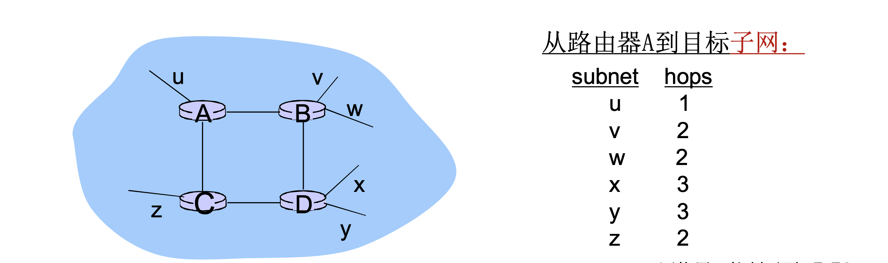
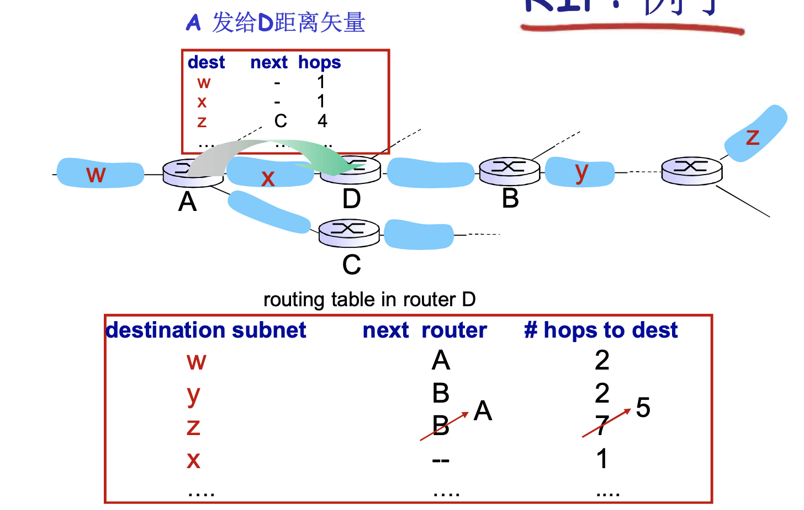
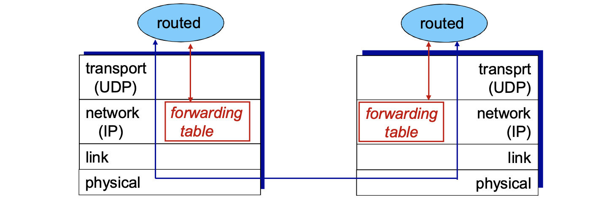
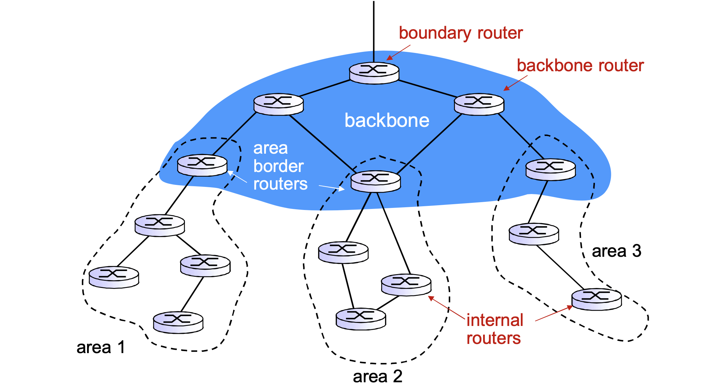

# 📘 5.3 因特网中自治系统内部的路由选择 (Intra-AS Routing)

> 来源说明：郑老师《计算机网络》课程 5.3节 | 本节涵盖：RIP与OSPF两种内部网关协议的工作原理、特点与对比

---

## 🧠 核心概念总览（严格按原文顺序）

- [*知识点1: 层次路由与自治系统(AS)概念*](#id1)
- [*知识点2: RIP协议——距离矢量算法的实现*](#id2)
- [*知识点3: RIP通告、链路失效与毒性逆转*](#id3)
- [*知识点4: OSPF协议——链路状态算法的实现*](#id4)
- [*知识点5: OSPF高级特性与层次化路由*](#id5)

---

## ✅ 知识点1: 层次路由与自治系统(AS)概念

- **平面路由的问题**：
  - 一个网络中的所有路由器地位一样，所有路由器都要知道其他所有路由器（子网）如何走
  - **规模问题**：路由信息的存储、传输和计算代价巨大
    - DV：距离矢量很大，且不能够收敛
    - LS：几百万个节点的LS分组的泛洪传输、存储以及最短路径算法的计算
  - **管理问题**：
    - 不同的网络所有者希望按照自己的方式管理网络
    - 希望对外隐藏自己网络的细节
    - 还希望和其它网络互联
- **层次路由**：将互联网分成一个个**AS(Autonomous System，自治系统)**
  - 某个区域内的路由器集合
  - 一个AS用<b>AS Number (ASN)</b>L唯一标示
  - 一个ISP可能包括1个或者多个AS
- **路由变成了2个层次**：
  - **AS内部路由(intra-AS)**：在同一个AS内路由器运行相同的路由协议
    - "intra-AS" routing protocol = **内部网关协议**
    - 不同的AS可能运行着不同的内部网关协议
    - 能够解决规模和管理问题
    - 如：OSPF, IGRP
    - **网关路由器**：AS边缘路由器，可以连接到其他AS
  - **AS间路由(inter-AS)**：AS之间运行AS间路由协议
    - "inter-AS" routing protocol = **外部网关协议**
    - 解决AS之间的路由问题，完成AS之间的互联互通

- **层次路由的优点**：
  1. **解决了规模问题**：
     - 内部网关协议解决AS内部数量有限的路由器相互到达的问题，AS内部规模可控
     - 如AS节点太多，可分割AS
     - AS之间的路由：增加一个AS，对其他AS来说只是增加了一个表项
     - **扩展性强**：规模增大，性能不会减得太多
  2. **解决了管理问题**：
     - 各个AS可以运行不同的内部网关协议
     - 可以使自己网络的细节不向外透露

> 💡 **理解技巧**：AS就像一个个"独立王国"，内部用自己的规则管理，对外只暴露必要信息。BGP就是"外交协议"，协调各王国之间的关系。

---

## ✅ 知识点2: RIP协议——距离矢量算法的实现

- **RIP (Routing Information Protocol)**：
  - 在1982年发布的BSD-UNIX中实现
  - **Distance vector算法**的实现
  - 距离矢量要交换的信息：每条链路cost=1， cost这里代表多少hops (**max = 15 hops**)跳数可达
    > ⚠️ **关键限制**：RIP最大跳数为15，16表示不可达。这限制了RIP能支持的网络规模。
  - DV每隔30秒和邻居交换DV，通告，或者收到主动请求
  - 每个通告包括：最多25个目标子网

> 💡 **理解技巧**：RIP就是DV算法的"工程实现版"，用最简单的跳数作为代价，定期广播自己的路由表。

---

## ✅ 知识点3: RIP通告、链路失效与毒性逆转

- **RIP通告（advertisements）**：
  - DV：在邻居之间每30秒交换通告报文
    - 定期，而且在改变路由的时候发送通告报文
    - 在对方的请求下可以发送通告报文
  - 每一个通告：至多AS内部的25个目标网络的DV
    - 目标网络 + 跳数
  - **一次公告最多25个子网，最大跳数为16**

- **RIP例子**——拓扑与路由表：
  

- **RIP链路失效和恢复**：
  - 如果**180秒**没有收到通告信息(Advertisement) → 邻居或者链路失效
    - 发现经过这个邻居的路由已失效
    - 新的通告报文会传递给邻居
    - 邻居因此发出新的通告（如果路由变化的话）
    - 链路失效快速地在整网中传输
  - 使用<b>毒性逆转（poison reverse）</b>阻止ping-pong回路
    - 不可达的距离：跳数无限 = 16段
- **RIP进程处理**：
  - RIP以**应用进程**的方式实现：route-d (daemon)
  - 通告报文通过**UDP报文**传送，周期性重复
  - **网络层的协议使用了传输层的服务，以应用层实体的方式实现**
  

> ⚠️ **关键机制**：毒性逆转是Split Horizon的一种变体——不是不报，而是报"无穷大"（16跳），让邻居立刻知道该路径不可达。

> 🔄 **知识关联**：RIP使用UDP端口520，这种"网络层协议跑在传输层之上"的设计是RIP的一个特点。

---

## ✅ 知识点4: OSPF协议——链路状态算法的实现

**理论**
- **OSPF (Open Shortest Path First)**：
  - "open"：标准可公开获得
  - 使用**LS算法**
    - LS分组在网络中（一个AS内部）分发
    - 全局网络拓扑、代价在每一个节点中都保持
    - 路由计算采用**Dijkstra算法**
  - OSPF通告信息中携带：每一个邻居路由器一个表项
  - 通告信息会传遍AS全部（通过泛洪）
    - 在**IP数据报上直接传送**OSPF报文（而不是通过UDP和TCP）
    > ⚠️ **关键区分**：OSPF的层次化是为了解决LS在大型网络中的扩展性问题——不是全网泛洪，而是区域内泛洪+区域间汇总。
  - IS-IS路由协议：几乎和OSPF一样

> 💡 **理解技巧**：OSPF就是LS算法的"工程实现版"，直接在IP层跑（协议号89），不依赖UDP/TCP，效率更高。

---

## ✅ 知识点5: OSPF高级特性与层次化路由

**理论**
- **OSPF "高级"特性**（在RIP中没有的）：
  1. **安全**：所有的OSPF报文都是经过认证的（防止恶意的攻击）
  2. **允许有多个代价相同的路径存在**（在RIP协议中只有一个）
  3. **对于每一个链路，对于不同的TOS有多重代价矩阵**
     - 例如：卫星链路代价对于尽力而为的服务代价设置比较低，对实时服务代价设置的比较高
     - 支持按照不同的代价计算最优路径，如：按照时间和延迟分别计算最优路径
  4. **对单播和多播的集成支持**
     - Multicast OSPF (MOSPF) 使用相同的拓扑数据库，就像在OSPF中一样
  5. **在大型网络中支持层次性OSPF**

- **层次化的OSPF路由**：
  - **2个级别的层次性**：本地(local)、骨干(backbone)
    - 链路状态通告仅仅在本地区域**Area**范围内进行
    - 每一个节点拥有本地区域的拓扑信息
    - 关于其他区域，知道去它的方向，通过**区域边界路由器**（最短路径）
  - **区域边界路由器(Area Border Router)**："汇总（聚集）"到自己区域内网络的距离，向其它区域边界路由器通告
  - **骨干路由器(Backbone Router)**：仅仅在骨干区域内，运行OSPF路由
  - **边界路由器(Boundary Router)**：连接其它的AS's
  

> 💡 **理解技巧**：OSPF的Area就像"省"，骨干区域就像"中央"，区域边界路由器就像"省长"，只向中央汇报本省概况。

---

## 🔑 核心要点总结

1. **层次路由的核心思想**：将互联网划分为自治系统(AS)，内部用intra-AS协议(RIP/OSPF)，AS之间用inter-AS协议(BGP)。
2. **RIP是DV的工程实现**：跳数为代价，最大15跳，30秒通告一次，用毒性逆转防环路，跑在UDP之上。
3. **OSPF是LS的工程实现**：Dijkstra计算，直接在IP层传输(协议号89)，支持认证、多路径、TOS、MOSPF。
4. **OSPF层次化**：通过Area划分减少LS泛洪范围，区域边界路由器汇总距离信息，骨干区域连接各区域。
5. **RIP vs OSPF**：RIP简单但慢、规模受限；OSPF复杂但快、可扩展、功能丰富。

## 📌 考试速记版

- **关键参数**：
  - RIP：跳数最大15，30秒通告，180秒超时
  - OSPF：直接在IP上传输（协议号89），支持认证和多路径
- **重要对比**：

| 特性 | RIP | OSPF |
|:---|:---|:---|
| 算法类型 | DV | LS |
| 代价指标 | 跳数(Hops) | 可配置（带宽等） |
| 最大规模 | 15跳 | 大（层次化后更大） |
| 传输层 | UDP | IP直接（协议89） |
| 安全 | 无 | 有认证 |
| 多路径 | 不支持 | 支持 |
| 层次化 | 不支持 | 支持Area |

- **常见考点**：
  - 为什么RIP最大15跳？→ 防止count-to-infinity问题无限增长
  - OSPF为什么比RIP快？→ LS收敛快，触发更新+周期性更新结合
  - OSPF层次化的目的？→ 减少LS泛洪开销，解决大规模网络扩展性

**记忆口诀**：
> "RIP简单跳数限，三十秒广播慢收敛；OSPF复杂功能全，Dijkstra算直连IP传。"
