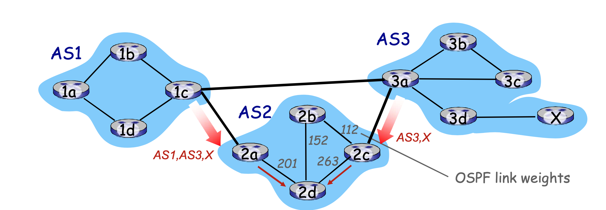
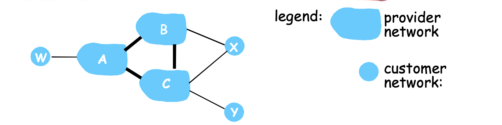

# 📘 5.4 ISP之间的路由选择: BGP (Inter-AS Routing: BGP)

> 来源说明：郑老师《计算机网络》课程 5.4节 | 本节涵盖：BGP协议原理、eBGP/iBGP、路径属性、策略路由、BGP报文类型

---

## 🧠 核心概念总览（严格按原文顺序）

- [*知识点1: BGP概述——"互联网的胶水"*](#id1)
- [*知识点2: eBGP与iBGP连接*](#id2)
- [*知识点3: BGP基础——路径通告语义*](#id3)
- [*知识点4: 路径属性与BGP路由*](#id4)
- [*知识点5: BGP路径通告过程*](#id5)
- [*知识点6: BGP报文类型*](#id6)
- [*知识点7: BGP、OSPF、转发表的综合例子*](#id7)
- [*知识点8: BGP路径选择*](#id12)
- [*知识点9: 热土豆路由*](#id13)
- [*知识点10: 通过路径通告执行策略*](#id14)
- [*知识点11: 内部网关协议与外部网关协议的区别*](#id15)

---

## ✅ 知识点1: BGP概述——"互联网的胶水"

- **BGP (Border Gateway Protocol)**：自治区域间路由协议"事实上的"标准
  - **"将互联网各个AS粘在一起的胶水"**
- BGP提供给每个AS以以下方法：
  - **eBGP**(External BGP)：从**相邻**的ASes那里获得子网可达信息
  - **iBGP**(Internal BGP)：将获得的子网可达信息传遍到AS**内部**的所有路由器
  - 根据子网可达信息和策略来决定到达子网的"好"路径
- 允许子网向互联网其他网络通告"我在这里"
- **基于距离矢量算法（路径矢量）**
  - 不仅仅是距离矢量，还包括到达各个目标网络的**详细路径（AS序号的列表）**
  - 能够避免简单DV算法的路由环路问题
  > ⚠️ 注意：BGP是距离矢量算法的改进版本，还会携带完整的 AS 路径（AS Path），记录了这条路由经过了哪些自治系统，能天然防环。

> 💡 **理解技巧**：BGP就像"国际外交协议"——每个AS是一个国家，BGP负责让各国互通有无，同时各国可以按自己的"外交政策"选择路径。

---

## ✅ 知识点2: eBGP与iBGP连接

- **eBGP connectivity**：不同AS之间的BGP连接
- **iBGP connectivity**：同一AS内部的BGP连接
- **网关路由器**同时运行eBGP和iBGP协议: 1c, 2a, 3d路由器
  > 📋 **术语提醒**：`网关路由器(Gateway Router)` / `对等体(Peer)`

- eBGP用于AS之间交换路由信息
- iBGP用于AS内部传播从eBGP获得的路由信息

> ⚠️ **关键区分**：eBGP是"跨国贸易"，iBGP是"国内流通"。网关路由器是"海关"，同时处理进出口和国内分发。

---

## ✅ 知识点3: BGP基础——路径通告语义

- **BGP会话**：2个BGP路由器("peers")在一个**半永久的TCP连接**上交换BGP报文
  - 通告向不同目标子网前缀的"路径"
  - BGP是一种**路径矢量协议**
- **路径通告示例**：
  - 当AS3网关路由器3a向AS2的网关路由器2c通告路径：AS3,X
    - 3a参与AS内路由运算，知道本AS所有子网X信息
    - **语义上**：AS3向AS2承诺，它可以向子网X转发数据报
    - 3a是2c关于X的**下一跳（next hop）**

> 💡 **理解技巧**：BGP的"路径"不是"怎么走"，而是"经过哪些AS"——AS-PATH就像护照上的签证章序列。

---

## ✅ 知识点4: 路径属性与BGP路由

- 当通告一个子网前缀时，通告包括BGP属性
  - **prefix + 2 attributes = "route"**
- **子网前缀**：BGP不是通告"某个AS可达"，而是通告 "某个子网前缀(prefix)如何到达"，也就是告知这些IP前缀可以通过我可达。
  > 💡 这里用"子网前缀"是因为BGP工作在网络层，它管理的是IP地址块的可达性。AS是管理边界，prefix是实际被路由的数据。
- **2个重要的属性**：
  1. **AS-PATH**：前缀的通告所经过的AS列表（如：AS67 AS17）
     - **检测环路**：如果发现自己的ASN已经在路径中，就拒绝该路径
     - **多路径选择**：用于选择较短或较优路径
     - 在向其它AS转发时，需要将自己的AS号加在路径上
  2. **NEXT-HOP**：从当前AS到下一跳AS有多个链路时，告诉对方通过**哪个接口转发**
  3. **其它属性**：路由偏好指标、如何被插入的属性
- **基于策略的路由**：
  - 当一个网关路由器接收到了一个路由通告，使用**输入策略**来接受或过滤（accept/decline）
    - 过滤原因例1：不想经过某个AS，转发某些前缀的分组
    - 过滤原因例2：已经有了一条往某前缀的偏好路径
  - 策略也决定了是否向它别的邻居通告收到的这个路由信息

> ⚠️ **核心机制**：AS-PATH是BGP防环路的关键——每个AS在转发时把自己的ASN加到路径前面，形成"签名链"。

> 💡 **理解技巧**：NEXT-HOP就像"请从这个门进"，AS-PATH就像"我经过了这些检查站"。

---

## ✅ 知识点5: BGP路径通告过程

- **路径通告流程**：
  1. 路由器AS2.2c从AS3.3a接收到AS3,X路由通告（通过**eBGP**）
  2. 基于AS2的输入策略，AS2.2c决定接收AS3,X的通告，而且通过**iBGP**向AS2的所有路由器进行通告
  3. 基于AS2的策略，AS2路由器2a通过**eBGP**向AS1.1c路由器通告AS2,AS3,X路由信息
     - **路径上加上了AS2自己作为AS序列的一跳**

- **多路径选择**：
  - AS1网关路由器1c从2a学习到路径：AS2,AS3,X
  - AS1网关路由器1c从3a处学习到路径AS3,X
  - 基于自定义策略，AS1路由器1c选择了路径：AS3,X（更短，少经过一个AS）
  - 通过**iBGP**告诉所有AS1内部的路由器

> 💡 **理解技巧**：BGP路径选择不只是"最短"，更是"最符合策略"——可能选择绕远但避开某个AS的路径。

---

## ✅ 知识点6: BGP报文类型

- BGP使用**TCP协议**交换报文（端口179）
- **BGP报文类型**：
  1. **OPEN**：打开TCP连接，认证发送方
  2. **UPDATE**：通告新路径（或者撤销原路径）
  3. **KEEPALIVE**：在没有更新时保持连接，也用于对OPEN请求确认
  4. **NOTIFICATION**：报告以前消息的错误，也用来关闭连接

---

## ✅ 知识点7: BGP、OSPF、转发表的综合例子

- **转发表是由AS内和AS间的路由共同决定**：
  - 1a, 1b, 1c从1c那里通过**iBGP**学习到"到往子网X的要通过1c"
    - > 外部网关协议可以通告内部AS向哪个接口转发可到X
  - 1d：通过**OSPF**内部网关协议，知道如何抵达1c
    - > 内部网关协议是通告内部如何抵达IGBP指定的能到达X的网关
  > 💡 **理解技巧**：BGP负责"跨AS导航"（选网关），OSPF负责"AS内导航到大指定网关"（选接口），两者配合生成最终转发表。

- **综合决策过程**：
  1. **AS间路由（BGP）**：决定"去子网X应该走哪个网关路由器"（如1c）
  2. **AS内路由（OSPF）**：决定"去1c应该走哪个本地接口"（如接口1）
  3. **转发表**：综合以上两者，生成 `dest=X, interface=1` 的表项

---

## ✅ 知识点8: BGP路径选择

- 路由器可能获得一个网络前缀的多个路径，路由必须进行路径的选择，路由选择可以基于以下**消除规则**（按优先级排序）：
  1. **本地偏好值属性(Local Preference)**：偏好策略决定（值越大越优先，仅在AS内部传播）
  2. **最短AS-PATH**：AS的跳数（经过的AS数量最少）
  3. **最近的NEXT-HOP路由器**：`热土豆路由(Hot Potato Routing)`
  4. **附加的判据**：使用BGP标示（如路由器ID、接口IP等）
- 一个前缀对应着多种路径，采用**消除规则**直到留下一条路径
  - > ⚠️ **消除规则顺序**：本地偏好 > AS-PATH长度 > NEXT-HOP距离 > 其他——这是固定的决策链

> 💡 **理解技巧**：BGP选路像"多轮淘汰赛"——先比本地偏好，平了再比AS跳数，再平比热土豆...

---

## ✅ 知识点9: 热土豆路由

- **热土豆路由(Hot Potato Routing)**：
  - 热土豆策略：选择具备**最小内部区域代价**的网关作为往X的出口（如：2d选择2a，即使往X可能有比较多的AS跳数）
  - > ⚠️ **热土豆路由**：不是AS间最短，而是"赶紧把分组扔出自己AS"的最短内部路径

- **核心原则**：**不要操心域间的代价！**
- 也就是说：只要尽快把分组"扔"出自己AS，至于出AS后怎么走，不管。
- 例子：2d通过iBGP获知，它可以通过2a或者2c到达X

- > 💡 **记忆技巧**：想象手里拿个烫手山芋——赶紧传给最近的出口，不管他传给谁
- > 🔄 **知识关联**：热土豆是BGP路径选择第3条规则，位于本地偏好和AS-PATH之后

---

## ✅ 知识点10: 通过路径通告执行策略

**理论**
- **场景假设**：一个ISP只想路由流量到/去往它的客户网络（不想承载其他ISPs之间的流量，即不通告：不是去往我的客户，也不是来自我的客户）
- **网络类型**：
  - A, B, C是**提供商网络**
  - X, W, Y是**桩网络(stub networks)**或者叫**端网络**
  - X是**双重接入的，多宿桩网络**，接入了2个网络（A和B）
- **策略执行示例1**：
  
  - A向B和C通告路径Aw
  - B选择**不向C通告BAw**：
    - B从CBAw的路由上无法获得收益，因为C,A,w都不是B的客户
    - C从而无法获知CBAw路径的存在：每个ISP感知到的网络和真实不一致
  - C可能会通过CAw（而不是使用B）最终路由到w
- **策略执行示例2（多宿网络X）**：
  - 策略强制让X：X不想路由从B通过X到C的分组
  - 因而X就不通告给B，它实际上可以路由到C
- **核心思想**：ISP通过**选择性通告/不通告**路由来执行商业策略，控制流量承载范围

- > ⚠️ **BGP的策略本质**：ISP不转发非客户流量是为了避免"免费承载"他人流量（不盈利）
- > ⚠️ **每个ISP感知到的网络和真实不一致**：这是BGP策略路由的直接后果——不同路由器看到的世界不一样

---

## ✅ 知识点11: 内部网关协议与外部网关协议的区别

**理论**
- **为什么内部网关协议和外部网关协议如此不同？** 从三个维度对比：

| 维度 | Inter-AS (BGP) | Intra-AS (IGP) |
|------|---------------|---------------|
| **策略** | 管理员需要控制通信路径，谁在使用它的网络进行数据传输 | 一个管理者，所以无需策略；AS内部的各子网的主机尽可能地利用资源进行快速路由 |
| **规模** | AS间路由必须考虑规模问题，以便支持全网的数据转发 | AS内部路由规模不是一个大的问题；AS太大可分割 |
| **性能** | 策略可能比性能更重要 | 关注性能 |

- **AS规模问题**：
  - AS内部：如果AS太大，可将此AS分成小的AS；规模可控
    - AS内部路由支持层次性，层次性路由节约了表空间，降低了更新的数据流量
  - AS之间：只不过多了一个点而已
- **核心结论**：
  - Inter-AS：`策略` 比性能更重要
  - Intra-AS：`性能` 优先，无需策略

- > 💡 **记忆口诀**："内部看性能，外部看策略；内部一家管，外部各家算"
- > 🔄 **知识关联**：这一总结是整个BGP章节的"灵魂"——理解了这个，就理解了为什么BGP如此复杂

---

## 🔑 核心要点总结

1. **层次路由**是解决互联网规模和管理问题的核心方案——通过AS自治实现分而治之。
2. **BGP**是互联网AS间的"事实标准"，通过eBGP收信息、iBGP传信息，用路径矢量（AS-PATH）防环路。
3. **BGP不是纯技术协议**——策略驱动是其本质，ISP通过选择性通告控制流量承载范围。
4. **BGP路径选择**遵循消除规则：本地偏好 > 最短AS-PATH > 热土豆路由 > 其他。
5. **热土豆路由**体现AS自私性：只最小化内部代价，不操心全局最优。
6. **转发表由两层路由共同决定**：BGP给出远端目标→网关的映射，IGP给出网关→本地出口的映射。

---

## 📌 考试速记版

- **关键机制**：
  - 平面路由问题：规模不可控 + 管理不可控 → 层次路由（AS）
  - BGP = eBGP（外交）+ iBGP（内部传达）
  - AS-PATH：防环路 + 最短路径判断
  - NEXT-HOP：跨AS边界时的出口路由器
  - 基于策略：accept/decline + 选择性通告

- **易混淆概念对比**：
  - eBGP vs iBGP：eBGP跨AS（物理直连），iBGP同AS内（逻辑全连）
  - IGP vs BGP：IGP求性能（OSPF/RIP），BGP求策略（商业驱动）
  - 热土豆 vs 全局最优：热土豆只管内部最短，不管全局最短
  - 路径矢量 vs 距离矢量：路径矢量记录完整AS序列，距离矢量只记距离值

- **常见考试陷阱**：
  - BGP不是纯DV协议，而是**路径矢量**（Path Vector）——这是考试高频考点
  - BGP基于TCP（端口179），不是UDP
  - Local Preference只在**AS内部传播**，影响出站流量选路
  - 热土豆路由可能导致**全局次优**——考官爱问这个trade-off
  - 每个ISP的BGP视图可能不一致——这是策略路由的正常现象，不是错误

**记忆口诀**：
> "BGP粘网胶，e外i内传；AS路径戳，防环又选短；策略大于天，热土豆自私先！"