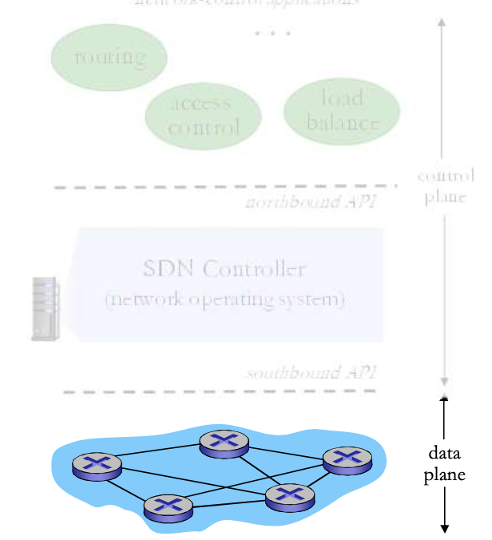
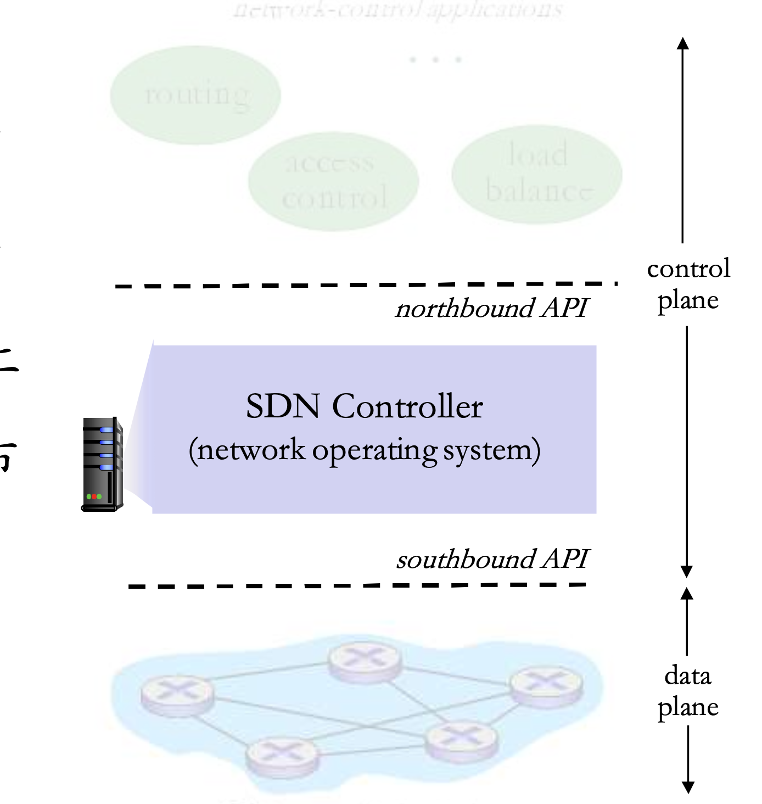

# 📘 5.5 SDN控制平面 (SDN Control Plane)

> 来源说明：计算机网络-郑老师 第5.5节 | 本节涵盖：软件定义网络(SDN)架构、控制平面与数据平面分离、OpenFlow协议、SDN控制器与面临的挑战

---

## 🧠 核心概念总览（严格按原文顺序）

- [*知识点1: 传统网络的问题与SDN引入*](#id1)
- [*知识点2: 传统方式 vs SDN方式：控制平面架构对比*](#id2)
- [*知识点3: 为什么需要逻辑上集中的控制平面*](#id3)
- [*知识点4: 主框架到PC的类比*](#id4)
- [*知识点5: 流量工程的困难*](#id5)
- [*知识点6: SDN四大特点*](#id6)
- [*知识点7: SDN数据平面交换机*](#id7)
- [*知识点8: SDN控制器*](#id8)
- [*知识点9: SDN控制应用*](#id9)
- [*知识点10: SDN控制器内部元件*](#id10)
- [*知识点11: OpenFlow协议与报文类型*](#id11)
- [*知识点12: SDN控制/数据平面交互示例*](#id12)
- [*知识点13: 控制器实现：OpenDaylight与ONOS*](#id13)
- [*知识点14: SDN面临的挑战*](#id14)

---

## ✅ 知识点1: 传统网络的问题与SDN引入

- **互联网络网络层的历史实现**：通过分布式、每个路由器独立实现的方式运行。
- **单个路由器的构成**：
  - 交换设备硬件
  - 私有路由器OS（如：`思科IOS(Cisco IOS)`）
  - 其上运行的互联网标准协议（IP, RIP, IS-IS, OSPF, BGP）的**私有实现**
- **中间盒(Middlebox)问题**：需要不同的中间盒来实现不同网络层功能：
  - 防火墙(Firewall)
  - 负载均衡设备(Load Balancer)
  - NAT...
- > ⚠️ **核心问题**：传统网络是"垂直集成"——每个路由器是硬件+私有OS+私有协议实现的封闭盒子，导致网络创新缓慢、管理困难。
- **历史转折点**：**~2005年**，点燃重新思考互联网控制平面的兴趣。

---

## ✅ 知识点2: 传统方式 vs SDN方式：控制平面架构对比

- **传统方式：每-路由器(Per-router)控制平面**
  - 在每一个路由器中的单独路由器算法元件，在控制平面进行交互
  - 每个路由器独立运行控制平面，独立计算转发表
- **SDN方式：逻辑上集中的控制平面**
  - 一个不同的（通常是远程的）`控制器(Controller)`与本地`控制代理(Control Agents, CAs)`交互
  - 控制平面与数据平面分离，控制逻辑集中在控制器

- > ⚠️ **关键区别**：传统方式控制平面"分散在每个路由器里"；SDN方式控制平面"抽出来放到远程控制器"——路由器只剩转发功能。

---

## ✅ 知识点3: 为什么需要逻辑上集中的控制平面

- **网络管理更加容易**：
  - 避免路由器的错误配置
  - 对于通信流的弹性更好
- **基于流表的转发（回顾OpenFlow API）**：允许"可编程"的路由器
  - 集中式"编程"更加容易：集中计算流表然后分发
  - 传统方式分布式"编程"困难：在每个单独的路由器上分别运行分布式的算法，得到转发表（部署和升级代价低）
  - 而且要求各分布式计算出的转发表都得基本正确
- **控制平面的开放实现（非私有）**：
  - 新的竞争生态

- > ⚠️ **集中式优势**：集中计算→一致性好、错误少、升级快；分布式计算→各节点状态不一致、配置错误频发。

---

## ✅ 知识点4: 主框架到PC的类比

- **类比结构**：
  - **垂直集成（传统网络）**：
    - 专用软件 + 专用操作系统 + 专用硬件
    - 封闭，私有，创新缓慢，产业规模小
  - **水平集成（SDN/PC模式）**：
    - App层（应用）
    - 开放接口（Open Interface）
    - 通用OS（Windows/Linux/Mac OS）
    - 开放接口（Open Interface）
    - 通用硬件（Microprocessor）
    - 开放接口，快速创新，产业巨大
  
- **核心思想**：SDN借鉴了PC产业的开放架构思想——通过开放接口实现硬件与软件的解耦，促进创新。

---

## ✅ 知识点5: 流量工程的困难

**理论**
- **场景1：路径控制**
  - Q: 网管如果需要u到z的流量走uvwz，x到z的流量走xwyz，怎么办？
  - A: 需要定义链路的代价，流量路由算法以此运算（IP路由面向目标，无法操作）（或者需要新的路由算法）
    
- **场景2：负载均衡**
  - Q: 如果网管需要将u到z的流量分成2路：uvwz和uxyz（负载均衡），怎么办？（IP路由面向目标）
  - A: 无法完成（在原有体系下只有使用新的路由选择算法，而在全网部署新的路由算法是个大的事情）
    
- **场景3：基于流类别的差异化路由**
  - Q: 如果需要w对蓝色的和红色的流量采用不同的路由，怎么办？
  - A: 无法操作（基于目标的转发，采用LS, DV路由）
    
- **核心问题**：传统IP路由是**基于目的地址的转发**（Destination-based Forwarding），无法灵活实现流量工程需求。

- > ⚠️ **传统路由的根本局限**：传统路由协议（OSPF/BGP）只基于目的IP做决策——无法根据源IP、应用类型、负载状况等灵活控制路径。
- > ⚠️ **为什么OSPF/BGP等是传统路由算法**： OSPF/BGP 等协议里，每台设备既是控制平面（算路、维护邻居），也是数据平面（转发），而 SDN 要求二者分离

---

## ✅ 知识点6: SDN四大特点

**理论**
- **SDN的核心特点**：
  1. **通用"flow-based"基于流的匹配+行动**（e.g., `OpenFlow`）
     - 转发决策基于流表中的多个字段（源IP、目的IP、端口、协议等），而不仅仅是目的IP
  2. **控制平面和数据平面的分离**
     - 控制逻辑从路由器中抽离，集中到控制器
  3. **控制平面功能在数据交换设备之外实现**
     - 控制器可以是远程服务器，甚至运行在云端
  4. **可编程控制应用**
     - 在控制器之上以网络应用形式实现各种网络功能（如路由、负载均衡、访问控制）

- > ⚠️ **核心特征**：1和2是SDN的"技术基石"——流匹配+控制数据分离；3和4是"能力延伸"——开放+可编程。
- > 🔄 **知识关联**：OpenFlow是SDN南向接口的事实标准，实现了这四大特点的具体协议化。

---

## ✅ 知识点7: SDN数据平面交换机

- **数据平面交换机(Data Plane Switch)**：
  - 快速，简单，商业化交换设备
  - 采用硬件实现**通用转发功能**
  - 流表被控制器计算和安装
- **基于南向API（例如OpenFlow）**：
  - SDN控制器访问基于流的交换机
  - 定义了哪些可以被控制，哪些不能
- **也定义了和控制器的协议**（e.g., `OpenFlow`）

- > ⚠️ **交换机的"降级"**：SDN交换机不再"智能"——只负责快速匹配流表并转发，所有"聪明劲"都在控制器。

---

## ✅ 知识点8: SDN控制器

**理论**
- **SDN控制器(Controller/网络OS)**：
  - 维护网络状态信息（拓扑、链路、主机、交换机信息）
  - 通过上面的`北向API(Northbound API)`和网络控制应用交互
  - 通过下面的`南向API(Southbound API)`和网络交换机交互
  - **逻辑上集中，但是在实现上通常由于性能、可扩展性、容错性以及鲁棒性采用分布式方法实现**
  
- **控制器的双重角色**：既是网络操作系统，又是应用平台。

- > ⚠️ **逻辑集中 vs 物理分布**：SDN控制器"逻辑上"是一个整体（全局视图），但"物理上"可以是分布式集群（为了可靠性和扩展性）。
- > 🔄 **知识关联**：控制器是整个SDN架构的"大脑"——没有控制器，SDN交换机就是一堆盲转的硬件。

---

## ✅ 知识点9: SDN控制应用

**理论**
- **网络控制应用(Network Control Applications)**：
  - **控制的大脑**：采用下层提供的服务（SDN控制器提供的API），实现网络功能
    - 路由器功能
    - 接入控制防火墙
    - 负载均衡
    - 其他功能
  - **非绑定(Unbundled)**：可以被第三方提供
    - 与控制器厂商可以不同，与分组交换机厂商也可以不同
- **本质**：通过编程控制器API来实现网络策略，而不是配置单个路由器。

- > ⚠️ **非绑定的意义**：控制应用、控制器、交换机三者可以来自不同厂商——这是开放生态的基础。

---

## ✅ 知识点10: SDN控制器内部元件

**理论**
- **SDN控制器内部架构**包含三层：
  1. **网络控制应用的界面层：抽象API**
     - 为网络控制应用提供访问界面，功能抽象
     - 如：`network graph`, `RESTful API`, `intent`
  2. **网络范围的状态管理层**
     - 网络链路、交互设备和服务的状态：分布式数据库
     - 包含：`statistics`, `flow tables`, `Link-state info`, `host info`, `switch info`
     - 网络范围的分布式、健壮的状态管理
  3. **通信层**
     - SDN控制器和SDN交换机之间进行通信（双向）
     - 如：`OpenFlow`, `SNMP`

**注意点**
- ⚠️ **状态管理层的重要性**：控制器需要维护全局网络状态（拓扑、流表、统计信息），这是集中决策的数据基础。
- 💡 **理解技巧**：控制器内部像"三层蛋糕"——顶层给App用（API），中间存数据（状态），底层通信设备（协议）。
- 📋 **术语提醒**：`Intent` = 意图接口（高层次的策略声明，如"允许A访问B"，而非具体流表规则）

---

## ✅ 知识点11: OpenFlow协议与报文类型

**理论**
- **OpenFlow协议**：
  - 控制器和SDN交换机交互的协议
  - 采用**TCP**来交换报文（加密可选）
  - **3种OpenFlow报文类型**：
    - 控制器→交换机（Controller to Switch）
    - 异步（交换机→控制器，Asynchronous）
    - 对称（Symmetric，misc）
- **关键的控制器→交换机报文**：
  - `特性(Features)`：控制器查询交换机特性，交换机应答
  - `配置(Configuration)`：交换机查询/设置交换机的配置参数
  - `修改状态(Modify-State)`：增加/删除/修改OpenFlow表中的流表
  - `Packet-out`：控制器可以将分组通过特定的端口发出
- **关键的交换机→控制器报文**：
  - `分组进入(Packet-in)`：将分组（和它的控制）传给控制器，等待来自控制器的Packet-out报文
  - `流移除(Flow-Removed)`：在交换机上删除流表项
  - `端口状态(Port-Status)`：通告控制器端口的变化
- **重要说明**：网络管理员不需要直接通过创建/发送流表来编程交换机，而是采用在控制器上的App自动运算和配置。

**注意点**
- ⚠️ **Packet-in/Packet-out机制**：当交换机遇到"没有匹配流表"的分组时，通过Packet-in上交给控制器，控制器决策后通过Packet-out下发行动——这是SDN的"慢路径"。
- 💡 **记忆技巧**："控制器→交换机"是"命令"（改流表、发分组）；"交换机→控制器"是"报告"（分组来了、流表删了、端口变了）。
- 📋 **术语提醒**：`OpenFlow` = SDN南向协议的事实标准；`Flow Table` = 流表（交换机上匹配分组首部并执行行动的规则表）

---

## ✅ 知识点12: SDN控制/数据平面交互示例

**理论**
- **链路失效后的恢复流程**（按步骤）：
  1. **S1经历了链路失效**，采用OpenFlow报文通告控制器：`端口状态(Port-Status)`报文
  2. **SDN控制器接收**OpenFlow报文，更新链路状态信息
  3. **Dijkstra路由算法应用**被调用（前面注册过这个状态变化消息）
  4. **Dijkstra路由算法**访问控制器中的网络拓扑信息，链路状态信息计算新路由
  5. **链路状态路由App**和SDN控制器中流表计算元件交互，计算出新的所需流表
  6. **控制器采用OpenFlow**在交换机上安装新的需要更新的流表
- **本质**：链路变化 → 交换机上报 → 控制器重算 → 下发新流表 —— 完全由控制器驱动的闭环。

**注意点**
- ⚠️ **控制闭环的完整流程**：这个例子展示了SDN的核心工作模式——"事件触发→集中计算→全局更新"。
- 💡 **理解技巧**：传统OSPF是"每个路由器自己算"；SDN是"控制器统一算，然后告诉大家怎么做"。
- 🔄 **知识关联**：Dijkstra算法在SDN中运行在控制器上，而不是每个路由器上——这消除了分布式算法的收敛问题。

---

## ✅ 知识点13: 控制器实现：OpenDaylight与ONOS

**理论**
- **OpenDaylight (ODL) 控制器**：
  - ODL Lithium控制器
  - 网络应用可以在SDN控制内或者外面
  - **服务抽象层(SAL, Service Abstraction Layer)**：和内部以及外部的应用以及服务进行交互
  - 架构：REST API → Network Service Apps / Basic Network Service Functions → SAL → OpenFlow 1.0 / SNMP / OVSDB
- **ONOS (Open Network Operating System) 控制器**：
  - 控制应用和控制器分离（应用App在控制器外部）
  - **意图框架(Intent Framework)**：服务的高级规范——描述"什么"而不是"如何"
  - 相当多的重点聚焦在**分布式核心**上，以提高服务的可靠性、性能的可扩展性
  - 北向接口：REST API, Intent；核心：hosts, paths, flow rules, topology, devices, links, statistics；南向：OpenFlow, Netconf, OVSDB

**注意点**
- ⚠️ **ODL vs ONOS定位**：ODL强调服务抽象和模块化；ONOS强调分布式可靠性和意图驱动（Intent-based Networking）。
- 📋 **术语提醒**：`SAL` = `Service Abstraction Layer`（服务抽象层，屏蔽底层差异）；`Intent` = 意图（声明式网络策略，如"A能访问B"）；`OVSDB` = Open vSwitch Database Management Protocol
- 🔄 **知识关联**：Intent框架是SDN的高级抽象——用户说"要什么"，控制器自动算出"怎么做"，而不是手工配置流表。

---

## ✅ 知识点14: SDN面临的挑战

**理论**
- **挑战1：强化控制平面**
  - 可信、可靠、性能可扩展性、安全的分布式系统
  - 对于失效的鲁棒性：利用为控制平面可靠分布式系统的强大理论
  - 可信任，安全：从一开始就进行铸造（security by design）
- **挑战2：网络、协议满足特殊任务的需求**
  - e.g., 实时性，超高可靠性、超高安全性
- **挑战3：互联网络范围内的扩展性**
  - 而不是仅仅在一个AS的内部部署，**全网部署**
  - 互联网规模的SDN化是巨大的挑战

**注意点**
- ⚠️ **全网部署的挑战**：SDN在数据中心/企业网内很好使，但在跨ISP的互联网范围部署面临信任、策略、规模的多重障碍。
- 💡 **理解技巧**：SDN像"中央计划"——小范围（如一个数据中心）很高效；大范围（如整个互联网）需要解决分布式信任、自治策略等复杂问题。
- 🔄 **知识关联**：BGP的策略驱动与SDN的集中控制存在理念冲突——互联网是否会全面SDN化仍是开放问题。

---

## 🔑 核心要点总结

1. **SDN的本质**：控制平面与数据平面分离，控制逻辑集中，数据平面只负责高速转发。
2. **传统路由的问题**：垂直集成、封闭私有、配置困难、流量工程无法实现灵活控制。
3. **OpenFlow是SDN的南向协议事实标准**：基于TCP，支持控制器对交换机的流表增删改查。
4. **SDN控制器是"网络大脑"**：维护全局状态，通过北向API服务应用，通过南向API管理交换机。
5. **控制应用可编程**：路由、防火墙、负载均衡等功能从硬件变成软件，从固件变成应用。
6. **SDN的挑战**：可靠性、安全性、全网扩展性——尤其互联网级别的部署仍是开放难题。

---

## 📌 考试速记版

- **关键机制**：
  - SDN = 控制平面（Controller）+ 数据平面（Switch）分离
  - 南向API：OpenFlow（控制器→交换机）；北向API：RESTful/Intent（应用→控制器）
  - OpenFlow报文：控制器→交换机（Features/Config/Modify-State/Packet-out）；交换机→控制器（Packet-in/Flow-Removed/Port-Status）
  - Packet-in触发控制器决策，Packet-out下发行动——"慢路径"机制

- **易混淆概念对比**：
  - 传统路由：分布式控制，每个路由器自己算，基于目的IP转发
  - SDN：集中控制，控制器统一算，基于流表多字段匹配（流转发）
  - 逻辑集中 vs 物理分布：控制器逻辑上统一视图，物理上可以是分布式集群
  - ODL vs ONOS：ODL强调SAL服务抽象；ONOS强调分布式核心和意图框架

- **常见考试陷阱**：
  - SDN交换机不是"传统路由器"——它不运行路由算法，只匹配流表转发
  - OpenFlow基于TCP（不是UDP），端口不是固定必须记住，但知道是TCP很重要
  - 控制器"逻辑集中"不等于"单机部署"——大规模部署通常是分布式集群
  - 意图(Intent)是声明式（描述"要什么"），不是命令式（描述"怎么做"）
  - SDN目前主要部署在数据中心/企业网，**互联网全网SDN仍是挑战**

**记忆口诀**：
> "SDN两平面，控制数据分；OpenFlow当红线，南往北向连；控制器算全局，交换机只转；Packet-in报事件，Packet-out下命令；意图框架说目标，不用管过程！"
