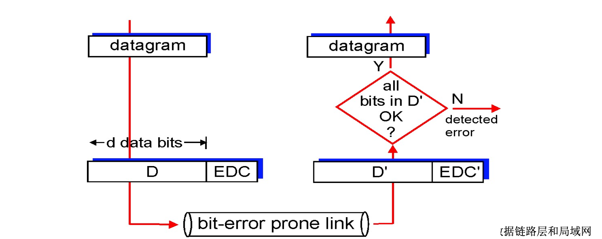

# 📘 6.2 差错检测和纠正 (Error Detection and Correction)

> 来源说明：计算机网络教材（郑老师）第6.2节 | 本节涵盖：差错检测与纠正的基本原理、三种核心方法（奇偶校验、Internet校验和、CRC循环冗余校验）及其性能分析

---

## 🧠 核心概念总览（严格按原文顺序）

- [*知识点1: 差错检测的基本框架*](#id1)
- [*知识点2: 差错检测的非绝对性*](#id2)
- [*知识点3: 单bit奇偶校验*](#id3)
- [*知识点4: 2维奇偶校验*](#id4)
- [*知识点5: Internet校验和*](#id5)
- [*知识点6: CRC循环冗余校验原理*](#id6)
- [*知识点7: CRC的数学实现*](#id7)
- [*知识点8: CRC检错性能*](#id8)

---

<a id="id1"></a>
## ✅ 知识点1: 差错检测的基本框架

**理论**
- **EDC**(`Error Detection and Correction bits`)：差错检测和纠正位，即**冗余位**
- **D**(`Data`)：被差错检测保护的数据字段，可以包含头部字段
- 发送方将数据 `D` 和冗余位 `EDC` 组合成发送帧：`[D | EDC]`
- 接收方收到的是 `D'` 和 `EDC'`，经过**易错链路**(`bit-error prone link`) 传输后可能产生比特翻转
- 接收方根据 `D'` 重新计算，与 `EDC'` 比对，判断数据是否完好

**教材示例**



> - ⚠️ **关键区分**：EDC 不是数据本身的一部分，是**额外添加的冗余信息**，用于保护D的完整性
> - 💡 **理解技巧**：EDC 就像快递的防伪标签——标签本身不是商品，但用来验证商品有没有被调包


---

<a id="id2"></a>
## ✅ 知识点2: 差错检测的非绝对性

**残存错误**
- **错误检测不是100%可靠的！**
- EDC错了代表一定错误，但是没错不代表一定不错，这些未被检测出来的错误被称为**残存错误**
  >- ⚠️ **关键区分**：差错检测是**概率性保证正确**，不是绝对保证。EDC 的设计目标是让漏检概率低到可以接受的程度
- 任何差错检测方案都**会漏检一些错误**，但漏检概率很低
- **更长的 EDC 字段**可以得到更好的检测和纠正效果
    > - 💡 **理解技巧**：CRC-32 比 CRC-8 强，就像32位密码比8位密码难猜——位数越长，"猜对"的概率越低
- 核心权衡：**冗余开销** vs **检测能力**


---

<a id="id3"></a>
## ✅ 知识点3: 单bit奇偶校验

**理论**
- **单bit奇偶校验**(`single-bit parity check`)：在 `d` 个数据位后面附加 **1 个奇偶校验位**
- 两种模式：
  - **偶校验**(`even parity`)：附加校验位使得 `d+1` 位中 **1 的个数为偶数**
  - **奇校验**(`odd parity`)：附加校验位使得 `d+1` 位中 **1 的个数为奇数**
- 只能**检测单个bit级错误**：当且仅当有**奇数个bit发生翻转**时才能检测出错误
- 如果有**偶数个bit同时翻转**，奇偶校验**无法检出**

**教材示例**
```
d data bits          parity bit
0111000110101011  |  0
                 ↑
         1的个数为偶数 → 校验位为0
```

**注意点**
- ⚠️ **关键限制**：单bit奇偶校验只能检测**奇数个bit错误**。如果2个bit同时翻转，1的总数奇偶性不变，**漏检！**
- 💡 **理解技巧**：奇偶校验就像数人数——如果有人偷偷走了，但同时又混进来一个，总数没变，你就发现不了
- 📋 **术语提醒**：奇偶校验 = parity check，偶校验 = even parity，奇校验 = odd parity

---

<a id="id4"></a>
## ✅ 知识点4: 2维奇偶校验

**理论**
- **2维奇偶校验**(`2-dimensional parity`)：将数据位组织成**二维矩阵**，对每一行和每一列分别计算奇偶校验位
- 相比单bit校验，能**检测并纠正单个bit错误**
- **检测原理**：
  - 如果某行和某列的校验位同时出错，交点处的bit就是出错位
  - 可以**精确定位**错误位置并**纠正**
- **检测能力**：能检测所有 1-bit、2-bit、3-bit 错误，以及大多数更高位数的错误

**教材示例**
```
          column parity
       d₁,₁  ...  d₁,ⱼ | d₁,ⱼ₊₁(row parity)
       d₂,₁  ...  d₂,ⱼ | d₂,ⱼ₊₁
       ...   ...  ...  | ...
       dᵢ,₁  ...  dᵢ,ⱼ | dᵢ,ⱼ₊₁
       ----------------+--------
       dᵢ₊₁,₁ ... dᵢ₊₁,ⱼ| dᵢ₊₁,ⱼ₊₁
          ↑
    column parity

Example:
10101|1    10101|1    ← original
11110|0    11100|0    ← 1-bit error at row2 col4
01110|1    01110|1
00101|0    00101|0
------     ------
00010      01010
no errors  correctable single bit error
```

**注意点**
- ⚠️ **关键能力升级**：2维奇偶校验不只是"检测"，还能"纠正"单个bit错误——定位到行列交叉点即可翻转修复
- ⚠️ **局限**：2-bit错误可以被检测出（至少2行或2列校验出错），但**不一定能定位纠正**
- 💡 **理解技巧**：就像Excel表格的行列交叉定位——行校验说"第三行有问题"，列校验说"第五列有问题"，交点就是具体出错单元格
- 📋 **术语提醒**：2维奇偶校验 = two-dimensional parity check，纠正 = correction

---

<a id="id5"></a>
## ✅ 知识点5: Internet校验和

**理论**
- **Internet校验和**(`Internet Checksum`)：用于检测传输报文段时的错误（如位翻转）
- **应用范围**：主要用在**传输层**（TCP、UDP头部），而非链路层
- **发送方操作**：
  1. 将报文段看成**16-bit整数序列**
  2. 计算这些16-bit整数的**和**（1's complement sum，补码和）
  3. 发送方将 `checksum` 的值放在"UDP校验和"字段
- **接收方操作**：
  1. 计算接收到的报文段的**校验和**
  2. 检查是否与**携带的校验和字段值一致**
  3. **不一致**：检出错误
  4. **一致**：没有检出错误，但**可能还是有错误**（存在漏检可能）
- **简单检查方法**：全部加起来看是不是全1（在1's complement表示中，和为全1表示正确）

**教材示例**
```
发送方：
  将报文段看作 16-bit 整数序列
  计算校验和 = 和(1的补码和)
  将 checksum 放在 UDP 校验和字段

接收方：
  计算接收报文段的校验和
  检查 计算值 == 携带值 ?
    N → 检出错误
    Y → 未检出错误（但可能有错！）
```

**注意点**
- ⚠️ **关键区分**：Internet校验和用的是 **1's complement sum（1的补码和）**，不是普通算术和。1's complement的溢出要回卷（wrap around）
- ⚠️ **关键区分**：Internet校验和主要用在**传输层**（UDP/TCP），链路层通常用**CRC**
- 💡 **理解技巧**：1's complement和就像"逢65535进1，进位加到最低位"（循环进位），这是为了统一处理正负数
- 🔄 **知识关联**：第3章RDT中的校验和就是此机制，UDP头部有16位校验和字段
- 📋 **术语提醒**：校验和 = checksum，1's complement sum = 1的补码和

---

<a id="id6"></a>
## ✅ 知识点6: CRC循环冗余校验原理

**理论**
- **CRC**(`Cyclic Redundancy Check`)：循环冗余校验，是一种**强大的差错检测编码**
- 核心思想：将数据 `D` 看成**二进制的数据**（一个二进制数）
- **生成多项式**(`Generator Polynomial`) **G**：双方协商的 `r+1` 位模式（对应 `r` 次多项式）
- **目标**：选择 `r` 位 CRC附加位 `R`，使得 `<D, R>`（即 `D` 左移 `r` 位后接上 `R`）**正好被 `G` 整除**（模2除法，即XOR操作）
- **发送方**：将数据 `D` 左移 `r` 位（相当于乘以 $2^r$），附加 `R`，发送 `<D, R>`
- **接收方**：用已知的 `G` 去除收到的 `<D, R>`。如果余数为0，认为无错；如果非0，检出错误

**教材示例/公式**
```
D: data bits to be sent
R: CRC bits (r bits)
G: generator polynomial (r+1 bits)

发送端:
         ←─ d bits ──→←─ r bits ──→
        ┌─────────────┬──────────────┐
        │      D      │      R       │
        └─────────────┴──────────────┘
                     ↑
                R = remainder[ D·2^r / G ]

数学公式:
D · 2^r  XOR  R  =  nG  （n为整数，表示能被G整除）
等价于:
D · 2^r  =  nG  XOR  R
等价于:
两边同除 G，得到余数 R:
R = remainder[ D·2^r / G ]
```

**注意点**
- ⚠️ **关键区分**：CRC 用的是**模2运算（XOR）**，不是普通算术除法。在模2下，加法和减法都是XOR
- ⚠️ **关键区分**：`G` 是双方**预先协商**的，不是发送的，发送的额外开销只有 `R`（`r` 位）
- 💡 **理解技巧**：CRC 就像"找一个尾巴 `R`，让数据+尾巴组成的数能被约定的除数 `G` 整除"。接收方检查"能不能整除"来判断对错
- 📋 **术语提醒**：CRC = Cyclic Redundancy Check，生成多项式 = generator polynomial，模2除法 = modulo-2 division

---

<a id="id7"></a>
## ✅ 知识点7: CRC的数学实现

**理论**
- **模2除法**：二进制多项式的除法，运算规则与异或(`XOR`)相同：
  - $0 + 0 = 0$，$0 + 1 = 1$，$1 + 0 = 1$，$1 + 1 = 0$（无进位）
  - 减法与加法相同
- **计算步骤**：
  1. 数据 `D` 后面补 `r` 个0（即 $D \times 2^r$）
  2. 用生成多项式 `G`（`r+1` 位）做模2除法
  3. 得到的**余数**就是 `R`（`r` 位）
  4. 发送 $D \cdot 2^r + R$（模2加法即XOR）

**教材示例/公式**
```
Example: CRC calculation

G = 1001 (4 bits, r+1=4, so r=3)
D = 101110 (6 bits)

Step 1: D后面补 r=3 个 0 → 101110000
Step 2: 101110000 ÷ 1001 (模2除法)

       101011
    ┌───────────
1001 │ 101110000
     │ 1001
     │ ────
     │  0110
     │  0000
     │  ────
     │   1100
     │   1001
     │   ────
     │    1010
     │    1001
     │    ────
     │     0110
     │     0000
     │     ────
     │      1100
     │      1001
     │      ────
     │       011  ← R = 011 (r=3 bits)

Step 3: 发送 D·2^r XOR R = 101110011
```

**注意点**
- ⚠️ **关键区分**：模2除法**不考虑借位/进位**，每一位的运算独立进行。竖式计算中，每次用 `G` 对齐被除数最高位的1进行XOR
- 💡 **理解技巧**：模2除法就像玩"消消乐"——每次在最高位的1处对齐G做XOR，消掉最高位的1，重复直到剩余位数小于G的位数，剩下的就是余数
- 📋 **术语提醒**：模2除法 = modulo-2 division = XOR division，余数 = remainder

---

<a id="id8"></a>
## ✅ 知识点8: CRC检错性能

**理论**
- **突发错误**(`burst error`)：连续多个bit发生翻转。突发**长度**(`burst length`) 是从第一个错误bit到最后一个错误bit的位数
- CRC 检错性能描述（以生成多项式次数为 `r`）：
  - ✅ **能够检查出所有的 1-bit 错误**
  - ✅ **能够检查出所有的双 bits 错误**
  - ✅ **能够检查出所有长度 ≤ r 位的突发错误**
  - ⚠️ 出现长度为 **r+1** 的突发错误，检查不出的概率是 $\frac{1}{2^{r-1}}$
  - ⚠️ 出现长度 **大于 r+1** 的突发错误，检查不出的概率是 $\frac{1}{2^r}$

**教材示例/公式**
$$P_{\text{undetected}}(r+1) = \frac{1}{2^{r-1}}$$

$$P_{\text{undetected}}(>r+1) = \frac{1}{2^r}$$

**注意点**
- ⚠️ **关键结论**：CRC-32（`r=32`）对长度>33的突发错误，漏检概率只有 $\frac{1}{2^{32}}$，约 2.3×10⁻¹⁰，极其可靠
- 💡 **理解技巧**：CRC 的"r"就像"安检门的灵敏度"。r越大，能检出的突发错误长度越长，漏检概率越低。32位CRC相当于32道安检关卡
- 🔄 **知识关联**：以太网用CRC-32，802.11 WiFi用CRC-32，ATM也用CRC，这就是为什么CRC是链路层主流检错方案
- 📋 **术语提醒**：突发错误 = burst error，突发长度 = burst length，生成多项式次数 = degree of generator polynomial

---

## 🔑 核心要点总结

1. **差错检测基本模型**：发送方发送 `D+EDC`，接收方通过链路后得到 `D'+EDC'`，通过重新计算比对来检测错误
2. **检测非绝对**：任何EDC方案都有漏检可能，更长的EDC位可以提供更好的检测能力
3. **奇偶校验**：单bit校验只能检出奇数个错误；2维校验能检测并纠正单个bit错误，通过行列交叉定位
4. **Internet校验和**：16-bit整数序列的1's complement和，主要用于传输层（TCP/UDP），接收方比对计算值与携带值
5. **CRC核心**：用模2除法（XOR）计算余数R，使`D·2^r + R`能被生成多项式G整除，接收方检查余数是否为0
6. **CRC性能**：能检出所有1-bit、2-bit和长度≤r的突发错误；长度r+1的突发错误漏检率1/2^(r-1)；更长突发错误漏检率1/2^r

---

## 📌 考试速记版

- **关键机制**：
  - 奇偶校验：加1位使1的总数为偶/奇，检奇数个错误
  - 2维校验：行列双校验，可定位并纠正1-bit错误
  - Internet校验和：16-bit整数的1's complement和，用于TCP/UDP
  - CRC：$R = \text{remainder}[D \cdot 2^r / G]$，模2除法

- **易混淆概念对比**：

| 方法 | 冗余位 | 检测能力 | 纠正能力 | 应用场景 |
|------|--------|----------|----------|----------|
| 单bit奇偶校验 | 1位 | 奇数个错误 | ❌ 无 | 简单场景 |
| 2维奇偶校验 | m+n+1位 | 大多数错误 | ✅ 1-bit | 内存校验 |
| Internet校验和 | 16位 | 较强 | ❌ 无 | **传输层** |
| CRC-r | r位 | 极强 | ❌ 无 | **链路层** |

- **CRC关键公式**：
  - $D \cdot 2^r \text{ XOR } R = nG$
  - $R = \text{remainder}[D \cdot 2^r / G]$
  - 漏检概率：$r+1$ 突发错误 → $\frac{1}{2^{r-1}}$；$>r+1$ → $\frac{1}{2^r}$

- **常见考试陷阱**：
  - ❌ "CRC可以纠正错误" → CRC**只能检测**，不能纠正（纠正需要额外的纠错码如Hamming码）
  - ❌ "偶数个bit翻转奇偶校验一定能检出" → 是**奇数个**能检出，偶数个**不能**检出
  - ❌ "Internet校验和用于链路层" → 主要用于**传输层**，链路层用CRC
  - ❌ "CRC用普通除法" → CRC用**模2除法（XOR）**，不是算术除法

**记忆口诀**：奇偶一维检单数，二维行列可纠正；校验和，十六位，传输层里放UDP；CRC用模二，生成多项式来约定；小于等于r全检出，r加一漏检二的负r次方！
