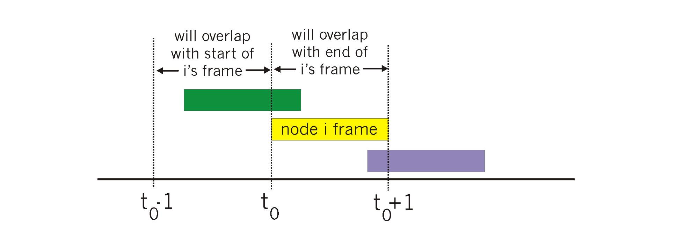
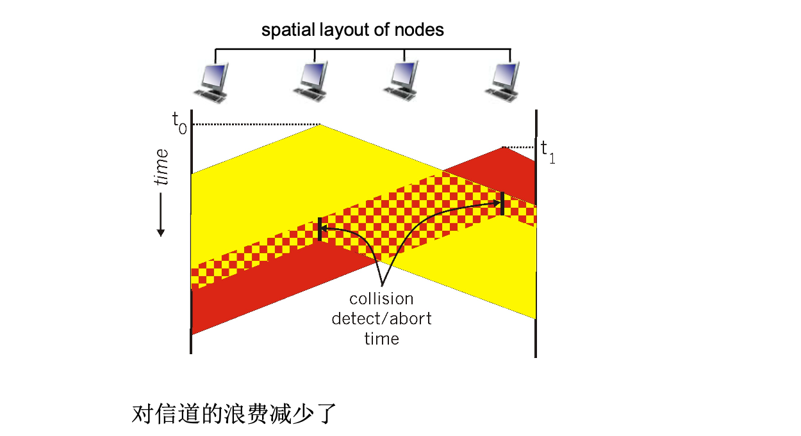

# 📘 [章节 6.3] 多路访问协议 (Multiple Access Protocol)

> 来源说明：郑老师《计算机网络》第6章第3节 | 本节涵盖：共享广播信道下的多路访问控制协议原理与分类

---

## 🧠 核心概念总览（严格按原文顺序）

- [*知识点1: 多路访问链路类型与协议概述*](#id1)
- [*知识点2: 理想的多路访问协议*](#id2)
- [*知识点3: MAC协议分类总览*](#id3)
- [*知识点4: 信道划分MAC协议 — TDMA与FDMA*](#id4)
- [*知识点5: 码分多路访问 CDMA*](#id5)
- [*知识点6: 随机存取协议：ALOHA协议 — 时隙ALOHA与纯ALOHA*](#id6)
- [*知识点7: CSMA载波侦听多路访问*](#id7)
- [*知识点8: CSMA/CD 冲突检测与以太网算法*](#id8)
- [*知识点9: CSMA/CA 冲突避免与802.11*](#id9)
- [*知识点10: 冲突避免机制 — RTS-CTS交换*](#id10)
- [*知识点11: 线缆接入网络 DOCSIS*](#id11)
- [*知识点12: 轮流MAC协议 — 令牌传递*](#id12)
- [*知识点13: MAC协议总结与比较*](#id13)

---

<a id="id1"></a>
## ✅ 知识点1: 多路访问链路类型与协议概述


链路可分为两种类型：
- **点对点链路`Point-to-Point Link`**：连接单个发送方与单个接收方
  - **拨号访问的PPP`Point-to-Point Protocol`**
  - 以太网交换机和主机之间的点对点链路
- **多点链接/广播链路`Broadcast Link`**（共享线路或媒体）：多个发送方和接收方连接在同一共享信道上
  - **传统以太网`Traditional Ethernet`**
  - **HFC上行链路`HFC Upstream Link`**
  - **802.11无线局域网`802.11 Wireless LAN`**
  - > ⚠️ **关键区分**：点对点链路不存在多路访问问题，只有广播链路需要MAC协议


**多路访问问题**：
- 单个共享的广播型链路，多个节点共享同一信道
- **2个或更多站点同时传送** → 产生**冲突`collision`**：
  - 多个节点在同一时刻发送，则收到2个或多个信号叠加
  - 信号相互干扰，导致传输失败

**多路访问协议`Multiple Access Protocol`**（又称**介质访问控制协议MAC`Medium Access Control`**）：
- **分布式算法**，决定节点如何使用**共享信道**
- 即：**决定节点什么时候可以发送？**
- 关于共享控制的通信必须借助信道本身传输（没有带外的信道）
  - 各节点使用其协调信道使用
  - 用于传输控制信息
- > 🔄 **知识关联**：MAC协议工作在数据链路层的MAC子层

---

<a id="id2"></a>
## ✅ 知识点2: 理想的多路访问协议

**理论**

给定：$R$ bps的广播信道

**必要条件（理想特性）**：
1. **单节点独占时全速率**：当一个节点要发送时，可以 $R$ 速率发送
2. **多节点均分时平均速率**：当 $M$ 个节点要发送，每个可以以 $R/M$ 的平均速率发送
3. **完全分布的`Fully Distributed`(无中心控制节点)**：
   - 没有特殊节点协调发送
   - 没有时钟和时隙的同步
4. **简单**


---

<a id="id3"></a>
## ✅ 知识点3: MAC协议分类总览


MAC协议分为**3大类**：

**1. 信道划分`Channel Partitioning`**
- 把信道划分成小片（时间、频率、编码）
- 分配片给每个节点专用
- 代表协议：**TDMA**、**FDMA**、**CDMA**

**2. 随机访问`Random Access`**
- 信道不划分，允许冲突
- **冲突后恢复**（检测冲突并重传）
- 代表协议：**ALOHA**、**CSMA**、**CSMA/CD**、**CSMA/CA**

**3. 依次轮流`Taking Turns`**
- 节点依次轮流使用信道
- 但是有很多数据传输的节点可以获得较长的信道使用权
- 代表协议：**令牌传递`Token Passing`**、**轮询`Polling`**


> 🔄 **知识关联**：高负载信道划分好，低负载随机访问好，轮流试图取两者优点


---

<a id="id4"></a>
## ✅ 知识点4: 信道划分MAC协议 — TDMA与FDMA


**TDMA `Time Division Multiple Access`（时分多址）**
- **轮流使用信道**，信道的时间分为**周期`cycle`**
- 每个站点使用每周期中**固定的时隙**（长度 = 帧传输时间）
- 传输帧
- 如果站点**无帧传输**，时隙空闲 → **浪费**


**FDMA `Frequency Division Multiple Access`（频分多址）**
- 信道的有效频率范围被分成一个个小的**频带**
- 每个站点被分配一个**固定的频段**
- 分配给站点的频段如果没有被使用，则**空闲浪费**


- > ⚠️ **关键缺点**：信道划分协议的共同问题是**低负载时浪费严重** — 哪怕只有一个节点有数据，也只能用1/N的信道容量


---

<a id="id5"></a>
## ✅ 知识点5: 码分多路访问 CDMA


**CDMA `Code Division Multiple Access`（码分多址）**
- 所有站点在整个频段上**同时进行传输**，采用**编码原理**加以区分
- **完全无冲突**
- 假定：信号同步很好，线性叠加

**类比理解**
- **TDMA**：不同的人在**不同的时刻**讲话
- **FDMA**：不同的组在**不同的房间**里通信
- **CDMA**：不同的人使用**不同的语言**讲话（靠语言区分）

> - ⚠️ **关键前提**：CDMA要求**信号同步良好**且能实现**线性叠加分离**，这是其实现无冲突的核心假设
> - 🔄 **知识关联**：CDMA广泛应用于3G移动通信（WCDMA、CDMA2000）


---

<a id="id6"></a>
## ✅ 知识点6: 随机存取协议：ALOHA协议 — 时隙ALOHA与纯ALOHA

**随机存取协议核心特征**
- 当节点有帧要发送时，以信道带宽的**全部 $R$ bps**发送
- **没有节点间的预先协调**
- 两个或更多节点同时传输，会发生**冲突`collision`**
- **随机存取协议规定**：如何检测冲突、如何从冲突中恢复（如：通过稍后的重传）

**时隙ALOHA `Slotted ALOHA`**

**假设**：
- 所有帧是等长的
- 时间被划分成相等的**时隙**(slot)，每个时隙可发送一帧
- 节点只在**下一个时隙开始时**启动发送，本时隙已经开始不会启动
- 节点之间在**时钟上是同步的**
- 如果两个或多个节点在一个时隙传输，所有的站点都能检测到冲突

**运行**：
- 当节点获取新的帧，在**下一个时隙传输**
- 传输时没有检测到冲突 → **成功**
- 检测时如果检测到冲突，**失败** → 节点在每一个随后的时隙以**概率 $p$** 重传帧直到成功


**优点**：
- 节点可以以信道带宽**全速率连续传输**
- **高度分布**：仅需要节点之间在时隙上的同步
- **简单**

**缺点**：
- 存在**冲突**，浪费时隙
- 即使有帧要发送，仍然有可能存在**空闲的时隙**，浪费了
- 需要**时钟上同步**
- 节点检测冲突的时间 $<$ 帧传输的时间
- **必须传完**

**时隙ALOHA效率分析**

效率 = 成功传输帧的时隙所占比例

**假设** $N$ 个节点，每个节点都有很多帧要发送，在每个时隙中的传输概率是 $p$

- 一个节点成功传输概率：$p(1-p)^{N-1}$
- 任何一个节点的成功概率：$Np(1-p)^{N-1}$
- $N$ 个节点的最大效率，求出使 $f(p) = Np(1-p)^{N-1}$ 最大的 $p^*$
- 代入 $p^*$ 得到最大效率：

$$f(p^*) = N \cdot \frac{1}{N} \cdot \left(1 - \frac{1}{N}\right)^{N-1} = \left(1 - \frac{1}{N}\right)^{N-1}$$

- $N$ 为无穷大时的极限：

$$\lim_{N \to \infty} \left(1 - \frac{1}{N}\right)^{N-1} = \frac{1}{e} \approx 0.37$$

**最好情况：信道利用率 37%**

**纯ALOHA `Pure ALOHA`**

- **无时隙**，简单、无须节点间在时间上同步
- 当有帧需要传输：**马上传输**
- **冲突的概率增加**：
  - 帧在 $t_0$ 发送，和其它在 $[t_0-1, t_0+1]$ 区间内开始发送的帧冲突
  - 和当前帧冲突的区间（其他帧在此区间开始传输）增大了一倍



**纯ALOHA效率分析**：

$$P(\text{指定节点成功}) = P(\text{该节点传输}) \cdot P(\text{其它节点在}[t_0-1, t_0]\text{不传}) \cdot P(\text{其它节点在}[t_0, t_0+1]\text{不传})$$

$$= p \cdot (1-p)^{N-1} \cdot (1-p)^{N-1} = p(1-p)^{2(N-1)}$$

选择最佳的 $p$，$N$ 趋向无穷大：

$$\lim_{N \to \infty} \text{效率} = \frac{1}{2e} \approx 17.5\%$$

**效率比时隙ALOHA更差了！**

> - ⚠️ **关键数据**：时隙ALOHA最大效率 **37%**，纯ALOHA最大效率 **17.5%** — 这是常考数字
> - 💡 **理解技巧**：纯ALOHA效率低因为它有2个"危险区间"（前后各一帧时间），冲突窗口翻倍


---

<a id="id7"></a>
## ✅ 知识点7: CSMA载波侦听多路访问


**CSMA `Carrier Sense Multiple Access`（载波侦听多路访问）**

**核心思想：先听后发**

- 在发送前**先侦听信道**`Listen Before Talk`
  - 如果侦听到信道**空闲** → **传送整个帧**
  - 如果侦听到信道**忙** → **推迟传送**

**人类类比**：**不要打断别人正在进行的说话！**

**CSMA冲突**

- **冲突仍然可能发生**：由<b>传播延迟`propagation delay`</b>造成
  - 两个节点可能侦听不到正在进行的传输
  - 因为信号还没传到对方
  - > ⚠️ **关键区分**：CSMA"先听后发"但仍然可能冲突，因为**传播延迟导致"听"和"发"不同步**
  - > 💡 **理解技巧**：两个人打电话，你说"喂"之前先听对方是否在说话，但由于延迟可能同时开口

  

- **注意**：传播延迟（距离）决定了冲突的概率（正比）
  - 节点依据本地的信道使用情况来判断全部信道的使用情况


---

<a id="id8"></a>
## ✅ 知识点8: CSMA/CD 冲突检测与以太网算法


**CSMA/CD `CSMA with Collision Detection`（带冲突检测的CSMA）**

**核心改进**：边发边听，发现冲突立即停止

- **载波侦听CSMA**：和CSMA中一样发送前侦听信道
  - 没有传完一个帧就可以在**短时间内检测到冲突**
  - 冲突发生时则**传输终止**，减少对信道的浪费

- **冲突检测CD技术**，**有线局域网**中容易实现：
  - 检测**信号强度**，比较传输与接收到的信号是否相同
  - 通过周期的**过零点检测**

- **人类类比**：**礼貌的对话人** — 说话时发现别人也在说，就停下来



**以太网CSMA/CD算法**

1. **适配器获取数据报**，创建帧
2. **发送前**：侦听信道CS
   - 1) **闲**：开始传送帧
   - 2) **忙**：一直等到闲再发送
3. **发送过程中**，**冲突检测CD**
   - 1) **没有冲突**：成功
   - 2) **检测到冲突**：放弃，之后尝试重发
4. **发送方**适配器检测到冲突，除放弃外，还发送一个 **Jam信号**
   - 让所有听到冲突的适配器也**知道冲突**
   - **强化冲突**：让所有站点都知道冲突
   - >💡 **理解技巧**：Jam信号是一种强化信号足够强，足以喊"停！"让所有人知道撞车了，指数退避像"越来越耐心"地等
5. 如果放弃，适配器进入<b>指数退避`exponential backoff`</b>状态等待准备重发
   - 在第 $m$ 次失败后，适配器**随机选择**一个 $K \in \{0, 1, 2, ..., 2^m-1\}$
   - 等待 $K \cdot 512$ 位时，然后转到步骤2
   - **二进制指数退避算法**
  - > ⚠️ **关键机制**：CSMA/CD的核心是"边发边检测，冲突即停+Jam信号+指数退避"

**指数退避细节**

- **目标**：适配器试图适应当前负载，在一个变化的碰撞窗口中随机选择时间点尝试重发
  - 高负载：重传窗口大 → 减少冲突，但等待时间长
  - 低负载：使得各站点等待时间少，但冲突概率大

- **首次碰撞**：在 $\{0, 1\}$ 选择 $K$，延迟 $K \cdot 512$ 位时
- **第2次碰撞**：在 $\{0, 1, 2, 3\}$ 选择 $K$
- **第10次碰撞**：在 $\{0, 1, 2, 3, ..., 1023\}$ 选择 $K$

**CSMA/CD效率**

定义：
- $t_{prop}$ = LAN上2个节点的**最大传播延迟**
- $t_{trans}$ = **传输最大帧的时间**

$$\text{efficiency} = \frac{1}{1 + 5t_{prop}/t_{trans}}$$

- **效率变为1**：
  - 当 $t_{prop}$ 变成0时
  - 当 $t_{trans}$ 变成无穷大时
- **比ALOHA更好的性能**，而且**简单**、**廉价**、**分布式**！

**注意点**

- ⚠️ **关键公式**：效率公式 $\frac{1}{1 + 5t_{prop}/t_{trans}}$，当传播延迟小或帧长时效率高
- 🔄 **知识关联**：经典以太网（10Mbps/100Mbps）使用CSMA/CD，现代全双工以太网已不需要
- 📋 **术语提醒**：`Jam signal` — 阻塞信号; `exponential backoff` — 指数退避; `collision detection` — 冲突检测

---

<a id="id9"></a>
## ✅ 知识点9: CSMA/CA 冲突避免与802.11

**理论**

### 为什么无线网不能用CSMA/CD？

**无线局域网中的MAC：CSMA/CA**

- **802.11 CSMA**：发送前侦听信道，不会和其它节点正在进行的传输发生冲突
- **802.11 没有冲突检测！**
  - **无法检测冲突**：自身信号远远大于其他节点信号
  - 即使能CD：冲突 ≠ 成功（无线中检测到冲突时帧已废）

**目标**：**avoid collisions** — **CSMA/CA** (`Collision Avoidance` 冲突避免)

- 802.11 采用**事先冲突避免**，而不是在发生冲突时放弃然后重发
- 一旦发送一帧就必须发完，**不中途停止**

### 无线局域网CSMA/CA — 发送方

1. 如果站点侦测到信道空闲持续 **DIFS** (`Distributed Inter-Frame Space`) 长，则**传输整个帧**（no CD）
2. 如果侦测到信道**忙**，那么选择一个**随机回退值**，并在信道空闲时**递减该值**
   - 信道忙时，回退值**不会变化**
   - 数到 **0** 时（只在信道闲时）发送整个帧
   - 如果没有收到 **ACK**，**增加回退值**，重复步骤2

### 802.11 接收方

- 如果帧正确，则在 **SIFS** (`Short Inter-Frame Space`) 后发送 **ACK**
- 无线链路特性，需要**每帧确认**
- 由于隐藏终端问题，在接收端可能形成干扰，接收方没有正确地收到 — 链路层可靠性机制

### IEEE 802.11 MAC协议：CSMA/CA

**为什么count down到0时才发送，而不是侦听到信道空闲就马上发送？**

- 2个站点有数据帧需要发送，第三个节点正在发送
  - 2个站点等待传输，第三个节点发完，**立即发送**？
  - LAN CD：让2者听完第三个节点发完，立即发送 → **冲突**
    - 放弃当前的传输，避免了信道的浪费于无用冲突帧的发送
    - **代价**不高
  - WLAN CA：
    - **无法CD**：一旦发送就必须发完，如冲突信道浪费严重，代价高昂
    - 思想：尽量**事先避免冲突**，而不是在发生冲突时放弃然后重发
    - 听到发送的站点，分别选择随机值，回退到0发送
      - 不同的随机值，一个站点会胜利
      - 失败站点会冻结计数值，当胜利节点发完再发

**注意点**
- ⚠️ **关键区分**：有线CSMA/CD能检测冲突并立即停止，无线CSMA/CA**无法检测**只能**事先避免**
- ⚠️ **关键参数**：DIFS > SIFS，确保ACK优先于新帧发送
- 💡 **理解技巧**：CSMA/CA像"不仅先听后说，还要等倒计时结束再说，防止一群人同时开口"
- 🔄 **知识关联**：802.11 WiFi使用CSMA/CA，这是无线和有线MAC的核心差异
- 📋 **术语提醒**：`CSMA/CA` — Collision Avoidance; `DIFS` — Distributed Inter-Frame Space; `SIFS` — Short Inter-Frame Space; `ACK` — 确认帧

---

<a id="id10"></a>
## ✅ 知识点10: 冲突避免机制 — RTS-CTS交换

**理论**

### IEEE 802.11 MAC协议：CSMA/CA — 无法完全避免冲突

**隐藏终端问题`Hidden Terminal Problem`**：
- **A、B相互隐藏**，C在传输
- A、B选择了随机回退值，一个节点如A胜利了，发送
  - 而B节点收不到，顺利count down到0，发送
- A、B的发送在C附近形成了**干扰**
- 除了非常接近的随机回退值：
  - A、B选择的值非常近
  - A到0后发送，但是这个信号还没到达B时
  - B也到0了，发送
  - **冲突**

### 冲突避免（续）— RTS-CTS机制

**思想**：允许发送方 **"预约"信道**，而不是随机访问该信道：
- 避免长数据帧的冲突（可选项）

**过程**：
1. 发送方首先使用CSMA向 **BS** (`Base Station` 基站/AP) 发送一个小的 **RTS** (`Request To Send`) 分组
   - RTS可能会冲突，但分组小 → 浪费信道较少
2. BS广播 **clear-to-send CTS** 作为RTS的响应
   - CTS能够被所有涉及到的节点听到
3. 发送方发送**数据帧**
4. 其它节点**抑制发送**

**关键结论**：**采用小的预约分组，可以完全避免数据帧的冲突**

### 冲突避免：RTS-CTS交换（图示过程）

```
A → AP: RTS(A)      [预约请求]
AP → A/B: CTS(A)    [允许A发送，B听到后保持沉默]
A → AP: DATA(A)     [发送数据]
AP → A: ACK(A)      [确认接收]
```

**注意点**
- ⚠️ **关键机制**：RTS-CTS的核心是"用小帧预约，用大帧传输"，牺牲一点开销换取数据帧不冲突
- 💡 **理解技巧**：RTS-CTS像餐厅"先打电话预约包厢，再去吃饭"，避免到了发现没位置
- 🔄 **知识关联**：RTS-CTS是解决隐藏终端问题的经典方案，但增加开销所以是可选的
- 📋 **术语提醒**：`RTS` — Request To Send; `CTS` — Clear To Send; `Hidden Terminal` — 隐藏终端

---

<a id="id11"></a>
## ✅ 知识点11: 线缆接入网络 DOCSIS

**理论**

### 线缆接入网络架构

- **CMTS** (`Cable Modem Termination System`)：电缆调制解调器端接系统
- **CM** (`Cable Modem`)：电缆调制解调器
- **HFC** (`Hybrid Fiber Coaxial`)：混合光纤同轴网络

### 下行信道
- 多个40Mbps下行（广播）信道，**FDM**
- 下行：通过FDM分成若干信道，互联网、数字电视等
- 互联网信道：只有1个CMTS在其上传输

### 上行信道
- 多个30 Mbps上行的信道，**FDM**
- **多路访问**：所有用户使用
  - 接着**TDM分成微时隙**
  - 部分时隙：**分配**（给特定用户）
  - 部分时隙：**竞争**

### DOCSIS：`Data Over Cable Service Interface Specification`

- 采用**TDM**方式将**上行信道**分成若干**微时隙**
- **MAP** 指定站点采用分配给它的微时隙上行数据传输：**分配**
- 在**特殊的上行微时隙**中：各站点**请求**上行微时隙：**竞争**
  - 各站点对于该时隙的使用是**随机访问**的
  - 一旦碰撞（请求不成功，结果是在下行的MAP中没有为它分配），则**二进制退避**选择时隙再传输

### 下行信道（续）
- 在下行MAP帧中：CMTS告诉各节点**微时隙分配方案**，分配给各站点的上行微时隙
- 另外：**头端传输下行数据**（给各个用户）

**注意点**
- ⚠️ **关键区分**：DOCSIS上行是**TDM+竞争+分配**的混合方案，下行是广播无竞争
- 💡 **理解技巧**：DOCSIS上行像"先预约时段（竞争），再被分配到固定时段（分配）"
- 🔄 **知识关联**：HFC网络上行多路访问是实际部署的MAC协议混合使用案例
- 📋 **术语提醒**：`DOCSIS` — 电缆数据服务接口规范; `CMTS` — 电缆调制解调器端接系统; `MAP` — 微时隙分配消息

---

<a id="id12"></a>
## ✅ 知识点12: 轮流MAC协议 — 令牌传递

**理论**

### 为什么需要轮流协议？

- **信道划分MAC协议**：共享信道在高负载时是有效和公平的，但在**低负载时效率低下**
  - 只能等到自己的时隙开始发送或者利用1/N的信道频率发送
  - 当只有一个节点有帧传时，也只能够得到1/N个带宽分配

- **随机访问MAC协议**：在**低负载时效率高**，单个节点可以完全利用信道全部带宽；但在**高负载时**，冲突开销较大，效率极低，时间很多浪费在冲突中

- **轮流协议**：**有2者的优点！**

### 轮询 `Polling`

- **主节点**邀请**从节点**依次传送
- 从节点一般比较 **"dumb"**

**缺点**：
- **轮询开销**：轮询本身消耗信道带宽
- **等待时间**：每个节点需等到主节点轮询后开始传输，即使只有一个节点，也需要等到轮询一周后才能被发送
- **单点故障**：主节点失效时造成整个系统无法工作

### 令牌传递 `Token Passing`

- **控制令牌`token`** 循环从**一个节点**到**下一个节点**传递
- **令牌报文**：特殊的帧

**缺点**：
- **令牌开销**：本身消耗带宽
- **延迟**：只有等到**抓住令牌**，才能传输
- **单点故障**：令牌丢失系统级故障，整个系统无法传输
  - 复杂机制重新生成令牌

**注意点**
- ⚠️ **关键对比**：轮询有主从结构（中心化），令牌传递是纯分布式环形拓扑
- 💡 **理解技巧**：令牌传递像击鼓传花，拿到花（令牌）才能说话
- 🔄 **知识关联**：令牌环网（Token Ring）和FDDI使用令牌传递
- 📋 **术语提醒**：`Polling` — 轮询; `Token Passing` — 令牌传递; `Master/Slave` — 主从

---

<a id="id13"></a>
## ✅ 知识点13: MAC协议总结与比较

**理论**

### 多点接入问题

对于一个**共享型介质**，各个节点**如何协调对它的访问和使用？**

### 协议分类总结

| 类别 | 代表协议 | 核心机制 |
|------|---------|---------|
| **信道划分** | TDMA、FDMA、CDMA | 按时间、频率或者编码划分资源 |
| **随机访问（动态）** | ALOHA、S-ALOHA、CSMA、CSMA/CD | 按需竞争，冲突后恢复 |
| **随机访问（有线）** | CSMA/CD：802.3 Ethernet网中使用 | 边发边检测 |
| **随机访问（无线）** | CSMA/CA：802.11 WLAN中使用 | 事先避免冲突 |
| **依次轮流协议** | 令牌环、蓝牙、FDDI | 集中：由中心节点轮询；分布：通过令牌控制 |

### 各协议适用场景

- **信道划分**：
  - 高负载时有效、公平
  - 低负载时效率低（浪费未使用时隙/频带）

- **随机访问**：
  - 低负载时效率高（无预分配开销）
  - 高负载时冲突严重，效率低

- **轮流协议**：
  - 试图结合两者优点
  - 但有令牌/轮询开销和单点故障问题

**注意点**
- ⚠️ **关键记忆**：三类协议的负载特性对比是常考重点
- 💡 **理解技巧**：高负载→分蛋糕稳但慢；低负载→抢话筒快但容易撞；轮流→排队但可能等太久
- 🔄 **知识关联**：实际网络根据介质特性选择：有线以太网→CSMA/CD；WiFi→CSMA/CA；令牌环→令牌传递
- 📋 **术语提醒**：`Ethernet` — 以太网; `WLAN` — 无线局域网; `Token Ring` — 令牌环

---

## 🔑 核心要点总结

1. **广播链路需要MAC协议**：点对点链路无冲突问题，只有共享广播信道才需要协调多个节点的发送
2. **三类MAC协议的本质区别**：信道划分（预分配资源）、随机访问（竞争+恢复）、轮流（排队使用）
3. **效率对比**：时隙ALOHA(37%) > 纯ALOHA(17.5%)；CSMA/CD效率随 $t_{prop}/t_{trans}$ 降低而提高
4. **有线vs无线MAC根本不同**：有线可检测冲突（CSMA/CD），无线只能事先避免（CSMA/CA）
5. **RTS-CTS预约机制**：用小控制帧开销换取大数据帧不冲突，解决隐藏终端问题
6. **指数退避算法**：冲突次数越多等待窗口越大，自适应网络负载

## 📌 考试速记版

- **关键机制**：
  - CSMA：先听后发
  - CSMA/CD：边发边检测，冲突即停+Jam+指数退避
  - CSMA/CA：先听后发+倒计时+DIFS/SIFS+ACK
  - RTS-CTS：预约机制避免数据帧冲突

- **效率公式**：
  - 时隙ALOHA：$\lim = 1/e \approx 37\%$
  - 纯ALOHA：$\lim = 1/(2e) \approx 17.5\%$
  - CSMA/CD：$\eta = \frac{1}{1 + 5t_{prop}/t_{trans}}$

- **易混淆概念对比**：
  | 特性 | CSMA/CD (有线) | CSMA/CA (无线) |
  |------|---------------|---------------|
  | 冲突处理 | 检测并停止 | 事先避免 |
  | Jam信号 | 有 | 无 |
  | ACK确认 | 不需要 | 必须 |
  | 标准 | 802.3 | 802.11 |
  | 隐藏终端 | 不存在 | 存在，需RTS-CTS |

- **常见考试陷阱**：
  - 802.11**没有**冲突检测，只有冲突避免
  - TDMA/FDMA低负载时**浪费严重**
  - 纯ALOHA冲突窗口是**2倍帧时间**（前后各一帧），所以效率是时隙ALOHA的一半
  - 指数退避中最大重传次数为**10次**（退避窗口最大到1023）

**记忆口诀**：
> "有线听边停，无线听躲等，ALOHA纯碰运气，令牌传花轮流说"
