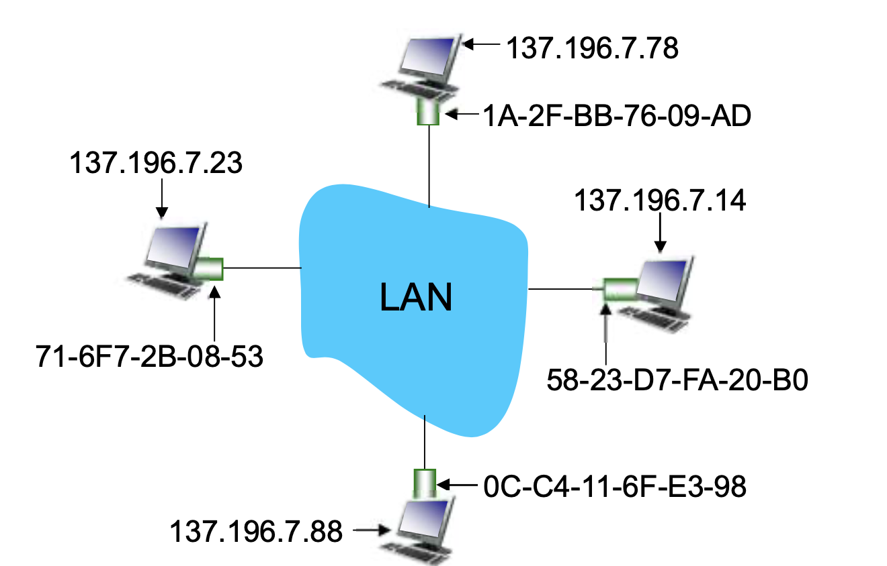
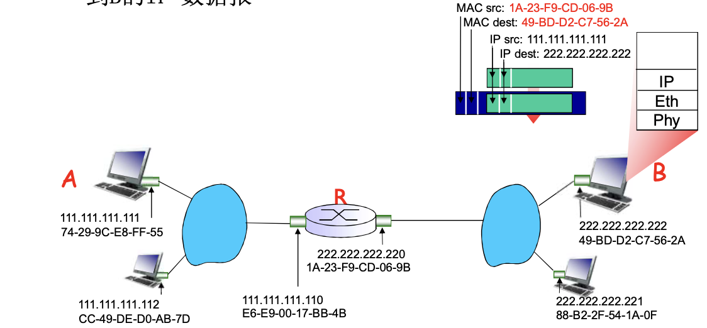

# 📘 6.4 LANs (Local Area Networks) 局域网

> 来源说明：计算机网络（郑老师）第6.4节 | 本节涵盖：局域网核心技术——MAC地址、以太网、802.11无线局域网、交换机、VLAN

---

## 🧠 核心概念总览（严格按原文顺序）

- [*知识点1: 网络地址与MAC地址分离*](#id1)
- [*知识点2: ARP协议*](#id2)
- [*知识点3: 以太网帧结构*](#id3)
- [*知识点4: CSMA/CD协议*](#id4)
- [*知识点5: 以太网物理层编码与速率*](#id5)
- [*知识点6: 802.11无线局域网标准*](#id6)
- [*知识点7: 802.11信道与关联*](#id7)
- [*知识点8: 802.11帧结构*](#id8)
- [*知识点9: 交换机自学习机制*](#id9)
- [*知识点10: 交换机过滤与转发*](#id10)
- [*知识点11: VLAN概念与动机*](#id11)
- [*知识点12: 802.1Q VLAN帧格式*](#id12)

---

<a id="id1"></a>
## ✅ 知识点1: 网络地址与MAC地址分离

**理论**
- **IP地址**是`网络层(Network Layer)`的**层次化**地址，用于跨网络数据报**路由**：
  - 使数据报到达**目的IP子网**，最后一跳到达目标节点。
  - 层次化使的IP地址路由可以子网聚集，方便计算
  - **IP地址可配置、可迁移**
- **MAC地址**是`数据链路层(Data Link Layer)`的**平面**地址48bit，用于子网内部网卡和站点的物理区分：
  - 固化在适配器`ROM`中，**全球唯一**（理论上任何2个网卡MAC地址不同）
  - MAC地址在网卡生产出来后就封装完毕
  - 格式：16进制，每2位一组，如`1A-2F-BB-76-09-AD`（6字节=48bit）。
- > 💡 **理解技巧**：MAC地址是"身份证"，IP地址是"住址"。身份证终身不变，住址可以搬家。
- > 💡 **理解技巧**：MAC地址由IEEE管理和分配，制造商购入地址空间保证唯一性


**为什么需要分离？**
- **网卡可更换**：网卡坏了，IP不变，可重新绑定到另一个网卡的MAC上
- **支持多协议**：物理网络可支持除IP外的其他网络层协议（如IPX、AppleTalk）
- **如果捆绑**：
  - 以太网只能支持IP协议；网卡每次上电重写IP
  - 如果只使用MAC地址，那么每个帧需上传到IP层判断，效率严重干扰
  - 如果只使用IP，那么无法支持其他协议

  | 特性 | IP地址 | MAC地址 |
  |------|--------|---------|
  | **层次** | 网络层（分层） | 数据链路层（平面） |
  | **可变性** | 可配置、可迁移 | 全球唯一、固化 |
  | **移动性** | 有层次，不能移动 | 平面地址，支持移动 |
  | **作用** | 网络到网络的路由 | 物理网络内节点到节点的交付 |

- > ⚠️ **关键区分**：IP地址是**分层**的，MAC地址是**平面**的。分层地址有层次结构，不能跨网络移动；平面地址支持移动。


---

<a id="id2"></a>
## ✅ 知识点2: ARP协议

**ARP概览**
- **核心问题**：已知B的IP地址，如何确定B的MAC地址？、
  - A：通过使用ARP将IP地址转换为MAC地址
- **ARP表**：每个LAN节点都有一个ARP表，记录`<IP address; MAC address; TTL>`，TTL典型值**20分钟**。
  - > TTL: 存多久之后将这个表项删掉，因为这个映射关系是变化的
- **工作流程**：
  1. A要发送帧给B，知道B的IP但ARP表中没有B的MAC
  2. A广播ARP查询包（目标MAC=`FF-FF-FF-FF-FF-FF`），LAN上所有节点收到
  3. B识别查询的是自己的IP，单播回复A自己的MAC地址
  4. A缓存`IP-to-MAC`映射直到超时
- <b>ARP是即插即用(Plug and Play)</b>的：节点自己创建ARP表项，无需管理员干预


**跨网段通信**

- 假设A和B在不同子网，中间经过路由器R：
  - **Step 1**：A查路由表，发现目标IP不在本地子网，下一跳是R的左接口IP。A通过ARP查询R左接口的MAC地址。A创建帧：MAC源=A，MAC目标=R左接口MAC，IP源=A，IP目标=B。
  - **Step 2**：R收到帧，提取IP分组，发现IP目标在右侧子网。R查ARP表发现B的MAC。R创建新帧：MAC源=R右接口MAC，MAC目标=B MAC，IP源=A（不变！），IP目标=B（不变！）。
  - **Step 3**：B收到帧，IP目标是自己的地址。
- **关键洞察**：**IP地址在跨网段传输中保持不变，MAC地址每跳都重新封装！**


- > ⚠️ **关键区分**：ARP只在**同一LAN**内工作。跨网段时，ARP解析的是**下一跳路由器接口**的MAC，而非最终目标的MAC。
- > 💡 **理解技巧**：ARP就像"问邻居要地址"——只能在同一个院子里问，出远门得先问门卫（路由器）。

---

<a id="id3"></a>
## ✅ 知识点3: 以太网帧结构

**理论**
- 以太网是**最主流的LAN技术**，市场占有率98%，廉价（30元RMB能买到100Mbps设备），从10M→100M→1G→10G→100G。

**以太帧结构（Ethernet Frame）**
```
| preamble (8B) | dest. address (6B) | source address (6B) | type (2B) | data (46-1500B) | CRC (4B) |
```

| 字段 | 长度 | 说明 |
|------|------|------|
| **前导码(Preamble)** | 8B | 7B`10101010` + 1B`10101011`，同步收发时钟 |
| **目标地址** | 6B | 目标MAC地址（本站/广播`FF-FF-FF-FF-FF-FF`/组播） |
| **源地址** | 6B | 源MAC地址 |
| **类型(Type)** | 2B | 上层协议（IP/Novell IPX/AppleTalk） |
| **数据(Payload)** | 46-1500B | 上层数据（IP数据报等） |
| **CRC** | 4B | 循环冗余校验，接收方校验，失败则丢弃 |

**服务特点**
- **无连接(Connectionless)**：帧传输前无握手过程，直接发送
- **不可靠(Unreliable)**：接收方不发送ACKs/NAKs，可能有gap，由TCP补上

**注意点**
- ⚠️ **关键区分**：前导码(Preamble)不是数据帧的一部分，是物理层用于时钟同步的。
- 💡 **理解技巧**：以太帧就像"快递包裹"——收件人地址、发件人地址、内容类型、内容本身、校验码。
- 📋 **术语提醒**：`前导码(Preamble)`用于同步；`CRC(Cyclic Redundancy Check)`是循环冗余校验；`payload`是有效载荷。

---

<a id="id4"></a>
## ✅ 知识点4: CSMA/CD协议

**理论**
- 以太网采用**二进制指数退避的CSMA/CD**（`载波侦听多路访问/冲突检测`，Carrier Sense Multiple Access with Collision Detection）。
- **核心机制**：
  1. **没有时隙**（unslotted）
  2. **NIC网卡**侦听到其他NIC在发送就不发送（载波侦听Carrier Sense）
  3. 发送时侦听到其他适配器在发送就放弃当前帧（冲突检测Collision Detection）
  4. 冲突后等待随机时间重传（随机访问Random Access）

**CSMA/CD算法**
```
1. 适配器获取数据报，创建帧
2. 发送前：侦听信道CS
   1) 闲：开始传送帧
   2) 忙：一直等到闲再发送
3. 发送过程中，冲突检测CD
   1) 没有冲突：成功
   2) 检测到冲突：放弃，发送Jam信号（48 bits，强化冲突让所有站点知道）
4. 进入指数退避状态
   - 第m次失败后，从{0,1,2,...,2^m-1}中选K
   - 等待K * 512位时，然后转到步骤2
```

**效率公式**
$$
\text{efficiency} = \frac{1}{1 + 5t_{prop}/t_{trans}}
$$
- **t_prop** = LAN上最远2个节点的传播时间
- **t_trans** = 最大帧的传输时间
- t_prop=0时效率接近1；t_trans→∞时效率接近1

**指数退避**
| 碰撞次数 | 选择范围K |
|----------|----------|
| 第1次 | {0,1} |
| 第2次 | {0,1,2,3} |
| 第3次 | {0,1,...,7} |
| 第10次 | {0,1,...,1023} |

- 对于K=1023，10Mbps以太网大约等50ms（1023 * 512 * 0.1μs）

**注意点**
- ⚠️ **关键区分**：CSMA/CD是**检测冲突**，不是**避免冲突**。检测到冲突后放弃当前帧并退避重传。
- ⚠️ **约束**：CSMA/CD只适用于**半双工**模式。全双工交换式以太网不需要CSMA/CD。
- 💡 **理解技巧**：就像开会发言——先听有没有人说话（载波侦听），说话时如果发现有人同时说话（冲突检测），就停下来等一会儿再重新说（退避重传）。
- 🔄 **知识关联**：与802.11的CSMA/CA对比——无线环境无法检测冲突，所以用冲突避免而非冲突检测。
- 📋 **术语提醒**：`Bit Time` = 1/10M = 0.1μs（10Mbps以太网）；`Jam Signal` = 48 bits，强化冲突。

---

<a id="id5"></a>
## ✅ 知识点5: 以太网物理层编码与速率

**理论**
- **802.3以太网标准**：MAC协议相同（介质访问控制和帧结构），但物理层标准不同。速率有2/10/100/1000/10Gbps，媒介有光纤、同轴电缆、双绞线。

**物理层标准**
| 标准 | 速率 | 介质 | 特点 |
|------|------|------|------|
| 10BaseT | 10 Mbps | 双绞线 | 星型拓扑，节点到HUB最大100m |
| 100BaseT | 100 Mbps | 双绞线 | 快速以太网，逻辑总线型 |
| 1000BaseT | 1 Gbps | 光纤/双绞线 | 共享模式用CSMA/CD，交换模式全双工 |

**Hub（集线器）**
- 本质是物理层中继器，从一个端口收，转发到所有其他端口
- 没有帧缓存，速率一致，所有端口在一个碰撞域

**物理层编码**
| 编码 | 使用标准 | 效率 | 特点 |
|------|---------|------|------|
| **曼彻斯特编码(Manchester)** | 10BaseT | 50% | 每bit中间跳变，20M带宽，无时钟恢复问题 |
| **4b5b编码** | 100BaseT | 80% | 4bit→5bit，保证跳变 |
| **8b10b编码** | 千兆以太网 | 80% | 8bit→10bit，保证跳变 |

**4b5b映射表**
| 数据 | 编码 | 数据 | 编码 |
|------|------|------|------|
| 0000 | 11110 | 1000 | 10010 |
| 0001 | 01001 | 1001 | 10011 |
| 0010 | 10100 | 1010 | 10110 |
| 0011 | 10101 | 1011 | 10111 |
| 0100 | 01010 | 1100 | 11010 |
| 0101 | 01011 | 1101 | 11011 |
| 0110 | 01110 | 1110 | 11100 |
| 0111 | 01111 | 1111 | 11101 |

**注意点**
- ⚠️ **关键区分**：Hub是物理层设备（广播所有端口），Switch是链路层设备（选择性转发）。Hub所有端口在同一碰撞域，Switch每个端口是独立碰撞域。
- 💡 **理解技巧**：Hub像"大喇叭"——一个人说话全屋子都听到；Switch像"智能接线员"——知道该把话转给谁。
- 📋 **术语提醒**：`Base`表示基带传输；`T`表示双绞线(Twisted Pair)；`FX/SX/BX`表示光纤类型。

---

<a id="id6"></a>
## ✅ 知识点6: 802.11无线局域网标准

**理论**
- **802.11标准族**：所有802.11标准都用`CSMA/CA`进行多路访问，都有基站模式和自组织模式。

| 标准 | 频段 | 速率 | 特点 |
|------|------|------|------|
| **802.11b** | 2.4-5 GHz | 最高11 Mbps | 无绳电话和微波炉干扰；DSSS扩频 |
| **802.11a** | 5-6 GHz | 最高54 Mbps | 更高频率，距离短，多路径影响大 |
| **802.11g** | 2.4-5 GHz | 最高54 Mbps | 与802.11b向后兼容 |
| **802.11n** | 2.4-5 GHz | 最高200 Mbps | **MIMO**多天线技术 |

**体系结构**
- **基础设施模式(Infrastructure Mode)**：无线主机 ↔ **AP(Access Point)** ↔ 分布式系统 ↔ Internet
- **BSS(Basic Service Set / "cell")** = AP + 关联主机
- **自组织模式(Ad Hoc Mode)**：只有主机，无AP，直接通信
- **ESS(Extended Service Set)**：多个BSS通过分布式系统连接

**注意点**
- ⚠️ **关键区分**：802.11a用5GHz频段（干扰少但距离短），802.11b/g用2.4GHz（兼容性好但易受干扰）。
- 💡 **理解技巧**：AP就像"无线基站"——手机（无线主机）必须通过基站（AP）才能打电话（上网）。
- 📋 **术语提醒**：`BSS` = Basic Service Set（基本服务集）；`AP` = Access Point（接入点）；`ESS` = Extended Service Set（扩展服务集）；`MIMO` = Multiple Input Multiple Output（多输入多输出）。

---

<a id="id7"></a>
## ✅ 知识点7: 802.11信道与关联

**理论**
- **802.11b频段**：2.4GHz-2.485GHz分为**11个部分重叠**的频段。AP管理员为AP选频率，邻居AP可能选同一信道造成干扰。

**关联(Association)过程**
1. **扫描所有信道**：侦听包含AP `SSID`和`MAC地址`的信标帧
   - **被动扫描(Passive Scanning)**：主机侦听AP主动发送的信标帧
   - **主动扫描(Active Scanning)**：主机发送探测，接受AP响应
2. **选择希望关联的AP**
3. **执行鉴别(Authentication)**：基于MAC、用户名口令，通过AP中继使用RADIUS服务器鉴别
4. **执行DHCP**：获得IP地址和AP所在子网前缀

**被动扫描流程**
1. AP发送信标帧(Beacon)
2. H1发送关联请求
3. AP发送关联响应

**主动扫描流程**
1. H1广播探测请求帧
2. AP发送探测响应
3. H1向选择的AP发送关联请求帧
4. AP向H1发送关联响应帧

**注意点**
- ⚠️ **关键区分**：被动扫描省电（只接收），主动扫描更快（主动询问）。
- 💡 **理解技巧**：被动扫描像"听广播找频道"——打开收音机一个个台听；主动扫描像"问路人"——主动问"哪个AP信号最好？"
- 🔄 **知识关联**：关联过程与DHCP结合——先无线连上（关联），再获取IP（DHCP）。
- 📋 **术语提醒**：`SSID(Service Set Identifier)` = 无线网络名称；`Beacon` = 信标帧，AP周期性广播；`RADIUS` = 远程认证拨号用户服务。

---

<a id="id8"></a>
## ✅ 知识点8: 802.11帧结构

**理论**
- 802.11帧有**4个MAC地址**（以太网只有2个），因为AP作为"桥梁"连接无线主机和有线网络。

**帧格式**
```
| frame control (2B) | duration (2B) | addr1 (6B) | addr2 (6B) | addr3 (6B) | seq control (2B) | addr4 (6B) | payload (0-2312B) | CRC (4B) |
```

| 地址 | 用途 |
|------|------|
| **Address 1** | 接收方（AP MAC addr） |
| **Address 2** | 发送方（Host MAC addr） |
| **Address 3** | AP连接的路由器接口MAC地址 |
| **Address 4** | 仅自组织模式使用 |

**帧控制字段(Frame Control)**
- 帧类型：**RTS, CTS, ACK, data**
- 预约传输时间的持续期（RTS/CTS）
- 帧序号（for RDT）
- 协议版本、类型、子类型、To AP、From AP等

**AP转发示例**
- 802.11帧（AP→R1）：address1=R1 MAC，address2=H1 MAC，address3=AP MAC
- 802.3帧（AP→R1以太网）：dest=R1 MAC，source=H1 MAC

**CSMA/CA**
- 无线环境**无法可靠检测冲突**（隐藏终端问题），所以用`CSMA/CA`（冲突避免Collision Avoidance）而非CSMA/CD
- 采用**RTS/CTS**机制预留信道，减少冲突

**注意点**
- ⚠️ **关键区分**：802.11有4个地址是因为AP需要知道：谁发的（addr2）、发给谁的（addr1）、AP自己连的路由器是谁（addr3）。
- 💡 **理解技巧**：AP像"翻译官"——无线端说"我发给路由器"（addr1=路由器，addr2=我，addr3=AP），AP翻译成有线端的"他从我这里发给路由器"（dest=路由器，source=我）。
- 🔄 **知识关联**：与知识点4对比——有线用CSMA/CD（能检测冲突），无线用CSMA/CA（无法检测，只能避免）。
- 📋 **术语提醒**：`RTS(Request To Send)` = 请求发送；`CTS(Clear To Send)` = 允许发送；`RDT` = Reliable Data Transfer（可靠数据传输）。

---

<a id="id9"></a>
## ✅ 知识点9: 交换机自学习机制

**理论**
- **交换机(Switch)**是链路层设备，存储转发，根据**目标MAC地址**进行选择性转发。
- **透明**：主机对交换机存在不关心，好像直接相连。
- **即插即用，自学习**：无需配置，上电自动学习。
- **多路同时传输**：每端口是独立碰撞域，全双工无碰撞，A-to-A'和B-to-B'可同时传输。

**交换表(Switch Table)**
| MAC addr | interface | TTL |
|----------|-----------|-----|
| A | 1 | 60 |
| A' | 4 | 60 |

- 每个交换机都有一个交换表，记录`<MAC地址, 接口, TTL>`

**自学习过程**
- 交换机通过**学习**得到哪些主机（MAC地址）可通过哪些端口到达
- 接收到帧时，记录**源MAC地址/进入端口**映射关系
- 例如：A向A'发送帧→帧到达交换机，源=A，进入端口1→记录`<A,1,TTL>`

**注意点**
- ⚠️ **关键区分**：交换机是**链路层**设备（看MAC地址），不是物理层（Hub）也不是网络层（路由器）。
- 💡 **理解技巧**：交换机像"智能门童"——第一次见人（新MAC）不知道住哪，就广播问（泛洪）；记住之后（学习到），直接送到房间（转发）。
- 🔄 **知识关联**：自学习是交换机的核心机制，与过滤/转发/泛洪直接相关（知识点10）。
- 📋 **术语提醒**：`Switch Table` = 交换表；`Self-Learning` = 自学习；`TTL` = Time To Live（表项生存时间）。

---

<a id="id10"></a>
## ✅ 知识点10: 交换机过滤与转发

**理论**
- 当交换机收到帧时：
  1. 记录进入链路，发送主机的MAC地址（学习）
  2. 使用目标MAC地址对交换表进行索引
  3. **如果找到目标**：
     - 目标在与源同一网段 → **过滤(Filter)**，丢弃帧
     - 目标在另一网段 → **转发(Forward)**，发到该接口
  4. **如果找不到目标** → **泛洪(Flood)**，向所有端口（除进入端口）广播

**三种操作对比**
| 操作 | 条件 | 行为 |
|------|------|------|
| **过滤(Filter)** | 目标与源在同一网段 | 丢弃帧，不需要转发 |
| **转发(Forward)** | 目标在另一已知端口 | 转发到该端口 |
| **泛洪(Flood)** | 目标不在交换表中 | 向所有端口（除进入端口）广播 |

**交换机级联**
- 交换机可被级联，形成树状结构
- 自学习机制同样适用：S1泛洪到S4，S4泛洪到S3，S3学习到C的MAC
- 多交换机协同工作，泛洪保证初始可达性

**交换机 vs 路由器 vs Hub**
| 特性 | Hub | Switch | Router |
|------|-----|--------|--------|
| **层次** | 物理层(L1) | 链路层(L2) | 网络层(L3) |
| **转发依据** | 广播 | MAC地址 | IP地址 |
| **碰撞域** | 一个 | 每端口一个 | 每端口一个 |
| **广播域** | 一个 | 一个 | 多个（可隔离） |
| **配置** | 无 | 即插即用 | 需配置子网前缀 |
| **速率** | 低 | 高 | 较低 |

**注意点**
- ⚠️ **关键区分**：泛洪(Flood)不等于广播(Broadcast)。泛洪是交换机不知道目标位置时的扩散行为，广播是帧目标地址为`FF-FF-FF-FF-FF-FF`的帧，所有节点都必须处理。
- ⚠️ **关键区分**：Hub是物理层中继器（无脑广播），Switch是链路层智能设备（学习+选择性转发）。
- 💡 **理解技巧**：过滤像"拒收快递"——发现是同一栋楼的就直接扔掉；转发像"精准配送"——知道住哪就直送；泛洪像"寻人启事"——不知道住哪就全楼喊。
- 📋 **术语提醒**：`Flooding` = 泛洪（交换机不知道目标时的行为）；`Broadcast` = 广播（目标地址全F的帧）。

---

<a id="id11"></a>
## ✅ 知识点11: VLAN概念与动机

**理论**
- **VLAN(Virtual LAN)** = 虚拟局域网，将一个物理LAN基础设施**虚拟成多个LANs**。
- **动机**：
  - CS用户搬到EE大楼，仍希望连CS交换机
  - 如果都接到一个交换机，在一个广播域——所有层2广播（ARP、DHCP）穿过整个LAN，安全性/私密性问题

**基于端口的VLAN(Port-Based VLAN)**
- 带有VLAN功能的交换机可被配置成：物理上一个交换机，虚拟成多个局域网
- 端口1-8属于VLAN A，端口9-16属于VLAN B
- 流量隔离：不同VLAN互不干扰
- 也可基于**MAC地址**定义VLAN（更灵活）
- **动态成员**：可在VLANs之间动态分配，无需物理重新连接

**VLANs间转发**
- 通过**路由器**进行转发（像通过各自交换机相联一样）
- 实际设备生产商提供**交换机+路由器的单一设备**（三层交换机）

**跨交换机VLAN**
- 多个交换机相连并共享VLANs信息
- **Trunk Port（干线端口）**：交换机间共享定义的VLAN，传输帧时携带VLAN ID信息
- 使用**802.1Q协议**增加/移除附加头部字段

**注意点**
- ⚠️ **关键区分**：VLAN是**逻辑**隔离，不是物理隔离。同一个交换机的不同端口可以属于不同VLAN。
- 💡 **理解技巧**：VLAN像"酒店楼层隔离"——同一栋楼（交换机），不同楼层（VLAN），楼层之间不能直接串门，必须经过前台（路由器）。
- 🔄 **知识关联**：与知识点10关联——交换机默认所有端口在同一广播域，VLAN将其分割成多个广播域。
- 📋 **术语提醒**：`VLAN` = Virtual LAN；`Trunk Port` = 干线端口；`三层交换机` = 同时具备交换和路由功能的设备。

---

<a id="id12"></a>
## ✅ 知识点12: 802.1Q VLAN帧格式

**理论**
- 帧在trunk端口上转发时，**不能**使用标准802.1帧，必须携带**VLAN ID信息**。
- 使用**802.1Q协议**在标准帧中插入4字节标签。

**标准帧 vs 802.1Q帧**
```
标准帧：  preamble | dest | source | type | data | CRC
802.1Q帧：preamble | dest | source | 2B Tag | 2B TCI | type | data | CRC
```

**新增字段**
| 字段 | 长度 | 说明 |
|------|------|------|
| **TPID(Tag Protocol Identifier)** | 2字节 | 值`0x8100`（81-00） |
| **TCI(Tag Control Information)** | 2字节 | 包含VLAN ID和优先级 |
| **VLAN ID** | 12bit | 标识VLAN，最多4094个VLAN |
| **Priority** | 3bit | 类似IP TOS（服务质量） |
| **CFI** | 1bit | 兼容以太网/令牌环 |

- **Recomputed CRC**：插入新字段后需重新计算CRC
- 普通主机看不到802.1Q标签，标签只在trunk端口之间
- 交换机根据VLAN ID决定向哪些端口转发

**VLAN应用场景**
1. 部门隔离（不同部门不同VLAN）
2. 安全增强（敏感数据独立VLAN）
3. 广播控制（减少广播风暴范围）
4. 灵活移动（物理位置变化，VLAN归属不变）
5. 访客网络（访客单独VLAN，隔离内部资源）

**Hub vs Switch vs Switch+VLAN vs Router**
| 特性 | Hub | Switch | Switch+VLAN | Router |
|------|-----|--------|-------------|--------|
| **碰撞域** | 一个 | 每端口一个 | 每端口一个 | 每端口一个 |
| **广播域** | 一个 | 一个 | 多个（VLAN隔离） | 多个（子网隔离） |
| **工作层次** | 物理层 | 链路层 | 链路层 | 网络层 |
| **转发依据** | 广播 | MAC | MAC+VLAN ID | IP |
| **配置** | 无 | 即插即用 | 需配置VLAN | 需配置IP/路由 |

**注意点**
- ⚠️ **关键区分**：802.1Q标签插在源地址和类型字段之间，不是帧尾。插入后CRC必须重新计算。
- ⚠️ **约束**：VLAN ID用12bit，所以最多4094个VLAN（0和4095保留）。
- 💡 **理解技巧**：802.1Q标签像"特殊邮戳"——只在交换机之间（trunk端口）的"内部快递"上盖章，普通主机收不到也看不到。
- 🔄 **知识关联**：与知识点3（以太帧结构）直接关联——802.1Q是对标准以太帧的扩展。
- 📋 **术语提醒**：`TPID` = Tag Protocol Identifier；`TCI` = Tag Control Information；`CFI` = Canonical Format Indicator。

---

## 🔑 核心要点总结

1. **MAC地址**是48bit平面地址，全球唯一，固化在ROM；**IP地址**是32bit分层地址，可配置。二者分离实现网卡可更换和多协议支持。
2. **ARP协议**在同一LAN内将IP解析为MAC，即插即用，广播查询/单播回复；跨网段时IP不变，MAC每跳重新封装。
3. **以太帧**结构：前导码(8B)+目的MAC(6B)+源MAC(6B)+类型(2B)+数据(46-1500B)+CRC(4B)；无连接、不可靠服务。
4. **CSMA/CD**先听后发、边发边检测、冲突后二进制指数退避；效率=$\frac{1}{1+5t_{prop}/t_{trans}}$；Jam信号48bits强化冲突。
5. **802.11**用CSMA/CA（非CD），有4地址帧（AP桥接无线/有线），BSS+AP架构，被动/主动扫描关联。
6. **交换机**自学习建立交换表，执行过滤/转发/泛洪；每端口独立碰撞域，全双工；与Hub（L1广播）和Router（L3 IP转发）区分。
7. **VLAN**逻辑隔离广播域，基于端口或MAC；trunk端口用802.1Q标签（4字节：TPID+TCI含VLAN ID+Priority）；VLAN间需路由器。

---

## 📌 考试速记版

**关键机制**
- ARP：广播→单播，即插即用，20分钟TTL
- CSMA/CD：先听后发→边发边检测→冲突→Jam信号→指数退避→重传
- 交换机：自学习→交换表→过滤/转发/泛洪
- 802.1Q：标准帧中间插4B标签（TPID=0x8100 + VLAN ID 12bit）

**易混淆概念对比**
| 对比 | A | B |
|------|---|---|
| CSMA/CD vs CSMA/CA | 有线，检测冲突 | 无线，避免冲突（隐藏终端） |
| Hub vs Switch | L1广播，所有端口同一碰撞域 | L2选择性转发，每端口独立碰撞域 |
| Switch vs Router | L2，MAC转发，即插即用 | L3，IP转发，需配置 |
| 标准帧 vs 802.1Q | 无标签 | 源地址后插4B标签 |

**常见考试陷阱**
- ❌ 跨网段时ARP解析的是**最终目标**的MAC → ✅ 解析的是**下一跳路由器接口**的MAC
- ❌ CSMA/CD适用于**全双工**交换式以太网 → ✅ 只适用于**半双工**共享式以太网
- ❌ 交换机有**IP地址** → ✅ 交换机只有MAC地址，无IP地址（三层交换机除外）
- ❌ 802.11帧有**2个地址** → ✅ 有**4个地址**（AP桥接需要额外地址）
- ❌ VLAN是**物理隔离** → ✅ 是**逻辑隔离**，同一交换机不同端口可属不同VLAN
- ❌ 802.1Q标签插在**帧尾** → ✅ 插在**源地址和类型字段之间**

**记忆口诀**
> MAC像身份证号，IP像住址；ARP问邻居，跨网段问门卫。CSMA/CD先听后发，冲突退避再重来。交换机学门牌，过滤转发不迷糊。VLAN像酒店楼层，802.1Q是楼层门禁卡。

---

> 🔗 **返回章节导航**：[第6章 数据链路层和局域网](../chapter05.md)
> 🔗 **返回根目录**：[Course Notes Root](../../README.md)
