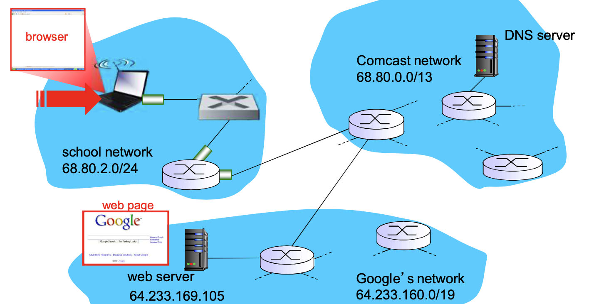

# 📘 6.7 Web请求的一天 (A Day in the Life of Web Request)

> 来源说明：计算机网络教材第6.7节 | 本节涵盖：从笔记本电脑打开浏览器到访问Google网页的完整网络生命周期，包括DHCP获取IP、ARP解析、DNS查询、TCP连接建立与HTTP请求/响应全流程

---

## 🧠 核心概念总览（严格按原文顺序）

- [*知识点1: 场景概述与网络拓扑*](#id1)
- [*知识点2: 连接到互联网的准备工作：DHCP获取网络参数*](#id2)
- [*知识点3: 连接到互联网的准备工作：ARP解析网关MAC地址*](#id3)
- [*知识点4: 连接到互联网的准备工作：使用DNS解析域名到IP地址*](#id4)
- [*知识点5: TCP三次握手建立连接*](#id5)
- [*知识点6: HTTP请求发送与响应接收*](#id6)

---

<a id="id1"></a>
## ✅ 知识点1: 场景概述与网络拓扑

**理论**
- 场景：用户通过笔记本电脑上的浏览器访问 `www.google.com`
- 网络拓扑涉及三个主要网络域：
  1. **校园网络(School Network)**：`68.80.2.0/24`，用户笔记本所在的局域网
  2. **Comcast网络**：`68.80.0.0/13`，ISP网络，连接校园网与Google网络
  3. **Google网络**：`64.233.160.0/19`，Google数据中心网络，承载Web服务器和DNS服务器
- 关键设备：
  - `browser`（浏览器）：发起HTTP请求
  - `web server`（`64.233.169.105`）：托管Google网页
  - `DNS server`：提供域名解析服务
  - `router`（运行 `DHCP` 服务）：校园网的第一跳路由器/网关



---

<a id="id2"></a>
## ✅ 知识点2: 连接到互联网的准备工作：DHCP获取网络参数

**理论**
- 笔记本首先需要获得网络参数，采用 `DHCP(Dynamic Host Configuration Protocol)`  
  - > ⚠️ **关键区分**：DHCP是**客户端尚未拥有IP地址时的启动协议**——客户端发送Discover时使用`0.0.0.0`作为源IP，使用广播MAC地址因为不知道DHCP服务器位置
- **DHCP请求阶段**：
  - 笔记本尚无IP地址，需要获得：自身IP地址、第一跳路由器（网关）IP地址、DNS服务器地址
  - 协议封装：`DHCP` → 封装在 `UDP` 中 → 封装在 `IP` 中 → 封装在 `802.3` 以太网帧中
  - 以太网帧在LAN上**广播**（目的MAC地址：`FF:FF:FF:FF:FF:FF`），被运行中的DHCP服务器（通常是路由器）接收
  - 路由器接收到帧后，逐层解封装：以太网帧 → IP数据报 → UDP段 → DHCP请求
- **DHCP ACK阶段**：
  - DHCP服务器生成 `DHCP ACK` 应答，包含：客户端IP地址、第一跳路由器IP地址、DNS名字服务器地址
  - 服务器端封装：DHCP ACK → UDP → IP → 以太网帧，通过LAN转发（`交换机学习` 客户端端口）到达客户端
  - 客户端接收DHCP ACK，逐层解封装获取网络参数
- **结果**：**客户端获得IP地址，知道了DNS域名服务器的名字和IP地址，第一跳路由器的IP地址**


---

<a id="id3"></a>
## ✅ 知识点3: 连接到互联网的准备工作：ARP解析网关MAC地址

**查询目标IP前：MAC地址获得**
- 在发送 `HTTP` 请求之前，需要知道 `www.google.com` 的IP地址 → 需要发起 `DNS(Domain Name System)` 查询
- 但DNS查询需要发送给DNS服务器（在校园网外），数据报必须通过**第一跳路由器**转发
- 为了将数据报发送给第一跳路由器，需要知道路由器接口的 `MAC地址(Media Access Control Address)`
- 采用 `ARP(Address Resolution Protocol)`：
  - **ARP查询**：客户端在LAN上**广播**ARP请求（"谁的IP是xxx？请告诉我你的MAC地址"）
  - 路由器接收到ARP查询，用**ARP应答**单播回复，给出其接口的MAC地址
  - 客户端缓存ARP结果，现在知道了第一跳路由器的MAC地址
- **协议封装**：ARP请求直接封装在以太网帧中（不经过IP/UDP层），以太网类型字段为0x0806

- > ⚠️ **关键区分**：ARP是**数据链路层协议**（或严格说是网络层与数据链路层之间的接口协议），不经过IP/UDP封装——ARP请求直接封装在以太网帧中，以太网类型为0x0806（区别于IP的0x0800）


---

<a id="id4"></a>
## ✅ 知识点4: 连接到互联网的准备工作：使用DNS解析域名到IP地址

**理论**
- 客户端现在可以发送DNS查询了，需要解析 `www.google.com` → IP地址
- **DNS查询的发送**：
  - 协议封装：`DNS` 查询 → 封装在 `UDP` 中（端口53） → 封装在 `IP` 数据报中（目的IP为DNS服务器地址） → 封装在以太网帧中（目的MAC为第一跳路由器接口MAC）
  - 以太网帧通过LAN交换机转发，到达第一跳路由器
- **DNS查询的转发与解析**：
  - IP数据报被路由器转发，从校园网到达Comcast网络
  - 路由路径由路由协议（`RIP`、`OSPF`、`IS-IS` 和/或 `BGP`）创建的路由表决定
  - IP数据报最终到达DNS服务器，服务器解封装获取DNS查询
  - DNS服务器查找域名记录，回复给客户端：`www.google.com` 的IP地址为 `64.233.169.105`
- **协议封装（DNS响应）**：DNS响应 → UDP → IP → 以太网，沿原路径返回客户端

**注意点**
- ⚠️ **关键区分**：DNS使用 **UDP端口53**（普通查询），但DNS也支持TCP（区域传输和大响应）；教材中的DNS查询是UDP封装，这是最常见的场景
- 💡 **理解技巧**：DNS就像"电话查号台"——你说"我要找Google"（www.google.com），查号台告诉你"电话号码是64.233.169.105"，你记下来就可以直接拨号了
- 🔄 **知识关联**：路由表中到达DNS服务器的路径可能由 `RIP/OSPF/IS-IS`（IGP，自治系统内部）和 `BGP`（EGP，自治系统之间）共同构建；DNS服务器本身通常由ISP或学校提供
- 📋 **术语提醒**：`DNS` 使用层次化的域名服务器结构：根DNS服务器 → 顶级域DNS（.com） → 权威DNS（google.com）；`迭代查询` 和 `递归查询` 是两种解析模式

---

<a id="id5"></a>
## ✅ 知识点5: TCP三次握手建立连接

**理论**
- 获得Google Web服务器的IP地址（`64.233.169.105`）后，客户端准备发送HTTP请求
- 但首先需要建立 `TCP(Transmission Control Protocol)` 连接：
  1. **第一次握手（SYN）**：客户端发送 `TCP SYN` 段到web服务器（目的端口80，HTTP默认端口）
     - 封装：TCP SYN → IP数据报（目的IP 64.233.169.105） → 以太网帧 → 经路由器转发到Google网络
  2. **第二次握手（SYN-ACK）**：web服务器收到SYN，回复 `TCP SYNACK` 段
     - 封装：TCP SYNACK → IP → 以太网 → 经路由器返回客户端
  3. **第三次握手**：客户端收到SYNACK，发送ACK确认（教材未详细展开，但隐含）
- **结果**：`TCP 连接建立了！` — 客户端和服务器之间建立了可靠的、面向连接的传输通道
- 协议栈变化：
  - 客户端：HTTP → TCP → IP → Eth → Phy（TCP连接建立后，HTTP层才能开始发送数据）
  - 服务器：TCP → IP → Eth → Phy（收到SYN后，服务器分配资源准备接收HTTP请求）

**注意点**
- ⚠️ **关键区分**：TCP三次握手是**面向连接**的前提，不完成三次握手，HTTP数据无法发送；TCP SYN报文不携带应用层数据，但占用一个序列号
- 💡 **理解技巧**：TCP三次握手就像"打电话确认"——你拨号（SYN），对方接起说"喂"（SYNACK），你回"喂"（ACK），然后双方才开始正式说话（HTTP数据）；如果少了任何一步，就不知道对方是否真的在线
- 🔄 **知识关联**：TCP连接的建立需要经过路由器转发（IP路由），跨越了校园网→Comcast→Google网络三个自治域；`TCP socket` 是操作系统提供的API抽象，代表一个TCP连接的端点
- 📋 **术语提醒**：`TCP SYN` 中的 `SYN` = `Synchronize Sequence Numbers`，用于同步初始序列号；`SYNACK` 同时携带SYN和ACK标志；HTTP默认端口80，HTTPS默认端口443

---

<a id="id6"></a>
## ✅ 知识点6: HTTP请求发送与响应接收

**理论**
- TCP连接建立后，正式进行 `HTTP(HyperText Transfer Protocol)` 通信：
- **HTTP请求阶段**：
  - 客户端将 `HTTP 请求` 发送到 `TCP socket` 中（操作系统通过socket API将HTTP数据交给TCP层）
  - 封装：HTTP请求 → TCP段（目的端口80） → IP数据报（目的IP 64.233.169.105） → 以太网帧 → 物理层传输
  - IP数据报经路由器转发，最终路由到 `www.google.com`（web服务器）
- **HTTP响应阶段**：
  - web服务器收到HTTP请求，解析请求内容，用 `HTTP 应答` 回应（包含请求的网页内容）
  - 封装：HTTP应答 → TCP → IP → 以太网 → 经路由器转发回客户端
  - IP数据报包含HTTP应答，最后被路由到客户端
- **结果**：客户端浏览器解析HTML内容，**web页面最后显示出来了**
- 协议栈完整封装（客户端→服务器方向）：
  ```
  HTTP → TCP → IP → Eth → Phy
  ```
  服务器→客户端方向同理。

**注意点**
- ⚠️ **关键区分**：HTTP是**无状态协议**——每个请求独立处理，服务器不保留之前请求的状态；但**TCP是有状态连接**——HTTP请求复用已建立的TCP连接，可以发送多个请求（HTTP持久连接/Keep-Alive）
- 💡 **理解技巧**：HTTP就像"写信格式"——你按标准格式写一封信（HTTP请求：GET / HTTP/1.1），塞进已经确认打通的专线管道（TCP连接），邮局系统（IP路由）负责把信送到对方；对方按同样格式回信（HTTP响应：200 OK + 网页内容），你再拆开信封看到网页
- 🔄 **知识关联**：本节的完整流程是全书协议栈的综合应用——从下到上：Phy→Eth→IP→TCP→HTTP，每一层都完成自己的职责；数据封装（Encapsulation）和解封装（Decapsulation）贯穿始终
- 📋 **术语提醒**：`HTTP/1.1` 默认支持 `持久连接(Persistent Connection)`，即一个TCP连接可以发送多个HTTP请求/响应对；`HTTP/2` 和 `HTTP/3` 进一步优化了多路复用和传输效率

---

## 🔑 核心要点总结

1. **完整流程（6步）**：
   - ① DHCP获取网络参数（IP、网关、DNS）
   - ② ARP解析网关MAC地址（IP→MAC映射）
   - ③ DNS解析域名到IP（www.google.com → 64.233.169.105）
   - ④ TCP三次握手建立连接（SYN → SYNACK → ACK）
   - ⑤ HTTP请求发送（GET / HTTP/1.1）
   - ⑥ HTTP响应接收，网页显示

2. **跨域通信**：数据报跨越校园网 → Comcast → Google网络三个自治域，需要路由协议（RIP/OSPF/IS-IS/BGP）支撑

3. **封装层次贯穿始终**：
   - DHCP：DHCP→UDP→IP→Eth
   - ARP：ARP→Eth（直接封装，不经过IP）
   - DNS：DNS→UDP→IP→Eth
   - TCP握手：TCP→IP→Eth
   - HTTP：HTTP→TCP→IP→Eth

4. **关键协议分工**：
   - DHCP：配置网络参数（启动第一步）
   - ARP：解析MAC地址（数据链路层关键映射）
   - DNS：域名→IP（应用层寻址）
   - TCP：可靠连接建立（传输层）
   - HTTP：网页内容请求/响应（应用层）
   - IP：跨网路由（网络层）
   - Eth+Phy：局域网传输（数据链路层+物理层）

## 📌 考试速记版

- **关键机制**：
  - DHCP四步（Discover→Offer→Request→ACK，教材简化为请求→ACK）获取IP/网关/DNS
  - ARP广播查询网关MAC，单播应答
  - DNS UDP端口53查询，经路由器跨域转发
  - TCP三次握手：SYN → SYNACK → ACK
  - HTTP请求→TCP socket→IP→Eth→Phy→路由器→服务器
  - HTTP响应沿原路径返回，浏览器解析显示

- **完整协议栈封装（以HTTP请求为例）**：

```
应用层：HTTP 请求报文
传输层：TCP 段（目的端口80）
网络层：IP 数据报（目的IP 64.233.169.105）
数据链路层：以太网帧（目的MAC 网关MAC地址）
物理层：比特流传输
```

- **易混淆概念对比**：

| 协议 | 层级 | 功能 | 封装关系 | 关键特征 |
|------|------|------|----------|----------|
| DHCP | 应用层 | 分配IP/网关/DNS | DHCP→UDP→IP→Eth | 启动协议，广播Discover |
| ARP | 数据链路层 | IP→MAC映射 | ARP→Eth（直接） | 局域网广播，非IP封装 |
| DNS | 应用层 | 域名→IP解析 | DNS→UDP→IP→Eth | UDP端口53，递归/迭代查询 |
| TCP | 传输层 | 可靠连接 | TCP→IP→Eth | 三次握手，面向连接 |
| HTTP | 应用层 | 网页请求/响应 | HTTP→TCP→IP→Eth | 无状态，端口80/443 |

- **常见考试陷阱**：
  - ❌ DHCP请求前已有IP地址？→ ✅ DHCP是**启动协议**，请求前客户端没有IP地址，使用0.0.0.0和广播MAC
  - ❌ ARP使用IP封装？→ ✅ ARP**直接封装在以太网帧**中，不经过IP/UDP层，以太网类型0x0806
  - ❌ DNS使用TCP？→ ✅ 普通DNS查询使用**UDP端口53**，只有区域传输和大响应用TCP
  - ❌ TCP握手可以传输HTTP数据？→ ✅ **不可以**，三次握手完成后才能发送HTTP数据，SYN不携带应用层数据
  - ❌ HTTP是有状态协议？→ ✅ HTTP是**无状态**的，但TCP连接是有状态的，HTTP/1.1支持持久连接复用TCP

**记忆口诀**：
> "DHCP拿地址，ARP问MAC门；DNS查Google号，TCP握手确认；HTTP发请求，网页弹出来；Phy到Eth到IP到TCP到HTTP，层层封装层层拆！"
