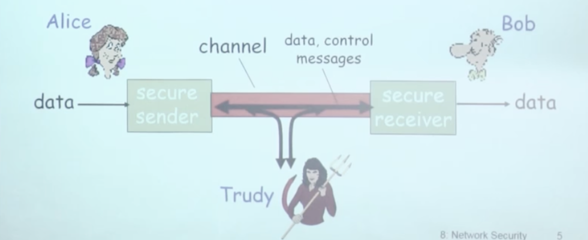

# 📘 章节 8.1 什么是网络安全？ (What is Network Security?)

> 来源说明：计算机网络 第8章第1节 | 本节涵盖：网络安全的核心属性、经典通信模型、现实应用及常见攻击类型

---

## 🧠 核心概念总览（严格按原文顺序）

- [*知识点1: 网络安全的四大核心属性*](#id1)
- [*知识点2: Alice-Bob-Trudy 经典通信模型*](#id2)
- [*知识点3: 现实世界中的安全通信实例*](#id3)
- [*知识点4: 网络中的攻击者能力*](#id4)

---

## ✅ 知识点1: 网络安全的四大核心属性

**安全的4大要素**
网络安全的目标可归纳为四个核心属性，它们共同保障通信过程的安全可靠：

1. **`机密性(Confidentiality)`**
   - 只有发送方和预订的接收方能够理解传输的报文内容
   - 实现方式：发送方**加密报文**，接收方**解密报文**
   - 即使报文被截获，未授权者也无法读取内容

2. **`认证性(Authentication)`**
   - 发送方和接收方需要确认对方的身份
   - 确保通信双方确实是声称的那个人/实体，而非假冒者

3. **`报文完整性(Message Integrity)`**
   - 发送方、接收方需要确认报文在传输过程中或者事后没有被改变
   - 防止数据在传输中被篡改、损坏或替换

4. **`访问控制和服务的可用性(Access Control and Availability)`**
   - 服务可以接入以及对用户而言是可用的
   - 确保合法用户能够正常访问服务，防止资源被非法占用或阻塞

---

## ✅ 知识点2: Alice-Bob-Trudy 经典通信模型

**理论**
网络安全领域有一个著名的抽象模型，用三个角色描述安全通信场景：

- **`Alice`**：发送方(`secure sender`)，希望将数据安全地发送给 Bob
- **`Bob`**：接收方(`secure receiver`)，希望安全地接收 Alice 的数据
- **`Trudy`**：入侵者(`intruder`)，可以截获、删除和增加报文

通信流程：
- Alice 通过 `secure sender` 将 data 发送到 channel
- channel 上传输 data 和 control messages
- Bob 通过 `secure receiver` 接收 data
- Trudy 可以在 channel 上**截获、删除或插入报文，干扰通信等等...**

---

## ✅ 知识点3: 现实世界中的安全通信实例

**安全通信场景**
Alice 和 Bob 不仅存在于理论中，现实网络中大量通信实体都需要安全保护：

- **电子交易中的 `Web browser/server`**（如在线购买）
- **在线银行的 `client/server`**
- **`DNS servers`** 之间的查询通信
- **路由信息的交换**（如 BGP 路由更新）
- 以及更多需要保护通信的实体

---

## ✅ 知识点4: 网络中的攻击者能力

**攻击者手段**
"bad guy"（即 Trudy 类型的攻击者）在网络中可以实施多种攻击：

| 攻击类型 | 英文 | 描述 |
|---------|------|------|
| **窃听** | `eavesdropping` | 截获报文，获取传输内容 |
| **插入** | `insertion` | 在连接上插入报文，注入恶意数据 |
| **伪装** | `spoofing` | 在分组的源地址写上伪装的地址，假冒身份 |
| **劫持** | `hijacking` | 将发送方或者接收方踢出，接管连接 |
| **拒绝服务** | `Denial of Service (DoS)` | 阻止服务被其他正常用户使用，通过对资源的过载使用 |

---

## 🔑 核心要点总结
1. 网络安全四大支柱：机密性、认证、完整性、可用性——缺一不可
2. Alice-Bob-Trudy 模型是理解安全协议的通用框架，几乎所有安全场景都能映射到这个模型
3. 攻击者能力分为被动（窃听）和主动（插入、伪装、劫持、DoS）两类，主动攻击危害更大
4. 安全不是少数应用的需求，而是所有涉及敏感数据传输的网络通信的普遍需求

## 📌 考试速记版
- **四大属性**：机密(Confidentiality)、认证(Authentication)、完整(Integrity)、可用(Availability)
- **经典角色**：Alice(发)、Bob(收)、Trudy(攻击者)
- **五种攻击**：窃听(eavesdropping)、插入(insertion)、伪装(spoofing)、劫持(hijacking)、DoS
- **被动 vs 主动**：窃听是被动攻击（只看不改），其余四种都是主动攻击（干预通信）

**记忆口诀**："机密认证完整可用，AliceBob 防 Trudy，窃插伪劫拒服务，五种攻击要记熟"
