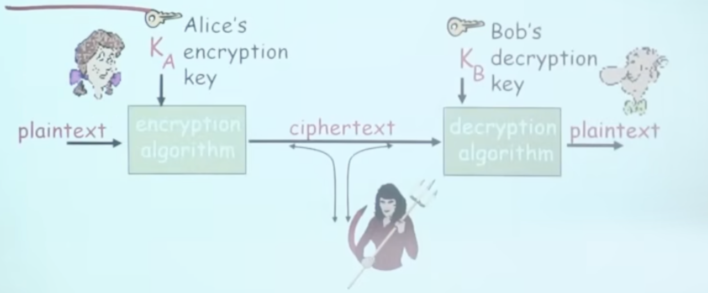
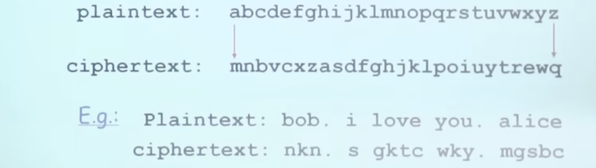
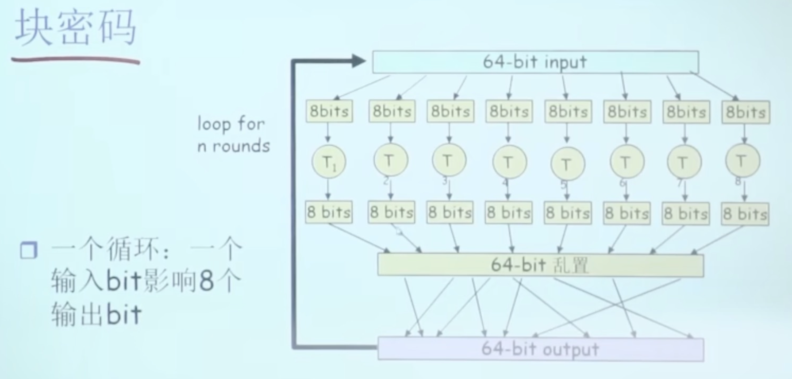
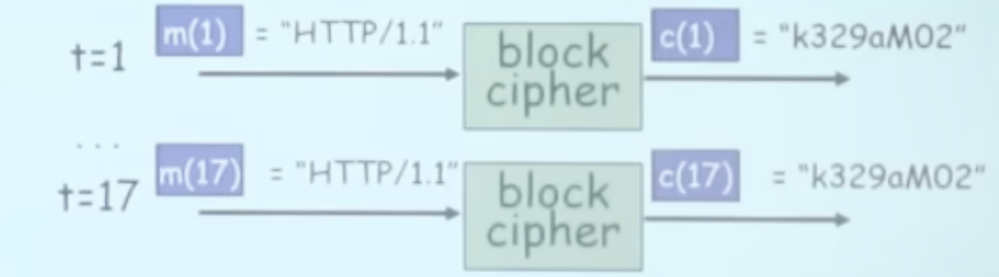
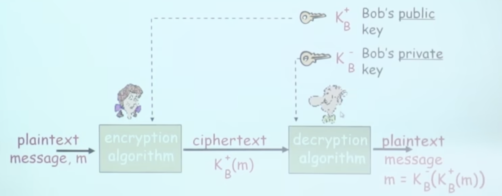
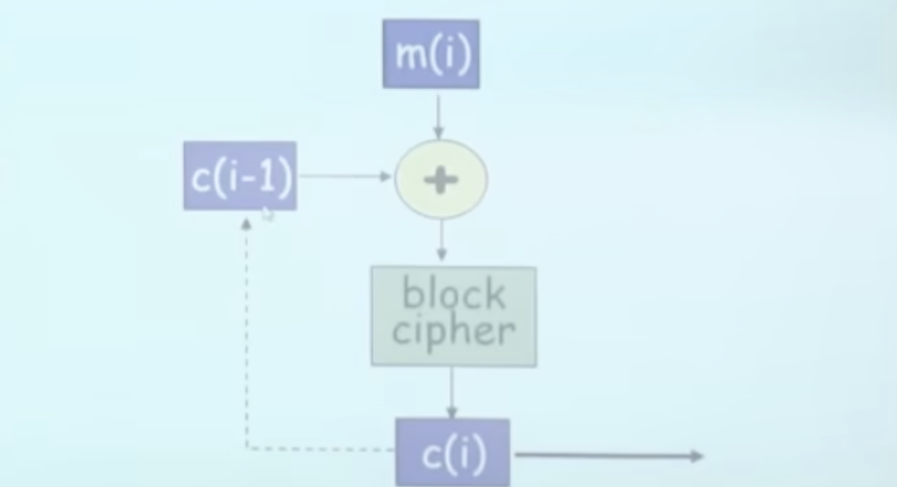

# 📘 章节 8.2 加密原理 (Principles of Encryption)

> 来源说明：计算机网络 第8章第2节 | 本节涵盖：对称密钥加密、DES/AES算法、块密码与密码块链、公开密钥密码学、RSA算法及解密攻击类型

---

## 🧠 核心概念总览（严格按原文顺序）

- [*知识点1: 加密语言与两大密码体系*](#id1)
- [*知识点2: 对称密钥加密：替换密码*](#id2)
- [*知识点3: 对称密钥密码学：DES*](#id3)
- [*知识点4: 对称密钥密码学：AES*](#id4)
- [*知识点5: 块密码与密码块链(CBC)*](#id5)
- [*知识点6: 公开密钥密码学基本原理*](#id6)
- [*知识点7: RSA密钥生成*](#id7)
- [*知识点8: RSA加密解密实例*](#id8)
- [*知识点9: RSA数学基础与可交换性*](#id9)
- [*知识点10: 解密攻击类型*](#id10)

---

## ✅ 知识点1: 加密语言与两大密码体系

**加密通信的基本模型**: 

加密密钥 $K_A$ 和解密密钥 $K_B$ 的关系决定了密码体系类型：

| 密码体系 | 密钥关系 | 特点 |
|---------|---------|------|
| **`对称密钥密码学(Symmetric Key Cryptography)`** | 发送方和接收方密钥**相同** | 加密快，需安全通道共享密钥 |
| **`公开密钥密码学(Public Key Cryptography)`** | 发送方用接收方**公钥**加密，接收方用**私钥**解密 | 无需共享密钥，公钥可公开 |

- > ⚠️ **核心问题**：对称密钥体系中，Bob和Alice如何就密钥达成一致？特别是他们从未见过面的情况下

---

## ✅ 知识点2: 对称密钥加密：替换密码

替换密码(`substitution cipher`)：将一个字符替换为另一个字符。单码替换密码(`monoalphabetic substitution cipher`)是最简单的形式：

**破解强度分析**
- `brute force(暴力破解)`：26! ≈ 4×10²⁶ 种可能，密钥空间极大
- 但实际可通过**字母频率分析**等统计方法破解，并非安全加密方式

---

## ✅ 知识点3: 对称密钥密码学：DES

**理论**
`DES(Data Encryption Standard)`：美国NIST 1993年发布的加密标准

- **密钥长度**：56-bit对称密钥，64-bit明文输入
- **DES挑战**：56-bit密钥加密的短语被破解，**用了4个月时间**
- **安全性争议**：可能存在后门
- **增强方案**：使用3个key的**3重DES运算**，以及**密文分组成串技术**

**DES操作结构**
- 初始替换(`initial permutation`)
- **16轮**相同的函数应用，每轮使用不同的**48-bit密钥**
- 最终替换(`final permutation`)
- 核心：64-bit输入 → 分成L/R两半 → 经过f函数(含S盒替换和P盒置换) → 迭代16轮 → 64-bit输出

- > ⚠️ **关键数据**：56-bit密钥已被暴力破解（4个月），说明DES已不再安全

---

## ✅ 知识点4: 对称密钥密码学：AES

**理论**
`AES(Advanced Encryption Standard)`：新的NIST对称密钥标准（2001年11月），用于替换DES

- 数据**128-bit**成组加密
- 支持密钥长度：**128, 192, or 256 bit**
- **安全性对比**：如果1秒钟能破解DES，破解AES需要**149万亿年**

- > ⚠️ **关键区分**：AES的安全性与密钥长度直接相关，256-bit AES目前被认为是抗暴力破解的
- > 💡 **记忆技巧**：AES = "Advanced" = 比DES更先进，密钥更长（128+ vs 56），分组更大（128 vs 64）

---

## ✅ 知识点5: 块密码与密码块链(CBC)

**块密码(`Block Cipher`)**

- 64-bit输入分成8个8-bit块，分别经过T函数处理
- **一个循环**：一个输入bit影响8个输出bit
- **多重循环**：每个输入bit影响所有输出bit（通过64-bit乱置/permutation）
- 代表算法：DES, 3DES, AES
    

**密码块链(`Cipher Block Chaining, CBC`)**

- 块密码问题：如果输入块重复，会得到**相同的密文块**（如 `m(1)=m(17)="HTTP/1.1"` → `c(1)=c(17)`）
    
- CBC解决方案：**第i轮输入 `m(i)` 与前一轮密文 `c(i-1)` 异或后再加密**
- `c(0)` 为初始向量(IV)，明文传输到接收端
- 效果：即使相同明文块，也因与前一个密文异或而产生不同密文

---

## ✅ 知识点6: 公开密钥密码学基本原理

与对称密钥密码学的核心区别：

| 对称密钥 | 公开密钥 |
|---------|---------|
| 需共享对称密钥 | 无需共享密钥 |
| 第一次见面密钥如何达成一致？ | 一个实体的**公钥**公诸于众 |
| | **私钥**只有他自己知道 |

代表算法：Diffie-Hellman(1976), RSA(1978)

**通信流程**
- Alice 用 Bob 的**公钥 $K_B^+$** 加密明文 → 密文 $K_B^+(m)$
- 密文通过channel传输
- Bob 用**私钥 $K_B^-$** 解密密文 → 明文 $m = K_B^-(K_B^+(m))$

- > ⚠️ **核心优势**：解决了对称密钥的"密钥分发问题"——无需预先安全共享密钥

---

## ✅ 知识点7: RSA密钥生成

**理论**
`RSA`：Rivest, Shamir, Adelson algorithm，公开密钥加密算法

**密钥生成五步骤**：
1. 选择2个很大的质数 $p, q$（如各1024 bits）
2. 计算 $n = pq$, $z = (p-1)(q-1)$
3. 选择 $e$（要求 $e < n$）和 $z$ **互素**(`relatively prime`)，即没有公共因子
4. 选择 $d$ 使得 $ed - 1$ 正好能被 $z$ 整除，即 $ed \mod z = 1$
5. **公钥** = $(n, e)$ (`K_B^+`)，**私钥** = $(n, d)$ (`K_B^-`)

- > ⚠️ **关键数据**：$p, q$ 需要"很大"（1024 bits），越大越安全；$n$ 是公开参数，但 $p, q$ 不公开
- 💡 **记忆技巧**：公钥有e(encryption)，私钥有d(decryption)；z是欧拉函数φ(n)

---

## ✅ 知识点8: RSA加密解密实例

**理论**
**示例参数**：Bob 选择 $p=5, q=7$，因此 $n=35, z=24$
- $e=5$（与 $z=24$ 互素）
- $d=29$（满足 $ed-1=144$ 能被 $z=24$ 整除）

**加密过程**（字母 'l' → m=12）：
- $m^e = 12^5 = 1524832$
- $c = m^e \mod n = 1524832 \mod 35 = 17$

**解密过程**（c=17）：
- $c^d = 17^{29}$（极大数）
- $m = c^d \mod n = 17^{29} \mod 35 = 12$
- 还原为字母 'l'

- > ⚠️ **核心公式**：加密 $c = m^e \mod n$，解密 $m = c^d \mod n$

---

## ✅ 知识点9: RSA可交换性

**RSA重要特性：可交换性**
- $K_B^-(K_B^+(m)) = m = K_B^+(K_B^-(m))$
- **先用公钥再用私钥** = **先用私钥再用公钥** = 结果一致！
- 这一特性将在数字签名等场景中非常有用

**注意点**
- > ⚠️ **关键区分**：RSA的可交换性意味着公钥私钥在数学上可互换操作，但**功能上不可互换**——用私钥加密是"签名"行为，用公钥解密是"验证"行为
- > 🔄 **知识关联**：此特性是数字签名(`digital signature`)的理论基础——用私钥"加密"=签名，任何人用公钥"解密"=验证

---

## ✅ 知识点10: 解密攻击类型

根据攻击者掌握的信息量，解密攻击分为多种类型：

**按已知信息分类**：
- 加密算法已知，求密钥
- 加密算法和密钥均不知道

**按攻击方式分类**：

| 攻击类型 | 英文 | 攻击者掌握信息 |
|---------|------|---------------|
| **唯密文攻击** | `Ciphertext-only Attack` | 仅有密文 |
| **已知明文攻击** | `Known Plaintext Attack` | 知道部分密文和明文的对应关系 |
| **选择明文攻击** | `Chosen Plaintext Attack` | 攻击者能够选择一段明文，并得到对应的密文 |

- > ⚠️ **关键区分**：攻击难度递减——唯密文最难（信息量最少），选择明文最易（信息量最多）
- > 💡 **理解技巧**：想象破译密码锁：唯密文=只看过锁，已知明文=看过钥匙和锁的对应关系，选择明文=你可以自己插钥匙试
- > 📋 **术语提醒**：实际密码学分析中，**选择明文攻击**是最强攻击模型，能抵抗这种攻击的算法才被认为安全

---

## 🔑 核心要点总结
1. 两大密码体系：对称密钥（快但需共享密钥）vs 公开密钥（慢但无需共享密钥）
2. DES已被56-bit密钥长度淘汰，AES（128/192/256-bit）是当前标准
3. CBC模式通过块间链式异或解决ECB的重复明文暴露问题
4. RSA基于大质数分解难题，公钥(n,e)公开，私钥(n,d)保密，数学上可交换
5. 攻击强度排序：唯密文 < 已知明文 < 选择明文（安全性评估按最强攻击模型设计）

## 📌 考试速记版
- **对称加密**：DES(56-bit, 已淘汰) → AES(128/192/256-bit, 安全)
- **RSA密钥生成**：选p,q → n=pq, z=(p-1)(q-1) → 选e(与z互素) → 选d(ed mod z=1) → 公钥(n,e), 私钥(n,d)
- **RSA加解密**：加密 $c=m^e \mod n$，解密 $m=c^d \mod n$
- **CBC**：当前明文块与前一个密文块异或后再加密，c(0)为IV
- **攻击类型**：唯密文(最难) → 已知明文 → 选择明文(最易)
- **RSA可交换性**：公钥私钥操作顺序可互换，是数字签名的基础

**记忆口诀**："对称快需共享密钥，公开慢但分发易；DES已死AES立，CBC链式防重复；RSA质数大难题，ed互素可交换；唯密文最难破，选择明文最危险"
