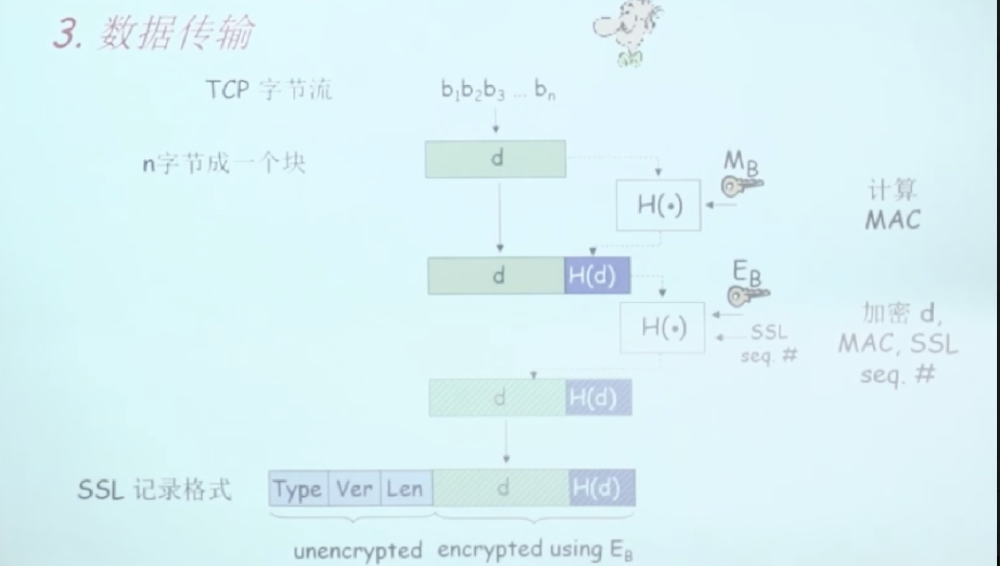
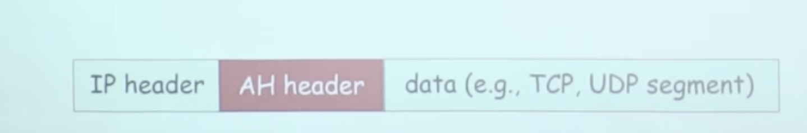
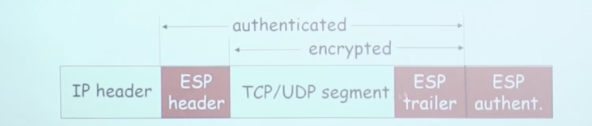
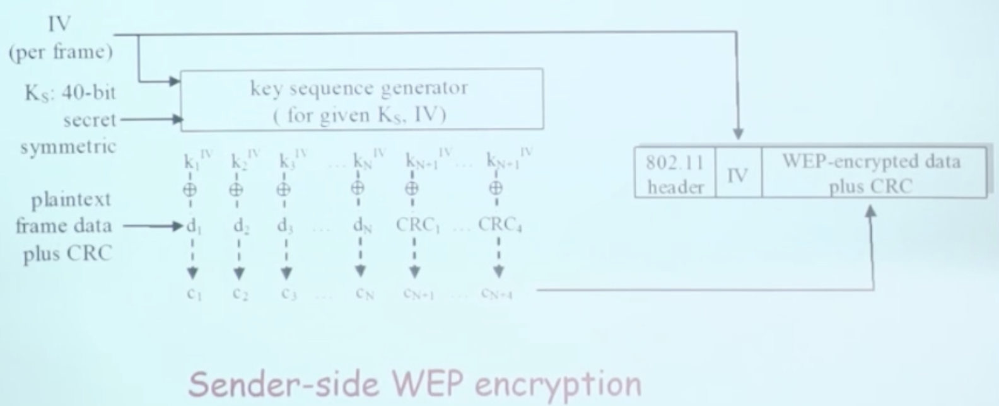
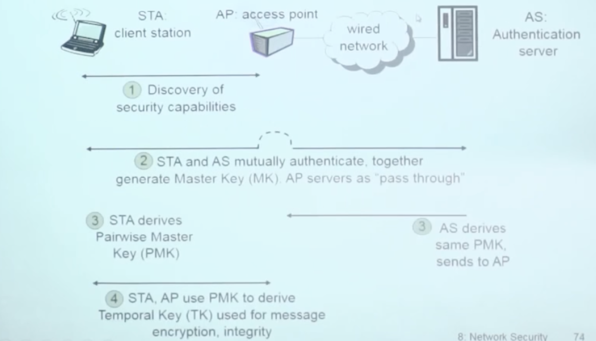

# 📘 8.6 各个层次的安全性 (Security at Each Layer)

> 来源说明：计算机网络（郑老师）第8.6节 | 本节涵盖：安全电子邮件、SSL/TLS、IPsec、无线网络安全在各协议层的实现机制

---

## 🧠 核心概念总览（严格按原文顺序）

- [*知识点1: 安全电子邮件的机密性*](#id1)
- [*知识点2: 安全电子邮件的源端认证与完整性*](#id2)
- [*知识点3: 安全电子邮件的完整方案（机密性+认证+完整性）*](#id3)
- [*知识点4: PGP（Pretty Good Privacy）*](#id4)
- [*知识点5: SSL（Secure Sockets Layer）*](#id5)
- [*知识点6: SSL 三阶段之握手*](#id6)
- [*知识点7: SSL 三阶段之密钥导出*](#id7)
- [*知识点8: SSL 三阶段之数据传输*](#id8)
- [*知识点9: IPsec（网络层安全性）*](#id9)
- [*知识点10: AH（Authentication Header）协议*](#id10)
- [*知识点11: ESP（Encapsulation Security Payload）协议*](#id11)
- [*知识点12: IEEE 802.11 无线安全概述*](#id12)
- [*知识点13: WEP（Wired Equivalent Privacy）*](#id13)
- [*知识点14: WEP 的破解原理*](#id14)
- [*知识点15: 802.11i（改进的安全机制）*](#id15)

---

## ✅ 知识点1: 安全电子邮件的机密性

**核心问题**：Alice 需要发送机密报文$m$ 给 Bob，**如何在不安全的 Internet 上保证报文内容不被窃听**
- 采用**混合加密**策略：对称加密处理大数据量（效率），公钥加密保护对称密钥（安全性）
- **Alice 操作**：
  1. 产生随机对称密钥 $K_S$（session key）
      > ⚠️ **关键区分**：对称密钥 $K_S$ 是**一次性随机生成**的，每封邮件不同——避免长期密钥暴露风险
  2. 使用 $K_S$ 对报文 $m$ 加密，得到 $K_{S}(m)$（对称加密效率高）
  3. 使用 **Bob 的公钥** $K_B^+$ 对 $K_S$ 加密，得到 $K_B^+(K_S)$
  4. 发送 $K_S(m)$ 和 $K_B^+(K_S)$ 给 Bob
- **Bob 操作**：
  1. 使用自己的**私钥** $K_B^-$ 解密 $K_B^+(K_S)$，恢复对称密钥 $K_S$
  2. 使用 $K_S$ 解密 $K_S(m)$，恢复原始报文 $m$

**教材示例/公式**

> 💡 **理解技巧**：想象把信件放进铁盒（对称加密），再把铁盒钥匙放进另一个保险箱（公钥加密），只有收件人能开保险箱取钥匙
> 🔄 **知识关联**：与知识点3对比——本方案只提供**机密性**，不提供源端**认证**和**完整性**

---

## ✅ 知识点2: 安全电子邮件的源端认证与完整性

**场景**：Alice 需要证明"这封信确实是我发的"，且报文**未被篡改**
- 核心机制：**数字签名**（Digital Signature）
- **Alice 操作**：
  1. 对报文 $m$ 计算哈希值 $H(m)$
  2. 使用**自己的私钥** $K_A^-$ 对哈希值签名，得到 $K_A^-(H(m))$
  3. 发送报文（明文）$m$ 和数字签名 $K_A^-(H(m))$
- **Bob 验证**：
  1. 使用 **Alice 的公钥** $K_A^+$ 解密签名，恢复 $H(m)$
  2. 对收到的明文 $m$ 计算哈希 $H(m)$
  3. **比较**两个哈希值：一致则认证通过且报文完整

**教材示例/公式**

> ⚠️ **关键区分**：本方案中**报文 m 是明文传输**的——只提供源端认证和完整性，**不提供机密性**
> ⚠️ **关键区分**：哈希+私钥签名 = 数字签名；**不要**与"用私钥加密报文"混淆（实际不会这样做，因为效率太低）

---

## ✅ 知识点3: 安全电子邮件的完整方案（机密性+认证+完整性）

**最终版**
- > 🔄 **知识关联**：对比知识点1（仅机密性）和知识点2（仅认证/完整性）——本方案是前两者的有机组合
- 同时满足三个安全目标：
  - **机密性**：报文内容不可窃听
  - **源端可认证性**：确认发送者身份
  - **报文完整性**：确认未被篡改
- **Alice 使用了3个 keys**：
  1. **自己的私钥** $K_A^-$ —— 用于数字签名（认证+完整性）
  2. **Bob 的公钥** $K_B^+$ —— 用于加密会话密钥（机密性）
  3. **新产生的对称密钥** $K_S$ —— 用于加密报文（效率）
- **Alice 操作流程**：
  1. 对报文 `m` 计算哈希 `H(m)`，用私钥签名得 `K_A^-(H(m))`
  2. 将 `m` 和签名 `K_A^-(H(m))` 拼接，用对称密钥 $K_S$ 加密整体 → $K_S(m + K_A^-(H(m)))$
  3. 用 Bob 公钥加密 $K_S$ → $K_B^+(K_S)$
  4. 发送 $[K_S(m + K_A^-(H(m))), K_B^+(K_S)]$

**教材示例/公式**

> 💡 **理解技巧**：把"签名+明文"当作一个整体包裹，外层用对称密钥加密，而对称密钥本身再用公钥加密——三层防护

---

## ✅ 知识点4: PGP（Pretty Good Privacy）

**应用层安全**
- **PGP** = `Pretty Good Privacy`，Internet e-mail 加密方案的**事实标准（de facto standard）**
- 发明者：**Phil Zimmerman**，曾成为3年犯罪调查目标（因密码学出口管制法规）
- PGP 使用了前面讲述的核心技术组合：
  - 对称密钥加密（对称加密报文）
  - 公开密钥加密（保护对称密钥）
  - 散列函数 `H(·)`（计算报文摘要）
  - 数字签名（源端认证+完整性）
- 提供三大安全服务：
  - **机密性**（Confidentiality）
  - **源端可认证性**（Authentication）
  - **报文完整性**（Integrity）
- PGP 签名消息格式包含：
 

---

## ✅ 知识点5: SSL（Secure Sockets Layer）

**传输层安全**
- **SSL** = `Secure Sockets Layer`，为使用 SSL 服务的、基于 **TCP** 的应用提供**传输层次的安全性**
- 典型场景：WEB 浏览器和服务器之间进行电子商务交易（HTTPS = HTTP over SSL/TLS）
- SSL 在协议栈中的位置：
  
  - SSL 位于应用层和传输层之间，对应用层透明，"夹在"应用和 TCP 之间
  - > ⚠️ **关键区分**：SSL 是**传输层**安全协议，不是应用层——它保护的是 TCP 连接上的**所有应用数据**，不感知具体应用协议
  - > ⚠️ **关键区分**：现代标准名称是 **TLS**（Transport Layer Security），SSL 3.0 后由 TLS 1.0 接替，但"SSL"一词仍广泛使用
- SSL 提供的安全服务：
  - **服务器的可认证性**（必选项）—— 浏览器确认服务器身份
  - **数据加密**（必选项）—— 传输内容保密
  - **客户端的可认证性**（可选项）—— 服务器确认客户端身份（较少使用）

> 🔄 **知识关联**：对比 PGP（应用层）和 IPsec（网络层）——SSL 位于中间层，保护 TCP 会话

---

## ✅ 知识点6: SSL 三阶段之握手（Handshake）

SSL 连接建立分三个阶段，**第一阶段：握手** —— 建立安全参数
- **握手步骤**：
  1. **建立 TCP 连接**：Bob 和 Alice 先完成标准 TCP 三次握手（SYN → SYNACK → ACK）
  2. **SSL hello**：双方协商 SSL 版本、加密算法等参数
  3. **服务器认证**：Alice 发送 **CA 签署的证书**（certificate）给 Bob，Bob 验证证书确认 Alice 身份
  4. **主密钥传输**：Bob 创建 **Master Secret (MS)**，使用 **Alice 的公钥** $K_A^+$ 加密 MS 发送给 Alice：$K_A^+(MS)$
  5. Alice 使用自己的**私钥** $K_A^-$ 解密得到 $MS$
- 注意：图中未显示**不重数交换**（nonce exchange），实际握手包含随机数交换以防重放攻击

**教材示例/公式**

> ⚠️ **关键区分**：SSL 握手建立在 TCP 连接之上——**必须先有 TCP 连接，才能 SSL 握手**
> ⚠️ **关键区分**：MS（Master Secret）是**会话密钥的种子**，不是直接加密数据的密钥——后续会导出多个实际密钥
> 💡 **理解技巧**：握手阶段 = "确认身份 + 协商规则 + 安全交换种子密钥"，类似见面时的"对暗号+交换密信"

---

## ✅ 知识点7: SSL 三阶段之密钥导出（Key Derivation）

**理论**
- **第二阶段**：Alice 和 Bob 使用共享的 **MS** 产生 **4 个 keys**
- 4 个密钥及其用途：
  1. **$E_B$**：Bob → Alice 的**数据加密 key**（Bob 发送数据时加密用）
  2. **$E_A$**：Alice → Bob 的**数据加密 key**（Alice 发送数据时加密用）
  3. **$M_B$**：Bob → Alice 的 **MAC key**（报文鉴别编码 key，Bob 发送时计算 MAC 用）
  4. **$M_A$**：Alice → Bob 的 **MAC key**（Alice 发送时计算 MAC 用）
- 加密算法和 MAC 算法在 Bob 和 Alice 之间协商确定
- **为什么要4个 keys？** —— **更安全**
  - 分离加密和认证密钥
  - 分离双向通信密钥（防止对称性问题）
  - 即使一个方向密钥泄露，不影响另一方向

> ⚠️ **关键区分**：**4个keys不是4个会话**——是一个 SSL 会话中的4个功能不同的密钥，用于区分方向和用途
> ⚠️ **关键区分**：MAC key 用于**完整性校验**，不是加密——发送方用 MAC key 计算报文认证码，接收方验证
> 💡 **理解技巧**：双向通信就像两条车道，每条车道需要"加密刷"和"认证刷"——4把刷子各司其职

---

## ✅ 知识点8: SSL 三阶段之数据传输（Data Transfer）

**理论**
- **第三阶段**：使用已协商密钥进行实际安全数据传输
- SSL 处理 TCP 字节流的方式：
  

>⚠️ **关键区分**：SSL 记录头部的 Type/Ver/Len 是**明文**的——中间节点能看到记录类型和长度，但看不到内容
>⚠️ **关键区分**：MAC 是在**加密前**计算的——先算 MAC 再加密整体，确保完整性保护覆盖数据本身
>💡 **理解技巧**：每个 SSL 记录 = "信封头（明文）+ 密封内容（密文）"，内容里还夹着"完整性校验条"
>🔄 **知识关联**：与知识点7衔接——这里使用的 $E_B$ 和 $M_B$ 就是第二阶段导出的4个 keys 中的两个

---

## ✅ 知识点9: IPsec（网络层安全性）

**理论**
- **IPsec** = IP Security，在**网络层**实现安全——为 IP 数据报提供保护
- 网络层次的机密性：
  - 发送端主机对 IP 数据报中的**数据进行加密**
  - 保护的数据包括：TCP 段、UDP 段、ICMP 报文、SNMP 报文等
- 网络层次的可认证性：
  - 目标主机可以**认证源主机的 IP 地址**
- 2 个主要协议：
  1. **AH**（Authentication Header）= 认证头部协议
  2. **ESP**（Encapsulation Security Payload）= 封装安全载荷协议
- **安全关联（Security Association, SA）**：
  - 无论 AH 还是 ESP，源和目标在通信之前都要**握手**
  - 创建一个网络层次的逻辑通道：SA
  - 每个 **SA 都是单向的**（unidirectional）
  - SA 由三元组唯一确定：
    - 安全协议（AH or ESP）
    - 源 IP 地址
    - 32-bit 连接 ID

> ⚠️ **关键区分**：IPsec 在**网络层**——对上层完全透明，应用不需要修改；对比 SSL 在传输层、PGP 在应用层
> ⚠️ **关键区分**：SA 是**单向**的——双向通信需要**两个 SA**（A→B 和 B→A）
> 💡 **理解技巧**：IPsec 是"在 IP 层面建围墙"——所有进出数据报都经过过滤/加密，上层应用无感知

---

## ✅ 知识点10: AH（Authentication Header）协议

**理论**
- **AH** = `Authentication Header`，提供：
  - **源端可认证性**
  - **数据完整性**
  - **但不提供机密性**（不加密数据）
- 实现方式：
  - 在 **IP 头部和数据字段之间**插入 AH 头部
  - IP 协议字段 = **51**（标识 AH）
  - 中间路由器按常规处理这个数据报（AH 不加密，头部可读）
- **AH 头部内容**：
  - **连接 ID**：标识该数据报所属的 SA
  - **认证数据**：对原始数据计算报文摘要，使用**源端的私钥**进行数字签名
  - **下一个字段（next header）**：定义数据类型（TCP/UDP/ICMP 等）
- 数据报格式：
  

> ⚠️ **关键区分**：AH **不加密数据**——窃听者能看到内容，但无法篡改（因为签名会失效）
> ⚠️ **关键区分**：AH 的认证覆盖**整个 IP 数据报**（除某些可变字段），确保完整性

---

## ✅ 知识点11: ESP（Encapsulation Security Payload）协议

**理论**
- **ESP** = `Encapsulation Security Payload`，提供：
  - **机密性**（加密数据）
  - **主机的可认证性**
  - **数据的完整性**
- 实现方式：
  - **数据和 ESP 尾部部分被加密**
  - `next header` 字段放在 **ESP 尾部**（因为头部可能被加密保护）
  - IP 协议号 = **50**
- **ESP 数据报格式**：
  

> ⚠️ **关键区分**：ESP **认证头部与 AH 类似**，但 ESP 额外提供加密——AH 的认证范围更全面（含 IP 头），ESP 的认证不含外部 IP 头
> ⚠️ **关键区分**：ESP 的 `next header` 在**尾部**——因为中间路由器需要读 IP 头路由，但不需要知道负载类型；真正的类型标记放在尾部供解密后使用
> 💡 **理解技巧**：ESP 是"黑箱运输"——外部只写地址，内部装箱（加密）且贴封条（认证）
> 🔄 **知识关联**：与 AH 对比——ESP 更全面（加密+认证），但 AH 更轻量（仅认证，无加密开销）

---

## ✅ 知识点12: IEEE 802.11 无线安全概述

**理论**
- 无线网络的天然脆弱性：
  - **War-driving**：开车在湾区转一圈，能发现超过 9000 个可接入的 802.11 网络
  - **85%** 使用**无加密/无认证**
  - 包嗅探（packet-sniffing）和各种攻击非常容易
- 保护 802.11 的安全需求：
  - 加密（encryption）
  - 认证（authentication）
- 802.11 安全标准的演进：
  1. **首次尝试**：WEP（Wired Equivalent Privacy）——**失败**
  2. **现行方案**：802.11i（WPA2/WPA3 的基础）

---

## ✅ 知识点13: WEP（Wired Equivalent Privacy）

**理论**
- WEP 的认证机制（基于 protocol ap4.0）：
  1. 主机（host）向接入点（access point, AP）请求认证
  2. AP 发送 **128-bit nonce**（随机数）
  3. 主机使用**共享对称密钥**加密 nonce
  4. AP 解密 nonce，验证与发送值一致，认证主机
- WEP 的缺陷：
  - **没有密钥分发机制**（no key distribution mechanism）——密钥如何到各设备手里？靠人工配置
  - **认证 = 知道共享密钥即可**（knowing the shared key is enough）——没有区分用户身份，谁有密钥谁就是"合法用户"
- WEP 加密机制：
  - 使用 **40-bit secret symmetric key** $K_S$ + **24-bit IV**（Initialization Vector，每帧不同）
  - 密钥流生成器（key sequence generator）根据 $K_S$ 和 IV 产生密钥流
  - 密钥流与明文（plaintext frame data + CRC）逐位 **XOR** 得到密文
  - 最终帧格式：`802.11 header | IV | WEP-encrypted data plus CRC`
  

> ⚠️ **关键区分**：WEP 的 IV 只有 **24-bit**（约 1600 万种组合）——在现代网络流量下**很快会耗尽并重复**
> ⚠️ **关键区分**：IV 是**明文传输**的——攻击者知道每帧使用的 IV，这是致命弱点

---

## ✅ 知识点14: WEP 的破解原理

**理论**
- **安全漏洞（Security hole）**：
  1. **24-bit IV，每帧一个** → IV 最终会**重复（reused）**
  2. **IV 以明文传输** → IV 重复可被**检测**到
- **攻击步骤（Trudy 攻击者）**：
  1. Trudy 诱导 Alice 加密**被已知明文** `d_1, d_2, d_3, d_4, ...`
  2. Trudy 观察到密文：`c_i = d_i XOR k_i^IV`（明文与密钥流 XOR）
  3. Trudy 已知 `c_i` 和 `d_i`，可计算：`k_i^IV = c_i XOR d_i` → **恢复密钥流**！
  4. Trudy 知道了该 IV 对应的完整密钥流 `k_1^IV, k_2^IV, k_3^IV, ...`
  5. **下次该 IV 被复用时**，Trudy 可直接用密钥流解密任何密文！
  - > ⚠️ **关键区分**：XOR 的致命特性——`c = d ⊕ k`，知道任意两个可求第三个——**这是流密码的通用弱点**
- 根本问题：
  - IV 空间太小 → 必然重复
  - IV 明文传输 → 攻击者知道何时重复
  - 已知明文攻击 → 一旦恢复某 IV 的密钥流，永久有效（只要密钥不变）

> ⚠️ **关键区分**：不需要知道密钥 `K_S`，只需要**恢复密钥流**——密钥流 = IV + K_S 的输出，一旦某 IV 的流被恢复，等于"该 IV 的密钥已泄露"
> 💡 **理解技巧**：WEP 像用同一把密码锁反复加密，而锁的编号（IV）只有 1600 万个——在繁忙 AP 上几小时内就会用完一轮，开始重复

---

## ✅ 知识点15: 802.11i（改进的安全机制）

**理论**
- 802.11i 对 WEP 的全面改进：
  1. **多种（更强的）加密形式** possible —— 不再限定 RC4，支持 AES-CCMP 等强算法
  2. **提供密钥分发机制** —— 解决 WEP 手动配密钥的问题
  3. **使用独立于接入点的认证服务器**（Authentication Server, AS）—— 认证不依赖 AP 本身
- **802.11i 四阶段操作**：
  
  1. **发现安全能力**（Discovery of security capabilities）：STA（client station）与 AP 协商安全参数
  2. **双向认证 + 主密钥生成**（STA and AS mutually authenticate, together generate Master Key, MK）：
     - STA 和 AS（认证服务器）通过 AP 作为"透传"（pass through）相互认证
     - 共同生成 **Master Key (MK)**
  3. **导出配对主密钥**（Pairwise Master Key, PMK）：
     - STA 从 MK 导出 PMK
     - AS 也导出相同 PMK，发送给 AP
  4. **生成临时密钥**（Temporal Key, TK）：
     - STA 和 AP 使用 PMK 导出 **TK**
     - TK 用于实际的消息加密和完整性保护

> ⚠️ **关键区分**：802.11i 的认证服务器（AS）是**独立**于 AP 的——AP 只转发认证消息，不存用户凭证，避免 AP 被攻破导致凭证泄露
> ⚠️ **关键区分**：密钥层次：**MK → PMK → TK** —— 分层派生，TK 定期更换，即使 TK 泄露也不影响上层密钥
> 💡 **理解技巧**：802.11i 像"企业门禁系统"——不是每个门（AP）自己认人，而是统一找总部（AS）查身份，然后发临时门禁卡（TK）
> 🔄 **知识关联**：对比 WEP 的单密钥静态机制——802.11i 的层级密钥 + 动态分发是现代 WiFi 安全（WPA2/WPA3）的基础

---

## 🔑 核心要点总结

1. **安全电子邮件**使用"3 keys"方案：自己私钥（签名）+ 对方公钥（加密会话密钥）+ 新生对称密钥（加密报文）——同时满足机密性、认证、完整性
2. **SSL**是传输层安全隧道，分三阶段：握手（认证+交换MS）→ 密钥导出（MS→4 keys）→ 数据传输（加密+MAC记录）
3. **IPsec**是网络层安全，含 AH（仅认证/完整）和 ESP（加密+认证），通过 SA 建立单向安全通道
4. **WEP 失败**的核心原因：IV 太短（24-bit）且明文传输，导致密钥流可被恢复和复用，流密码+XOR=已知明文即破解
5. **802.11i**改进：强加密算法 + 密钥分发机制 + 独立认证服务器（AS），密钥层级 MK→PMK→TK 动态派生

---

## 📌 考试速记版

- **关键机制**：
  - 邮件安全：混合加密（对称加密数据 + 公钥加密会话密钥）+ 数字签名（私钥签哈希）
  - SSL：MS → 4 keys（E_B, E_A, M_B, M_A）→ 记录格式 = Type|Ver|Len + encrypted(data+MAC)
  - IPsec：AH(51) = 认证+完整；ESP(50) = 加密+认证+完整；SA = 单向，三元组确定
  - 802.11i：四阶段 = 发现能力 → 认证+MK → PMK → TK；AS 独立于 AP

- **易混淆概念对比**：
  - **AH vs ESP**：AH 不加密（仅认证/完整），ESP 加密+认证；AH 协议号51，ESP 协议号50
  - **WEP vs 802.11i**：WEP 无密钥分发、静态共享密钥、短IV；802.11i 有AS、动态密钥、AES加密
  - **SSL vs IPsec**：SSL 传输层（保护TCP会话）、端-to-端；IPsec 网络层（保护IP数据报）、主机-to-主机

- **常见考试陷阱**：
  - WEP 的 IV 是**24-bit**（不是 48-bit MAC 地址），明文传输 → 可检测重复
  - SSL 的 4 keys 是**一个会话**的4把工具，不是4个会话
  - AH 和 ESP 都需要**先建立 SA** 才能通信，SA 是**单向的**
  - 数字签名签的是**哈希值**，不是明文报文

**记忆口诀**：
> "邮件三层保平安，SSL隧道四把剑，IPsec黑白双煞护网络，WEP短IV送人头，802.11i分层管" 🎯