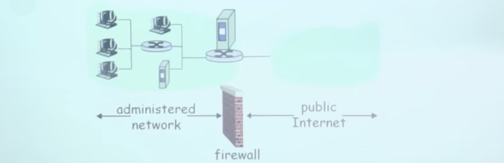
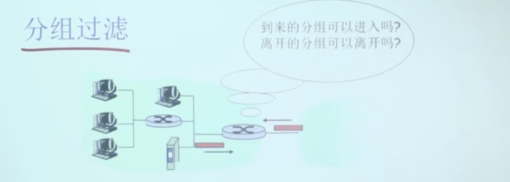
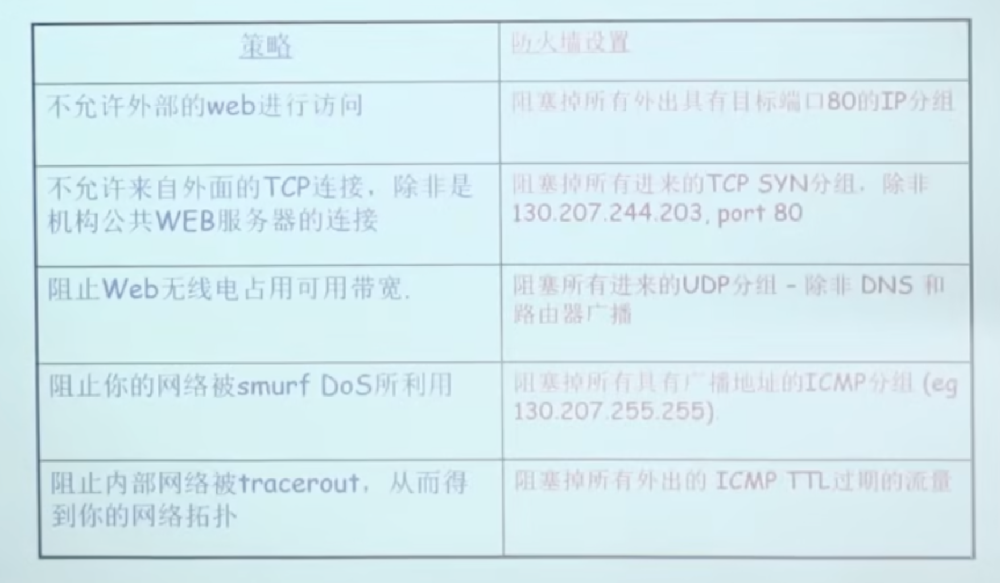
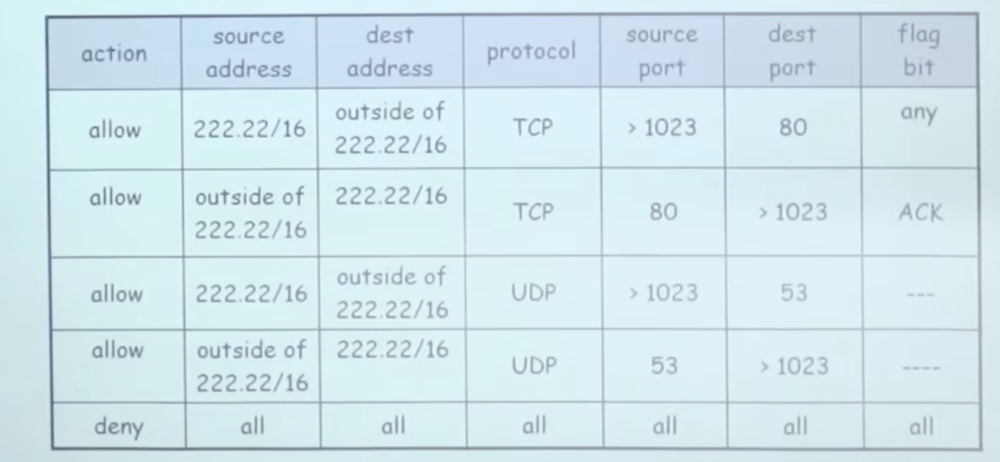
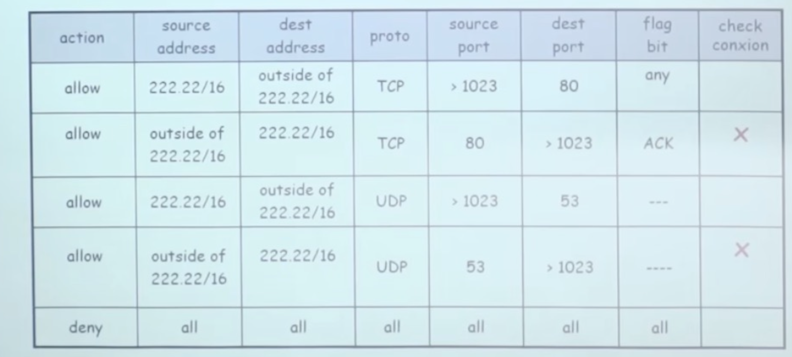
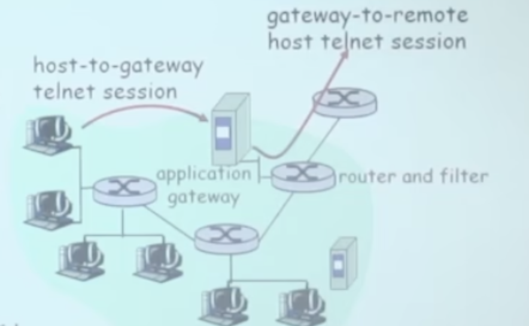

# 📘 8.7 访问控制：防火墙 (Access Control: Firewalls)

> 来源说明：计算机网络（郑老师）第8章防火墙部分 | 本节涵盖：防火墙概念、分组过滤（无状态/有状态）、ACL、应用程序网关

---

## 🧠 核心概念总览（严格按原文顺序）

- [*知识点1: 防火墙的定义与作用*](#id1)
- [*知识点2: 为什么需要防火墙*](#id2)
- [*知识点3: 分组过滤（Packet Filtering）*](#id3)
- [*知识点4: 无状态分组过滤（Stateless Packet Filtering）*](#id4)
- [*知识点5: 无状态分组过滤示例*](#id5)
- [*知识点6: 访问控制列表（ACL）*](#id6)
- [*知识点7: 有状态分组过滤（Stateful Packet Filtering）*](#id7)
- [*知识点8: 应用程序网关（Application Gateway）*](#id8)
- [*知识点9: IP 欺骗（IP Spoofing）与防火墙局限*](#id9)

---

## ✅ 知识点1: 防火墙的定义与作用

**概览**
- **防火墙**（`Firewall`）是位于**组织内部网络**与**互联网络**之间的安全设备/系统
- 核心功能：将内部网络与外部 Internet **隔离**（isolate），按照预设规则：
  - **允许**某些分组通过（进出）
  - **阻塞**（block）某些分组
- 防火墙位于网络边界，对所有进出流量进行过滤和审查
  - > ⚠️ **关键区分**：防火墙不是"防病毒软件"——它是**网络边界**的访问控制设备，工作在路由/网络层

  

> 💡 **理解技巧**：防火墙像"大楼门卫"——所有进出人员（分组）必须经过检查，名单上允许的放行，可疑的拦下

---

## ✅ 知识点2: 为什么需要防火墙

**为什么？**
- 防火墙存在的三大理由：
  1. **阻止拒绝服务攻击**（DoS）：
     - **SYN flooding**：攻击者建立大量伪造 TCP 连接，耗尽服务器资源，真正用户无法建立连接
  2. **阻止非法的修改/对非授权内容的访问**：
     - 例如：攻击者替换掉 `CIA` 的主页（网站篡改）
  3. **只允许认证的用户访问内部网络资源**：
     - 只有经过认证的用户/主机集合可以访问内部资源
- **两种类型的防火墙**：
  - **网络级别**：分组过滤器（packet filter）—— 有状态（stateful）和无状态（stateless）
  - **应用级别**：应用程序网关（application gateway）

> ⚠️ **关键区分**：SYN flooding 是**拒绝服务攻击**的典型方式，不是试图窃取数据，而是"占满资源让正常用户进不来"

---

## ✅ 知识点3: 分组过滤（Packet Filtering）

**理论**
- **分组过滤**是最基本的网络级防火墙机制
- 内部网络通过配置防火墙的**路由器**连接到互联网
- 路由器对分组**逐个过滤**，根据规则决定转发（forward）还是丢弃（drop）：
  - 源 IP 地址
  - 目标 IP 地址
  - TCP/UDP 源和目标端口
  - ICMP 报文类别
  - TCP SYN 和 ACK 标志位（flag bits）
- 过滤问题：
  - "到来的分组可以进入吗？"
  - "离开的分组可以离开吗？"

> ⚠️ **关键区分**：分组过滤工作在**IP 层/传输层**——不查看应用层数据，只看头部信息（IP 地址、端口、标志位）
> ⚠️ **关键区分**：分组过滤是**逐包独立**检查（无状态）或基于连接状态表检查（有状态）——两种方式差异很大

---

## ✅ 知识点4: 无状态分组过滤（Stateless Packet Filtering）

**理论**
- **无状态**分组过滤：每个分组被**独立**检查，不维护连接状态信息
- 防火墙根据当前分组的头部字段做判断，不记录之前有哪些分组经过
  - > 💡 **理解技巧**：无状态过滤器像"每次查票都当新乘客"——不记你刚才是不是买过票，每过一道门重新查
- **示例1**：阻塞所有 UDP 数据报（IP 协议字段 = 17）且源/目标端口号 = 23 的数据报：
  - 所有 UDP 流和 telnet 连接的数据报被阻塞
- **示例2**：阻塞进入内网的 TCP 段（ACK = 0）：
  - 阻止外部客户端和内部主机建立 TCP 连接（因为外部主动连接时，第一个 SYN 包 ACK = 0）
  - 但允许**内部网络客户端**和**外部服务器**建立 TCP 连接（因为内部主动发 SYN 时，回来的 SYNACK 会被允许进入——如果有状态过滤器才能处理，无状态下这个规则有问题，需配合其他规则）

> ⚠️ **关键区分**：无状态过滤器的**ACK=0 规则**需要仔细设计——它阻止外部发起的连接，但可能误伤正常响应或需要配合其他规则
> ⚠️ **关键区分**：IP 协议号 17 = UDP，6 = TCP，1 = ICMP —— 分组过滤器必须熟悉这些协议号

---

## ✅ 知识点5: 无状态分组过滤示例

**防火墙策略 vs 具体配置示例**：
  

> ⚠️ **关键区分**：策略是**目的**（"不允许外部Web访问"），配置是**手段**（"阻塞目标端口80的外出分组"）—— 两者需要精确对应

---

## ✅ 知识点6: 访问控制列表（ACL）

**理论**
- **ACL** = `Access Control List`，规则的表格，按 **top → bottom** 顺序应用到输入分组
- 每个规则是 **(action, condition)** 对：
  - action: allow（允许）或 deny（拒绝/丢弃）
  - condition: 匹配条件（源地址、目标地址、协议、端口、标志位等）
- 表格结构：
  
- **关键规则**：最后一条通常是 **deny all**（隐式拒绝），即不匹配任何允许规则的分组默认丢弃

> ⚠️ **关键区分**：ACL 是**顺序匹配**的——从上到下，第一条匹配的规则生效，后面的规则即使也匹配也不会检查
> ⚠️ **关键区分**：默认拒绝（deny all at bottom）很重要——如果没有默认拒绝，未匹配的分组会**默认通过**，这是安全隐患

---

## ✅ 知识点7: 有状态分组过滤（Stateful Packet Filtering）

**理论**
- **无状态**分组过滤：每个分组**独立**检查，不记忆历史
- **有状态**分组过滤：联合**分组状态表**（connection state table）检查，记住哪些连接是"合法的"
- **ACL 增强**：在允许分组之前需要检查**连接状态表**（check connection）
- 有状态 ACL 表格示例：在原有 ACL 基础上增加 **check connection** 列
 

---

## ✅ 知识点8: 应用程序网关（Application Gateway）

**理论**
- **应用级防火墙**（Application Gateway）与网络级防火墙的区别：
  - 网络级：根据 IP/TCP/UDP 头部字段过滤
  - 应用级：根据**应用层数据的内容**来过滤——检查的是应用层数据（HTTP payload、FTP 命令等）
  - > ⚠️ **关键区分**：应用网关是**代理**（proxy）模式——不是直接转发分组，而是自己作为通信端点，拆开数据再重组

  
- **示例：内部用户 telnet 到外部服务器**
  1. 不允许内部用户**直接**登录外部服务器
  2. 所有 telnet 用户必须通过**应用程序网关**来 telnet
  3. 对于认证的用户，网关建立与目标主机的 telnet 连接，网关在这**两个连接上做中继**（relay）
  4. 路由器过滤器对所有**不是来自网关**的 telnet 分组全部过滤掉
- 连接结构：
  - `host → gateway`（host-to-gateway telnet session）
  - `gateway → remote host`（gateway-to-remote host telnet session）
  - 网关作为中间人，可以**审查、修改、记录**所有应用层数据

> ⚠️ **关键区分**：应用网关能提供最细粒度的控制（如"只允许HTTP GET，不允许POST"），但性能开销大（解析应用层数据）
> 💡 **理解技巧**：应用网关像"翻译+审查员"——不仅检查你是谁（IP/端口），还检查你说话的内容（应用数据），不合适的话当场过滤
> 🔄 **知识关联**：与分组过滤对比——分组过滤是"查证件"，应用网关是"查行李内容"；两者常结合使用（分组过滤做第一道防线，应用网关做精细检查）

---

## ✅ 知识点9: IP 欺骗（IP Spoofing）与防火墙局限

**局限性**
- **IP spoofing**（IP 欺骗）：路由器不知道数据报是否**真的来自于声称的源地址**
  - 攻击者可以伪造 IP 源地址发送分组
  - 如果防火墙只检查源 IP 地址，可能被欺骗绕过
- **应用程序网关的挑战**：
  - 如果有多个应用需要控制，就需要**多个应用程序网关**（每个应用一个）
  - 例如：HTTP 代理、FTP 代理、SMTP 代理等
- **客户端软件配置**：
  - 客户端软件需要知道如何连接到应用网关
  - 例如：必须在 Web browser 中配置网络代理的 IP 地址
- 防火墙的**折中**（trade-off）：
  - 与外部通信的**自由度** vs **安全级别**
- 分组过滤器对 UDP 段的策略：
  - 要么**全部通过**（all pass），要么**全部不过**（all block）—— 因为 UDP 无连接，难以区分合法/非法响应
- 现实挑战：
  - 即使很多**高度保护的站点**仍然受到攻击的困扰
  - 防火墙不是银弹——它只是安全体系的一部分，不能解决所有安全问题

---

## 🔑 核心要点总结

1. **防火墙**是内部网络与 Internet 之间的边界隔离设备，按规则允许/阻塞分组
2. **分组过滤**（网络级）：无状态（逐包独立检查）和有状态（维护连接状态表）两种
3. **ACL** 按 top→bottom 顺序匹配，最后通常是默认 deny all；有状态 ACL 增加连接状态检查
4. **应用网关**（应用级）：代理模式，检查应用层数据内容，提供更细粒度控制但性能开销大
5. **IP spoofing** 可伪造源地址绕过基于地址的信任策略，防火墙需配合其他手段防御
6. **安全折中**：自由度 vs 安全级别；UDP 无连接特性导致全过/全不过困境；防火墙不是万能

---

## 📌 考试速记版

- **关键机制**：
  - 分组过滤：检查 IP 地址、端口、协议号、TCP 标志位（SYN/ACK）
  - ACL 顺序匹配：第一条匹配即生效，最后默认 deny all
  - 有状态：维护连接状态表（五元组 + 状态），自动允许响应流量
  - 应用网关：代理中继，拆开应用层数据做内容审查

- **易混淆概念对比**：
  - **无状态 vs 有状态**：无状态逐包独立查（需写双向规则），有状态记连接状态（只写单向规则，响应自动放行）
  - **网络级 vs 应用级**：网络级查头部（IP/端口/协议），应用级查内容（HTTP/FTP payload）
  - **分组过滤 vs 应用网关**：前者像查身份证，后者像查行李+审查对话内容

- **常见考试陷阱**：
  - ACL 是**顺序匹配**，不是最优匹配——规则顺序很重要，宽泛规则放上面会"吃掉"下面更精确的规则
  - IP spoofing 伪造**源地址**——防火墙单靠 IP 地址过滤无法防御，需要 ingress filtering
  - UDP 无连接 → 有状态防火墙对 UDP 只能做**伪状态跟踪**（基于近期查询超时窗口），不是真正的连接状态
  - 应用网关是**代理**模式——不是透明转发，网关自己作为通信端点，可能引入延迟和单点故障

**记忆口诀**：
> "防火墙守大门，ACL 列清单，无状态逐包查，有状态记连接，应用网关查行李，IP 欺骗套身份，安全折中莫忘深" 🎯