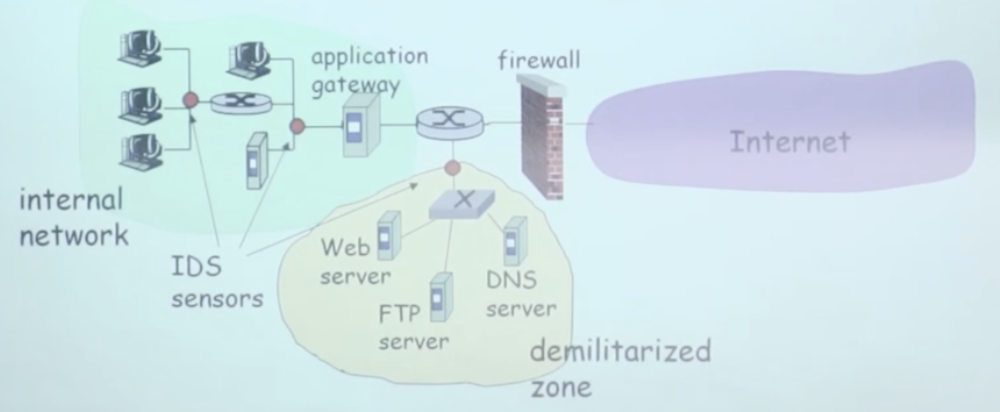
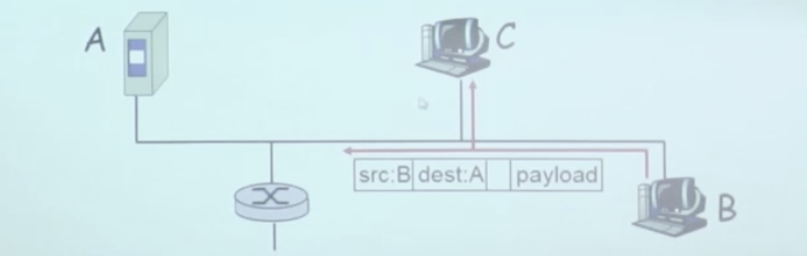
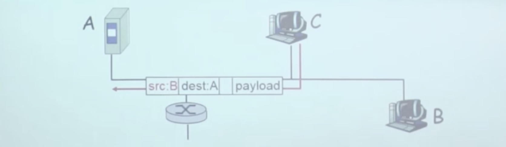

# 📘 8.8 攻击和对策 (Attacks and Countermeasures)

> 来源说明：计算机网络（郑老师）第8.8节 | 本节涵盖：IDS、网络映射、分组嗅探、IP Spoofing、DoS攻击及对策

---

## 🧠 核心概念总览（严格按原文顺序）

- [*知识点1: IDS（入侵检测系统）概述*](#id1)
- [*知识点2: 多重IDS部署*](#id2)
- [*知识点3: 网络映射（踩点/侦察）*](#id3)
- [*知识点4: 网络映射对策*](#id4)
- [*知识点5: 分组嗅探（Packet Sniffing）*](#id5)
- [*知识点6: 分组嗅探对策*](#id6)
- [*知识点7: IP Spoofing（IP欺骗）*](#id7)
- [*知识点8: IP Spoofing对策：入口过滤*](#id8)
- [*知识点9: DoS（拒绝服务攻击）*](#id9)
- [*知识点10: DoS对策*](#id10)

---

## ✅ 知识点1: IDS（入侵检测系统）概述

 **IDS** = `Intrusion Detection System`（入侵检测系统），与分组过滤的核心区别：
- **分组过滤**：
  - 对 TCP/IP 头部进行检查
  - 不检查会话间的相关性（每个分组独立判断）
- **IDS**：
  - **深入分组检查**：检查分组的内容（payload），匹配已知攻击数据库的病毒和攻击串（特征签名）
  - **检查分组间的相关性**：判断多个分组是否构成有害行为
    - 端口扫描（port scanning）
    - 网络映射（network mapping）
    - DoS 攻击（Denial of Service）
- IDS 是**检测**（detection）而非**防御**（prevention）——发现攻击后报警，但通常不主动阻断（除非联动 IPS）

> ⚠️ **关键区分**：IDS 与防火墙不同——防火墙是**防御**（按规则放行/丢弃），IDS 是**检测**（观察+分析+报警），IPS（Intrusion Prevention System）才是防御+检测一体
> ⚠️ **关键区分**：IDS 的"深入检查"指检查**应用层数据内容**，而不仅是网络/传输层头部——因此能发现应用层攻击（如 SQL 注入、恶意脚本）

---

## ✅ 知识点2: 多重IDS部署

**multiple IDSs**：在不同地点进行不同类型的检查
- 典型部署架构：
  
  - **IDS sensors（传感器）** 部署在内部网络关键节点——监测内部横向移动和异常流量
  - **DMZ 区域**：部署在防火墙内侧，监测对 Web server、FTP server、DNS server 等公网服务的攻击
  - **防火墙/网关旁路**：监测通过边界的流量
- **DMZ**（Demilitarized Zone，非军事区）：
  - 位于防火墙与内部网络之间的缓冲区
  - 放置对外提供服务的服务器（Web、FTP、DNS）
  - 即使 DMZ 被攻破，内部网络仍有防火墙隔离保护
- 多重 IDS 的价值：
  - 不同位置捕获不同阶段的攻击
  - 内网 IDS 检测内部威胁和已穿透边界的攻击
  - DMZ IDS 检测外部直接攻击

> ⚠️ **关键区分**：DMZ 不是"完全暴露"——外部只能访问 DMZ 中特定服务，DMZ 到内部网络仍受防火墙控制

---

## ✅ 知识点3: 网络映射（踩点/侦察）

**映射**（Mapping）是攻击者的**前期侦察**——在真正攻击前收集目标信息
- 具体手段：
  1. **"踩点"**（footprinting）：发现网络上实现了哪些服务
  2. **ping**：判断哪些主机在网络上有地址（主机存活探测）
  3. **端口扫描**（port scanning）：试图顺序地在每一个端口上建立 TCP 连接，看看会发生什么——判断哪些端口开放、运行什么服务
  4. **nmap**：`http://www.insecure.org/nmap/`，mapper 工具，用于 "network exploration and security auditing"
- 端口扫描的本质：
  - 对目标 IP 的 1-65535 端口逐一尝试连接
  - 开放端口会响应 SYN+ACK 或完成三次握手
  - 关闭端口返回 RST
  - 根据响应推断服务类型和操作系统（指纹）

> ⚠️ **关键区分**：映射本身**不是攻击**——是侦察行为，但它是攻击的前置步骤，通常作为 IDS 检测的特征之一（异常高频连接尝试）

---

## ✅ 知识点4: 网络映射对策

对策：记录进入网络中的通信流量，发现可疑行为
- **可疑行为特征**：
  - IP addresses 被依次扫描（sequential IP scanning）
  - 端口被依次扫描（sequential port scanning）
  - 短时间内大量不完整的 TCP 连接（SYN 扫描特征）
- IDS 检测逻辑：
  - 统计单个源 IP 对多个目标 IP 的连接尝试 → 标记为网络映射
  - 统计对单个目标 IP 的多个端口尝试 → 标记为端口扫描
  - 触发阈值报警
- 防御策略：
  - 部署 IDS 监测扫描行为
  - 在防火墙/路由器限制单个源地址的连接速率
  - 使用"端口敲门"（port knocking）等隐藏服务技术

> ⚠️ **关键区分**：端口扫描的**半开扫描**（SYN scan，不完成三次握手）比全连接扫描更隐蔽，但 IDS 仍可通过统计异常 SYN 模式检测
> 💡 **理解技巧**：对策的核心是"统计异常"——正常用户不会1秒内连你100个端口，这种行为一眼就是扫描

---

## ✅ 知识点5: 分组嗅探（Packet Sniffing）

**分组嗅探**是局域网级别的窃听攻击
- 实现条件：
  1. **广播式介质**（如传统共享式以太网/集线器）——所有数据在共享信道上广播
  2. **混杂模式（promiscuous mode）的 NIC**（网卡）——网卡被设置为接收所有经过信道的分组，而不是仅接收发给自己的
- 攻击效果：
  - 可获取所有**未加密的数据**（e.g., passwords、明文 HTTP 内容等）
  - 示例：C 嗅探 B 的分组——B 发送给 A 的分组在广播介质上被 C 截获
- 攻击场景：
  
  - 攻击者接入共享网络（如公共 WiFi、集线器网络）
  - 将网卡设为混杂模式
  - 运行抓包工具（tcpdump、Wireshark）收集数据

> ⚠️ **关键区分**：分组嗅探在**交换式网络**（switch）中无法直接实施——交换机只向目标端口转发，不会广播到所有端口（除非用 ARP 欺骗等手段）
> ⚠️ **关键区分**：嗅探获取的是**未加密数据**——如果通信使用了 SSL/TLS 或 VPN，即使被嗅探也无法解密内容

---

## ✅ 知识点6: 分组嗅探对策

**对策**
- 对策1：**主机监测**
  - 机构中的所有主机都运行能够监测软件
  - **周期性地检查是否有网卡运行于混杂模式**——如果某主机网卡被设为混杂模式，极可能是恶意嗅探行为
  
- 对策2：**网络架构升级**
  - 每一个主机一个独立的网段
  - 使用**交换式以太网（switch）而不是集线器（hub）**
  - 交换机根据 MAC 地址表定向转发，分组不会被广播到无关端口
- 对策3：**加密通信**
  - 使用 SSL/TLS、VPN 等加密手段——即使被嗅探也无法获取明文
- 对策4：**网络分段**
  - 将网络划分为多个 VLAN，限制广播域范围

> ⚠️ **关键区分**：监测混杂模式只能检测**本机**是否被设为嗅探——不能检测远程主机是否在嗅探，也不能阻止物理层窃听（如分光器）
> ⚠️ **关键区分**：交换机也不是绝对安全——**ARP 欺骗**（ARP spoofing）可以让交换机将流量错误转发到攻击者端口，本质是一种"主动嗅探"

---

## ✅ 知识点7: IP Spoofing（IP欺骗）

**IP Spoofing**（IP 欺骗）：攻击者伪造 IP 分组的源地址
- 实现方式：
  - 应用进程可以直接产生 **"raw" IP 分组**（原始 IP 分组）
  - 在 IP 源地址部分直接放置**任何地址**——不受操作系统正常协议栈限制
- 攻击效果：
  - 接收端无法判断源地址是否具有欺骗性
  - 示例：C 伪装成 B，向 A 发送分组，A 误以为来自 B
- 典型攻击场景：
  
  - 绕过基于 IP 地址的访问控制（如"只允许 192.168.1.0/24 访问"）
  - 伪造身份发起 DoS 攻击（反射攻击/放大攻击）
  - TCP 序列号预测攻击（盲攻击）

> ⚠️ **关键区分**：IP spoofing 是**伪造源地址**——不是篡改数据内容，而是冒充他人身份发送数据
> ⚠️ **关键区分**：IP 协议本身**没有内置源地址认证**——这是协议设计的简化，也是安全漏洞的根源

---

## ✅ 知识点8: IP Spoofing对策：入口过滤

**对策**
- **入口过滤**（Ingress Filtering）：
  - 路由器对那些具有**非法源地址**的分组不进行转发
  - 非法源地址判定标准：数据包源 IP，**不属于接收该报文的接口所直连网段的合法地址区间**。
  - 例如：从外部接口进来的分组，源地址不应该是内部网络地址（否则就是伪造内部地址）
- 入口过滤的效果：
  - 如果 ISP/路由器都实施入口过滤，伪造源地址的分组无法进入网络核心
  - 攻击者无法从外部伪造内部地址发起攻击
- 局限性：
  - 很好，但入口过滤**不能够在全网范围内安装**——需要全球 ISP 合作，否则攻击者可以从未实施过滤的网络注入伪造流量

> 💡 **理解技巧**：入口过滤像"海关查护照"——你声称来自美国，但你是从中国口岸入境的？直接拒绝，除非你有合理解释（ Transit 等）
> 🔄 **知识关联**：与知识点7（IP spoofing）对应——没有入口过滤，IP spoofing 很容易实施；有了入口过滤，攻击者必须控制真实地址范围内的主机才能伪造

---

## ✅ 知识点9: DoS（拒绝服务攻击）

**理论**
- **DoS** = `Denial of Service`（拒绝服务攻击）
- 核心目标：使目标服务不可用，不是窃取数据
- 典型方式：
  - **SYN flooding**：发送大量 SYN 请求，耗尽服务器的连接表资源
  - 攻击者可能使用**伪造源地址**（配合 IP spoofing）
  - 攻击者可能从多个源同时发起（DDoS = Distributed Denial of Service）
- DoS 攻击特征：
  - 大量泛洪分组（flooding packets）涌向目标
  - 目标主机资源（CPU、内存、带宽、连接表）被耗尽
  - 合法用户无法获得服务

> ⚠️ **关键区分**：DoS 和 DDoS 的区别——DoS 是**单源**攻击，DDoS 是**多源分布式**攻击（通常利用僵尸网络 botnet），后者更难防御和追踪

---

## ✅ 知识点10: DoS对策

**理论**
- 对策1：**在到达主机之前过滤掉泛洪的分组**
  - 例如：过滤 SYN flooding 的大量 SYN 分组
  - 问题：**throw out good with bad**（好坏一起丢）——正常 SYN 请求也会被丢弃，影响正常服务
- 对策2：**回溯到源主机**
  - 追踪攻击流量来源
  - 问题：源主机很可能是无辜的被入侵机）
  - 追到一个僵尸节点，真正的攻击者（C&C 服务器）隐藏在更深处
- 其他有效对策：
  - **SYN cookies**：服务器在收到 SYN 时不分配连接表项，而是发送一个加密的 cookie 作为 SYNACK 的序列号，只有客户端返回合法 ACK 时才建立连接——不消耗半开连接资源
  - **速率限制**（rate limiting）：限制单个 IP 的连接速率
  - **流量清洗**（scrubbing）：将流量引到清洗中心，过滤恶意流量后转发正常流量
  - **CDN 和负载均衡**：分散攻击流量，增加容量

> ⚠️ **关键区分**：DoS 对策的困境——**没有完美解法**：过滤会误伤正常用户，溯源往往追到无辜机器，扩容成本高昂

---

## 🔑 核心要点总结

1. **IDS** 是检测系统（检测攻击行为/相关性），不同于防火墙（防御规则执行）；多重 IDS 覆盖内部网络、DMZ 和边界
2. **网络映射**（踩点、ping、端口扫描）是攻击前置侦察，IDS 通过统计异常连接检测
3. **分组嗅探**依赖广播介质+混杂模式网卡，对策是升级到交换式网络 + 监测混杂模式 + 加密通信
4. **IP Spoofing** 利用 IP 协议无源地址认证的缺陷，**入口过滤**是核心对策但需全网配合
5. **DoS** 是资源耗尽攻击，"过滤"对策会误伤正常用户，**SYN cookies** 是高效的半开连接防护机制

---

## 📌 考试速记版

- **关键机制**：
  - IDS：深度检查分组内容 + 分析分组间相关性（检测端口扫描、网络映射、DoS）
  - 入口过滤：路由器拒绝源地址不属于本接口直连网络的分组（防止外部伪造内部地址）
  - SYN cookies：用加密 cookie 代替连接表存储半开连接，防御 SYN flooding

- **易混淆概念对比**：
  - **IDS vs 防火墙**：IDS = 检测/报警（被动观察）；防火墙 = 过滤/阻断（主动执行）；IPS = IDS + 防火墙（检测+阻断）
  - **IP spoofing vs 分组嗅探**：IP spoofing 是"伪造身份发送"；嗅探是"窃听他人通信"——一个是主动攻击，一个是被动窃听
  - **DoS vs DDoS**：DoS = 单源；DDoS = 多源分布式（通常通过 botnet）

- **常见考试陷阱**：
  - IDS 检测端口扫描靠的是**分组间相关性统计**（大量异常连接模式），不是单个分组特征
  - 入口过滤只能阻止**外部伪造内部地址**，不能阻止内部伪造或绕过过滤网络的注入
  - 分组嗅探在**集线器**网络可行，在**交换机**网络需要 ARP 欺骗等额外手段
  - DoS 对策 "throw out good with bad" 意味着过滤泛洪流量会**误伤正常请求**，不是完美方案

**记忆口诀**：
> "IDS 监检测，映射踩点先，嗅探听广播，欺骗改源脸，DoS 堵大门，过滤好坏连，入口过滤防伪造，SYN cookies 保资源" 🎯